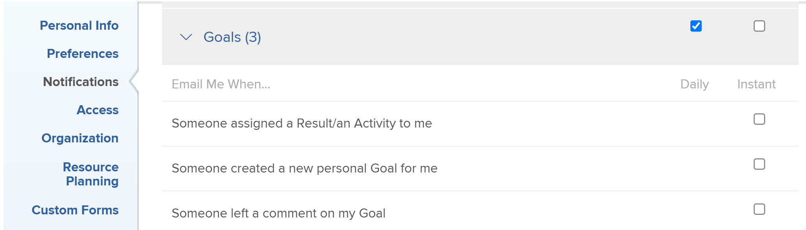

# Notificaciones: Objetivos

Puede activar las notificaciones por correo electrónico para los eventos que se producen en [!DNL Adobe Workfront Goals] en su perfil. Un usuario con un [!UICONTROL Plan] licencia también puede habilitarlas para otros usuarios. Para obtener más información, consulte [[!DNL Adobe Workfront] notificaciones](../../workfront-basics/using-notifications/wf-notifications.md).

## Requisitos de acceso

<!--

(NOTE: because there are conditions for who sees this, I added this from the How To articles/ template although this is not a How To. But I like the format, so I thought keeping it consistent might help users. We may decide to update this when we have access and prereq for overview-type articles)

-->

Debe tener lo siguiente:

<table style="table-layout:auto"> 
 <col> 
 <col> 
 <tbody> 
  <tr> 
   <td role="rowheader"><strong>[!DNL Adobe Workfront plan*]</strong></td> 
   <td> 
[!UICONTROL Pro] o superior
 </td> 
  </tr> 
  <tr> 
   <td role="rowheader"><strong>[!DNL Adobe Workfront] licencia*</strong></td> 
   <td> 
[!UICONTROL Request] o superior
 </td> 
  </tr> 
  <tr> 
   <td role="rowheader"><strong>Product</strong></td> 
   <td>[!DNL Workfront Goals] 
Para obtener información sobre [!DNL Workfront Goals], consulte <a href="../../workfront-goals/goal-management/wf-goals-overview.md" class="MCXref xref">[!DNL Adobe Workfront Goals] información general</a>.
 </td> 
  </tr> 
  <tr> 
   <td role="rowheader"><strong>Configuraciones de nivel de acceso*</strong></td> 
   <td> 
Acceso de [!UICONTROL View] a [!DNL Goals] o superior
 
Nota: Si todavía no tiene acceso, pregunte a su [!DNL Workfront] administrador si establecen restricciones adicionales en su nivel de acceso. Para obtener información sobre cómo se [!DNL Workfront] administrador puede cambiar el nivel de acceso, consulte <a href="../../administration-and-setup/add-users/configure-and-grant-access/create-modify-access-levels.md" class="MCXref xref">Crear o modificar niveles de acceso personalizados</a>.
 </td> 
  </tr> <!--
   <tr data-mc-conditions="QuicksilverOrClassic.Draft mode"> 
    <td role="rowheader">Object permissions</td> 
    <td> 
[Insert permissions needed]
 
For information on requesting additional access, see <a href="../../workfront-basics/grant-and-request-access-to-objects/request-access.md" class="MCXref xref">Request access to objects </a>.
 </td> 
   </tr>
  --> 
 </tbody> 
</table>

&#42;Para saber qué plan, tipo de licencia o acceso tiene, póngase en contacto con su [!DNL Workfront] administrador.

## Requisitos previos

El usuario cuyo [!DNL Goals] las notificaciones se actualizan deben tener lo siguiente:

* Una plantilla de diseño que incluye el [!DNL Goals] en el [!UICONTROL Menú principal].
* Acceso al nuevo [!DNL Adobe Workfront] experiencia.

   <!--
  <MadCap:conditionalText data-mc-conditions="QuicksilverOrClassic.Draft mode">
  (NOTE: we need this here because you can see these notifications from Classic)
  </MadCap:conditionalText>
  -->

## [!DNL Goals] notificaciones en el [!UICONTROL perfil de usuario] area

Las notificaciones enumeradas en la siguiente tabla le avisan de los eventos que se producen en [!DNL Workfront Goals], como alguien que le asigne un objetivo, un resultado o una actividad, o alguien que actualice un objetivo, un resultado o una actividad de su propiedad. Para obtener información sobre la configuración de las notificaciones que recibe, consulte [Activar o desactivar sus propias notificaciones de eventos](../../workfront-basics/using-notifications/activate-or-deactivate-your-own-event-notifications.md).

>[!NOTE]
>
>Notificaciones instantáneas para [!DNL Goals] están desactivados de forma predeterminada. No puede activar ni desactivar las notificaciones diarias y no recibe correos electrónicos resumidos diarios para los eventos de esta categoría. Puede activar o desactivar notificaciones instantáneas individuales para la variable [!DNL Goals] categoría.

Consulte también [Notificaciones de eventos](../../workfront-basics/using-notifications/event-notifications.md).

<table style="table-layout:auto"> 
 <col> 
 <col> 
 <tbody> 
  <tr> 
   <td><strong>Notificación</strong></td> 
   <td> 
<strong>Campos incluidos</strong> 
 
<strong>*Solo notificaciones instantáneas</strong>
 </td> 
  </tr> 
  <tr> 
   <td><strong>Alguien me ha asignado un resultado o una actividad</strong></td> 
   <td> 
El nombre de la persona que le asignó el resultado o la actividad
 
El periodo del objetivo para el resultado o la actividad
 
Nombre del resultado o actividad
 
La variable <strong>[!UICONTROL Abrir en aplicación web]</strong> que abre el panel [!UICONTROL Goal Details]
 
La variable <strong>[!UICONTROL Cambiar configuración de notificaciones]</strong> que le permite administrar sus notificaciones.
 </td> 
  </tr> 
  <tr> 
   <td><strong>Alguien ha creado una nueva meta personal para mí</strong> </td> 
   <td> 
Nombre de la persona que asignó el objetivo
 
El periodo del objetivo
 
Nombre del objetivo
 
La variable <strong>[!UICONTROL Abrir en aplicación web]</strong> que abre el panel [!UICONTROL Goal Details]
 
La variable <strong>[!UICONTROL Cambiar configuración de notificaciones]</strong> que le permite administrar sus notificaciones.
 </td> 
  </tr> 
  <tr> 
   <td><strong>Alguien ha dejado un comentario sobre mi meta</strong></td> 
   <td> 
Nombre de la persona que abandonó el comentario
 
El periodo del objetivo 
 
Nombre del objetivo
 
Texto del comentario
 
La variable <strong>[!UICONTROL Abrir en aplicación web]</strong> que abre el panel [!UICONTROL Goal Details]
 
La variable <strong>[!UICONTROL Cambiar configuración de notificaciones]</strong> que le permite administrar sus notificaciones.
 </td> 
  </tr> 
  <tr> 
   <td><strong>A alguien le ha gustado mi comentario sobre una meta</strong></td> 
   <td> 
Nombre de la persona a la que le gustó el comentario
 
El periodo del objetivo 
 
Nombre del objetivo
 
Texto del comentario 
 
La variable <strong>[!UICONTROL Abrir en aplicación web]</strong> que abre el panel [!UICONTROL Goal Details]
 
La variable <strong>[!UICONTROL Cambiar configuración de notificaciones]</strong> que le permite administrar sus notificaciones.
 </td> 
  </tr> 
  <tr> 
   <td><strong>A alguien le ha gustado una actualización de mi meta</strong></td> 
   <td> 
Recibe un correo electrónico cuando a alguien le gusta un comentario que haya hecho sobre un objetivo o cuando actualiza el progreso de sus resultados o actividades en el objetivo. 
 
Nombre de la persona a la que le gustó la actualización
 
El periodo del objetivo 
 
Nombre del objetivo
 
La variable <strong>[!UICONTROL Abrir en aplicación web]</strong> que abre el panel [!UICONTROL Goal Details]
 
La variable <strong>[!UICONTROL Cambiar configuración de notificaciones]</strong> que le permite administrar sus notificaciones.
 </td> 
  </tr> 
 </tbody> 
</table>

<!--
NOTE FOR NAME OF GOAL IN LAST TABLE CELL: check this. Is this true? Didn't triggger when this was written; add anything else? Maybe the type of the update is mentioned?!
-->
