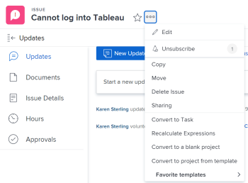
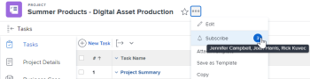

# Suscribirse a elementos en [!DNL Adobe Workfront]

[!UICONTROL Adobe Workfront] envía notificaciones sobre los elementos que se le han asignado o que le pertenecen. Si desea seguir la comunicación de elementos que no le han sido asignados, pero que podrían afectar a su trabajo, puede suscribirse a ellos.

También puede mantener a su administrador y compañeros al día sobre su trabajo suscribiéndolos al estado de actualización de los elementos para los que tenga permisos de [!UICONTROL Administrar] y [!UICONTROL Compartir].

Actualmente, puede suscribirse a los siguientes elementos:

* Problemas
* Tareas
* Proyectos

Al suscribirse a problemas, tareas o proyectos, recibe notificaciones en la aplicación cuando alguien les publica un comentario. Según las funciones que haya habilitado, también puede recibir notificaciones push por correo electrónico y por aplicaciones móviles de los elementos a los que esté suscrito.

>[!NOTE]
>
>No recibirá notificaciones por otros eventos que se produzcan en el elemento al que se suscriba. Solo se le notificará cuando alguien publique un comentario en el elemento.

Para obtener más información sobre cómo trabajar con suscripciones, consulte [Acerca de cómo trabajar con suscripciones](#about-working-with-subscriptions).

## Requisitos de acceso

Debe tener el siguiente acceso para realizar los pasos de este artículo:

<table style="table-layout:auto"> 
 <col> 
 </col> 
 <col> 
 </col> 
 <tbody> 
  <tr> 
   <td role="rowheader"><strong>Plan [!UICONTROL Adobe Workfront]*</strong></td> 
   <td> 
Cualquiera
 </td> 
  </tr> 
  <tr> 
   <td role="rowheader"><strong>[!DNL Adobe Workfront] licencia*</strong></td> 
   <td> 
[!UICONTROL Request] o superior
 </td> 
  </tr> 
  <tr> 
   <td role="rowheader"><strong>Configuraciones de nivel de acceso*</strong></td> 
   <td> 
Si el administrador de [!DNL Workfront] ha habilitado <strong>[!UICONTROL View only updates in which they have been included in the conversation]</strong> en su nivel de acceso, no podrá suscribirse a los elementos de [!DNL Workfront].
 
Nota: si sigue sin tener acceso, pregunte al administrador de [!UICONTROL Workfront] si ha establecido restricciones adicionales en su nivel de acceso. Para obtener información sobre cómo un administrador de [!UICONTROL Workfront] puede cambiar su nivel de acceso, consulte <a href="../../administration-and-setup/add-users/configure-and-grant-access/create-modify-access-levels.md" class="MCXref xref">Crear o modificar niveles de acceso personalizados</a>.
 </td> 
  </tr> 
  <tr> 
   <td role="rowheader"><strong>Permisos de objeto</strong></td> 
   <td> 
Acceso [!UICONTROL View] o superior al proyecto, tarea o problema (para suscribirse)
 
Acceso de [!UICONTROL Manage] y permisos de [!UICONTROL Share] para el proyecto, tarea o problema (para suscribir a otros)
 </td> 
  </tr> 
 </tbody> 
</table>

Para saber qué plan, tipo de licencia o acceso tiene, póngase en contacto con el administrador de [!DNL Workfront].

## Suscribirse a un elemento

El proceso de suscripción a un elemento es idéntico para todos los elementos.

Por ejemplo, para suscribirse a un problema:

1. Vaya al problema al que desee suscribirse.

   >[!TIP]
   >
   >Para suscribirse a proyectos, puede realizar una de las siguientes acciones:
   >
   >* Vaya al proyecto al que desee suscribirse, haga clic en el icono **[!UICONTROL Más]**  a la derecha del nombre del proyecto y, a continuación, en **[!UICONTROL Suscribirse]**.
   >* Vaya a una lista de proyectos o a un informe y seleccione un proyecto. Haga clic en el icono **[!UICONTROL Más]**  en la parte superior de la lista y, a continuación, haga clic en **[!UICONTROL Suscribirse]**. Esto solo está disponible en una lista de proyectos.

1. Haz clic en **[!UICONTROL Más]**  y luego haz clic en **[!UICONTROL Suscribirse]**.

   

   Aparece una marca de verificación en la campana y el número que hay junto a ella se actualiza para añadirle al recuento de usuarios suscritos.

   Ahora ya está suscrito al problema. El estado de actualización del problema registra que se ha suscrito al problema.

   Cada vez que alguien comente el problema, recibirá una notificación en la aplicación. Según las funciones que haya habilitado, también puede recibir notificaciones por correo electrónico y notificaciones push de aplicaciones móviles.

   Para obtener más información sobre el correo electrónico de suscripción, consulte [Modificar sus propias notificaciones por correo electrónico](../../workfront-basics/using-notifications/activate-or-deactivate-your-own-event-notifications.md).

## Cancelar la suscripción a un elemento

Puede cancelar fácilmente la suscripción a un elemento de [!DNL Workfront]. El proceso para cancelar la suscripción a un elemento de [!DNL Workfront] es idéntico para todos los elementos.

Por ejemplo, para cancelar la suscripción a un problema:

1. Vaya al problema desde el que desea cancelar la suscripción.

   >[!TIP]
   >
   >Para cancelar la suscripción a proyectos, puede realizar una de las siguientes acciones:
   >
   >* Vaya al proyecto cuya suscripción desea cancelar, haga clic en el icono **[!UICONTROL Más]**  a la derecha del nombre del proyecto y, a continuación, en **[!UICONTROL Cancelar la suscripción]**.
   >* Vaya a una lista de proyectos o a un informe y seleccione un proyecto. Haga clic en el icono **[!UICONTROL Más]**  en la parte superior de la lista y, a continuación, haga clic en **[!UICONTROL Cancelar la suscripción]**. Esto solo está disponible en una lista de proyectos.

1. Haga clic en **[!UICONTROL Más]**  y luego haga clic en **[!UICONTROL Cancelar la suscripción]**.

   

1. También puede cancelar la suscripción a un elemento al que se haya suscrito haciendo clic en el vínculo [!UICONTROL Cancelar la suscripción] del correo electrónico de suscripción.

   Una vez que haya cancelado la suscripción a un elemento, ya no recibirá ninguna notificación cuando alguien comente el problema.

   El estado de actualización del elemento registra que ha cancelado la suscripción al problema.

## Administración de suscriptores

Puede administrar quién se suscribe a los proyectos, tareas y problemas para los que tiene los permisos Administrar y Compartir.

* [Suscribir a otro usuario a un elemento](#subscribe-another-user-to-an-item)
* [Cancelar la suscripción de un elemento a otra persona](#unsubscribe-another-person-from-an-item)

Todos los suscriptores tienen permisos de [!UICONTROL visualización] para el elemento. Si los nuevos suscriptores ya tienen permisos para el elemento, sus permisos permanecerán intactos.

### Suscribir a otro usuario a un elemento

1. Vaya al elemento al que desea suscribir a otro usuario.

   >[!TIP]
   >
   >Para suscribir a otro usuario a proyectos, puede realizar una de las siguientes acciones:
   >
   >* Vaya al proyecto desde el que desee suscribir a otros usuarios, o
   >   
   >* Vaya a una lista de proyectos o a un informe y seleccione un proyecto.

1. Haga clic en **[!UICONTROL Más]** .
1. Haga clic en la burbuja numérica situada junto al vínculo **[!UICONTROL Suscribirse]**.
1. En el cuadro que aparece, empiece a escribir el nombre del usuario en el cuadro **[!UICONTROL Suscribir a otros]** y, a continuación, seleccione el usuario en las opciones que se muestran.

1. (Opcional) Para añadir más suscriptores, repita el paso 4.
1. Haga clic en **[!UICONTROL Guardar]**.

No se notifica la suscripción al suscriptor, pero se añade una entrada sobre la suscripción a las actualizaciones del sistema del elemento.

Cuando alguien añade un comentario a la ficha [!UICONTROL Actualizaciones] del elemento, el suscriptor recibe una notificación dentro de la aplicación. Según las funciones que haya activado el administrador de Workfront, el suscriptor también puede recibir notificaciones en el móvil y por correo electrónico del elemento.

### Cancelar la suscripción de un elemento a otra persona

1. Vaya al elemento del que desea cancelar la suscripción de otro usuario.

   >[!TIP]
   >
   >Para cancelar la suscripción de otro usuario a los proyectos, puede realizar una de las siguientes acciones:
   >
   >* Vaya al proyecto en el que desea cancelar la suscripción de otros, o
   >   
   >* Vaya a una lista de proyectos o a un informe y seleccione un proyecto.

1. Haga clic en **[!UICONTROL Más]** .
1. Haga clic en la burbuja numérica junto al vínculo **[!UICONTROL Suscribirse]** o **[!UICONTROL Cancelar la suscripción]**.
1. En la página **[!UICONTROL Suscriptores]** que aparece, haga clic en la “X” junto al nombre del usuario al que desea cancelar la suscripción.

   O

   Empiece a escribir el nombre del usuario en el cuadro **[!UICONTROL Buscar personas en la lista]** y, a continuación, haga clic en la “X” a la derecha del nombre del usuario.

1. Haga clic en **[!UICONTROL Guardar]**.

   No se notifica al usuario que se ha dado de baja de la suscripción al elemento, pero se añade una entrada sobre la suscripción a las Actualizaciones del sistema para el elemento.

## Recibir una notificación en la aplicación

Inmediatamente después de que alguien publique un comentario en un elemento al que está suscrito, recibirá una notificación dentro de la aplicación.

Para obtener más información, consulte [Ver y administrar notificaciones en la aplicación](../../workfront-basics/using-notifications/view-and-manage-in-app-notifications.md).

## Recibir el correo electrónico de suscripción

Según las funciones que su administrador de [!UICONTROL Workfront] haya habilitado, es posible que reciba correos electrónicos de suscripción, además de notificaciones dentro de la aplicación cada vez que alguien comente un elemento al que se suscriba.

Para obtener más información sobre cómo configurar o deshabilitar el correo electrónico, consulte [Configurar notificaciones de eventos para todos los usuarios del sistema](../../administration-and-setup/manage-workfront/emails/configure-event-notifications-for-everyone-in-the-system.md).

>[!NOTE]
>
>Incluso si desactiva el correo electrónico de suscripción, seguirá recibiendo notificaciones en la aplicación cada vez que alguien comente un elemento al que esté suscrito.

## Enumerar los usuarios suscritos a un elemento

Para ver quién está suscrito a un elemento:

1. Desplácese hasta el elemento cuyos suscriptores desee ver.

   Si hay suscriptores para el elemento, el número de suscriptores se muestra junto a la campana. Puede pasar el ratón por encima del número para mostrar una lista de los usuarios que se suscriben al elemento. Los primeros 25 suscriptores se muestran en orden alfabético.

   

   También puede ver una lista de suscriptores añadiendo un campo [!UICONTROL Suscriptor] como una columna en un informe o vista para el elemento suscrito. Para obtener más información, consulte [Glosario de  [!DNL Adobe Workfront] terminología](../../workfront-basics/navigate-workfront/workfront-navigation/workfront-terminology-glossary.md).

## Cómo trabajar con suscripciones

Tenga en cuenta lo siguiente cuando trabaja con suscripciones:

* El administrador de [!DNL Workfront] no puede controlar a qué usuarios pueden o no suscribirse.

  Cualquier persona con permisos de [!UICONTROL visualización] o permisos superiores en cualquier tarea, problema o proyecto puede suscribirse a ellas.

* No se pueden configurar suscripciones para un correo electrónico de resumen diario.
* Si se suscribe a una tarea, un problema o un proyecto y también es la persona asignada, el contacto principal o el propietario del proyecto, solo recibirá el correo electrónico de suscripción cuando alguien comente el elemento al que se suscribe.

  Para obtener más información sobre las notificaciones por correo electrónico que se activan cuando se hace un comentario sobre uno de los elementos, consulte [Notificaciones de Adobe Workfront](../../workfront-basics/using-notifications/wf-notifications.md).

* Si se suscribe a un elemento y hace un comentario sobre él, no recibirá un correo electrónico de suscripción sobre ese comentario, a menos que incluya su nombre en el mismo.
* Si el usuario que comenta el elemento convierte el comentario en privado bloqueándolo y usted no forma parte de la misma compañía que ese usuario, no recibirá ninguna notificación por dicho comentario. Para obtener más información sobre cómo convertir un comentario en privado para su compañía, consulte la sección [Añadir una actualización a un elemento de trabajo](../../workfront-basics/updating-work-items-and-viewing-updates/update-work.md#add) en [Actualizar trabajo](../../workfront-basics/updating-work-items-and-viewing-updates/update-work.md).

* No se puede crear un informe para suscripciones. Se registra una auditoría en el estado de actualización de cada elemento cuando alguien se suscribe o cancela la suscripción al elemento.
* Los comentarios realizados sobre objetos secundarios no activan las notificaciones de suscripción de los objetos principales. Si se suscribe a un proyecto, solo recibirá una notificación de los comentarios realizados sobre dicho proyecto. No recibirá ninguna notificación de comentarios realizados sobre elementos secundarios asociados con el proyecto (por ejemplo, tareas o problemas), a menos que se suscriba a cada elemento secundario. Para obtener más información acerca de las relaciones entre objetos, consulte la sección [Interdependencia y jerarquía de objetos](../../workfront-basics/navigate-workfront/workfront-navigation/understand-objects.md#understanding-interdependency-and-hierarchy-of-objects) en [Comprender los objetos de  [!DNL Adobe Workfront]](../../workfront-basics/navigate-workfront/workfront-navigation/understand-objects.md).
