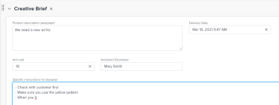
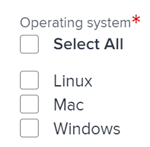

# Editar información en campos de formulario personalizados

<!--Audited: 10/2025-->

Puede editar la información de un formulario personalizado después de adjuntar el formulario a un objeto. Para obtener información acerca de cómo agregar formularios personalizados a objetos, vea [Agregar un formulario personalizado a un objeto](../../workfront-basics/work-with-custom-forms/add-a-custom-form-to-an-object.md).

## Requisitos de acceso

+++ Expanda para ver los requisitos de acceso para la funcionalidad en este artículo.

<table style="table-layout:auto"> 
 <col> 
 <col> 
 <tbody> 
  <tr> 
   <td role="rowheader"> 
paquete de Adobe Workfront
 </td> 
   <td>Cualquiera</td> 
  </tr> 
  <tr> 
   <td role="rowheader"> 
Licencia de Adobe Workfront
 </td> 
   <td> 
Colaborador o superior
 
   
Solicitud o superior
 </td> 
  </tr> 
  <tr data-mc-conditions=""> 
   <td role="rowheader">Configuraciones de nivel de acceso</td> 
   <td> 
Editar el acceso al objeto para el que desea editar el formulario personalizado
 </td> 
  </tr> 
  <tr data-mc-conditions=""> 
   <td role="rowheader"> 
Permisos de objeto
 </td> 
   <td> 
    <ul> 
     <li> 
Permisos de contribución o superiores en el objeto para el que desea editar el formulario personalizado
 </li> 
     <li>
Vea los permisos de los campos que desea editar.
</li> 
     <li>
Editar permisos para las secciones del formulario en las que se encuentran los campos que desea editar
</li> 
    </ul></td> 
  </tr> 
 </tbody> 
</table>

Para obtener más información, consulte [Requisitos de acceso en la documentación de Workfront](/help/quicksilver/administration-and-setup/add-users/access-levels-and-object-permissions/access-level-requirements-in-documentation.md).

+++

<!--Old:
<table style="table-layout:auto"> 
 <col> 
 <col> 
 <tbody> 
  <tr> 
   <td role="rowheader"> 
Adobe Workfront plan*
 </td> 
   <td>Team or higher</td> 
  </tr> 
  <tr> 
   <td role="rowheader"> 
Adobe Workfront licenses*
 </td> 
   <td> 
Request or higher
 </td> 
  </tr> 
  <tr data-mc-conditions=""> 
   <td role="rowheader">Access level*</td> 
   <td> 
Edit access to the object for which you want to edit the custom form
 
Note: If you still don't have access, ask your Workfront administrator if they set additional restrictions in your access level. For information on how a Workfront administrator can change your access level, see <a href="../../administration-and-setup/add-users/configure-and-grant-access/create-modify-access-levels.md" class="MCXref xref">Create or modify custom access levels</a>.
 </td> 
  </tr> 
  <tr data-mc-conditions=""> 
   <td role="rowheader"> 
Object permissions
 </td> 
   <td> 
    <ul> 
     <li> 
Contribute or higher permissions on the object for which you want to edit the custom form
 </li> 
     <li>View permissions on the fields you want to edit. For information about sharing permissions for custom fields, see <a href="/help/quicksilver/administration-and-setup/customize-workfront/create-manage-custom-forms/form-designer/manage-a-form/share-custom-fields.md" class="MCXref xref">Configure sharing for custom fields and widgets</a>.</li> 
     <li> 
Edit permissions for the sections on the form where the fields you want to edit are located
 </li> 
    </ul> 
For information on requesting additional access for objects, see <a href="../../workfront-basics/grant-and-request-access-to-objects/request-access.md" class="MCXref xref">Request access to objects </a>.
 </td> 
  </tr> 
 </tbody> 
</table>-->

## Requisitos previos

* El administrador de Workfront o un usuario de Plan con acceso administrativo a los formularios personalizados deben crear formularios personalizados en su entorno. Para obtener más información, consulte [Crear un formulario personalizado](/help/quicksilver/administration-and-setup/customize-workfront/create-manage-custom-forms/form-designer/design-a-form/design-a-form.md).
* Debe tener formularios personalizados adjuntos a un objeto.

  Para obtener información sobre cómo aplicar formularios personalizados a un objeto, consulte [Añadir un formulario personalizado a un objeto](../../workfront-basics/work-with-custom-forms/add-a-custom-form-to-an-object.md).

## Edición de información en un formulario personalizado

La edición de información en un formulario personalizado adjunto a un objeto es idéntica para todos los objetos. Para obtener información sobre qué objetos pueden tener un formulario personalizado, vea [Información general sobre formularios personalizados](../../administration-and-setup/customize-workfront/create-manage-custom-forms/custom-forms-overview.md).

1. Vaya a un objeto cuya información desee editar en el formulario personalizado.
1. Haga clic en **`<Object type>`detalles** en el panel izquierdo.

   Por ejemplo, cuando edite información en un formulario personalizado de proyecto, haga clic en **Detalles del proyecto**.

1. Desplácese hasta el formulario personalizado. Cuando hay un formulario personalizado adjunto al objeto, el nombre del formulario se muestra como un área en la sección Detalles.
1. Si es necesario, haga clic en la flecha  a la izquierda del nombre del formulario personalizado para expandirlo.
1. Cerca de la esquina superior derecha de la página, haga clic en el icono Editar .
1. Comience a introducir información en cualquier campo al que tenga acceso.

   

   O

   Si todavía no se ha especificado información en el formulario, haga clic en **Agregar+** para cualquier campo al que tenga acceso y empiece a escribir información.

   

   Si hay varios formularios personalizados adjuntos al objeto, puede hacerlo para cada formulario.

   Según el tipo de campo en el que trabaje, tenga en cuenta lo siguiente:

   * Solo se puede seleccionar una opción para los campos de botón de opción.
   * Puede seleccionar una o varias opciones en un campo de casilla de verificación, según la configuración que haya realizado el creador del formulario en el campo.
   * Puede seleccionar una o varias opciones en un campo desplegable de selección múltiple, según la configuración del campo que haya realizado el creador del formulario.
   * Solo se puede aplicar formato a los campos de texto (negrita, cursiva o subrayado) si el usuario que ha creado el formulario los ha configurado como campos de texto con formato. No se puede dar formato a los campos de texto de una sola línea y a los campos de texto de párrafo.
   * Solo se puede actualizar la hora del día en un tipo de campo de fecha si el usuario que ha creado el formulario lo ha incluido al crear el campo.

   Para obtener información acerca de todos los tipos de campo, vea [Crear un formulario personalizado](/help/quicksilver/administration-and-setup/customize-workfront/create-manage-custom-forms/form-designer/design-a-form/design-a-form.md).

1. Haga clic en **Guardar cambios**.

   >[!IMPORTANT]
   >
   >Debe completar todos los campos obligatorios del formulario para poder guardarlo. El nombre de un campo obligatorio va seguido de un asterisco.
   >
   >

   Cuando alguien cambia datos en otro objeto al que se hace referencia mediante campos personalizados calculados en su objeto, los cambios no se reflejan automáticamente en su objeto. Para obtener información acerca de cómo actualizar manualmente todos los campos personalizados calculados en el objeto, vea [Volver a calcular todos los campos personalizados calculados para un objeto](#recalculate-all-calculated-custom-fields-for-an-object) en este artículo.

   Cuando se modifican los campos dependientes de la página, los campos calculados del formulario personalizado se vuelven a calcular dinámicamente en tiempo real. Puede ver el nuevo valor de campo calculado sin guardar el formulario, pero en realidad no se aplica al formulario y al objeto hasta que no guarda los cambios. Esto se aplica a los campos calculados en los formularios predeterminados y a los formularios personalizados.

   También puede actualizar manualmente todos los campos personalizados calculados para un objeto al editar el objeto de forma masiva junto con otros objetos de una lista. Para obtener instrucciones, vea [Volver a calcular todos los campos personalizados calculados para varios objetos de una lista al editar los objetos](#recalculate-all-calculated-custom-fields-for-multiple-objects-in-a-list-when-editing-the-objects) en este artículo.

## Volver a calcular todos los campos personalizados calculados para un objeto  {#recalculate-all-calculated-custom-fields-for-an-object}

1. Vaya a la página principal del objeto cuyos campos personalizados desea volver a calcular.
1. Haga clic en el menú **Más**  que se encuentra a la derecha del nombre del objeto y, a continuación, haga clic en **Volver a calcular expresiones**.

   Esto vuelve a calcular todos los campos personalizados del formulario del objeto.

## Volver a calcular todos los campos personalizados calculados para varios objetos de una lista al editar los objetos {#recalculate-all-calculated-custom-fields-for-multiple-objects-in-a-list-when-editing-the-objects}

<!--

(NOTE: this will need to be edited when the bulk edit for objects update in NW)

-->

Puede recalcular manualmente los campos personalizados de varios objetos editándolos por lotes desde una lista o informe.

1. Vaya a una lista de objetos que contienen formularios personalizados con campos calculados.
1. Seleccione los objetos cuyos campos personalizados calculados desee actualizar.
1. Haga clic en el **icono Editar**.
1. Haga clic en **Forms personalizado** en el menú de la izquierda y, a continuación, seleccione **Volver a calcular expresiones personalizadas**.
1. Haga clic en **Guardar** **cambios**.

   Workfront calcula todos los campos personalizados de todos los objetos seleccionados.

>[!TIP]
>
>También puede volver a calcular las expresiones personalizadas desde una lista de objetos. Por ejemplo, para volver a calcular las expresiones personalizadas de forma masiva desde una lista de proyectos:
>
>1. Vaya a un informe o lista de proyectos y seleccione uno o varios proyectos.
>1. Haga clic en el menú **Más**  y, a continuación, haga clic en **Volver a calcular expresiones personalizadas**.
>
>
>
>Workfront calcula todos los campos personalizados de todos los proyectos seleccionados.
>&#x200B;>No todas las listas de todos los objetos tienen esta capacidad.
>
>Según la complejidad de los proyectos, se recomienda no seleccionar un gran número de proyectos al volver a calcular los campos personalizados calculados de forma masiva para garantizar un rendimiento óptimo. Algunas cosas que podrían hacer que un proyecto sea demasiado complejo podrían ser varias dependencias o asignaciones o un gran número de campos personalizados.

