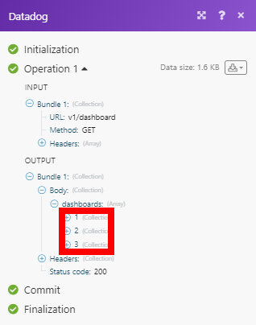

# [!DNL Datadog] módulos

En un [!DNL Adobe Workfront Fusion] , puede automatizar los flujos de trabajo que utilizan [!DNL Datadog], así como conectarlo a múltiples aplicaciones y servicios de terceros.

Si necesita instrucciones sobre cómo crear un escenario, consulte [Creación de un escenario en [!DNL Adobe Workfront Fusion]](../../workfront-fusion/scenarios/create-a-scenario.md).

Para obtener información sobre los módulos, consulte [Módulos en [!DNL Adobe Workfront Fusion]](../../workfront-fusion/modules/modules.md).

## Requisitos de acceso

Debe tener el siguiente acceso para utilizar la funcionalidad de este artículo:

<table style="table-layout:auto">
 <col> 
 <col> 
 <tbody> 
  <tr> 
   <td role="rowheader">[!DNL Adobe Workfront] plan*</td>
  <td> 
[!UICONTROL Pro] o superior
 </td>
  </tr> 
  <tr data-mc-conditions=""> 
   <td role="rowheader">[!DNL Adobe Workfront] licencia*</td>
   <td> 
[!UICONTROL Plan], [!UICONTROL Trabajo]
 </td> 
  </tr> 
  <tr> 
   <td role="rowheader">[!DNL Adobe Workfront Fusion] licencia**</td> 
   <td>
   
Requisito de licencia actual: No [!DNL Workfront Fusion] requisito de licencia.

   
O

   
Requisito de licencia heredada: [!UICONTROL [!DNL Workfront Fusion] para automatización e integración de trabajo] 

   </td> 
  </tr> 
  <tr> 
   <td role="rowheader">Product</td> 
   <td>
   
Requisito actual del producto: si tiene [!UICONTROL Select] o [!UICONTROL Prime] [!DNL Adobe Workfront] Plan, su organización debe comprar [!DNL Adobe Workfront Fusion] así como [!DNL Adobe Workfront] para utilizar la funcionalidad descrita en este artículo. [!DNL Workfront Fusion] está incluido en [!UICONTROL Ultimate] [!DNL Workfront] plan.

   
O

   
Requisito de productos heredados: su organización debe comprar [!DNL Adobe Workfront Fusion] así como [!DNL Adobe Workfront] para utilizar la funcionalidad descrita en este artículo.

   </td> 
  </tr> 
 </tbody> 
</table>

Para saber qué plan, tipo de licencia o acceso tiene, póngase en contacto con su [!DNL Workfront] administrador.

Para obtener información sobre [!DNL Adobe Workfront Fusion] licencias, consulte [[!DNL Adobe Workfront Fusion] licencias](../../workfront-fusion/get-started/license-automation-vs-integration.md).

## Requisitos previos

Para usar [!DNL Datadog] módulos, debe tener un [!DNL Datadog] cuenta.

## Connect [!DNL Datadog] hasta [!DNL Workfront Fusion] {#connect-datadog-to-workfront-fusion}

### Recupere la clave de API y la clave de aplicación {#retrieve-your-api-key-and-application-key}

Para conectar su [!DNL Datadog] cuenta a [!DNL Workfront Fusion] debe recuperar una clave de API y una clave de aplicación de su [!DNL Datadog] cuenta.

1. Inicie sesión en su [!DNL Datadog] cuenta.
1. En el panel de navegación izquierdo, haga clic en **[!UICONTROL Integraciones]**, luego haga clic en **[!UICONTROL API]**.
1. En la pantalla principal, haga clic en **[!UICONTROL Claves de API]**.
1. Pase el ratón sobre la barra morada para mostrar la clave de API.
1. Copie la clave de API en una ubicación segura.
1. En la pantalla principal, haga clic en **[!UICONTROL Claves de aplicación]**.
1. Pase el ratón sobre la barra morada para ver la clave de la aplicación.
1. Copie la clave de la aplicación en una ubicación segura.

### Cree una conexión con [!DNL Datadog] in [!DNL Workfront Fusion]

Puede crear una conexión con su [!DNL Datadog] cuenta directamente desde dentro de un [!UICONTROL Datadog] módulo.

1. En cualquier [!UICONTROL Datadog] , haga clic en **[!UICONTROL Añadir]** junto al [!UICONTROL Conexión] field.
1. Rellene los campos del módulo de la siguiente manera:

<table style="table-layout:auto">
    <col> 
    <col> 
    <tbody> 
     <tr> 
      <td role="rowheader">[!UICONTROL Tipo de conexión]</td> 
      <td> 
 Seleccione [!UICONTROL [!DNL Datadog] Opción [Application] para obtener acceso completo a [!DNL Datadog] API.
 </td> 
     </tr> 
     <tr> 
      <td role="rowheader">[!UICONTROL Nombre de conexión]</td> 
      <td> 
 Introduzca un nombre para la conexión.
 </td> 
     </tr> 
     <tr> 
      <td role="rowheader">[!UICONTROL Dominio] </td> 
      <td> 
Seleccione el dominio al que desea conectarse (EE.UU. o UE).
 </td> 
     </tr> 
     <tr> 
      <td role="rowheader">Clave de API [!UICONTROL]</td> 
      <td> 
 Introduzca su [!DNL Datadog] Clave de API. 
 
Para obtener instrucciones sobre cómo recuperar la clave de API, consulte <a href="#retrieve-your-api-key-and-application-key" class="MCXref xref">Recupere la clave de API y la clave de aplicación</a> en este artículo.
 </td> 
     </tr> 
     <tr> 
      <td role="rowheader">Clave de aplicación [!UICONTROL]</td> 
      <td> 
 Introduzca su [!DNL Datadog] clave de aplicación. 
 
Para obtener instrucciones sobre cómo recuperar la clave de aplicación, consulte <a href="#retrieve-your-api-key-and-application-key" class="MCXref xref">Recupere la clave de API y la clave de aplicación</a> en este artículo.
 </td> 
     </tr> 
    </tbody> 
   </table>

1. Clic **[!UICONTROL Continuar]** para crear la conexión y volver al módulo.

## [!DNL Datadog] módulos y sus campos

Al configurar [!DNL Datadog] módulos, [!DNL Workfront Fusion] muestra los campos que se indican a continuación. Junto con estos, se añaden [!DNL Datadog] Los campos pueden mostrarse, en función de factores como el nivel de acceso en la aplicación o el servicio. Un título en negrita en un módulo indica un campo obligatorio.

Si ve el botón Asignar encima de un campo o función, puede utilizarlo para establecer variables y funciones para ese campo. Para obtener más información, consulte [Asignación de información de un módulo a otro en [!DNL Adobe Workfront Fusion]](../../workfront-fusion/mapping/map-information-between-modules.md).

### Acciones

* [[!UICONTROL Publicar puntos de series temporales]](#post-timeseries-points)
* [[!UICONTROL Realizar una llamada de API]](#make-an-api-call)

#### [!UICONTROL Publicar puntos de series temporales]

El módulo le permite publicar datos de series temporales en los que se puede realizar un gráfico [!DNL Datadog]Paneles de.

El límite de cargas útiles comprimidas es de 3,2 megabytes (3200000) y de 62 megabytes (62914560) para cargas útiles descomprimidas.

<table style="table-layout:auto">
 <col> 
 <col> 
 <tbody> 
  <tr> 
   <td role="rowheader">[!UICONTROL Conexión]</td> 
   <td> 
Para obtener instrucciones acerca de cómo conectar su [!DNL Datadog] cuenta a [!DNL Workfront Fusion], consulte <a href="#connect-datadog-to-workfront-fusion" class="MCXref xref">Connect [!DNL Datadog] hasta [!DNL Workfront Fusion]</a> en este artículo.
 </td> 
  </tr> 
  <tr> 
   <td role="rowheader">[!UICONTROL Series]</td> 
   <td> 
Añada las series temporales que desee enviar [!DNL Datadog].
 
    <ul> 
     <li> 
<strong>[!UICONTROL Métrica]</strong> 
 
Introduzca el nombre de la serie temporal.
 </li> 
     <li> 
<strong>[!UICONTROL Tipo]</strong> 
 
Seleccione el tipo de métrica.
 </li> 
     <li> 
<strong>[!UICONTROL Intervalo]</strong> 
 
 Si el tipo de métrica es tasa o recuento, defina el intervalo correspondiente.
 </li> 
     <li> 
<strong>[!UICONTROL Puntos]</strong> 
 
Añada puntos relacionados con una métrica.
 
Esta es una matriz de puntos JSON. Cada punto tiene el formato: <code>[[POSIX_timestamp, numeric_value], ...] </code>
 
Nota:  
La marca de tiempo debe estar en segundos.
 
La marca de tiempo debe ser actual. Actual se define como no más de 10 minutos en el futuro o más de 1 hora en el pasado.
 
 El formato de valor numérico debe ser un valor flotante.
 
 
Este campo debe contener al menos 1 elemento.
 </li> 
     <li> 
<strong>[!UICONTROL Host]</strong> 
 
Introduzca el nombre del host que produjo la métrica.
 </li> 
    </ul> </td> 
  </tr> 
 </tbody> 
</table>

#### [!UICONTROL Realizar una llamada de API]

Este módulo de acción le permite realizar una llamada de API personalizada.

<table style="table-layout:auto">
 <col> 
 <col> 
 <tbody> 
  <tr> 
   <td role="rowheader">[!UICONTROL Conexión]</td> 
   <td> 
Para obtener instrucciones acerca de cómo conectar su [!DNL Datadog] cuenta a [!DNL Workfront Fusion], consulte <a href="#connect-datadog-to-workfront-fusion" class="MCXref xref">Connect [!DNL Datadog] hasta [!DNL Workfront Fusion]</a> en este artículo.
 </td> 
  </tr> 
  <tr> 
   <td role="rowheader">[!UICONTROL URL]</td> 
   <td>Introduzca una ruta relativa a <code>https://api.datadoghq.com/api/</code>. Ejemplo:<code> /v1/org</code>.</td> 
  </tr> 
  <tr> 
   <td role="rowheader">[!UICONTROL Método]</td> 
   <td> 
Seleccione el método de solicitud HTTP que necesita para configurar la llamada de API. Para obtener más información, consulte <a href="../../workfront-fusion/modules/http-request-methods.md" class="MCXref xref">Métodos de solicitud HTTP en [!DNL Adobe Workfront Fusion]</a>.
 </td> 
  </tr> 
  <tr> 
   <td role="rowheader">[!UICONTROL Encabezados]</td> 
   <td> 
Añada los encabezados de la solicitud en forma de objeto JSON estándar.
 
Por ejemplo, <code>{"Content-type":"application/json"}</code>
 
Workfront Fusion añade los encabezados de autorización por usted.
 </td> 
  </tr> 
  <tr> 
   <td role="rowheader">[!UICONTROL Cadena de consulta]</td> 
   <td> 
Añada la consulta para la llamada de API en forma de objeto JSON estándar.
 
Por ejemplo: <code>{"name":"something-urgent"}</code>
 </td> 
  </tr> 
  <tr> 
   <td role="rowheader">[!UICONTROL Cuerpo]</td> 
   <td> 
Añada el contenido del cuerpo para la llamada de API en forma de objeto JSON estándar.
 
Nota:  
Cuando se utilizan afirmaciones condicionales como <code>if</code> en su JSON, ponga las comillas fuera del enunciado condicional.
 
     
Example: </b>"> 
      
  
 
     
 
 </td> 
  </tr> 
 </tbody> 
</table>

**Ejemplo:** La siguiente llamada de API devuelve todos los paneles de su [!DNL Datadog] cuenta:

URL: `/v1/dashboard`

Método: `GET`

El resultado se puede encontrar en Salida del módulo, en Paquete > Cuerpo > Paneles.

En nuestro ejemplo, se devolvieron 3 paneles:

