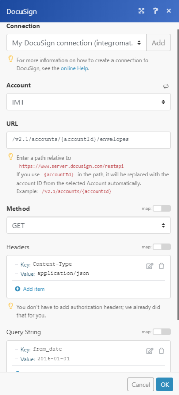

# Módulos de DocuSign

Los módulos [!DNL Adobe Workfront Fusion] [!DNL DocuSign] le permiten supervisar y recuperar el estado de los sobres, buscar y recuperar sobres o descargar y enviar un documento para iniciar sesión en su cuenta de [!DNL DocuSign].

Si necesita instrucciones para crear un escenario, consulte [Crear un escenario en [!DNL Adobe Workfront Fusion]](../../workfront-fusion/scenarios/create-a-scenario.md).

Para obtener información acerca de los módulos, vea [Módulos en [!DNL Adobe Workfront Fusion]](../../workfront-fusion/modules/modules.md).

## Requisitos de acceso

Debe tener el siguiente acceso para utilizar la funcionalidad de este artículo:

<table style="table-layout:auto">
 <col> 
 <col> 
 <tbody> 
  <tr> 
   <td role="rowheader">[!DNL Adobe Workfront] plan*</td>
  <td> 
[!UICONTROL Pro] o superior
 </td>
  </tr> 
  <tr data-mc-conditions=""> 
   <td role="rowheader">[!DNL Adobe Workfront] licencia*</td>
   <td> 
[!UICONTROL Plan], [!UICONTROL Trabajo]
 </td> 
  </tr> 
  <tr> 
   <td role="rowheader">[!DNL Adobe Workfront Fusion] licencia**</td> 
   <td>
   
Requisito de licencia actual: no se requiere licencia de [!DNL Workfront Fusion].

   
O

   
Requisito de licencia heredado: [!UICONTROL [!DNL Workfront Fusion] para automatización e integración de trabajo] 

   </td> 
  </tr> 
  <tr> 
   <td role="rowheader">Producto</td> 
   <td>
   
Requisito de producto actual: si tiene el plan [!UICONTROL Select] o [!UICONTROL Prime] [!DNL Adobe Workfront], su organización debe adquirir [!DNL Adobe Workfront Fusion] así como [!DNL Adobe Workfront] para utilizar la funcionalidad descrita en este artículo. [!DNL Workfront Fusion] está incluido en el plan [!DNL Workfront] de [!UICONTROL Ultimate].

   
O

   
Requisito de productos heredados: su organización debe comprar [!DNL Adobe Workfront Fusion] y [!DNL Adobe Workfront] para utilizar la funcionalidad descrita en este artículo.

   </td> 
  </tr> 
 </tbody> 
</table>

Para saber qué plan, tipo de licencia o acceso tiene, póngase en contacto con el administrador de [!DNL Workfront].

Para obtener información sobre [!DNL Adobe Workfront Fusion] licencias, consulte [[!DNL Adobe Workfront Fusion] licencias](../../workfront-fusion/get-started/license-automation-vs-integration.md).

## Requisitos previos

Para usar módulos de [!DNL DocuSign], debe tener una cuenta de [!DNL DocuSign].

## Información de API de DocuSign

El conector de DocuSign utiliza lo siguiente:

<table style="table-layout:auto"> 
 <col> 
 <col> 
 <tbody> 
  <tr> 
   <td role="rowheader">Etiqueta de API</td> 
   <td>1.18.11</td> 
  </tr>
 </tbody> 
 </table>

## Conectar [!DNL DocuSign] a [!DNL Workfront Fusion] {#connect-docusign-to-workfront-fusion}

Para crear una conexión para los módulos de [!DNL DocuSign]:

1. Haga clic en **[!UICONTROL Agregar]** junto al cuadro [!UICONTROL Conexión] cuando empiece a configurar el primer módulo de [!DNL DocuSign].
1. Introduzca lo siguiente:

<table style="table-layout:auto">
    <col> 
    <col> 
    <tbody> 
     <tr> 
      <td role="rowheader"> 
[!UICONTROL Nombre de conexión]
 </td> 
      <td>Escriba un nombre para la nueva conexión [!DNL DocuSign]</td> 
     </tr> 
     <tr> 
      <td role="rowheader">[!UICONTROL Tipo de cuenta]</td> 
      <td>Seleccione si la cuenta a la que desea conectarse es una cuenta de producción o una cuenta de demostración.</td> 
     </tr> 
    </tbody> 
   </table>

1. Continúe como se describe en [Crear una conexión con [!DNL Adobe Workfront Fusion] - Instrucciones básicas](../../workfront-fusion/connections/connect-to-fusion-general.md#connect).

## [!DNL DocuSign] módulos y sus campos

Al configurar [!DNL DocuSign] módulos, [!DNL Workfront Fusion] muestra los campos que se indican a continuación. Junto con estos, podrían mostrarse [!DNL DocuSign] campos adicionales, según factores como el nivel de acceso en la aplicación o el servicio. Un título en negrita en un módulo indica un campo obligatorio.

Si ve el botón Asignar encima de un campo o función, puede utilizarlo para establecer variables y funciones para ese campo. Para obtener más información, vea [Asignar información de un módulo a otro en [!DNL Adobe Workfront Fusion]](../../workfront-fusion/mapping/map-information-between-modules.md).

* [Déclencheur](#triggers)
* [Acciones](#actions)

### Déclencheur

#### [!UICONTROL Ver sobres]

Este módulo de déclencheur inicia un escenario en el que se envía, entrega, firma, completa o rechaza un sobre.

<table style="table-layout:auto">
 <col data-mc-conditions=""> 
 <col data-mc-conditions=""> 
 <tbody> 
  <tr> 
   <td role="rowheader">[!UICONTROL Conexión] </td> 
   <td> 
Para obtener instrucciones acerca de cómo conectar su cuenta de [!DNL DocuSign] a [!DNL Workfront Fusion], vea <a href="../../workfront-fusion/scenarios/create-a-scenario.md#connect" class="MCXref xref">Conectar la aplicación o el servicio web del módulo a [!DNL Workfront Fusion]</a> en el artículo <a href="../../workfront-fusion/scenarios/create-a-scenario.md" class="MCXref xref">Crear un escenario en [!DNL Adobe Workfront Fusion]</a>.
 </td> 
  </tr> 
  <tr> 
   <td role="rowheader">[!UICONTROL Cuenta] </td> 
   <td> 
Seleccione la cuenta que contiene los registros que desea ver.
 </td> 
  </tr> 
  <tr> 
   <td role="rowheader">[!UICONTROL Tipo de evento]</td> 
   <td> 
 Seleccione el tipo de evento que desea ver.
 
    <ul> 
     <li>[!UICONTROL Documento completado]</li> 
     <li>[!UICONTROL Documento rechazado]</li> 
     <li>[!UICONTROL Documento enviado]</li> 
     <li>[!UICONTROL Documento firmado]</li> 
     <li>[!UICONTROL Nuevo documento en Bandeja de entrada]</li> 
    </ul> </td> 
  </tr> 
  <tr> 
   <td role="rowheader"> 
[!UICONTROL Campos de salida]
 </td> 
   <td> 
Seleccione los campos que desea incluir en la salida del módulo.
 </td> 
  </tr> 
  <tr> 
   <td role="rowheader">[!UICONTROL Límite]</td> 
   <td>Introduzca o asigne el número máximo de registros con los que desea que trabaje el módulo durante cada ciclo de ejecución de escenario.</td> 
  </tr> 
 </tbody> 
</table>

### Acciones

* [[!UICONTROL Llamada de API personalizada]](#custom-api-call)
* [[!UICONTROL Descargar un documento]](#download-a-document)
* [[!UICONTROL Leer un sobre]](#read-an-envelope)
* [[!UICONTROL Cargar un archivo en un sobre]](#upload-a-file-to-an-envelope)
* [[!UICONTROL Crear un sobre nuevo]](#create-a-new-envelope)
* [[!UICONTROL Agregar destinatario al sobre]](#add-recipient-to-envelope)
* [[!UICONTROL Agregar campo personalizado]](#add-custom-field)
* [[!UICONTROL Modificar campo personalizado]](#modify-custom-field)
* [[!UICONTROL Enviar sobre]](#send-envelope)

#### [!UICONTROL Llamada de API personalizada]

Este módulo de acción le permite realizar una llamada de API personalizada.

<table style="table-layout:auto">
 <col> 
 <col> 
 <tbody> 
  <tr> 
   <td>[!UICONTROL Conexión]</td> 
   <td> 
Para obtener instrucciones acerca de cómo conectar su cuenta de [!DNL DocuSign] a [!DNL Workfront Fusion], vea <a href="#connect-docusign-to-workfront-fusion" class="MCXref xref">Conectar [!DNL DocuSign] a [!DNL Workfront Fusion]</a> en este artículo.
 </td> 
  </tr> 
  <tr> 
   <td>[!UICONTROL Cuenta]</td> 
   <td>Escriba o asigne la cuenta que desea usar para obtener acceso a la API de [!DNL DocuSign].</td> 
  </tr> 
  <tr> 
   <td>[!UICONTROL URL]</td> 
   <td> 
Escriba la dirección del servidor web con el que desea que interactúe el módulo.
 
Puede escribir una dirección URL relativa, lo que significa que no tiene que incluir el protocolo (como <code>http://</code>) al principio. Esto sugiere al servidor web que la interacción se está produciendo en el servidor.
 
Por ejemplo: <code>[!DNL /api/conversations].create</code>
  </td> 
  </tr> 
  <tr> 
   <td>[!UICONTROL Método]</td> 
   <td> 
Seleccione el método de solicitud HTTP que necesita para configurar la llamada de API. Para obtener más información, vea <a href="../../workfront-fusion/modules/http-request-methods.md" class="MCXref xref" data-mc-variable-override="">Métodos de solicitud HTTP en [!DNL Adobe Workfront Fusion]</a>.
 </td> 
  </tr> 
  <tr> 
   <td>[!UICONTROL Encabezados]</td> 
   <td> 
Añada los encabezados de la solicitud en forma de objeto JSON estándar. Determina el tipo de contenido de la solicitud.
 
Por ejemplo,<code> {"Content-type":"application/json"}</code>
 
Nota: Si se producen errores y es difícil determinar su origen, considere la posibilidad de modificar los encabezados basados en la documentación de [!DNL Workfront]. Si la llamada de API personalizada devuelve un error de solicitud HTTP 422, intente utilizar un encabezado "Content-Type": "text/plain".
 </td> 
  </tr> 
  <tr> 
   <td>[!UICONTROL Cadena de consulta]</td> 
   <td> 
Añada la consulta para la llamada de API en forma de objeto JSON estándar.
 
Por ejemplo: <code>{"name":"something-urgent"}</code>
 </td> 
  </tr> 
  <tr> 
   <td>[!UICONTROL Cuerpo]</td> 
   <td> 
Añada el contenido del cuerpo para la llamada de API en forma de objeto JSON estándar.
 
Nota:  
Cuando utilice afirmaciones condicionales como <code>if</code> en su JSON, coloque las comillas fuera de la afirmación condicional.
 
     
Example: </b>"> 
      
  
 
     
 
 </td> 
  </tr> 
  <tr> 
   <td>[!UICONTROL Límite]</td> 
   <td>Introduzca o asigne el número máximo de resultados que se van a trabajar durante un ciclo de ejecución.</td> 
  </tr> 
 </tbody> 
</table>

>[!INFO]
>
>**Ejemplo:** sobres de lista
>
>La siguiente llamada API devuelve sobres a partir de la fecha especificada en su cuenta de [!DNL DocuSign]:
>
>**URL**: `/v2.1/accounts/{accountId}/envelopes/`
>
>**Método**: `GET`
>
>**Cadena de consulta**:
>
>* **Clave**: `from_date`
>
>* **Valor**: `YYYY-MM-DD`
>
>Especifica cuándo comienza la solicitud a comprobar los cambios de estado de los sobres de la cuenta.
>
>
>
>El resultado se puede encontrar en Salida del módulo en Paquete > Cuerpo > Sobres.
>
>En nuestro ejemplo, se devolvieron 6 sobres:
>
>

#### [!UICONTROL Descargar un documento]

Este módulo de acción descarga un solo documento.

<table style="table-layout:auto">
 <col> 
 <col> 
 <tbody> 
  <tr> 
   <td role="rowheader">[!UICONTROL Conexión]</td> 
   <td> 
Para obtener instrucciones acerca de cómo conectar su cuenta de [!DNL DocuSign] a [!DNL Workfront Fusion], vea <a href="#connect-docusign-to-workfront-fusion" class="MCXref xref">Conectar [!DNL DocuSign] a [!DNL Workfront Fusion]</a> en este artículo.
 </td>
  </tr> 
  <tr> 
   <td role="rowheader">[!UICONTROL Cuenta] </td> 
   <td> 
Seleccione la cuenta que contiene el documento que desea descargar.
 </td> 
  </tr> 
  <tr> 
   <td role="rowheader">[!UICONTROL Envelope ID]</td> 
   <td> 
 Introduzca o asigne el ID del sobre que desea descargar.
 </td> 
  </tr> 
  <tr> 
   <td role="rowheader"> 
[!UICONTROL ID de documento]
 </td> 
   <td> 
Introduzca o asigne el ID del documento que desea descargar.
 </td> 
  </tr> 
  <tr> 
   <td role="rowheader">[!UICONTROL Certificado]</td> 
   <td>Seleccione <strong>[!UICONTROL Yes]</strong> si desea incluir el certificado de firma de sobre en la descarga.</td> 
  </tr> 
  <tr> 
   <td role="rowheader">Documentos de [!UICONTROL por identificador de usuario]</td> 
   <td>Seleccione <strong>[!UICONTROL Yes]</strong> si desea permitir que los destinatarios recuperen documentos por identificador de usuario. Por ejemplo, si un usuario se incluye en dos órdenes de enrutamiento diferentes con distintas visibilidad, al utilizar esta opción se devuelven todos los documentos de ambas rutas.</td> 
  </tr> 
  <tr> 
   <td role="rowheader">[!UICONTROL Cifrado]</td> 
   <td>Seleccione <strong>[!UICONTROL Yes]</strong> si desea que los bytes de PDF devueltos en la respuesta se cifren para todos los administradores de claves configurados en su cuenta de [!DNL DocuSign].</td> 
  </tr> 
  <tr> 
   <td role="rowheader">[!UICONTROL Idioma]</td> 
   <td>Seleccione el idioma.</td> 
  </tr> 
  <tr> 
   <td role="rowheader">[!UICONTROL Mostrar cambios]</td> 
   <td>Cuando se establece en <strong>[!UICONTROL Yes]</strong>, los campos modificados para el PDF devuelto se resaltan en amarillo y las iniciales o firmas opcionales se resaltan en rojo.</td> 
  </tr> 
  <tr> 
   <td role="rowheader">[!UICONTROL Filigrana]</td> 
   <td> 
Seleccione <strong>[!UICONTROL No]</strong> para quitar la marca de agua de los documentos del PDF.
 </td> 
  </tr> 
 </tbody> 
</table>

#### [!UICONTROL Leer un sobre]

Este módulo de acción lee información acerca de un sobre en [!DNL DocuSign] mediante el identificador del sobre.

<table style="table-layout:auto">
 <col> 
 <col> 
 <tbody> 
  <tr> 
   <td role="rowheader">[!UICONTROL Conexión]</td> 
   <td> 
Para obtener instrucciones acerca de cómo conectar su cuenta de [!DNL DocuSign] a [!DNL Workfront Fusion], vea <a href="#connect-docusign-to-workfront-fusion" class="MCXref xref">Conectar [!DNL DocuSign] a [!DNL Workfront Fusion]</a> en este artículo.
 </td>
  </tr> 
  <tr> 
   <td role="rowheader">[!UICONTROL Cuenta] </td> 
   <td> 
Seleccione la cuenta que contiene el documento del que desea leer información.
 </td> 
  </tr> 
  <tr> 
   <td role="rowheader">[!UICONTROL Envelope ID]</td> 
   <td> 
 Introduzca o asigne el ID que contiene el documento del que desea leer información.
 </td> 
  </tr> 
  <tr> 
   <td role="rowheader">[!UICONTROL Salidas]</td> 
   <td>Seleccione las propiedades que desea que aparezcan en la salida del módulo. </td> 
  </tr> 
 </tbody> 
</table>

#### [!UICONTROL Cargar un archivo en un sobre]

Este módulo carga un archivo especificado en un sobre existente en DocuSign.

<table style="table-layout:auto">
 <col> 
 <col> 
 <tbody> 
  <tr> 
   <td role="rowheader">[!UICONTROL Conexión]</td> 
   <td> 
Para obtener instrucciones acerca de cómo conectar su cuenta de [!DNL DocuSign] a [!DNL Workfront Fusion], vea <a href="#connect-docusign-to-workfront-fusion" class="MCXref xref">Conectar [!DNL DocuSign] a [!DNL Workfront Fusion]</a> en este artículo.
 </td>
  </tr> 
  <tr> 
   <td role="rowheader">[!UICONTROL Cuenta] </td> 
   <td> 
Seleccione la cuenta que contiene el sobre en el que desea cargar un archivo.
 </td> 
  </tr> 
  <tr> 
   <td role="rowheader">[!UICONTROL Envelope ID]</td> 
   <td> 
 Introduzca o asigne el ID del sobre donde desea cargar un archivo.
 </td> 
  </tr> 
  <tr> 
   <td role="rowheader">[!UICONTROL archivo Source]</td> 
   <td>Seleccione un archivo de origen de un módulo anterior o introduzca el nombre y los datos del archivo de origen.</td> 
  </tr> 
 </tbody> 
</table>

#### [!UICONTROL Crear un sobre nuevo]

Este módulo de acción crea un nuevo sobre a partir de una plantilla. Devuelve el ID del nuevo sobre, así como el estado del nuevo sobre.

<table style="table-layout:auto">
 <col data-mc-conditions=""> 
 <col data-mc-conditions=""> 
 <tbody> 
  <tr> 
    <td role="rowheader">[!UICONTROL Conexión] </td>

<td> 
Para obtener instrucciones sobre cómo conectar su cuenta de DocuSign a Workfront Fusion, consulte <a href="../../workfront-fusion/scenarios/create-a-scenario.md#connect" class="MCXref xref">Conectar la aplicación o el servicio web del módulo a Workfront Fusion</a> en el artículo <a href="../../workfront-fusion/scenarios/create-a-scenario.md" class="MCXref xref">Crear un escenario en Adobe Workfront Fusion</a>.
 </td> 
  </tr> 
  <tr> 
    <td role="rowheader">[!UICONTROL Cuenta] </td>
   <td> 
Seleccione la cuenta que contiene el sobre en el que desea cargar un archivo.
 </td> 
  </tr> 
  <tr> 
    <td role="rowheader" >[!UICONTROL Template]</td>
   <td> 
 Seleccione la plantilla a partir de la que desea crear el nuevo sobre. Las plantillas están disponibles según la [!UICONTROL Account] seleccionada.
 </td> 
  </tr> 
  <tr> 
   <td role="rowheader">
     [!UICONTROL Después de la creación]
   </td> 
   <td> 
Seleccione si desea guardar el sobre como borrador o enviarlo para su firma.
 </td> 
  </tr> 
  <tr> 
    <td role="rowheader" >[!UICONTROL Destinatarios de plantilla]</td>
    <td>Seleccione el destinatario de este sobre</td>
  </tr> 
 </tbody> 
</table>

#### [!UICONTROL Agregar destinatario al sobre]

Este módulo de acción añade uno o más destinatarios a un sobre existente. Si el sobre ya se ha enviado, se envía un correo electrónico al destinatario. Este módulo no es válido para sobres que ya se han completado.

<table style="table-layout:auto">
 <col data-mc-conditions=""> 
 <col data-mc-conditions=""> 
 <tbody> 
  <tr data-mc-conditions=""> 
    <td>[!UICONTROL Conexión] </td>
   <td> 
Para obtener instrucciones sobre cómo conectar su cuenta de DocuSign a Workfront Fusion, consulte <a href="../../workfront-fusion/scenarios/create-a-scenario.md#connect" class="MCXref xref">Conectar la aplicación o el servicio web del módulo a Workfront Fusion</a> en el artículo <a href="../../workfront-fusion/scenarios/create-a-scenario.md" class="MCXref xref">Crear un escenario en Adobe Workfront Fusion</a>.
 </td> 
  </tr> 
  <tr data-mc-conditions="">
    <td>[!UICONTROL Cuenta] </td>
   <td> 
Seleccione la cuenta que contiene el sobre en el que desea agregar destinatarios.
 </td> 
  </tr> 
  <tr> 
    <td>[!UICONTROL Envelope ID]</td>
    <td>Seleccione o asigne el ID del sobre donde desea añadir el destinatario.</td>
  </tr> 
  <tr data-mc-conditions="">
    <td role="rowheader">[!UICONTROL Tipo de destinatario]</td>
   <td> 
 Seleccione el tipo de destinatario que desea añadir al sobre.
 
    <ul> 
     <li> 
[!UICONTROL Agent]
 </li> 
     <li> 
[!UICONTROL Copia de carbono]
 </li> 
     <li> 
[!UICONTROL Envío certificado]
 </li> 
     <li> 
[!UICONTROL Firmante en persona]
 </li> 
     <li> 
[!UICONTROL Intermediario]
 </li> 
     <li> 
[!UICONTROL Signatario]
 </li> 
    </ul> </td> 
  </tr> 
  <tr> 
    <td>[!UICONTROL Correo electrónico]</td>
   <td> 
Introduzca o asigne la dirección de correo electrónico del destinatario que desea añadir al sobre.
 </td> 
  </tr> 
  <tr> 
    <td>[!UICONTROL Nombre]</td>
   <td>Introduzca o asigne el nombre del destinatario que desea añadir al sobre.</td> 
  </tr> 
  <tr>
    <td>[!UICONTROL Orden de enrutamiento]</td>
   <td> 
Introduzca o asigne el número de ruta del destinatario. El número de enrutamiento determina el orden en que los destinatarios reciben y firman los documentos.
 </td> 
  </tr> 
  <tr> 
    <td role="rowheader">[!UICONTROL Email body]</td>
   <td>Introduzca o asigne el cuerpo (contenido) del correo electrónico que se envía al destinatario.</td> 
  </tr> 
  <tr>
    <td role="rowheader">[!UICONTROL Asunto del correo electrónico]</td>
   <td>Introduzca o asigne el asunto del correo electrónico que se envía al destinatario.</td> 
  </tr> 
    <td role="rowheader">[!UICONTROL Mensaje privado]</td>
   <td> <li> 
Solo el destinatario seleccionado ve el mensaje privado, así como el mensaje general. El mensaje privado está limitado a 1000 caracteres.
 </li> </td> 
  </tr> 
  <tr> 
   <td role="rowheader">[!UICONTROL Autenticación]</td> 
   <td> 
Seleccione el método de autenticación que desee utilizar para confirmar la identidad del destinatario.
 
    <ul> 
     <li> 
<strong>[!UICONTROL Ninguno]</strong> 
 </li> 
     <li> 
<strong>[!UICONTROL Código de acceso]</strong> 
 
Introduzca o asigne el código de acceso.
 </li> 
     <li> 
<strong>[!UICONTROL Teléfono]</strong> 
 
Escriba o asigne el número de teléfono
 </li> 
     <li> 
<strong>[!UICONTROL SMS]</strong> 
 
Escriba o asigne el número de teléfono
 </li> 
    </ul> </td> 
  </tr> 
 </tbody> 
</table>

#### [!UICONTROL Agregar campo personalizado]

Este módulo de acción agrega un campo personalizado al documento

<table style="table-layout:auto">
 <col> 
 <col> 
 <tbody> 
  <tr> 
   <td role="rowheader">[!UICONTROL Conexión]</td> 
   <td> 
Para obtener instrucciones acerca de cómo conectar su cuenta de [!DNL DocuSign] a [!DNL Workfront Fusion], vea <a href="#connect-docusign-to-workfront-fusion" class="MCXref xref">Conectar [!DNL DocuSign] a [!DNL Workfront Fusion]</a> en este artículo.
 </td>
  </tr> 
  <tr> 
   <td role="rowheader">[!UICONTROL Cuenta] </td> 
   <td> 
Seleccione la cuenta que contiene el documento donde desea agregar un campo personalizado.
 </td> 
  </tr> 
  <tr> 
   <td role="rowheader">[!UICONTROL Envelope ID]</td> 
   <td> 
 Escriba o asigne el Id. del sobre que contiene el documento donde desea agregar un campo personalizado.
 </td> 
  </tr> 
  <tr> 
   <td role="rowheader">[!UICONTROL Nombre de campo]</td> 
   <td>Escriba o asigne un nombre para el nuevo campo que desee agregar.</td> 
  </tr> 
  <tr> 
   <td role="rowheader">[!UICONTROL Requerido]</td> 
   <td>Active esta opción si desea que el campo añadido sea un campo obligatorio.</td> 
  </tr> 
  <tr> 
   <td role="rowheader">[!UICONTROL Mostrar campo]</td> 
   <td>Active esta opción si desea que el campo sea visible.</td> 
  </tr> 
  <tr> 
   <td role="rowheader">[!UICONTROL Valor]</td> 
   <td>Introduzca o asigne el valor (contenido) del campo añadido. </td> 
  </tr> 
 </tbody> 
</table>

#### [!UICONTROL Modificar campo personalizado]

Este módulo de acción modifica un campo personalizado mediante el nombre del campo.

<table style="table-layout:auto">
 <col> 
 <col> 
 <tbody> 
  <tr> 
   <td role="rowheader">[!UICONTROL Conexión]</td> 
   <td> 
Para obtener instrucciones acerca de cómo conectar su cuenta de [!DNL DocuSign] a [!DNL Workfront Fusion], vea <a href="#connect-docusign-to-workfront-fusion" class="MCXref xref">Conectar [!DNL DocuSign] a [!DNL Workfront Fusion]</a> en este artículo.
 </td>
  </tr> 
  <tr> 
   <td role="rowheader">[!UICONTROL Cuenta] </td> 
   <td> 
Seleccione la cuenta que contiene el documento donde desea modificar un campo personalizado.
 </td> 
  </tr> 
  <tr> 
   <td role="rowheader">[!UICONTROL Envelope ID]</td> 
   <td> 
 Introduzca o asigne el ID del sobre que contiene el documento en el que desea modificar un campo personalizado.
 </td> 
  </tr> 
  <tr> 
   <td role="rowheader">[!UICONTROL Id. de campo]</td> 
   <td>Introduzca o asigne el ID del campo que desea modificar.</td> 
  </tr> 
  <tr> 
   <td role="rowheader">[!UICONTROL Nombre de campo]</td> 
   <td>Introduzca o asigne el nombre del campo que desea modificar.</td> 
  </tr> 
  <tr> 
   <td role="rowheader">[!UICONTROL Requerido]</td> 
   <td>Active esta opción si desea que el campo modificado sea obligatorio.</td> 
  </tr> 
  <tr> 
   <td role="rowheader">[!UICONTROL Mostrar campo]</td> 
   <td>Active esta opción si desea que el campo sea visible.</td> 
  </tr> 
  <tr> 
   <td role="rowheader">[!UICONTROL Valor]</td> 
   <td>Introduzca o asigne el valor (contenido) del campo modificado. </td> 
  </tr> 
 </tbody> 
</table>

#### [!UICONTROL Enviar sobre]

Este módulo de acción envía un sobre borrador a sus destinatarios.

<table style="table-layout:auto">
 <col> 
 <col> 
 <tbody> 
  <tr> 
   <td role="rowheader">[!UICONTROL Conexión]</td> 
   <td> 
Para obtener instrucciones acerca de cómo conectar su cuenta de [!DNL DocuSign] a [!DNL Workfront Fusion], vea <a href="#connect-docusign-to-workfront-fusion" class="MCXref xref">Conectar [!DNL DocuSign] a [!DNL Workfront Fusion]</a> en este artículo.
 </td>
  </tr> 
  <tr> 
   <td role="rowheader">[!UICONTROL Cuenta] </td> 
   <td> 
Seleccione la cuenta que contiene el sobre borrador que desea enviar a sus destinatarios.
 </td> 
  </tr> 
  <tr> 
   <td role="rowheader">[!UICONTROL Envelope ID]</td> 
   <td> 
 Introduzca o asigne el ID del sobre borrador que desea enviar a sus destinatarios.
 </td> 
  </tr> 
 </tbody> 
</table>
