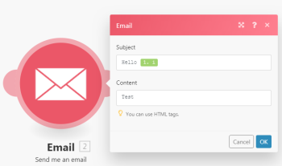

# Control de flujo en Adobe Workfront Fusion

Al crear o editar un escenario, puede configurar opciones para controlar el modo en que los datos fluyen por él.

## Requisitos de acceso

Debe tener el siguiente acceso para utilizar la funcionalidad de este artículo:

<table style="table-layout:auto"> 
 <col> 
 <col> 
 <tbody> 
  <tr> 
   <td role="rowheader">[!DNL Adobe Workfront] plan*</td>
  <td> 
[!UICONTROL Pro] o superior
 </td>
  </tr> 
  <tr data-mc-conditions=""> 
   <td role="rowheader">[!DNL Adobe Workfront] licencia*</td>
   <td> 
[!UICONTROL Plan], [!UICONTROL Trabajo]
 </td> 
  </tr> 
  <tr> 
   <td role="rowheader">[!DNL Adobe Workfront Fusion] licencia**</td> 
   <td>
   
Requisito de licencia actual: no se requiere licencia de [!DNL Workfront Fusion].

   
O

   
Requisito de licencia heredado: [!UICONTROL [!DNL Workfront Fusion] para automatización e integración de trabajo], [!UICONTROL [!DNL Workfront Fusion] para automatización de trabajo]

   </td> 
  </tr> 
  <tr> 
   <td role="rowheader">Product</td> 
   <td>
   
Requisito de producto actual: si tiene el plan [!UICONTROL Select] o [!UICONTROL Prime] [!DNL Adobe Workfront], su organización debe adquirir [!DNL Adobe Workfront Fusion] así como [!DNL Adobe Workfront] para utilizar la funcionalidad descrita en este artículo. [!DNL Workfront Fusion] está incluido en el plan [!DNL Workfront] de [!UICONTROL Ultimate].

   
O

   
Requisito de productos heredados: su organización debe comprar [!DNL Adobe Workfront Fusion] y [!DNL Adobe Workfront] para utilizar la funcionalidad descrita en este artículo.

   </td> 
  </tr> 
 </tbody> 
</table>

Para saber qué plan, tipo de licencia o acceso tiene, póngase en contacto con el administrador de [!DNL Workfront].

Para obtener información sobre [!DNL Adobe Workfront Fusion] licencias, consulte [[!DNL Adobe Workfront Fusion] licencias](../../workfront-fusion/get-started/license-automation-vs-integration.md).

## Repetidor

Puede usar un módulo [!UICONTROL Repeater] para repetir una tarea un número determinado de veces. Un módulo [!UICONTROL Repeater] genera paquetes uno tras otro.

Por ejemplo, podrías usar un módulo [!UICONTROL Repetidor] para enviar cinco correos electrónicos con los temas &quot;Hola 1&quot;, &quot;Hola 2&quot;, etc., conectando el módulo **[!UICONTROL Correo electrónico] >[!UICONTROL Enviarme un correo electrónico]** al módulo [!UICONTROL Repetidor].

Para usar un módulo [!UICONTROL Repeater]:

1. Haga clic en el icono [!UICONTROL Control de flujo]  en la parte inferior de la pantalla y, a continuación, haga clic en **[!UICONTROL Repetidor]** en el menú que se muestra.
1. Haga clic en el paquete [!UICONTROL Repeater] y, a continuación, haga clic en **[!UICONTROL Conectarse automáticamente]** en el cuadro que aparece.
1. En el cuadro [!UICONTROL Control de flujo] que aparece, escriba el número de repeticiones (paquetes de salida) que desee en el cuadro **[!UICONTROL Repeticiones]**.

   En nuestro ejemplo de correo electrónico, debe escribir 5.

   

   El valor del elemento aumenta en cada repetición según este valor especificado en el campo **[!UICONTROL Paso]**, que puede ver seleccionando **[!UICONTROL Mostrar configuración avanzada]**. Este número es 1 de forma predeterminada.

1. Haga clic en **[!UICONTROL Aceptar]** para cerrar el cuadro **[!UICONTROL Control de flujo]**.

1. Haga clic en la aplicación o el módulo de servicio conectado al módulo [!UICONTROL Repeater].
1. En el cuadro que aparece, escriba la información que desea repetir.

   En nuestro ejemplo de correo electrónico, escribiría Hello en el cuadro [!UICONTROL Subject] y, a continuación, asignaría `i` desde el módulo del repetidor.

   

| Elemento | Descripción |
|---|---|
| [!UICONTROL Valor inicial] | Escriba o asigne el número que desea que el módulo establezca como `i` en la primera iteración. El valor predeterminado es 1. |
| [!UICONTROL Repeticiones] | Introduzca o asigne el número de veces que desea que el módulo se repita. Este número debe ser mayor o igual que 0, y menor o igual que 10 000. |
| [!UICONTROL Paso] | Es el número en que el módulo aumenta el valor de `i`. El valor predeterminado es 1. |

{style="table-layout:auto"}

>[!NOTE]
>
>El número de repeticiones no está determinado por el valor de `i`, ya que estaría en un bucle en la programación. El módulo repetirá la cantidad de veces indicada en el campo [!UICONTROL Repeticiones]. El valor `i` cambia con cada iteración del módulo [!DNL repeater] y se puede asignar a módulos posteriores. El ejemplo anterior asigna el valor de `i` al mensaje Hello, lo que da como resultado mensajes que dicen &quot;Hello 1&quot;, &quot;Hello 2&quot;, etc.

## [!UICONTROL Iterador]

Un [!UICONTROL Iterator] es un tipo especial de módulo que convierte una matriz en una serie de paquetes. Cada elemento de matriz será un paquete independiente en la salida del módulo [!UICONTROL Iterator]. Para obtener más información, consulte el módulo [[!UICONTROL Iterator] en [!DNL Adobe Workfront Fusion]](../../workfront-fusion/modules/iterator-module.md).

## Agregador de matrices

Un agregador de matrices es un tipo especial de módulo que permite combinar varios paquetes en uno solo. Para obtener más información, consulte el módulo [[!UICONTROL Aggregator] en Adobe Workfront Fusion](../../workfront-fusion/modules/aggregator-module.md).

## [!UICONTROL Enrutador]

El módulo [!UICONTROL Router] le permite bifurcar el flujo en varias rutas y procesar los datos de cada ruta de forma diferente. Una vez que un módulo [!UICONTROL Router] recibe un paquete, lo reenvía a cada ruta conectada en el orden en que se adjuntaron las rutas al módulo [!UICONTROL Router]. Para obtener más información, consulte [Módulo de enrutador en [!DNL Adobe Workfront Fusion]](../../workfront-fusion/modules/router-module.md).

<!--

<h2>Directives</h2>

The error handling directives allow you to control how your scenario reacts to errors. For more information, see <a href="../../workfront-fusion/errors/advanced-error-handling.md" class="MCXref xref">Advanced error handling in Adobe Workfront Fusion</a> and <a href="../../workfront-fusion/errors/directives-for-error-handling.md" class="MCXref xref">Directives for error handling in Adobe Workfront Fusion</a>.

-->
