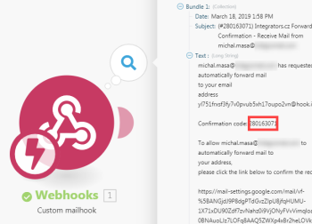

# [!DNL Google Calendar] módulos

En un escenario de [!DNL Adobe Workfront Fusion], puede automatizar los flujos de trabajo que usan [!UICONTROL Google Calendar], así como conectarlo a varias aplicaciones y servicios de terceros.

Si necesita instrucciones para crear un escenario, consulte [Crear un escenario en [!DNL Adobe Workfront Fusion]](../../workfront-fusion/scenarios/create-a-scenario.md).

Para obtener información acerca de los módulos, vea [Módulos en [!DNL Adobe Workfront Fusion]](../../workfront-fusion/modules/modules.md).

## Requisitos de acceso

Debe tener el siguiente acceso para utilizar la funcionalidad de este artículo:

<table style="table-layout:auto"> 
 <col> 
 <col> 
 <tbody> 
  <tr> 
   <td role="rowheader">[!DNL Adobe Workfront] plan*</td>
  <td> 
[!UICONTROL Pro] o superior
 </td>
  </tr> 
  <tr data-mc-conditions=""> 
   <td role="rowheader">[!DNL Adobe Workfront] licencia*</td>
   <td> 
[!UICONTROL Plan], [!UICONTROL Trabajo]
 </td> 
  </tr> 
  <tr> 
   <td role="rowheader">[!DNL Adobe Workfront Fusion] licencia**</td> 
   <td>
   
Requisito de licencia actual: no se requiere licencia de [!DNL Workfront Fusion].

   
O

   
Requisito de licencia heredado: [!UICONTROL [!DNL Workfront Fusion] para automatización e integración de trabajo] 

   </td> 
  </tr> 
  <tr> 
   <td role="rowheader">Product</td> 
   <td>
   
Requisito de producto actual: si tiene el plan [!UICONTROL Select] o [!UICONTROL Prime] [!DNL Adobe Workfront], su organización debe adquirir [!DNL Adobe Workfront Fusion] así como [!DNL Adobe Workfront] para utilizar la funcionalidad descrita en este artículo. [!DNL Workfront Fusion] está incluido en el plan [!DNL Workfront] de [!UICONTROL Ultimate].

   
O

   
Requisito de productos heredados: su organización debe comprar [!DNL Adobe Workfront Fusion] y [!DNL Adobe Workfront] para utilizar la funcionalidad descrita en este artículo.

   </td> 
  </tr> 
 </tbody> 
</table>

Para saber qué plan, tipo de licencia o acceso tiene, póngase en contacto con el administrador de [!DNL Workfront].

Para obtener información sobre [!DNL Adobe Workfront Fusion] licencias, consulte [[!DNL Adobe Workfront Fusion] licencias](../../workfront-fusion/get-started/license-automation-vs-integration.md).

## Requisitos previos

Para usar módulos de [!DNL Google Calendar], debe tener una cuenta de [!DNL Google].

## [!DNL Google Calendar] módulos y sus campos

Al configurar [!DNL Google Calendar] módulos, [!DNL Workfront Fusion] muestra los campos que se indican a continuación. Junto con estos, podrían mostrarse [!DNL Google Calendar] campos adicionales, según factores como el nivel de acceso en la aplicación o el servicio. Un título en negrita en un módulo indica un campo obligatorio.

Si ve el botón Asignar encima de un campo o función, puede utilizarlo para establecer variables y funciones para ese campo. Para obtener más información, vea [Asignar información de un módulo a otro en [!DNL Adobe Workfront Fusion]](../../workfront-fusion/mapping/map-information-between-modules.md).

* [Eventos](#events)
* [Calendarios](#calendars)
* [Reglas de control de acceso](#access-control-rules)
* [Iteradores (obsoletos)](#iterators-deprecated)
* [Otro](#other)

### Eventos

* [[!UICONTROL Ver eventos]](#watch-events)
* [[!UICONTROL Buscar eventos]](#search-events)
* [[!UICONTROL Obtener un evento]](#get-an-event)
* [[!UICONTROL Crear un evento]](#create-an-event)
* [[!UICONTROL Actualizar un evento]](#update-an-event)
* [[!UICONTROL Eliminar un evento]](#delete-an-event)

#### [!UICONTROL Ver eventos]

Este módulo de déclencheur ejecuta un escenario cuando se agrega, actualiza, elimina, inicia o finaliza un nuevo evento en el calendario que especifique. El módulo devuelve todos los campos estándar asociados con el registro o registros, junto con cualquier campo personalizado y valor al que acceda la conexión. Puede asignar esta información en módulos subsiguientes en el escenario.

Al configurar este módulo, se muestran los campos siguientes.

<table style="table-layout:auto"> 
 <col> 
 <col> 
 <tbody> 
  <tr> 
   <td>[!UICONTROL Conexión] </td> 
   <td> 
Para obtener instrucciones acerca de cómo conectar su cuenta de [!DNL Google Calendar] a [!DNL Workfront Fusion], vea <a href="../../workfront-fusion/connections/connect-to-fusion-general.md" class="MCXref xref" data-mc-variable-override="">Crear una conexión con el Adobe [!DNL Workfront Fusion] - Instrucciones básicas</a>
 </td> 
  </tr> 
  <tr> 
   <td>[!UICONTROL Calendario] </td> 
   <td> 
Seleccione el calendario con el que desea que funcione el módulo.
 </td> 
  </tr> 
  <tr> 
   <td>[!UICONTROL Ver eventos]</td> 
   <td> 
Elija si desea ver eventos por fecha de creación, fecha de actualización, fecha de inicio o fecha de finalización.
 </td> 
  </tr> 
  <tr> 
   <td>[!UICONTROL Mostrar eventos eliminados]</td> 
   <td> 
Active esta opción para incluir eventos que se eliminaron.
 </td> 
  </tr> 
  <tr> 
   <td>[!UICONTROL Consulta] </td> 
   <td> 
Escriba el texto que desea buscar.
 </td> 
  </tr> 
  <tr> 
   <td>[!UICONTROL Límite]</td> 
   <td> 
 Establezca el número máximo de eventos con los que trabaja [!DNL Workfront Fusion] durante un ciclo (el número de repeticiones por ejecución de escenario). Si el valor se establece demasiado alto, la conexión se puede interrumpir en el lado del servicio de terceros proporcionado (tiempo de espera). [!DNL Workfront Fusion] no tiene ninguna influencia en esto. Le recomendamos que establezca un valor menor y defina un valor mayor para el número máximo de ciclos o que ejecute el escenario con más frecuencia.
 </td> 
  </tr> 
 </tbody> 
</table>

#### [!UICONTROL Buscar eventos]

Este módulo de acción busca un evento en el calendario seleccionado.

Especifique el calendario y los parámetros de la búsqueda.

El módulo devuelve el ID del evento y cualquier campo asociado, junto con cualquier campo y valor personalizados a los que acceda la conexión. Puede asignar esta información en módulos subsiguientes en el escenario.

Al configurar este módulo, se muestran los campos siguientes.

<table style="table-layout:auto"> 
 <col> 
 <col> 
 <tbody> 
  <tr> 
   <td>[!UICONTROL Conexión] </td> 
   <td>Para obtener instrucciones sobre cómo conectar su cuenta de [!DNL Google Calendar] a Workfront Fusion, consulte <a href="../../workfront-fusion/connections/connect-to-fusion-general.md" class="MCXref xref" data-mc-variable-override="">Crear una conexión a Adobe Workfront Fusion: instrucciones básicas</a></td> 
  </tr> 
  <tr> 
   <td>[!UICONTROL ID de calendario]</td> 
   <td> 
Seleccione el calendario en el que desea buscar.
 </td> 
  </tr> 
  <tr> 
   <td>[!UICONTROL Fecha de inicio]</td> 
   <td> 
 Introduzca o asigne la fecha en la que se inicia el evento. Este módulo también recupera eventos que comienzan antes de esta fecha y que aún se producen en la fecha de inicio introducida. 
 
Para obtener una lista de los formatos de fecha y hora admitidos, vea <a href="../../workfront-fusion/mapping/type-coercion.md" class="MCXref xref">Coerción de tipos en [!DNL Adobe Workfront Fusion]</a>.
 </td> 
  </tr> 
  <tr> 
   <td>[!UICONTROL Fecha de finalización]</td> 
   <td> 
 Introduzca o asigne la fecha en la que termina el evento. 
 
 Para obtener una lista de los formatos de fecha y hora admitidos, vea <a href="../../workfront-fusion/mapping/type-coercion.md" class="MCXref xref">Coerción de tipos en [!DNL Adobe Workfront Fusion]</a>.
 </td> 
  </tr> 
  <tr> 
   <td>[!UICONTROL Eventos únicos]</td> 
   <td> 
 Active esta opción para tratar los eventos recurrentes como instancias únicas. Por ejemplo, si tiene una reunión semanal y esta opción está habilitada, el módulo devuelve la reunión de cada semana como un evento independiente.
 </td> 
  </tr> 
  <tr> 
   <td>[!UICONTROL Consulta]</td> 
   <td> 
Introduzca o asigne el término de búsqueda por el que desea buscar. 
 </td> 
  </tr> 
  <tr> 
   <td>[!UICONTROL Ordenar por]</td> 
   <td> 
Seleccione el orden de los eventos devueltos en el resultado.
 
    <ul> 
     <li><strong>[!UICONTROL Hora de inicio]</strong>: ordene por fecha y hora de inicio (ascendente). Esto solo está disponible cuando se consultan eventos únicos.</li> 
     <li><strong>[!UICONTROL Hora de actualización]</strong>: Ordenar por hora de última modificación (ascendente).</li> 
    </ul> </td> 
  </tr> 
  <tr> 
   <td>[!UICONTROL Límite]</td> 
   <td> 
Establezca el número máximo de eventos que devuelve [!DNL Workfront Fusion] durante un ciclo de ejecución.
 </td> 
  </tr> 
 </tbody> 
</table>

#### [!UICONTROL Obtener un evento]

Este módulo de acción devuelve los metadatos de un solo evento del calendario especificado.

Especifique el calendario y el evento.

El módulo devuelve el ID del evento y todos los campos asociados, junto con cualquier campo y valor personalizados a los que acceda la conexión. Puede asignar esta información en módulos subsiguientes en el escenario.

Al configurar este módulo, se muestran los campos siguientes.

<table style="table-layout:auto"> 
 <col> 
 <col> 
 <tbody> 
  <tr> 
   <td>[!UICONTROL Conexión] </td> 
   <td> 
Para obtener instrucciones acerca de cómo conectar su cuenta de [!DNL Google Calendar] a [!DNL Workfront Fusion], vea <a href="../../workfront-fusion/connections/connect-to-fusion-general.md" class="MCXref xref" data-mc-variable-override="">Crear una conexión con el Adobe [!DNL Workfront Fusion] - Instrucciones básicas</a>
 </td> 
  </tr> 
  <tr> 
   <td>[!UICONTROL ID de calendario]</td> 
   <td> 
Introduzca o asigne el ID del calendario que contiene el evento que desea obtener.
 </td> 
  </tr> 
  <tr> 
   <td>[!UICONTROL ID de evento] </td> 
   <td> 
Escriba el identificador de evento del evento [!DNL Google Calendar] existente que desee obtener.
 </td> 
  </tr> 
 </tbody> 
</table>

#### [!UICONTROL Crear un evento]

Este módulo de acción crea un evento.

Especifique el calendario y los parámetros del evento.

El módulo devuelve el ID del evento y cualquier campo asociado, junto con cualquier campo y valor personalizados a los que acceda la conexión. Puede asignar esta información en módulos subsiguientes en el escenario.

Al configurar este módulo, se muestran los campos siguientes.

<table style="table-layout:auto"> 
 <col> 
 <col> 
 <tbody> 
  <tr> 
   <td>[!UICONTROL Conexión] </td> 
   <td>Para obtener instrucciones sobre cómo conectar su cuenta de [!DNL Google Calendar] a Workfront Fusion, consulte <a href="../../workfront-fusion/connections/connect-to-fusion-general.md" class="MCXref xref" data-mc-variable-override="">Crear una conexión a Adobe Workfront Fusion: instrucciones básicas</a></td> 
  </tr> 
  <tr> 
   <td>[!UICONTROL Crear un evento]</td> 
   <td> 
Seleccione cómo desea crear el evento.
 
    <ul> 
     <li><b>[!UICONTROL En Detalle]</b>
Esta opción le permite poner más detalles sobre el evento. 
</li> 
     <li><b>[!UICONTROL Rápidamente]</b>
Solo es necesario seleccionar el calendario e introducir un nombre para el evento. Puede incluir detalles de hora y lugar en el nombre, y [!DNL Google Calendar] programará el evento para ese lugar y hora.
</li> 
    </ul> </td> 
  </tr> 
  <tr> 
   <td>[!UICONTROL ID de calendario]</td> 
   <td> 
Seleccione el calendario en el que desea que aparezca el evento.
 </td> 
  </tr> 
  <tr> 
   <td>[!UICONTROL Color]</td> 
   <td>Seleccione el color que muestra el evento en el calendario.</td> 
  </tr> 
  <tr> 
   <td>[!UICONTROL Nombre de evento]</td> 
   <td> 
 Introduzca o asigne un nombre para el evento. 
 
Nota: Si ha seleccionado [!UICONTROL Quick add] en el campo [!UICONTROL Crear un evento], puede incluir la fecha y la hora del evento, y [!DNL Workfront Fusion] crea el evento para esa fecha y hora. Ejemplo: <code>Appointment at Capitol Hill on June 3rd 10am-10:25am</code>. Si seleccionó [!UICONTROL Quick add] pero no incluye una fecha y hora en el nombre del evento, el evento se crea a partir de la hora actual y dura una hora.
 </td> 
  </tr> 
  <tr> 
   <td>[!UICONTROL Evento de todo el día]</td> 
   <td>Active esta opción si el evento es de todo el día (no requiere horas de inicio y finalización).</td> 
  </tr> 
  <tr> 
   <td>[!UICONTROL Fecha de inicio]</td> 
   <td> 
Si se trata de un evento de todo el día, introduzca la fecha de inicio del evento. 
 
Para obtener una lista de formatos de fecha admitidos, vea <a href="../../workfront-fusion/mapping/type-coercion.md" class="MCXref xref">Coerción de tipos en [!DNL Adobe Workfront Fusion]</a>.
 </td> 
  </tr> 
  <tr> 
   <td>[!UICONTROL Fecha de finalización]</td> 
   <td> 
 Si se trata de un evento de todo el día, introduzca la fecha de finalización del evento. 
 
Para obtener una lista de formatos de fecha admitidos, vea <a href="../../workfront-fusion/mapping/type-coercion.md" class="MCXref xref">Coerción de tipos en [!DNL Adobe Workfront Fusion]</a>.
 </td> 
  </tr> 
  <tr> 
   <td>[!UICONTROL Descripción]</td> 
   <td>Introduzca o asigne una descripción para el evento. Este campo admite HTML.</td> 
  </tr> 
  <tr> 
   <td>[!UICONTROL Ubicación]</td> 
   <td>Introduzca una ubicación para el evento en forma de texto.</td> 
  </tr> 
  <tr> 
   <td>[!UICONTROL Utilizar la configuración predeterminada de recordatorio para este evento]</td> 
   <td>Active esta opción para utilizar la configuración de recordatorio predeterminada. Si establece un aviso personalizado en el campo [!UICONTROL Recordatorio], este valor se establece en No.</td> 
  </tr> 
  <tr> 
   <td>[!UICONTROL Recordatorio] </td> 
   <td> 
Añada un recordatorio para el evento. Para cada recordatorio, seleccione el método con el que desea que se le recuerde y defina cuánto tiempo (en minutos) antes del evento que desea que se le recuerde.
 </td> 
  </tr> 
  <tr> 
   <td>[!UICONTROL Asistentes]</td> 
   <td>Agregue los asistentes al evento. Para cada asistente, escriba o asigne su nombre y dirección de correo electrónico.</td> 
  </tr> 
  <tr> 
   <td>[!UICONTROL Mostrarme como]</td> 
   <td>Seleccione si desea que las personas que vean el calendario lo vean como Ocupado o Disponible durante este evento.</td> 
  </tr> 
  <tr> 
   <td>[!UICONTROL Visibilidad] </td> 
   <td> 
Seleccione la visibilidad de este evento. 
 
    <ul> 
     <li> 
<b>[!UICONTROL Predeterminado]</b>
 
El evento tiene la visibilidad que ha establecido en la configuración del calendario.
 </li> 
     <li> 
<b>[!UICONTROL Public]</b>
 
Cualquier persona con la que se comparta el calendario puede ver este evento.
 </li> 
     <li> 
<b>[!UICONTROL Privado]</b>
 
Solo los asistentes pueden ver este evento.
 </li> 
    </ul> </td> 
  </tr> 
  <tr> 
   <td>[!UICONTROL Enviar notificación sobre la creación del evento]</td> 
   <td> 
Seleccione si desea enviar notificaciones sobre la creación de un nuevo evento a todos los invitados, a no más de [!DNL Google Calendar] invitados o a nadie.
 
Sugerencia: Se recomienda utilizar la opción [!UICONTROL None] solo para casos de uso de migración.
 </td> 
  </tr> 
  <tr> 
   <td>[!UICONTROL Los invitados pueden modificar el evento]</td> 
   <td> 
Active esta opción si desea que los invitados puedan modificar este evento.
 </td> 
  </tr> 
  <tr> 
   <td>[!UICONTROL Periodicidad]</td> 
   <td>Añada las reglas de periodicidad que desee aplicar a este evento. Cada regla requiere una lista de [!UICONTROL RULE], [!UICONTROL EXRULE], [!UICONTROL RDATE] y [!UICONTROL EXDATE] líneas para un evento recurrente. Tenga en cuenta que las líneas [!UICONTROL DTSTART] y [!UICONTROL DTEND] no están permitidas en este campo; las horas de inicio y finalización de los eventos se especifican en los campos de inicio y finalización. Este campo se omite para eventos únicos o instancias de eventos recurrentes. Para obtener más información, consulte <a href="https://tools.ietf.org/html/rfc5545#section-3.8.5">RFC5545</a>.</td> 
  </tr> 
 </tbody> 
</table>

#### [!UICONTROL Actualizar un evento]

Este módulo de acción cambia un evento existente.

Especifique el calendario y el ID de evento.

El módulo devuelve el ID del evento y cualquier campo asociado, junto con cualquier campo y valor personalizados a los que acceda la conexión. Puede asignar esta información en módulos subsiguientes en el escenario.

Al configurar este módulo, se muestran los campos siguientes.

<table style="table-layout:auto"> 
 <col> 
 <col> 
 <tbody> 
  <tr> 
   <td>[!UICONTROL Conexión] </td> 
   <td> 
Para obtener instrucciones acerca de cómo conectar su cuenta de [!DNL Google Calendar] a [!DNL Workfront Fusion], vea <a href="../../workfront-fusion/connections/connect-to-fusion-general.md" class="MCXref xref" data-mc-variable-override="">Crear una conexión con el Adobe [!DNL Workfront Fusion] - Instrucciones básicas</a>
 </td> 
  </tr> 
  <tr> 
   <td>[!UICONTROL Calendario] </td> 
   <td> 
Seleccione el calendario con el que desea trabajar.
 </td> 
  </tr> 
  <tr> 
   <td>[!UICONTROL ID de evento] </td> 
   <td> 
Introduzca el ID de evento del evento [!DNL Google Calendar] creado anteriormente que desee actualizar.
 </td> 
  </tr> 
 </tbody> 
</table>

Puede actualizar la información del evento introduciendo nuevos valores en el campo deseado. Para obtener más información sobre los campos individuales, consulte [[!UICONTROL Crear un evento]](#create-an-event).

#### [!UICONTROL Eliminar un evento]

Este módulo de acción elimina un evento.

Especifique el calendario y el ID de evento.

El módulo devuelve el ID del evento y cualquier campo asociado, junto con cualquier campo y valor personalizados a los que acceda la conexión. Puede asignar esta información en módulos subsiguientes en el escenario.

Al configurar este módulo, se muestran los campos siguientes.

<table style="table-layout:auto"> 
 <col> 
 <col> 
 <tbody> 
  <tr> 
   <td>[!UICONTROL Conexión] </td> 
   <td> 
Para obtener instrucciones acerca de cómo conectar su cuenta de [!DNL Google Calendar] a [!DNL Workfront Fusion], vea <a href="../../workfront-fusion/connections/connect-to-fusion-general.md" class="MCXref xref" data-mc-variable-override="">Crear una conexión con el Adobe [!DNL Workfront Fusion] - Instrucciones básicas</a>
 </td> 
  </tr> 
  <tr> 
   <td>[!UICONTROL ID de calendario]</td> 
   <td> 
Seleccione el calendario que contiene el evento que desea eliminar.
 </td> 
  </tr> 
  <tr> 
   <td>[!UICONTROL ID de evento]</td> 
   <td> 
 Introduzca el ID de evento de un evento [!DNL Google Calendar] creado anteriormente que desee eliminar.
 </td> 
  </tr> 
  <tr> 
   <td>[!UICONTROL Enviar notificación sobre la eliminación del evento]</td> 
   <td>Seleccione si desea enviar notificaciones sobre la eliminación del evento a todos los invitados, invitados que no usen [!DNL Google Calendar] o a nadie.</td> 
  </tr> 
 </tbody> 
</table>

### Calendarios

* [[!UICONTROL Enumerar calendarios]](#list-calendars)
* [[!UICONTROL Obtener un calendario]](#get-a-calendar)
* [[!UICONTROL Crear un calendario]](#create-a-calendar)
* [[!UICONTROL Actualizar un calendario]](#update-a-calendar)
* [[!UICONTROL Eliminar un calendario]](#delete-a-calendar)
* [[!UICONTROL Borrar un calendario]](#clear-a-calendar)

#### [!UICONTROL Enumerar calendarios]

Este módulo de acción devuelve los calendarios de la lista de calendarios de un usuario.

El módulo devuelve el ID del calendario y cualquier campo asociado, junto con cualquier campo personalizado y valor al que acceda la conexión. Puede asignar esta información en módulos subsiguientes en el escenario.

Al configurar este módulo, se muestran los campos siguientes.

<table style="table-layout:auto"> 
 <col> 
 <col> 
 <tbody> 
  <tr> 
   <td role="rowheader">[!UICONTROL Conexión] </td> 
   <td> 
Para obtener instrucciones acerca de cómo conectar su cuenta de [!DNL Google Calendar] a [!DNL Workfront Fusion], vea <a href="../../workfront-fusion/connections/connect-to-fusion-general.md" class="MCXref xref" data-mc-variable-override="">Crear una conexión con el Adobe [!DNL Workfront Fusion] - Instrucciones básicas</a>
 </td> 
  </tr> 
  <tr> 
   <td role="rowheader">[!UICONTROL Rol de acceso mínimo]</td> 
   <td> 
Seleccione la función de acceso mínimo del usuario. El módulo devuelve calendarios basados en esta función de acceso mínimo.
 
    <ul> 
     <li><strong>[!UICONTROL Reader de disponibilidad]</strong>: el usuario puede leer información de disponibilidad. </li> 
     <li><strong>[!UICONTROL Owner]</strong>: el usuario puede leer y modificar eventos y puede acceder a listas de control. </li> 
     <li><strong>[!UICONTROL Reader]</strong>: el usuario puede leer eventos que no son privados. </li> 
     <li><strong>[!UICONTROL Writer]</strong>: el usuario puede leer y modificar eventos.</li> 
    </ul> </td> 
  </tr> 
  <tr> 
   <td role="rowheader">[!UICONTROL Mostrar calendarios ocultos]</td> 
   <td>Active esta opción para incluir los calendarios ocultos en la lista que devuelve el módulo.</td> 
  </tr> 
  <tr> 
   <td role="rowheader">[!UICONTROL Límite]</td> 
   <td>Establezca el número máximo de calendarios que devuelve [!DNL Workfront Fusion] durante un ciclo de ejecución.</td> 
  </tr> 
 </tbody> 
</table>

#### [!UICONTROL Obtener un calendario]

Este módulo de acción recupera un calendario.

Especifique el identificador del calendario que desea recuperar.

El módulo devuelve el ID del registro y cualquier campo asociado, junto con cualquier campo y valor personalizados a los que acceda la conexión. Puede asignar esta información en módulos subsiguientes en el escenario.

Al configurar este módulo, se muestran los campos siguientes.

<table style="table-layout:auto"> 
 <col> 
 <col> 
 <tbody> 
  <tr> 
   <td role="rowheader">[!UICONTROL Conexión] </td> 
   <td> 
Para obtener instrucciones acerca de cómo conectar su cuenta de [!DNL Google Calendar] a [!DNL Workfront Fusion], vea <a href="../../workfront-fusion/connections/connect-to-fusion-general.md" class="MCXref xref" data-mc-variable-override="">Crear una conexión con el Adobe [!DNL Workfront Fusion] - Instrucciones básicas</a>
 </td> 
  </tr> 
  <tr> 
   <td role="rowheader">[!UICONTROL ID de calendario]</td> 
   <td> 
Seleccione el calendario que desee recuperar.
 </td> 
  </tr> 
 </tbody> 
</table>

#### [!UICONTROL Crear un calendario]

Este módulo de acción crea un nuevo calendario.

Especifique un nombre para el calendario.

El módulo devuelve el ID del calendario y cualquier campo asociado, junto con cualquier campo personalizado y valor al que acceda la conexión. Puede asignar esta información en módulos subsiguientes en el escenario.

Al configurar este módulo, se muestran los campos siguientes.

<table style="table-layout:auto"> 
 <col> 
 <col> 
 <tbody> 
  <tr> 
   <td>[!UICONTROL Conexión] </td> 
   <td> 
Para obtener instrucciones acerca de cómo conectar su cuenta de [!DNL Google Calendar] a [!DNL Workfront Fusion], vea <a href="../../workfront-fusion/connections/connect-to-fusion-general.md" class="MCXref xref" data-mc-variable-override="">Crear una conexión con el Adobe [!DNL Workfront Fusion] - Instrucciones básicas</a>
 </td> 
  </tr> 
  <tr> 
   <td>[!UICONTROL Nombre de calendario]</td> 
   <td> 
 Escriba un nombre para el nuevo calendario.
 </td> 
  </tr> 
 </tbody> 
</table>

#### [!UICONTROL Actualizar un calendario]

Este módulo de acción actualiza un calendario.

Especifique el identificador del calendario que desea actualizar.

El módulo devuelve el ID del calendario y cualquier campo asociado, junto con cualquier campo personalizado y valor al que acceda la conexión. Puede asignar esta información en módulos subsiguientes en el escenario.

Al configurar este módulo, se muestran los campos siguientes.

<table style="table-layout:auto"> 
 <col> 
 <col> 
 <tbody> 
  <tr> 
   <td>[!UICONTROL Conexión] </td> 
   <td> 
Para obtener instrucciones acerca de cómo conectar su cuenta de [!DNL Google Calendar] a [!DNL Workfront Fusion], vea <a href="../../workfront-fusion/connections/connect-to-fusion-general.md" class="MCXref xref" data-mc-variable-override="">Crear una conexión con el Adobe [!DNL Workfront Fusion] - Instrucciones básicas</a>
 </td> 
  </tr> 
  <tr> 
   <td>[!UICONTROL ID de calendario]</td> 
   <td> 
Seleccione el calendario que desee actualizar.
 </td> 
  </tr> 
  <tr> 
   <td>[!UICONTROL Nombre de calendario]</td> 
   <td> 
 Introduzca un nuevo nombre para el calendario.
 </td> 
  </tr> 
 </tbody> 
</table>

#### [!UICONTROL Eliminar un calendario]

Este módulo de acción elimina un calendario.

Especifique el identificador del calendario que desea eliminar.

El módulo devuelve el ID del calendario y cualquier campo asociado, junto con cualquier campo personalizado y valor al que acceda la conexión. Puede asignar esta información en módulos subsiguientes en el escenario.

Al configurar este módulo, se muestran los campos siguientes.

<table style="table-layout:auto"> 
 <col> 
 <col> 
 <tbody> 
  <tr> 
   <td role="rowheader">[!UICONTROL Conexión] </td> 
   <td> 
Para obtener instrucciones acerca de cómo conectar su cuenta de [!DNL Google Calendar] a [!DNL Workfront Fusion], vea <a href="../../workfront-fusion/connections/connect-to-fusion-general.md" class="MCXref xref" data-mc-variable-override="">Crear una conexión con el Adobe [!DNL Workfront Fusion] - Instrucciones básicas</a>
 </td> 
  </tr> 
  <tr> 
   <td role="rowheader">[!UICONTROL ID de calendario]</td> 
   <td> 
Introduzca o asigne el ID del calendario que desea eliminar.
 </td> 
  </tr> 
 </tbody> 
</table>

#### [!UICONTROL Borrar un calendario]

Este módulo de acción elimina todos los eventos del calendario principal de una cuenta.

Especifique la conexión que se conecta a la cuenta que contiene el calendario que desea borrar.

El módulo devuelve el ID del calendario y cualquier campo asociado, junto con cualquier campo personalizado y valor al que acceda la conexión. Puede asignar esta información en módulos subsiguientes en el escenario.

Al configurar este módulo, se muestran los campos siguientes.

<table style="table-layout:auto"> 
 <col> 
 <col> 
 <tbody> 
  <tr> 
   <td role="rowheader">[!UICONTROL Conexión] </td> 
   <td> 
Para obtener instrucciones acerca de cómo conectar su cuenta de [!DNL Google Calendar] a [!DNL Workfront Fusion], vea <a href="../../workfront-fusion/connections/connect-to-fusion-general.md" class="MCXref xref" data-mc-variable-override="">Crear una conexión con el Adobe [!DNL Workfront Fusion] - Instrucciones básicas</a>
 </td> 
  </tr> 
 </tbody> 
</table>

### Reglas de control de acceso

* [[!UICONTROL Enumerar reglas de control de acceso]](#list-access-control-rules)
* [[!UICONTROL Obtener una regla de control de acceso]](#get-an-access-control-rule)
* [[!UICONTROL Crear una regla de control de acceso]](#create-an-access-control-rule)
* [[!UICONTROL Actualizar una regla de control de acceso]](#update-an-access-control-rule)
* [[!UICONTROL Eliminar una regla de control de acceso]](#delete-an-access-control-rule)

#### [!UICONTROL Enumerar reglas de control de acceso]

Este módulo de acción devuelve las reglas de la lista de control de acceso de un calendario.

Al configurar este módulo, se muestran los campos siguientes.

<table style="table-layout:auto"> 
 <col> 
 <col> 
 <tbody> 
  <tr> 
   <td role="rowheader">[!UICONTROL Conexión] </td> 
   <td> 
Para obtener instrucciones acerca de cómo conectar su cuenta de [!DNL Google Calendar] a [!DNL Workfront Fusion], vea <a href="../../workfront-fusion/connections/connect-to-fusion-general.md" class="MCXref xref" data-mc-variable-override="">Crear una conexión con el Adobe [!DNL Workfront Fusion] - Instrucciones básicas</a>
 </td> 
  </tr> 
  <tr> 
   <td role="rowheader">[!UICONTROL ID de calendario]</td> 
   <td> 
Seleccione el calendario que contiene las reglas de control de acceso que desea recuperar.
 </td> 
  </tr> 
  <tr> 
   <td role="rowheader">[!UICONTROL Límite]</td> 
   <td>Establezca el número máximo de resultados que devuelve [!DNL Workfront Fusion] durante un ciclo de ejecución.</td> 
  </tr> 
 </tbody> 
</table>

#### [!UICONTROL Obtener una regla de control de acceso]

Este módulo de acción devuelve los metadatos de una regla de control de acceso.

Al configurar este módulo, se muestran los campos siguientes.

<table style="table-layout:auto"> 
 <col> 
 <col> 
 <tbody> 
  <tr> 
   <td role="rowheader">[!UICONTROL Conexión] </td> 
   <td> 
Para obtener instrucciones acerca de cómo conectar su cuenta de [!DNL Google Calendar] a [!DNL Workfront Fusion], vea <a href="../../workfront-fusion/connections/connect-to-fusion-general.md" class="MCXref xref" data-mc-variable-override="">Crear una conexión con el Adobe [!DNL Workfront Fusion] - Instrucciones básicas</a>
 </td> 
  </tr> 
  <tr> 
   <td role="rowheader">[!UICONTROL ID de calendario]</td> 
   <td> 
Seleccione el calendario que contiene la regla de control de acceso que desea recuperar.
 </td> 
  </tr> 
  <tr> 
   <td role="rowheader">[!UICONTROL ID de regla de control de acceso]</td> 
   <td>Seleccione la regla de control de acceso que desee recuperar.</td> 
  </tr> 
 </tbody> 
</table>

#### [!UICONTROL Crear una regla de control de acceso]

Este módulo de acción crea una nueva regla de control de acceso.

Especifique un nombre para el calendario.

El módulo devuelve el ID de la regla de control de acceso y cualquier campo asociado, junto con cualquier campo y valor personalizados a los que acceda la conexión. Puede asignar esta información en módulos subsiguientes en el escenario.

Al configurar este módulo, se muestran los campos siguientes.

<table style="table-layout:auto"> 
 <col> 
 <col> 
 <tbody> 
  <tr> 
   <td>[!UICONTROL Conexión] </td> 
   <td> 
Para obtener instrucciones acerca de cómo conectar su cuenta de [!DNL Google Calendar] a [!DNL Workfront Fusion], vea <a href="../../workfront-fusion/connections/connect-to-fusion-general.md" class="MCXref xref" data-mc-variable-override="">Crear una conexión con el Adobe [!DNL Workfront Fusion] - Instrucciones básicas</a>
 </td> 
  </tr> 
  <tr> 
   <td>[!UICONTROL ID de calendario]</td> 
   <td> 
Seleccione el calendario donde desea crear una regla de control de acceso.
 </td> 
  </tr> 
  <tr> 
   <td>[!UICONTROL Función]</td> 
   <td> 
Seleccione la función que desea asignar a la regla de acceso. 
 
    <ul> 
     <li><strong>[!UICONTROL Reader de disponibilidad]</strong>: el usuario puede leer información de disponibilidad. </li> 
     <li><strong>[!UICONTROL Owner]</strong>: el usuario puede leer y modificar eventos y puede acceder a listas de control. </li> 
     <li><strong>[!UICONTROL Reader]</strong>: el usuario puede leer eventos que no son privados. </li> 
     <li><strong>[!UICONTROL Writer]</strong>: el usuario puede leer y modificar eventos.</li> 
    </ul> </td> 
  </tr> 
  <tr> 
   <td>[!UICONTROL Tipo]</td> 
   <td> 
Seleccione el tipo de ámbito. 
 
    <ul> 
     <li><strong>[!UICONTROL Predeterminado]</strong>: El ámbito público. Este es el valor predeterminado. </li> 
     <li><strong>[!UICONTROL User]</strong>: limita el ámbito a un solo usuario. </li> 
     <li><strong>[!UICONTROL Group]</strong>: limita el ámbito a un grupo. </li> 
     <li><strong>[!UICONTROL Domain]</strong>: limita el ámbito a un dominio. </li> 
    </ul> 
Nota: Los permisos concedidos al ámbito [!UICONTROL Default] o público se aplican a cualquier usuario, autenticado o no.
 </td> 
  </tr> 
  <tr> 
   <td>[!UICONTROL Valor]</td> 
   <td>Escriba la dirección de correo electrónico de un usuario o grupo, o el nombre de un dominio, según el tipo de ámbito.</td> 
  </tr> 
  <tr> 
   <td>[!UICONTROL Enviar notificaciones]</td> 
   <td> 
Active esta opción para enviar notificaciones sobre el cambio de acceso. 
 
Nota: No hay notificaciones sobre la eliminación de acceso. 
 </td> 
  </tr> 
 </tbody> 
</table>

#### [!UICONTROL Actualizar una regla de control de acceso]

Este módulo de acción actualiza una regla de control de acceso.

Especifique un nombre para el calendario.

El módulo devuelve el ID de la regla de control de acceso y cualquier campo asociado, junto con cualquier campo y valor personalizados a los que acceda la conexión. Puede asignar esta información en módulos subsiguientes en el escenario.

Al configurar este módulo, se muestran los campos siguientes.

<table style="table-layout:auto"> 
 <col> 
 <col> 
 <tbody> 
  <tr> 
   <td>[!UICONTROL Conexión] </td> 
   <td> 
Para obtener instrucciones acerca de cómo conectar su cuenta de [!DNL Google Calendar] a [!DNL Workfront Fusion], vea <a href="../../workfront-fusion/connections/connect-to-fusion-general.md" class="MCXref xref" data-mc-variable-override="">Crear una conexión con el Adobe [!DNL Workfront Fusion] - Instrucciones básicas</a>
 </td> 
  </tr> 
  <tr> 
   <td>[!UICONTROL ID de calendario]</td> 
   <td> 
Seleccione el calendario que contiene la regla de control de acceso que desea actualizar.
 </td> 
  </tr> 
  <tr> 
   <td>[!UICONTROL ID de regla de control de acceso]</td> 
   <td>Seleccione la regla de control de acceso que desee actualizar.</td> 
  </tr> 
  <tr> 
   <td>[!UICONTROL Función]</td> 
   <td> 
Seleccione la función que desea asignar a la regla de acceso. 
 
    <ul> 
     <li><strong>[!UICONTROL None]</strong>: Esta función no proporciona acceso.</li> 
     <li><strong>[!UICONTROL Reader de disponibilidad]</strong>: el usuario puede leer información de disponibilidad. </li> 
     <li><strong>[!UICONTROL Owner]</strong>: el usuario puede leer y modificar eventos y puede acceder a listas de control. </li> 
     <li><strong>[!UICONTROL Reader]</strong>: el usuario puede leer eventos que no son privados. </li> 
     <li><strong>[!UICONTROL Writer]</strong>: el usuario puede leer y modificar eventos.</li> 
    </ul> </td> 
  </tr> 
  <tr> 
   <td>[!UICONTROL Enviar notificaciones]</td> 
   <td> 
Active esta opción para enviar notificaciones sobre el cambio de acceso. 
 
Nota: No hay notificaciones sobre la eliminación de acceso. 
 </td> 
  </tr> 
 </tbody> 
</table>

#### [!UICONTROL Eliminar una regla de control de acceso]

Este módulo de acción elimina una regla de control de acceso.

Especifique un nombre para el calendario.

El módulo devuelve el ID de la regla de control de acceso y cualquier campo asociado, junto con cualquier campo y valor personalizados a los que acceda la conexión. Puede asignar esta información en módulos subsiguientes en el escenario.

Al configurar este módulo, se muestran los campos siguientes.

<table style="table-layout:auto"> 
 <col> 
 <col> 
 <tbody> 
  <tr> 
   <td>[!UICONTROL Conexión] </td> 
   <td> 
Para obtener instrucciones acerca de cómo conectar su cuenta de [!DNL Google Calendar] a [!DNL Workfront Fusion], vea <a href="../../workfront-fusion/connections/connect-to-fusion-general.md" class="MCXref xref" data-mc-variable-override="">Crear una conexión con el Adobe [!DNL Workfront Fusion] - Instrucciones básicas</a>
 </td> 
  </tr> 
  <tr> 
   <td>[!UICONTROL ID de calendario]</td> 
   <td> 
Seleccione o asigne el ID del calendario que contiene la regla de control de acceso que desea eliminar.
 </td> 
  </tr> 
  <tr> 
   <td>[!UICONTROL ID de regla de control de acceso]</td> 
   <td>Seleccione o asigne el ID de la regla de control de acceso que desee eliminar.</td> 
  </tr> 
 </tbody> 
</table>

### Iteradores (obsoletos)

Los módulos [!UICONTROL repetir datos adjuntos] e [!UICONTROL repetir asistentes] han quedado obsoletos. Para repetir adjuntos o asistentes, usa el módulo [!UICONTROL Control de flujo] > [!UICONTROL Iterador]. Para obtener más información, consulte [Módulo iterador en [!DNL Adobe Workfront Fusion]](../../workfront-fusion/modules/iterator-module.md)

### Otro

* [[!UICONTROL Realizar una llamada API]](#make-an-api-call)
* [[!UICONTROL Obtener información de disponibilidad]](#get-freebusy-information)

#### [!UICONTROL Realizar una llamada API]

Este módulo le permite realizar una llamada de API personalizada.

<table style="table-layout:auto"> 
 <col> 
 <col> 
 <tbody> 
  <tr> 
   <td role="rowheader">[!UICONTROL Conexión]</td> 
   <td> 
Para obtener instrucciones acerca de cómo conectar su cuenta de [!DNL Google Calendar] a [!DNL Workfront Fusion], vea <a href="../../workfront-fusion/connections/connect-to-fusion-general.md" class="MCXref xref" data-mc-variable-override="">Crear una conexión con el Adobe [!DNL Workfront Fusion] - Instrucciones básicas</a>
 </td> 
  </tr> 
  <tr> 
   <td role="rowheader"> 
[!UICONTROL URL]
 </td> 
   <td>Escriba una ruta relativa a <code>https://www.googleapis.com/calendar</code>. Ejemplo: <code>/v3/users/me/calendarList</code></td> 
  </tr> 
  <tr> 
   <td role="rowheader"> 
[!UICONTROL Método]
 </td> 
   td&gt; 
Seleccione el método de solicitud HTTP que necesita para configurar la llamada de API. Para obtener más información, vea <a href="../../workfront-fusion/modules/http-request-methods.md" class="MCXref xref" data-mc-variable-override="">Métodos de solicitud HTTP en [!DNL Adobe Workfront Fusion]</a>.
 </td> 
  </tr> 
  <tr> 
   <td role="rowheader">[!UICONTROL Encabezados]</td> 
   <td> 
Agregue los encabezados de la solicitud en forma de objeto JSON estándar. Por ejemplo, <code>{"Content-type":"application/json"}</code>. [!DNL Workfront Fusion] agrega los encabezados de autorización por usted.
 </td> 
  </tr> 
  <tr> 
   <td role="rowheader">[!UICONTROL Cadena de consulta]</td> 
   <td> 
 Añada la consulta para la llamada de API en forma de objeto JSON estándar.
 </td> 
  </tr> 
  <tr> 
   <td role="rowheader">[!UICONTROL Cuerpo]</td> 
   <td> 
Añada el contenido del cuerpo para la llamada de API en forma de objeto JSON estándar.
 
Nota:   
Cuando utilice afirmaciones condicionales como <code>if</code> en su JSON, coloque las comillas fuera de la afirmación condicional.
 
     
Example: </b>">  
      
  
 
     
 
 </td> 
  </tr> 
 </tbody> 
</table>

#### [!UICONTROL Obtener información de disponibilidad]

Este módulo de acción devuelve información de disponibilidad para un conjunto de calendarios.

El módulo devuelve el ID del calendario y cualquier campo asociado, junto con cualquier campo personalizado y valor al que acceda la conexión. Puede asignar esta información en módulos subsiguientes en el escenario.

Al configurar este módulo, se muestran los campos siguientes.

<table style="table-layout:auto"> 
 <col> 
 <col> 
 <tbody> 
  <tr> 
   <td>[!UICONTROL Conexión] </td> 
   <td>Para obtener instrucciones sobre cómo conectar su cuenta de [!DNL Google Calendar] a Workfront Fusion, consulte <a href="../../workfront-fusion/connections/connect-to-fusion-general.md" class="MCXref xref" data-mc-variable-override="">Crear una conexión a Adobe Workfront Fusion: instrucciones básicas</a></td> 
  </tr> 
  <tr> 
   <td>[!UICONTROL Tiempo mínimo]</td> 
   <td> 
 Introduzca el inicio del intervalo para el que desea recuperar información.
 
 Para obtener una lista de los formatos de fecha y hora admitidos, vea <a href="../../workfront-fusion/mapping/type-coercion.md" class="MCXref xref">Coerción de tipos en [!DNL Adobe Workfront Fusion]</a>.
 </td> 
  </tr> 
  <tr> 
   <td>[!UICONTROL Tiempo máximo]</td> 
   <td> 
 Introduzca el final del intervalo para el que desea recuperar información. 
 
Para obtener una lista de los formatos de fecha y hora admitidos, vea <a href="../../workfront-fusion/mapping/type-coercion.md" class="MCXref xref">Coerción de tipos en [!DNL Adobe Workfront Fusion]</a>.
 </td> 
  </tr> 
  <tr> 
   <td>[!UICONTROL Calendarios]</td> 
   <td> 
Para cada calendario del que desee recuperar información, haga clic en <strong>Agregar</strong> y escriba o asigne el identificador de calendario.
 </td> 
  </tr> 
 </tbody> 
</table>

## Déclencheur de un escenario antes de un evento

Puede almacenar en déclencheur un escenario un tiempo especificado antes de un evento con la ayuda de [!DNL Google Calendar] recordatorios de correo electrónico estándar y el módulo [!UICONTROL Webhooks] >[!UICONTROL mailhook personalizado].

1. Use el módulo [!UICONTROL Calendario de Google] >[!UICONTROL Actualizar un evento] para agregar un recordatorio por correo electrónico al evento:

   

1. Cree un nuevo escenario a partir del módulo [!UICONTROL Webhooks] >[!UICONTROL mailhook personalizado].

   1. Copie la dirección de correo electrónico del gancho.
   1. Guarde el escenario y ejecútelo.

1. En [!DNL Gmail], redirija los recordatorios de correo electrónico de [!DNL Google Calendar] a la dirección de correo electrónico del gancho de correo:

   1. Abra la configuración de **[!UICONTROL [!DNL Gmail]]**.
   1. Abra la pestaña **[!UICONTROL Reenvío y POP/IMAP]**.
   1. Haga clic en **[!UICONTROL Agregar una dirección de reenvío].**
   1. Pegue la dirección de correo electrónico de los buzones copiados, haga clic en&#x200B;**[!UICONTROL Siguiente]**, confirme pulsando **[!UICONTROL Continuar]** en la ventana emergente y, a continuación, haga clic en **[!UICONTROL Aceptar]**.

   1. En [!DNL Workfront Fusion], cambie al nuevo escenario que debería finalizar su ejecución al recibir el correo electrónico de confirmación.
   1. Haga clic en la burbuja situada encima del módulo para inspeccionar su salida.
   1. Expanda el elemento `Text` y copie el código de confirmación:

      

   1. En Gmail, pegue el código de confirmación en el cuadro de edición y haga clic en&#x200B;**[!UICONTROL Verificar]**:

      

   1. Abra la ficha **[!UICONTROL Filtros y direcciones bloqueadas]**.
   1. Haga clic en **[!UICONTROL Crear un nuevo filtro]**.
   1. Configure un filtro para todos los correos electrónicos que provengan de `     calendar-notification@google.com` y haga clic en&#x200B;**[!UICONTROL Crear un filtro]**:
   1. Seleccione **[!UICONTROL Reenviarlo a]** y elija la dirección de correo electrónico de los mailhooks en la lista.
   1. Haga clic en **[!UICONTROL Crear filtro]** para crear el filtro.

1. (Opcional) En [!DNL Workfront Fusion], agregue el módulo [!UICONTROL Analizador de texto] > [!UICONTROL Patrón de coincidencia] después del módulo [!UICONTROL Webhooks] >[!UICONTROL Gancho de correo personalizado] para analizar el código de HTML del correo electrónico y obtener la información que necesite.

   Por ejemplo, puede configurar el módulo de la siguiente manera para obtener el ID del evento:

   *Patrón*: `<meta itemprop="eventId/googleCalendar" content="(?<evenitID>.*?)"/>`

   *Texto*: El elemento `HTML content` se ha extraído del módulo [!UICONTROL Webhooks] >[!UICONTROL Gancho de correo personalizado].
