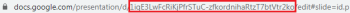

# [!DNL Google Slides] módulos

La variable [!DNL Adobe Workfront Fusion] [!DNL Google Slides] los módulos le permiten crear, actualizar, enumerar y/o eliminar presentaciones y cargar imágenes en las presentaciones de su [!DNL Google Slides] cuenta.

Para usar [!DNL Google Slides] con [!DNL Workfront Fusion], es necesario tener un [!DNL Google] cuenta. Si no tiene un [!DNL Google] todavía puede crear una en la [!DNL Google] Página de ayuda de la cuenta.

También necesita [!DNL Google Slides] en su [!DNL Google Drive].

## Requisitos de acceso

Debe tener el siguiente acceso para utilizar la funcionalidad de este artículo:

<table style="table-layout:auto"> 
 <col> 
 <col> 
 <tbody> 
  <tr> 
   <td role="rowheader">[!DNL Adobe Workfront] plan*</td>
  <td> 
[!UICONTROL Pro] o superior
 </td>
  </tr> 
  <tr data-mc-conditions=""> 
   <td role="rowheader">[!DNL Adobe Workfront] licencia*</td>
   <td> 
[!UICONTROL Plan], [!UICONTROL Work]
 </td> 
  </tr> 
  <tr> 
   <td role="rowheader">[!DNL Adobe Workfront Fusion] licencia**</td> 
   <td> 
[!UICONTROL [!DNL Workfront Fusion] para integración y automatización de trabajo] 
 </td> 
  </tr> 
  <tr> 
   <td role="rowheader">Product</td> 
   <td>Su organización debe comprar [!DNL Adobe Workfront Fusion] así como [!DNL Adobe Workfront] para utilizar las funciones descritas en este artículo.</td> 
  </tr> 
 </tbody> 
</table>

Para saber qué plan, tipo de licencia o acceso tiene, póngase en contacto con su [!DNL Workfront] administrador.

Para obtener información sobre [!DNL Adobe Workfront Fusion] licencias, consulte [[!DNL Adobe Workfront Fusion] licencias](../../workfront-fusion/get-started/license-automation-vs-integration.md).

## Requisitos previos

Para usar [!DNL Google Slides] módulos, debe tener un [!DNL Google] cuenta.

## [!DNL Google Slides] módulos y sus campos

Al configurar [!DNL Google Slides] Workfront Fusion muestra los campos que se enumeran a continuación. Además de estos, se incluyen [!DNL Google Slides] pueden mostrarse los campos, en función de factores como el nivel de acceso en la aplicación o el servicio. Un título en negrita en un módulo indica un campo obligatorio.

Si ve el botón de asignación encima de un campo o función, puede utilizarlo para establecer variables y funciones para ese campo. Para obtener más información, consulte [Asignar información de un módulo a otro en [!DNL Adobe Workfront Fusion]](../../workfront-fusion/mapping/map-information-between-modules.md).

* [Presentación](#presentation)
* [Otro](#other)

### Presentación

* [[!UICONTROL Ver Presentations]](#watch-presentations)
* [[!UICONTROL Lista Presentations]](#list-presentations)
* [[!UICONTROL Obtener una presentación]](#get-a-presentation)
* [[!UICONTROL Obtener una página/miniatura]](#get-a-pagethumbnail)
* [[!UICONTROL Crear una presentación a partir de una plantilla]](#create-a-presentation-from-a-template)
* [[!UICONTROL Cargar una imagen a una presentación]](#upload-an-image-to-a-presentation)
* [[!UICONTROL Actualizar un gráfico]](#refresh-a-chart)
* [[!UICONTROL Agregar o eliminar una diapositiva]](#adddelete-a-slide)

#### [!UICONTROL Ver Presentations]

Déclencheur cuando se crea o actualiza una nueva presentación.

<table style="table-layout:auto"> 
 <col> 
 <col> 
 <tbody> 
  <tr> 
   <td role="rowheader">[!UICONTROL Connection] </td> 
   <td> 
Para obtener instrucciones sobre cómo conectar su [!DNL Google Slides] cuenta para [!DNL Workfront Fusion], consulte <a href="../../workfront-fusion/connections/connect-to-fusion-general.md" class="MCXref xref" data-mc-variable-override="">Crear una conexión con [!DNL Adobe Workfront Fusion] - Instrucciones básicas</a>
 </td> 
  </tr> 
  <tr> 
   <td role="rowheader">[!UICONTROL Watch] </td> 
   <td> 
Seleccione la opción para ver las presentaciones:
 
    <ul> 
     <li> 
[!UICONTROL Fecha de creación]
 </li> 
     <li> 
[!UICONTROL Fecha de modificación]
 </li> 
    </ul> </td> 
  </tr> 
  <tr> 
   <td role="rowheader">[!UICONTROL Límite]</td> 
   <td> 
El número máximo de presentaciones que Workfront Fusion debe devolver durante un ciclo de ejecución de escenario.
 </td> 
  </tr> 
 </tbody> 
</table>

#### [!UICONTROL Lista Presentations]

Recupera una lista de todas las presentaciones.

<table style="table-layout:auto"> 
 <col> 
 <col> 
 <tbody> 
  <tr> 
   <td role="rowheader">[!UICONTROL Connection] </td> 
   <td> 
Para obtener instrucciones sobre cómo conectar su [!DNL Google Slides] cuenta para [!DNL Workfront Fusion], consulte <a href="../../workfront-fusion/connections/connect-to-fusion-general.md" class="MCXref xref" data-mc-variable-override="">Crear una conexión con [!DNL Adobe Workfront Fusion] - Instrucciones básicas</a>
 </td> 
  </tr> 
  <tr> 
   <td role="rowheader">[!UICONTROL Elija una ubicación de unidad]</td> 
   <td> 
Seleccione el [!DNL Google Drive] donde se encuentran las presentaciones que desea enumerar:
 
    <ul> 
     <li>[!UICONTROL Mi unidad]</li> 
     <li>[!UICONTROL Compartido Conmigo]</li> 
     <li>[!UICONTROL [!DNL Google] Unidad compartida]</li> 
    </ul> </td> 
  </tr> 
  <tr> 
   <td role="rowheader">[!UICONTROL Folder ID]</td> 
   <td> 
Elija la ubicación de la carpeta de las presentaciones que desea enumerar.
 </td> 
  </tr> 
  <tr> 
   <td role="rowheader">[!UICONTROL Límite]</td> 
   <td> 
El número máximo de presentaciones [!DNL Workfront Fusion] debe volver durante un ciclo de ejecución de escenario.
 </td> 
  </tr> 
 </tbody> 
</table>

#### [!UICONTROL Obtener una presentación]

Obtiene la versión más reciente de una presentación especificada.

<table style="table-layout:auto"> 
 <col> 
 <col> 
 <tbody> 
  <tr> 
   <td role="rowheader">[!UICONTROL Connection] </td> 
   <td> 
Para obtener instrucciones sobre cómo conectar su [!DNL Google Slides] cuenta para [!DNL Workfront Fusion], consulte <a href="../../workfront-fusion/connections/connect-to-fusion-general.md" class="MCXref xref" data-mc-variable-override="">Crear una conexión con [!DNL Adobe Workfront Fusion] - Instrucciones básicas</a>
 </td> 
  </tr> 
  <tr> 
   <td role="rowheader">[!UICONTROL Elegir una unidad]</td> 
   <td> 
Seleccione el [!DNL Google Drive] donde se encuentran las presentaciones que desea enumerar:
 
    <ul> 
     <li>[!UICONTROL Mi unidad]</li> 
     <li>[!UICONTROL Compartido Conmigo]</li> 
     <li>[!UICONTROL [!DNL Google] Unidad compartida]</li> 
    </ul> </td> 
  </tr> 
  <tr> 
   <td role="rowheader">[!UICONTROL ID de presentación]</td> 
   <td> 
 Seleccione la presentación que desee recuperar.
 </td> 
  </tr> 
 </tbody> 
</table>

#### [!UICONTROL Obtener una página/miniatura]

Obtiene la última versión de la página especificada o de la miniatura de una página de la presentación.

<table style="table-layout:auto"> 
 <col> 
 <col> 
 <tbody> 
  <tr> 
   <td role="rowheader">[!UICONTROL Connection] </td> 
   <td> 
Para obtener instrucciones sobre cómo conectar su [!DNL Google Slides] cuenta para [!DNL Workfront Fusion], consulte <a href="../../workfront-fusion/connections/connect-to-fusion-general.md" class="MCXref xref" data-mc-variable-override="">Crear una conexión con [!DNL Adobe Workfront Fusion] - Instrucciones básicas</a>
 </td> 
  </tr> 
  <tr> 
   <td role="rowheader">[!UICONTROL ID de presentación]</td> 
   <td> 
 Seleccione el ID de presentación que desee recuperar.
 </td> 
  </tr> 
  <tr> 
   <td role="rowheader">[!UICONTROL Page Object ID]</td> 
   <td> 
 Seleccione la diapositiva para la que desea ver los detalles del objeto de página.
 </td> 
  </tr> 
  <tr> 
   <td role="rowheader">[!UICONTROL Mostrar miniatura de página]</td> 
   <td> 
 Seleccione la casilla de verificación si desea ver la información de las miniaturas de página.
 </td> 
  </tr> 
 </tbody> 
</table>

#### [!UICONTROL Crear una presentación a partir de una plantilla]

Crea una nueva presentación reemplazando todas las etiquetas como `{{Name}}`, `{{Email}}` en una plantilla con los datos proporcionados.

<table style="table-layout:auto"> 
 <col> 
 <col> 
 <tbody> 
  <tr> 
   <td role="rowheader">[!UICONTROL Connection] </td> 
   <td> 
Para obtener instrucciones sobre cómo conectar su [!DNL Google Slides] cuenta para [!DNL Workfront Fusion], consulte <a href="../../workfront-fusion/connections/connect-to-fusion-general.md" class="MCXref xref" data-mc-variable-override="">Crear una conexión con [!DNL Adobe Workfront Fusion] - Instrucciones básicas</a>
 </td> 
  </tr> 
  <tr> 
   <td role="rowheader">[!UICONTROL Title] </td> 
   <td> 
Introduzca un nombre para la nueva presentación.
 </td> 
  </tr> 
  <tr> 
   <td role="rowheader">[!UICONTROL Copiar una presentación]</td> 
   <td> 
 Seleccione la opción si está copiando una presentación existente:
 
    <ul> 
     <li>[!UICONTROL Por Asignación]</li> 
     <li>[!UICONTROL By Dropdown]</li> 
    </ul> </td> 
  </tr> 
  <tr> 
   <td role="rowheader">[!UICONTROL Copia del ID de presentación existente]</td> 
   <td> 
 Introduzca la ruta o el ID de presentación de una presentación existente que desee copiar. Este campo aparece si está creando la presentación [!UICONTROL By Mapping].
 </td> 
  </tr> 
  <tr> 
   <td role="rowheader">[!UICONTROL Elegir una unidad]</td> 
   <td> 
Seleccione el [!DNL Google Drive] donde se encuentran las presentaciones que desea enumerar:
 
    <ul> 
     <li>[!UICONTROL Mi unidad]</li> 
     <li>[!UICONTROL Compartido Conmigo]</li> 
     <li>[!UICONTROL [!DNL Google] Unidad compartida]</li> 
    </ul> 
Este campo aparece si está creando la presentación [!UICONTROL By Dropdown].
 </td> 
  </tr> 
  <tr> 
   <td role="rowheader">[!UICONTROL ID de presentación]</td> 
   <td> 
 Seleccione el ID de presentación de la presentación que desee utilizar como plantilla.
 </td> 
  </tr> 
  <tr> 
   <td role="rowheader">[!UICONTROL Values] </td> 
   <td> 
Añada los valores:
 
    <ul> 
     <li><strong>[!UICONTROL Etiqueta]</strong>: Introduzca la etiqueta que desea reemplazar en la presentación. Por ejemplo, <code>&#123;&#123;Name&#125;&#125;</code></li> 
     <li><strong>[!UICONTROL Valor reemplazado]</strong>: Introduzca el valor con el que se va a reemplazar la etiqueta existente. Por ejemplo, si una cadena <code>&#123;&#123;Name}}</code><code>Sample</code></li></ul></td></tr><tr><td role="rowheader"></td><td>

<ul><li></li><li></li><li></li></ul></td></tr><tr><td role="rowheader">

</td><td>

</td></tr><tr><td role="rowheader"></td><td>

</td></tr><tr><td role="rowheader"></td><td>

</td></tr></tbody></table>

#### [!UICONTROL Cargar una imagen a una presentación]

Carga una imagen con los datos proporcionados.

<table style="table-layout:auto"> 
 <col> 
 <col> 
 <tbody> 
  <tr> 
   <td role="rowheader">[!UICONTROL Connection] </td> 
   <td> 
Para obtener instrucciones sobre cómo conectar su [!DNL Google Slides] cuenta para [!DNL Workfront Fusion], consulte <a href="../../workfront-fusion/connections/connect-to-fusion-general.md" class="MCXref xref" data-mc-variable-override="">Crear una conexión con [!DNL Adobe Workfront Fusion] - Instrucciones básicas</a>
 </td> 
  </tr> 
  <tr> 
   <td role="rowheader">[!UICONTROL Elegir una presentación]</td> 
   <td> 
Elija cómo desea seleccionar la presentación a la que está cargando una imagen.
 
    <ul> 
     <li>[!UICONTROL Por Asignación]</li> 
     <li>[!DNL By Dropdown]</li> 
    </ul> </td> 
  </tr> 
  <tr> 
   <td role="rowheader">[!UICONTROL Elegir una unidad]</td> 
   <td> 
Seleccione el [!DNL Google Drive] donde se encuentran las presentaciones que desea enumerar:
 
    <ul> 
     <li>[!UICONTROL Mi unidad]</li> 
     <li>[!UICONTROL Compartido Conmigo]</li> 
     <li>[!UICONTROL [!DNL Google] Unidad compartida]</li> 
    </ul> 
Este campo aparece si está creando la presentación [!UICONTROL By Dropdown].
 </td> 
  </tr> 
  <tr> 
   <td role="rowheader">[!UICONTROL ID de presentación]</td> 
   <td> 
 Seleccione el ID de presentación de la presentación a la que está cargando una imagen.
 </td> 
  </tr> 
  <tr> 
   <td role="rowheader">[!UICONTROL Values]</td> 
   <td> 
Valores Añada los valores:
 
    <ul> 
     <li><strong>[!UICONTROL Etiqueta]</strong>: Introduzca la etiqueta a la que desea añadir la URL.</li> 
     <li><strong>[!UICONTROL Image URL]</strong>: Introduzca la ruta o la dirección URL de la imagen que desea cargar.</li> 
    </ul> 
Nota: Las imágenes deben tener un tamaño inferior a 50 MB, no pueden superar los 25 megapíxeles y deben tener formato PNG, JPEG o GIF.
 </td> 
  </tr> 
 </tbody> 
</table>

#### [!UICONTROL Actualizar un gráfico]

Actualiza los datos del gráfico almacenados en una presentación especificada por ID.

<table style="table-layout:auto"> 
 <col> 
 <col> 
 <tbody> 
  <tr> 
   <td role="rowheader">[!UICONTROL Connection] </td> 
   <td> 
Para obtener instrucciones sobre cómo conectar su [!DNL Google Slides] cuenta para [!DNL Workfront Fusion], consulte <a href="../../workfront-fusion/connections/connect-to-fusion-general.md" class="MCXref xref" data-mc-variable-override="">Crear una conexión con [!DNL Adobe Workfront Fusion] - Instrucciones básicas</a>
 </td> 
  </tr> 
  <tr> 
   <td role="rowheader">[!UICONTROL Elegir una unidad]</td> 
   <td> 
Seleccione el [!DNL Google Drive] donde se encuentran las presentaciones que desea enumerar:
 
    <ul> 
     <li>[!UICONTROL Mi unidad]</li> 
     <li>[!UICONTROL Compartido Conmigo]</li> 
     <li>[!UICONTROL [!DNL Google] Unidad compartida]</li> 
    </ul> </td> 
  </tr> 
  <tr> 
   <td role="rowheader">[!UICONTROL ID de presentación]</td> 
   <td> 
Seleccione el ID de presentación de la presentación que incluye el gráfico que desea actualizar.
 </td> 
  </tr> 
  <tr> 
   <td role="rowheader">[!UICONTROL Chart Object ID]</td> 
   <td> 
 Seleccione el gráfico que desea actualizar.
 </td> 
  </tr> 
 </tbody> 
</table>

#### [!UICONTROL Agregar o eliminar una diapositiva]

Crea una diapositiva vacía o elimina una diapositiva existente en la presentación especificada.

<table style="table-layout:auto"> 
 <col> 
 <col> 
 <tbody> 
  <tr> 
   <td role="rowheader">[!UICONTROL Connection] </td> 
   <td> 
Para obtener instrucciones sobre cómo conectar su [!DNL Google Slides] cuenta para [!DNL Workfront Fusion], consulte <a href="../../workfront-fusion/connections/connect-to-fusion-general.md" class="MCXref xref" data-mc-variable-override="">Crear una conexión con [!DNL Adobe Workfront Fusion] - Instrucciones básicas</a>
 </td> 
  </tr> 
  <tr> 
   <td role="rowheader">[!UICONTROL Seleccione el método]</td> 
   <td> 
Elija si desea agregar una diapositiva nueva o eliminarla.
 </td> 
  </tr> 
  <tr> 
   <td role="rowheader">[!DNL Presentation ID]</td> 
   <td> 
Seleccione el ID de presentación de la presentación para la que desee añadir o eliminar una diapositiva.
 </td> 
  </tr> 
  <tr> 
   <td role="rowheader">[!UICONTROL Tipo de diseño predefinido]</td> 
   <td> 
 Seleccione el diseño de diapositiva predefinido que desea que utilice la diapositiva añadida. Especifique valores para cualquier campo adicional (como [!UICONTROL Title]).
 
    <ul> 
     <li>[!UICONTROL Diseño en blanco, sin marcadores de posición]</li> 
     <li>[!UICONTROL Diseño con un rótulo en la parte inferior]</li> 
     <li>[!UICONTROL Diseño con título y subtítulo]</li> 
     <li>[!UICONTROL Diseño con título y cuerpo]</li> 
     <li>[!UICONTROL Diseño con título y dos columnas]</li> 
     <li>[!UICONTROL Diseño con solo un título]</li> 
     <li>[!UICONTROL Diseño con título de sección]</li> 
     <li>[!UICONTROL Diseño con título y subtítulo por un lado y descripción por el otro]</li> 
     <li>[!UICONTROL Diseño con un título y un cuerpo, organizados en una sola columna]</li> 
     <li>[!UICONTROL Diseño con un punto principal]</li> 
     <li>[!DNL Layout with a big number heading]</li> 
    </ul> 
Este campo está disponible si ha seleccionado agregar una diapositiva.
 </td> 
  </tr> 
 </tbody> 
</table>

### Otro

* [[!UICONTROL Realizar una llamada de API]](#make-an-api-call)
* [[!UICONTROL Insertar vínculos en una presentación]](#insert-links-in-a-presentation)

#### [!UICONTROL Realizar una llamada de API]

Realiza una llamada API autorizada arbitraria.

<table style="table-layout:auto"> 
 <col> 
 <col> 
 <tbody> 
  <tr> 
   <td role="rowheader">[!UICONTROL Connection] </td> 
   <td> 
Para obtener instrucciones sobre cómo conectar su [!DNL Google Slides] cuenta para [!DNL Workfront Fusion], consulte <a href="../../workfront-fusion/connections/connect-to-fusion-general.md" class="MCXref xref" data-mc-variable-override="">Crear una conexión con [!DNL Adobe Workfront Fusion] - Instrucciones básicas</a>
 </td> 
  </tr> 
  <tr> 
   <td role="rowheader">[!UICONTROL URL]</td> 
   <td> 
Introduzca una ruta relativa a https://developers.google.com/slides/. Por ejemplo, Presentación.
 
Para obtener la lista de extremos disponibles, consulte la <a href="https://developers.google.com/slides/reference/rest">[!DNL Google Slides] Documentación de API</a>.
 </td> 
  </tr> 
  <tr> 
   <td role="rowheader">[!UICONTROL Método]</td> 
   <td> 
Seleccione el método de solicitud HTTP que necesita para configurar la llamada a la API. Para obtener más información, consulte <a href="../../workfront-fusion/modules/http-request-methods.md" class="MCXref xref">Métodos de solicitud HTTP en [!DNL Adobe Workfront Fusion]</a>.
 </td> 
  </tr> 
  <tr> 
   <td role="rowheader">[!UICONTROL Encabezados]</td> 
   <td> 
Introduzca los encabezados de solicitud deseados. No es necesario agregar encabezados de autorización.
 </td> 
  </tr> 
  <tr> 
   <td role="rowheader">[!UICONTROL Cadena de consulta]</td> 
   <td> 
 Introduzca la cadena de consulta de solicitud.
 </td> 
  </tr> 
  <tr> 
   <td role="rowheader">[!UICONTROL Body]</td> 
   <td> 
Añada el contenido del cuerpo para la llamada de API en forma de objeto JSON estándar.
 
Nota:  
Al utilizar afirmaciones condicionales como <code>if</code> en su JSON, ponga las comillas fuera de la afirmación condicional.
 
     
Example: </b>"> 
      
  
 
     
 
 </td> 
  </tr> 
 </tbody> 
</table>

>[!INFO]
>
>**Ejemplo:** Mediante una llamada API puede obtener los detalles de presentación del ID de presentación que ha introducido. Puede encontrar el ID de presentación en la URL cuando abre la presentación en [!DNL Google Slides].
>
>
>
>La siguiente llamada de API devuelve los detalles de la presentación:
>
>
>
>Las coincidencias de la búsqueda se pueden encontrar en la salida del módulo en [!UICONTROL Paquete] > [!UICONTROL Cuerpo] > [!UICONTROL presentationId].
>
>En nuestro ejemplo, se devolvieron los detalles de presentación solicitados:
>
>

#### [!UICONTROL Insertar vínculos en una presentación]

Este módulo permite hacer clic en todos los vínculos de una presentación o inserta un vínculo en todos los textos de entrada coincidentes.

<table style="table-layout:auto"> 
 <col> 
 <col> 
 <tbody> 
  <tr> 
   <td role="rowheader">[!UICONTROL Connection] </td> 
   <td> 
Para obtener instrucciones sobre cómo conectar su [!DNL Google Slides] cuenta para [!DNL Workfront Fusion], consulte <a href="../../workfront-fusion/connections/connect-to-fusion-general.md" class="MCXref xref" data-mc-variable-override="">Crear una conexión con [!DNL Adobe Workfront Fusion] - Instrucciones básicas</a>
 </td> 
  </tr> 
  <tr> 
   <td role="rowheader">[!UICONTROL Elegir una presentación]</td> 
   <td> 
Elija cómo desea seleccionar la presentación a la que está cargando una imagen.
 
    <ul> 
     <li>[!UICONTROL Por Asignación]</li> 
     <li>[!UICONTROL By Dropdown]</li> 
    </ul> </td> 
  </tr> 
  <tr> 
   <td role="rowheader">[!UICONTROL Elegir una unidad]</td> 
   <td> 
Seleccione el [!DNL Google Drive] donde se encuentran las presentaciones que desea enumerar:
 
    <ul> 
     <li>[!UICONTROL Mi unidad]</li> 
     <li>[!UICONTROL Compartido Conmigo]</li> 
     <li>[!UICONTROL [!DNL Google] Unidad compartida]</li> 
    </ul> 
Este campo aparece si está creando la presentación [!UICONTROL By Dropdown].
 </td> 
  </tr> 
  <tr> 
   <td role="rowheader">[!UICONTROL ID de presentación]</td> 
   <td> 
Elija la ubicación de la carpeta de las presentaciones que desea enumerar.
 </td> 
  </tr> 
  <tr> 
   <td role="rowheader">[!UICONTROL Seleccionar]</td> 
   <td> 
Seleccione si desea que todos los vínculos de una presentación puedan hacer clic en el botón o si desea insertar un vínculo en todos los textos de entrada coincidentes.
 </td> 
  </tr> 
  <tr> 
   <td role="rowheader">[!UICONTROL Entradas de texto]</td> 
   <td>Para cada elemento de texto para el que desee agregar un vínculo, agregue el elemento y su vínculo asociado a la lista. Cada vez que el elemento aparece en la presentación, se vincula automáticamente al sitio especificado.</td> 
  </tr> 
 </tbody> 
</table>
