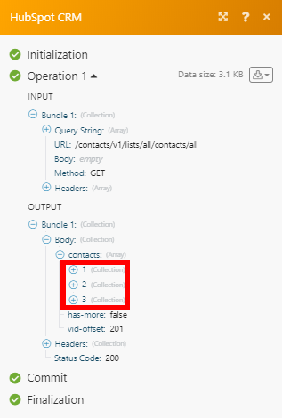

# [!DNL HubSpot CRM] módulos

Los módulos [!DNL Adobe Workfront Fusion] [!DNL HubSpot CRM] le permiten supervisar eventos, registros, contactos, participaciones, envíos de archivos y formularios, o crear, recuperar, actualizar y eliminar registros, contactos, participaciones, eventos o archivos en su cuenta de [!DNL HubSpot CRM].

## Requisitos de acceso

Debe tener el siguiente acceso para utilizar la funcionalidad de este artículo:

<table style="table-layout:auto"> 
 <col> 
 <col> 
 <tbody> 
  <tr> 
   <td role="rowheader">[!DNL Adobe Workfront] plan*</td>
  <td> 
[!UICONTROL Pro] o superior
 </td>
  </tr> 
  <tr data-mc-conditions=""> 
   <td role="rowheader">[!DNL Adobe Workfront] licencia*</td>
   <td> 
[!UICONTROL Plan], [!UICONTROL Trabajo]
 </td> 
  </tr> 
  <tr> 
   <td role="rowheader">[!DNL Adobe Workfront Fusion] licencia**</td> 
   <td>
   
Requisito de licencia actual: no se requiere licencia de [!DNL Workfront Fusion].

   
O

   
Requisito de licencia heredado: [!UICONTROL [!DNL Workfront Fusion] para automatización e integración de trabajo] 

   </td> 
  </tr> 
  <tr> 
   <td role="rowheader">Product</td> 
   <td>
   
Requisito de producto actual: si tiene el plan [!UICONTROL Select] o [!UICONTROL Prime] [!DNL Adobe Workfront], su organización debe adquirir [!DNL Adobe Workfront Fusion] así como [!DNL Adobe Workfront] para utilizar la funcionalidad descrita en este artículo. [!DNL Workfront Fusion] está incluido en el plan [!DNL Workfront] de [!UICONTROL Ultimate].

   
O

   
Requisito de productos heredados: su organización debe comprar [!DNL Adobe Workfront Fusion] y [!DNL Adobe Workfront] para utilizar la funcionalidad descrita en este artículo.

   </td> 
  </tr> 
 </tbody> 
</table>

Para saber qué plan, tipo de licencia o acceso tiene, póngase en contacto con el administrador de [!DNL Workfront].

Para obtener información sobre [!DNL Adobe Workfront Fusion] licencias, consulte [[!DNL Adobe Workfront Fusion] licencias](../../workfront-fusion/get-started/license-automation-vs-integration.md).

## Requisitos previos

Para usar módulos de [!DNL HubSpot CRM], debe tener una cuenta de [!DNL HubSpot CRM].

## Conectar [!DNL Adobe Workfront Fusion] a [!DNL HubSpot CRM]

Para obtener instrucciones acerca de cómo conectar su cuenta de [!DNL HubSpot CRM] a [!DNL Workfront Fusion], vea [Crear una conexión a [!DNL Adobe Workfront Fusion] - Instrucciones básicas](../../workfront-fusion/connections/connect-to-fusion-general.md)

>[!NOTE]
>
>Al configurar una conexión, seleccione el tipo de conexión **HubSpot CRM**. El tipo HubSpot CRM (obsoleto) admite conexiones existentes, pero no se recomienda utilizarlo para crear nuevas conexiones.

## [!DNL HubSpot CRM] módulos y sus campos

Al configurar [!DNL Hubspot CRM] módulos, [!DNL Workfront Fusion] muestra los campos que se indican a continuación. Junto con estos, podrían mostrarse [!DNL Hubspot CRM] campos adicionales, según factores como el nivel de acceso en la aplicación o el servicio. Un título en negrita en un módulo indica un campo obligatorio.

Si ve el botón Asignar encima de un campo o función, puede utilizarlo para establecer variables y funciones para ese campo. Para obtener más información, vea [Asignar información de un módulo a otro en [!DNL Adobe Workfront Fusion]](../../workfront-fusion/mapping/map-information-between-modules.md).

* [Objetos CRM](#crm-objects)
* [Registros (ofertas, contactos y compañías)](#records-deals-contacts-and-companies)
* [Contactos](#contacts)
* [Acuerdos](#deals)
* [Compañías](#companies)
* [Archivos](#files)
* [Entradas](#tickets)
* [Realizar una llamada de API](#make-an-api-call)

### Objetos CRM

#### [!UICONTROL Buscar objetos CRM]

Este módulo de búsqueda busca objetos CRM por propiedades personalizadas o por consulta. Para buscar productos o elementos de línea, utilice una conexión especial con un ámbito personalizado requerido.

<table style="table-layout:auto"> 
 <col> 
 <col> 
 <tbody> 
  <tr> 
   <td role="rowheader"> 
[!UICONTROL Conexión]
 </td> 
   <td> 
Para obtener instrucciones acerca de cómo conectar su cuenta de [!DNL HubSpot CRM] a [!DNL Workfront Fusion], vea <a href="../../workfront-fusion/connections/connect-to-fusion-general.md" class="MCXref xref" data-mc-variable-override="">Crear una conexión con [!DNL Adobe Workfront Fusion]: instrucciones básicas</a>
 </td> 
  </tr> 
  <tr> 
   <td role="rowheader">[!UICONTROL Límite]</td> 
   <td>Introduzca o asigne el número máximo de elementos que devolverá el módulo en un ciclo de ejecución.</td> 
  </tr> 
  <tr> 
   <td role="rowheader">[!UICONTROL Tipo de objeto de búsqueda]</td> 
   <td>Seleccione el tipo de objeto de Hubspot CRM que desea buscar.</td> 
  </tr> 
  <tr> 
   <td role="rowheader">[!UICONTROL Propiedades de salida]</td> 
   <td>Seleccione las propiedades que desea que aparezcan en la salida del módulo. Los campos disponibles dependen del objeto seleccionado.</td> 
  </tr> 
  <tr> 
   <td role="rowheader">[!UICONTROL Filtrar por] </td> 
   <td> 
Seleccione cómo desea filtrar la búsqueda
 
    <ul> 
     <li> 
<strong>[!UICONTROL Consulta]</strong> 
 
Introduzca o asigne la consulta
 </li> 
     <li> 
<strong>[!UICONTROL Propiedades]</strong> 
 
Introduzca los grupos o filtros para la búsqueda.
 </li> 
    </ul> </td> 
  </tr> 
  <tr> 
   <td role="rowheader">[!UICONTROL Ordenar por]</td> 
   <td> 
Haga clic en si desea ordenar los resultados. Si decide ordenar los resultados, aparecen los siguientes campos. 
 
    <ul> 
     <li> 
<strong>[!UICONTROL Nombre de propiedad]</strong> 
 
Seleccione la propiedad según la cual desea ordenar los resultados
 </li> 
     <li> 
<strong>[!UICONTROL Dirección]</strong> 
 
Elija si desea ordenar los resultados en dirección ascendente o descendente.
 </li> 
    </ul> </td> 
  </tr> <!--
   <tr data-mc-conditions="QuicksilverOrClassic.Draft mode"> 
    <td role="rowheader">Start Offset</td> 
    <td>Enter or map the ID of the first item you want to retrieve details for. This module only returns up to 5000 results at a time. Setting a start offset allows you to retrieve items other than the first 5000. If the start offset is 5000, the module would return items 5000-9999.</td> 
   </tr>
  --> 
 </tbody> 
</table>

### Registros (ofertas, contactos y compañías)

* [[!UICONTROL Crear un registro (heredado)]](#create-a-record-legacy)
* [[!UICONTROL Obtener un registro]](#get-a-record)
* [[!UICONTROL Actualizar un registro]](#update-a-record)
* [[!UICONTROL Eliminar un registro]](#delete-a-record)
* [[!UICONTROL Obtener una propiedad de registro]](#get-a-record-property)
* [[!UICONTROL Registros de observación]](#watch-records)

#### [!UICONTROL Crear un registro (heredado)]

Este módulo de acción crea un contacto, una compañía o una oferta.

<table style="table-layout:auto"> 
 <col> 
 <col> 
 <tbody> 
  <tr> 
   <td role="rowheader"> 
[!UICONTROL Conexión]
 </td> 
   <td> 
Para obtener instrucciones acerca de cómo conectar su cuenta de [!DNL HubSpot CRM] a [!DNL Workfront Fusion], vea <a href="../../workfront-fusion/connections/connect-to-fusion-general.md" class="MCXref xref" data-mc-variable-override="">Crear una conexión con [!DNL Adobe Workfront Fusion]: instrucciones básicas</a>
 </td> 
  </tr> 
  <tr> 
   <td role="rowheader">[!UICONTROL Tipo de registro]</td> 
   <td> 
Seleccione el tipo de registro que desea crear
 </td> 
  </tr> 
  <tr> 
   <td role="rowheader">[!UICONTROL Propiedades]</td> 
   <td>Rellene las propiedades que desee establecer para el registro. Los campos disponibles dependen del tipo de registro que desee crear.</td> 
  </tr> 
 </tbody> 
</table>

#### [!UICONTROL Obtener un registro]

Este módulo de acción obtiene detalles de un contacto, una compañía o una oferta.

<table style="table-layout:auto"> 
 <col> 
 <col> 
 <tbody> 
  <tr> 
   <td role="rowheader"> 
[!UICONTROL Conexión]
 </td> 
   <td> 
Para obtener instrucciones acerca de cómo conectar su cuenta de [!DNL HubSpot CRM] a [!DNL Workfront Fusion], vea <a href="../../workfront-fusion/connections/connect-to-fusion-general.md" class="MCXref xref" data-mc-variable-override="">Crear una conexión con [!DNL Adobe Workfront Fusion]: instrucciones básicas</a>
 </td> 
  </tr> 
  <tr> 
   <td role="rowheader">[!UICONTROL Tipo de registro]</td> 
   <td> 
Seleccione el tipo de registro.
 
    <ul> 
     <li>[!UICONTROL Contacto]</li> 
     <li>[!UICONTROL Company] </li> 
     <li>[!UICONTROL Deal]</li> 
    </ul> </td> 
  </tr> 
  <tr> 
   <td role="rowheader">[!UICONTROL Tipo de búsqueda]</td> 
   <td>Si va a recibir un contacto, seleccione si desea identificarlo por ID o por dirección de correo electrónico.</td> 
  </tr> 
  <tr> 
   <td role="rowheader">[!UICONTROL ID]</td> 
   <td>Introduzca el ID del contacto, empresa o acuerdo que desea recuperar. </td> 
  </tr> 
  <tr> 
   <td role="rowheader">[!UICONTROL Correo electrónico]</td> 
   <td>Introduzca la dirección de correo electrónico del contacto cuyos detalles desea recuperar. </td> 
  </tr> 
 </tbody> 
</table>

#### [!UICONTROL Actualizar un registro]

Este módulo de acción actualiza un contacto, una compañía o una oferta.

<table style="table-layout:auto"> 
 <col> 
 <col> 
 <tbody> 
  <tr> 
   <td role="rowheader"> 
[!UICONTROL Conexión]
 </td> 
   <td> 
Para obtener instrucciones acerca de cómo conectar su cuenta de [!DNL HubSpot CRM] a [!DNL Workfront Fusion], vea <a href="../../workfront-fusion/connections/connect-to-fusion-general.md" class="MCXref xref" data-mc-variable-override="">Crear una conexión con [!DNL Adobe Workfront Fusion]: instrucciones básicas</a>
 </td> 
  </tr> 
  <tr> 
   <td role="rowheader">[!UICONTROL Tipo de registro]</td> 
   <td>Seleccione el tipo de registro que desea actualizar.</td> 
  </tr> 
  <tr> 
   <td role="rowheader">[!UICONTROL Tipo de búsqueda]</td> 
   <td> 
Si va a obtener un contacto, seleccione cómo desea identificar el registro:
 
    <ul> 
     <li> 
[!UICONTROL ID]
 </li> 
     <li> 
[!UICONTROL Correo electrónico]
 </li> 
    </ul> </td> 
  </tr> 
  <tr> 
   <td role="rowheader">[!UICONTROL ID]</td> 
   <td>Introduzca el ID del contacto, empresa o acuerdo que desea actualizar. </td> 
  </tr> 
  <tr> 
   <td role="rowheader">[!UICONTROL Correo electrónico]</td> 
   <td>Introduzca la dirección de correo electrónico del contacto cuyos detalles desea actualizar. </td> 
  </tr> 
  <tr> 
   <td role="rowheader">[!UICONTROL Propiedades]</td> 
   <td>Rellene las propiedades que desee establecer para el registro. Los campos disponibles dependen del tipo de registro que desee crear.</td> 
  </tr> 
 </tbody> 
</table>

#### [!UICONTROL Eliminar un registro]

Este módulo de acción elimina un contacto, una compañía o una oferta.

<table style="table-layout:auto"> 
 <col> 
 <col> 
 <tbody> 
  <tr> 
   <td role="rowheader"> 
[!UICONTROL Conexión]
 </td> 
   <td> 
Para obtener instrucciones acerca de cómo conectar su cuenta de [!DNL HubSpot CRM] a [!DNL Workfront Fusion], vea <a href="../../workfront-fusion/connections/connect-to-fusion-general.md" class="MCXref xref" data-mc-variable-override="">Crear una conexión con [!DNL Adobe Workfront Fusion]: instrucciones básicas</a>
 </td> 
  </tr> 
  <tr> 
   <td role="rowheader">[!UICONTROL Tipo de registro]</td> 
   <td>Seleccione el tipo de registro que desea eliminar.</td> 
  </tr> 
  <tr> 
   <td role="rowheader">[!UICONTROL ID]</td> 
   <td>Introduzca el ID del contacto, empresa o acuerdo que desea eliminar. </td> 
  </tr> 
 </tbody> 
</table>

#### [!UICONTROL Obtener una propiedad de registro]

Este módulo de acción obtiene metadatos para una propiedad de registro específica por su nombre (interno).

<table style="table-layout:auto"> 
 <col> 
 <col> 
 <tbody> 
  <tr> 
   <td role="rowheader"> 
[!UICONTROL Conexión]
 </td> 
   <td> 
Para obtener instrucciones acerca de cómo conectar su cuenta de [!DNL HubSpot CRM] a [!DNL Workfront Fusion], vea <a href="../../workfront-fusion/connections/connect-to-fusion-general.md" class="MCXref xref" data-mc-variable-override="">Crear una conexión con [!DNL Adobe Workfront Fusion]: instrucciones básicas</a>
 </td> 
  </tr> 
  <tr> 
   <td role="rowheader">[!UICONTROL Tipo de registro]</td> 
   <td>Seleccione el tipo de registro que tiene la propiedad cuyos metadatos desea recuperar.</td> 
  </tr> 
  <tr> 
   <td role="rowheader">[!UICONTROL Nombre de propiedad]</td> 
   <td>Seleccione la propiedad para la que desee recuperar los metadatos.</td> 
  </tr> 
  <tr> 
   <td role="rowheader">[!UICONTROL Id. de opción]</td> 
   <td> 
 Algunas propiedades tienen un conjunto de opciones disponibles que un usuario puede seleccionar como valor de propiedad. Introduzca el ID de la opción que representa el valor de propiedad que desea recuperar.
 </td> 
  </tr> 
 </tbody> 
</table>

#### [!UICONTROL Registros de observación]

Este módulo de déclencheur inicia un escenario en el que se ha modificado o creado un contacto, una empresa o un acuerdo en los últimos 30 días. La salida está limitada a 10 000 registros.

<table style="table-layout:auto"> 
 <col> 
 <col> 
 <tbody> 
  <tr> 
   <td role="rowheader"> 
[!UICONTROL Conexión]
 </td> 
   <td> 
Para obtener instrucciones acerca de cómo conectar su cuenta de [!DNL HubSpot CRM] a [!DNL Workfront Fusion], vea <a href="../../workfront-fusion/connections/connect-to-fusion-general.md" class="MCXref xref" data-mc-variable-override="">Crear una conexión con [!DNL Adobe Workfront Fusion]: instrucciones básicas</a>
 </td> 
  </tr> 
  <tr> 
   <td role="rowheader">[!UICONTROL Tipo de registro]</td> 
   <td>Seleccione el tipo de registro que tiene la propiedad que desea ver.</td> 
  </tr> 
  <tr> 
   <td role="rowheader">[!UICONTROL Buscar]</td> 
   <td>Seleccione si desea ver los registros modificados recientemente o creados recientemente.</td> 
  </tr> 
  <tr> 
   <td role="rowheader">[!UICONTROL Propiedades de salida]</td> 
   <td>Seleccione las propiedades que desee incluir en la salida del módulo.</td> 
  </tr> 
  <tr> 
   <td role="rowheader">[!UICONTROL Límite]</td> 
   <td> 
Introduzca o asigne el número máximo de registros que desea que devuelva el módulo durante cada ciclo de ejecución de escenario.
 </td> 
  </tr> 
 </tbody> 
</table>

### Contactos

* [[!UICONTROL Crear/actualizar un contacto (heredado)]](#createupdate-a-contact-legacy)
* [[!UICONTROL Crear/actualizar un grupo de contactos]](#createupdate-a-group-of-contacts)
* [[!UICONTROL Agregar contactos a una lista]](#add-contacts-to-a-list)
* [[!UICONTROL Quitar un contacto de una lista]](#remove-a-contact-from-a-list)
* [[!UICONTROL Combinar contactos]](#merge-contacts)
* [[!UICONTROL Buscar contactos]](#search-for-contacts)
* [[!UICONTROL Lista de contactos]](#list-contacts)
* [[!UICONTROL Enumerar contactos de una compañía]](#list-contacts-of-a-company)

#### [!UICONTROL Crear/actualizar un contacto (heredado)]

Crea un contacto si aún no existe en un portal o lo actualiza con los valores de propiedad más recientes si existe en un portal.

<table style="table-layout:auto"> 
 <col> 
 <col> 
 <tbody> 
  <tr> 
   <td role="rowheader"> 
[!UICONTROL Conexión]
 </td> 
   <td> 
Para obtener instrucciones acerca de cómo conectar su cuenta de [!DNL HubSpot CRM] a [!DNL Workfront Fusion], vea <a href="../../workfront-fusion/connections/connect-to-fusion-general.md" class="MCXref xref" data-mc-variable-override="">Crear una conexión con [!DNL Adobe Workfront Fusion]: instrucciones básicas</a>
 </td> 
  </tr> 
  <tr> 
   <td role="rowheader">[!UICONTROL Propiedades]</td> 
   <td>Rellene las propiedades que desee establecer o actualizar para el contacto. </td> 
  </tr> 
 </tbody> 
</table>

#### [!UICONTROL Crear/actualizar un grupo de contactos]

Crea un grupo de contactos o los actualiza si ya existen. El rendimiento es mejor cuando el tamaño del lote está limitado a 100 contactos o menos. Los cambios realizados a través de este extremo se procesan asincrónicamente, por lo que los cambios pueden tardar varios minutos en aplicarse a los registros de contacto.

<table style="table-layout:auto"> 
 <col> 
 <col> 
 <tbody> 
  <tr> 
   <td role="rowheader"> 
[!UICONTROL Conexión]
 </td> 
   <td> 
Para obtener instrucciones acerca de cómo conectar su cuenta de [!DNL HubSpot CRM] a [!DNL Workfront Fusion], vea <a href="../../workfront-fusion/connections/connect-to-fusion-general.md" class="MCXref xref" data-mc-variable-override="">Crear una conexión con [!DNL Adobe Workfront Fusion]: instrucciones básicas</a>
 </td> 
  </tr> 
  <tr> 
   <td role="rowheader">[!UICONTROL Lote de contactos para crear/actualizar] </td> 
   <td> 
Añada el lote de contactos.
 
Haga clic en <strong>[!UICONTROL Agregar elemento]</strong> para agregar un nuevo contacto. En la ventana que aparece, introduzca o asigne la siguiente información:
 
    <ul> 
     <li> 
<strong>[!UICONTROL Tipo de búsqueda]</strong> 
 
Seleccione cómo desea identificar al contacto:
 
      <ul> 
       <li> 
[!UICONTROL ID]
 
Introduzca el ID del contacto que desea crear o actualizar. 
 </li> 
       <li> 
[!UICONTROL Correo electrónico]
 
Escriba la dirección de correo electrónico del contacto que desea crear o actualizar. 
 </li> 
      </ul> </li> 
     <li> 
<strong>[!UICONTROL Propiedades]</strong> 
 
Rellene las propiedades que desee establecer o actualizar para el contacto.
 </li> 
    </ul> </td> 
  </tr> 
 </tbody> 
</table>

#### [!UICONTROL Agregar contactos a una lista]

Este módulo agrega los registros de contacto que ya se han creado en el sistema a una lista de contactos.

<table style="table-layout:auto"> 
 <col> 
 <col> 
 <tbody> 
  <tr> 
   <td role="rowheader"> 
[!UICONTROL Conexión]
 </td> 
   <td> 
Para obtener instrucciones acerca de cómo conectar su cuenta de [!DNL HubSpot CRM] a [!DNL Workfront Fusion], vea <a href="../../workfront-fusion/connections/connect-to-fusion-general.md" class="MCXref xref" data-mc-variable-override="">Crear una conexión con [!DNL Adobe Workfront Fusion]: instrucciones básicas</a>
 </td> 
  </tr> 
  <tr> 
   <td role="rowheader">[!UICONTROL List ID] </td> 
   <td>Seleccione el ID de la lista a la que desea agregar el contacto. </td> 
  </tr> 
  <tr> 
   <td role="rowheader">[!UICONTROL IDs/Emails] </td> 
   <td> 
Seleccione cómo desea identificar los contactos que desea agregar a la lista:
 
    <ul> 
     <li> 
[!UICONTROL ID]
 
Agregue los identificadores de los contactos que desee agregar a la lista.
 </li> 
     <li> 
[!UICONTROL Correos electrónicos]
 
Agregue las direcciones de correo electrónico de los contactos que desee agregar a la lista.
 </li> 
    </ul> </td> 
  </tr> 
 </tbody> 
</table>

#### [!UICONTROL Quitar un contacto de una lista]

Quita un contacto de una lista de contactos.

>[!NOTE]
>
>No se pueden quitar contactos manualmente de una lista dinámica.

<table style="table-layout:auto"> 
 <col> 
 <col> 
 <tbody> 
  <tr> 
   <td role="rowheader"> 
[!UICONTROL Conexión]
 </td> 
   <td> 
Para obtener instrucciones acerca de cómo conectar su cuenta de [!DNL HubSpot CRM] a [!DNL Workfront Fusion], vea <a href="../../workfront-fusion/connections/connect-to-fusion-general.md" class="MCXref xref" data-mc-variable-override="">Crear una conexión con [!DNL Adobe Workfront Fusion]: instrucciones básicas</a>
 </td> 
  </tr> 
  <tr> 
   <td role="rowheader">[!UICONTROL List ID] </td> 
   <td>Seleccione el ID de la lista de la que desea quitar el contacto. </td> 
  </tr> 
  <tr> 
   <td role="rowheader">[!UICONTROL ID de contacto] </td> 
   <td>Introduzca el ID del contacto que desea eliminar de la lista. </td> 
  </tr> 
 </tbody> 
</table>

#### [!UICONTROL Combinar contactos]

<table style="table-layout:auto"> 
 <col> 
 <col> 
 <tbody> 
  <tr> 
   <td role="rowheader"> 
[!UICONTROL Conexión]
 </td> 
   <td> 
Para obtener instrucciones acerca de cómo conectar su cuenta de [!DNL HubSpot CRM] a [!DNL Workfront Fusion], vea <a href="../../workfront-fusion/connections/connect-to-fusion-general.md" class="MCXref xref" data-mc-variable-override="">Crear una conexión con [!DNL Adobe Workfront Fusion]: instrucciones básicas</a>
 </td> 
  </tr> 
  <tr> 
   <td role="rowheader">[!UICONTROL ID 1] </td> 
   <td>Escriba el identificador de uno de los contactos que desea combinar. </td> 
  </tr> 
  <tr> 
   <td role="rowheader">[!UICONTROL ID 2] </td> 
   <td>Escriba el identificador del otro contacto que desea combinar.</td> 
  </tr> 
 </tbody> 
</table>

#### [!UICONTROL Buscar contactos]

Recupera una lista de contactos mediante la consulta de búsqueda.

<table style="table-layout:auto"> 
 <col> 
 <col> 
 <tbody> 
  <tr> 
   <td role="rowheader"> 
[!UICONTROL Conexión]
 </td> 
   <td> 
Para obtener instrucciones acerca de cómo conectar su cuenta de [!DNL HubSpot CRM] a [!DNL Workfront Fusion], vea <a href="../../workfront-fusion/connections/connect-to-fusion-general.md" class="MCXref xref" data-mc-variable-override="">Crear una conexión con [!DNL Adobe Workfront Fusion]: instrucciones básicas</a>
 </td> 
  </tr> 
  <tr> 
   <td role="rowheader">[!UICONTROL Consulta]</td> 
   <td>Introduzca la consulta de búsqueda.</td> 
  </tr> 
  <tr> 
   <td role="rowheader">[!UICONTROL Límite] </td> 
   <td>Escriba o asigne el número máximo de contactos que [!DNL Workfront Fusion] debe devolver durante un ciclo de ejecución de escenario. </td> 
  </tr> 
 </tbody> 
</table>

#### [!UICONTROL Lista de contactos]

Devuelve todos los contactos que se han creado en el portal. La salida está limitada a 5000 contactos. Para enumerar contactos anteriores o siguientes, puede usar el parámetro [!UICONTROL advanced] para desplazar la lista.

<table style="table-layout:auto"> 
 <col> 
 <col> 
 <tbody> 
  <tr> 
   <td role="rowheader"> 
[!UICONTROL Conexión]
 </td> 
   <td> 
Para obtener instrucciones acerca de cómo conectar su cuenta de [!DNL HubSpot CRM] a [!DNL Workfront Fusion], vea <a href="../../workfront-fusion/connections/connect-to-fusion-general.md" class="MCXref xref" data-mc-variable-override="">Crear una conexión con [!DNL Adobe Workfront Fusion]: instrucciones básicas</a>
 </td> 
  </tr> 
  <tr> 
   <td role="rowheader">[!UICONTROL Límite]</td> 
   <td>El número máximo de contactos [!DNL Workfront Fusion] debe devolver durante un ciclo de ejecución de escenario. </td> 
  </tr> 
  <tr> 
   <td role="rowheader">[!UICONTROL Propiedades de salida]</td> 
   <td>Seleccione las propiedades que desea que aparezcan en la salida del módulo. </td> 
  </tr> <!--
   <tr data-mc-conditions="QuicksilverOrClassic.Draft mode"> 
    <td role="rowheader">Contact ID [start offset] </td> 
    <td>Enter or map the ID of the user that you want to start the list. For example, setting the Contact ID as the ID of the 101st contact will allow the module to list contacts 101-5100 rather than 1-5000. </td> 
   </tr>
  --> 
 </tbody> 
</table>

#### [!UICONTROL Enumerar contactos de una compañía]

Recupera una lista de contactos de la compañía. La salida está limitada a 5000 contactos. Para enumerar contactos anteriores o siguientes, puede usar el parámetro [!UICONTROL advanced] para desplazar la lista.

<table style="table-layout:auto"> 
 <col> 
 <col> 
 <tbody> 
  <tr> 
   <td role="rowheader"> 
[!UICONTROL Conexión]
 </td> 
   <td> 
Para obtener instrucciones acerca de cómo conectar su cuenta de [!DNL HubSpot CRM] a [!DNL Workfront Fusion], vea <a href="../../workfront-fusion/connections/connect-to-fusion-general.md" class="MCXref xref" data-mc-variable-override="">Crear una conexión con [!DNL Adobe Workfront Fusion]: instrucciones básicas</a>
 </td> 
  </tr> 
  <tr> 
   <td role="rowheader">[!UICONTROL ID]</td> 
   <td>Introduzca el ID de la empresa cuyos contactos desea enumerar. </td> 
  </tr> 
  <tr> 
   <td role="rowheader">[!UICONTROL Límite]</td> 
   <td>El número máximo de contactos [!DNL Workfront Fusion] debe devolver durante un ciclo de ejecución de escenario. </td> 
  </tr> <!--
   <tr data-mc-conditions="QuicksilverOrClassic.Draft mode"> 
    <td role="rowheader">Contact ID [start offset] </td> 
    <td>Enter or map the ID of the user that you want to start the list. For example, setting the Contact ID as the ID of the 101st contact will allow the module to list contacts 101-5100 rather than 1-5000. </td> 
   </tr>
  --> 
 </tbody> 
</table>

#### [!UICONTROL Ver contactos agregados a una lista]

Este módulo de déclencheur inicia un escenario cuando se agrega un nuevo contacto a una lista. Solo están disponibles para usuarios con una cuenta de marketing de pago.

<table style="table-layout:auto"> 
 <col> 
 <col> 
 <tbody> 
  <tr> 
   <td role="rowheader"> 
[!UICONTROL Conexión]
 </td> 
   <td> 
Para obtener instrucciones acerca de cómo conectar su cuenta de [!DNL HubSpot CRM] a [!DNL Workfront Fusion], vea <a href="../../workfront-fusion/connections/connect-to-fusion-general.md" class="MCXref xref" data-mc-variable-override="">Crear una conexión con [!DNL Adobe Workfront Fusion]: instrucciones básicas</a>
 </td> 
  </tr> 
  <tr> 
   <td role="rowheader">[!UICONTROL List ID]</td> 
   <td>Escriba o asigne el identificador de la lista que contiene los contactos que desea ver.</td> 
  </tr> 
  <tr> 
   <td role="rowheader">[!UICONTROL Propiedades de salida]</td> 
   <td>Seleccione las propiedades que desee incluir en la salida del módulo.</td> 
  </tr> 
  <tr> 
   <td role="rowheader">[!UICONTROL Límite]</td> 
   <td> 
Introduzca o asigne el número máximo de registros que desea que devuelva el módulo durante cada ciclo de ejecución de escenario.
 </td> 
  </tr> 
 </tbody> 
</table>

### Acuerdos

* [[!UICONTROL Enumerar canalizaciones de ofertas y tickets]](#list-dealticket-pipelines)
* [[!UICONTROL Obtener la canalización de CRM de un acuerdo]](#get-a-deals-crm-pipeline)

#### [!UICONTROL Enumerar canalizaciones de ofertas y tickets]

Devuelve todas las canalizaciones de ofertas y tickets de un portal determinado.

<table style="table-layout:auto"> 
 <col> 
 <col> 
 <tbody> 
  <tr> 
   <td role="rowheader"> 
[!UICONTROL Conexión]
 </td> 
   <td> 
Para obtener instrucciones acerca de cómo conectar su cuenta de [!DNL HubSpot CRM] a [!DNL Workfront Fusion], vea <a href="../../workfront-fusion/connections/connect-to-fusion-general.md" class="MCXref xref" data-mc-variable-override="">Crear una conexión con [!DNL Adobe Workfront Fusion]: instrucciones básicas</a>
 </td> 
  </tr> 
  <tr> 
   <td role="rowheader">[!UICONTROL Tipo de objeto] </td> 
   <td>Seleccione si quiere enumerar ofertas o entradas.</td> 
  </tr> 
 </tbody> 
</table>

#### [!UICONTROL Obtener la canalización de CRM de un acuerdo]

Devuelve una canalización de oportunidades específica.

<table style="table-layout:auto"> 
 <col> 
 <col> 
 <tbody> 
  <tr> 
   <td role="rowheader"> 
[!UICONTROL Conexión]
 </td> 
   <td> 
Para obtener instrucciones acerca de cómo conectar su cuenta de [!DNL HubSpot CRM] a [!DNL Workfront Fusion], vea <a href="../../workfront-fusion/connections/connect-to-fusion-general.md" class="MCXref xref" data-mc-variable-override="">Crear una conexión con [!DNL Adobe Workfront Fusion]: instrucciones básicas</a>
 </td> 
  </tr> 
  <tr> 
   <td role="rowheader">[!UICONTROL ID de canalización] </td> 
   <td>Introduzca o asigne el ID de la canalización para la que desea recuperar detalles. </td> 
  </tr> 
  <tr> 
   <td role="rowheader">[!UICONTROL ID de fase] </td> 
   <td>Introduzca o asigne el ID de la fase para la que desea recuperar detalles. </td> 
  </tr> 
 </tbody> 
</table>

### Compañías

#### [!UICONTROL Buscar compañías por dominio]

Recupera una lista de empresas en función de una coincidencia exacta con la propiedad del dominio.

<table style="table-layout:auto"> 
 <col> 
 <col> 
 <tbody> 
  <tr> 
   <td role="rowheader"> 
[!UICONTROL Conexión]
 </td> 
   <td> 
Para obtener instrucciones acerca de cómo conectar su cuenta de [!DNL HubSpot CRM] a [!DNL Workfront Fusion], vea <a href="../../workfront-fusion/connections/connect-to-fusion-general.md" class="MCXref xref" data-mc-variable-override="">Crear una conexión con [!DNL Adobe Workfront Fusion]: instrucciones básicas</a>
 </td> 
  </tr> 
  <tr> 
   <td role="rowheader">[!UICONTROL Dominio] </td> 
   <td>Escriba el dominio de las empresas que desea buscar, como <code>[!DNL hubspot].com</code>. </td> 
  </tr> 
  <tr> 
   <td role="rowheader">[!UICONTROL Límite]</td> 
   <td>El número máximo de empresas [!DNL Workfront Fusion] debe devolver durante un ciclo de ejecución de escenario. </td> 
  </tr> 
  <tr> 
   <td role="rowheader">[!UICONTROL Propiedades de salida]</td> 
   <td>Seleccione las propiedades que desea que aparezcan en la salida del módulo. </td> 
  </tr> 
 </tbody> 
</table>

### Archivos

* [[!UICONTROL Crear una carpeta]](#create-a-folder)
* [[!UICONTROL Eliminar una carpeta]](#delete-a-folder)
* [[!UICONTROL Mover un archivo]](#move-a-file)

#### [!UICONTROL Crear una carpeta]

Este módulo crea una carpeta.

<table style="table-layout:auto"> 
 <col> 
 <col> 
 <tbody> 
  <tr> 
   <td role="rowheader"> 
[!UICONTROL Conexión]
 </td> 
   <td> 
Para obtener instrucciones acerca de cómo conectar su cuenta de [!DNL HubSpot CRM] a [!DNL Workfront Fusion], vea <a href="../../workfront-fusion/connections/connect-to-fusion-general.md" class="MCXref xref" data-mc-variable-override="">Crear una conexión con [!DNL Adobe Workfront Fusion]: instrucciones básicas</a>
 </td> 
  </tr> 
  <tr> 
   <td role="rowheader">[!UICONTROL Nombre de carpeta] </td> 
   <td>Introduzca o asigne un nombre para la nueva carpeta.</td> 
  </tr> 
  <tr> 
   <td role="rowheader">[!UICONTROL Id. de carpeta principal] </td> 
   <td>Seleccione el ID de la carpeta principal de la carpeta que está creando. </td> 
  </tr> 
 </tbody> 
</table>

#### [!UICONTROL Eliminar una carpeta]

Marca una carpeta como eliminada.

<table style="table-layout:auto"> 
 <col> 
 <col> 
 <tbody> 
  <tr> 
   <td role="rowheader"> 
[!UICONTROL Conexión]
 </td> 
   <td> 
Para obtener instrucciones acerca de cómo conectar su cuenta de [!DNL HubSpot CRM] a [!DNL Workfront Fusion], vea <a href="../../workfront-fusion/connections/connect-to-fusion-general.md" class="MCXref xref" data-mc-variable-override="">Crear una conexión con [!DNL Adobe Workfront Fusion]: instrucciones básicas</a>
 </td> 
  </tr> 
  <tr> 
   <td role="rowheader">[!UICONTROL ID]</td> 
   <td>Introduzca el ID de la carpeta que desea eliminar.</td> 
  </tr> 
 </tbody> 
</table>

#### [!UICONTROL Mover un archivo]

Mueve un archivo a otra carpeta.

<table style="table-layout:auto"> 
 <col> 
 <col> 
 <tbody> 
  <tr> 
   <td role="rowheader"> 
[!UICONTROL Conexión]
 </td> 
   <td> 
Para obtener instrucciones acerca de cómo conectar su cuenta de [!DNL HubSpot CRM] a [!DNL Workfront Fusion], vea <a href="../../workfront-fusion/connections/connect-to-fusion-general.md" class="MCXref xref" data-mc-variable-override="">Crear una conexión con [!DNL Adobe Workfront Fusion]: instrucciones básicas</a>
 </td> 
  </tr> 
  <tr> 
   <td role="rowheader">[!UICONTROL ID de archivo] </td> 
   <td>Introduzca o asigne el ID del archivo que desea mover. </td> 
  </tr> 
  <tr> 
   <td role="rowheader">[!UICONTROL Identificador de carpeta] </td> 
   <td>Seleccione el ID de la carpeta a la que desea mover el archivo. </td> 
  </tr> 
  <tr> 
   <td role="rowheader">[!UICONTROL Nombre]</td> 
   <td>Introduzca un nombre para el archivo movido.</td> 
  </tr> 
 </tbody> 
</table>

### Entradas

#### [!UICONTROL Eliminar un vale]

Elimina un ticket existente por su ID.

<table style="table-layout:auto"> 
 <col> 
 <col> 
 <tbody> 
  <tr> 
   <td role="rowheader"> 
[!UICONTROL Conexión]
 </td> 
   <td> 
Para obtener instrucciones acerca de cómo conectar su cuenta de [!DNL HubSpot CRM] a [!DNL Workfront Fusion], vea <a href="../../workfront-fusion/connections/connect-to-fusion-general.md" class="MCXref xref" data-mc-variable-override="">Crear una conexión con [!DNL Adobe Workfront Fusion]: instrucciones básicas</a>
 </td> 
  </tr> 
  <tr> 
   <td role="rowheader">[!UICONTROL ID]</td> 
   <td>Introduzca el ID del ticket que desea eliminar. </td> 
  </tr> 
 </tbody> 
</table>

### [!UICONTROL Realizar una llamada API]

Permite realizar una llamada de API personalizada.

>[!NOTE]
>
>Los siguientes extremos quedaron obsoletos en la API de HubSpot el 31 de agosto de 2023 y ya no se pueden utilizar en los módulos Fusion.
>
>* Enumeración de eventos de contenido
>* Enumerar eventos sociales
>* Enumerar eventos de tarea de calendario
>* Enumerar todos los eventos de calendario
>* Crear tarea de calendario
>* Obtener tarea de calendario por identificador
>* Actualizar tarea de calendario
>* Eliminar una tarea de calendario

<table style="table-layout:auto"> 
 <col> 
 <col> 
 <tbody> 
  <tr> 
   <td role="rowheader">[!UICONTROL Conexión]</td> 
   <td> 
Para obtener instrucciones acerca de cómo conectar su cuenta de [!DNL HubSpot CRM] a [!DNL Workfront Fusion], vea <a href="../../workfront-fusion/connections/connect-to-fusion-general.md" class="MCXref xref" data-mc-variable-override="">Crear una conexión con [!DNL Adobe Workfront Fusion]: instrucciones básicas</a>
 </td> 
  </tr> 
  <tr> 
   <td role="rowheader"> 
[!UICONTROL URL]
 </td> 
   <td> 
Escriba una ruta relativa a https://api.hubapi.com/. Por ejemplo, /contacts/v1/lists/all/contacts/all
 
Para obtener la lista de extremos disponibles, consulte la <a href="https://legacydocs.hubspot.com/docs/overview">[!DNL HubSpot] Documentación de la API </a>.
 </td> 
  </tr> 
  <tr> 
   <td role="rowheader"> 
[!UICONTROL Método]
 </td> 
   <td> 
Seleccione el método HTTP que desee utilizar:
 
[!UICONTROL GET]
 
para recuperar información de una entrada.
 
[!UICONTROL POST]
 
para crear una nueva entrada.
 
[!UICONTROL PUT]
 
para actualizar o reemplazar una entrada existente.
 
[!UICONTROL PATCH]
 
para realizar una actualización de entrada parcial.
 
[!UICONTROL DELETE]
 
para eliminar una entrada.
 </td> 
  </tr> 
  <tr> 
   <td role="rowheader">[!UICONTROL Encabezados]</td> 
   <td> 
 Introduzca los encabezados de solicitud deseados. No tiene que agregar encabezados de autorización; ya lo hemos hecho por usted.
 </td> 
  </tr> 
  <tr> 
   <td role="rowheader">[!UICONTROL Cadena de consulta]</td> 
   <td> 
 Introduzca la cadena de consulta de solicitud.
 </td> 
  </tr> 
  <tr> 
   <td role="rowheader">[!UICONTROL Cuerpo]</td> 
   <td> 
Agregue el contenido del cuerpo para la llamada de API en forma de objeto JSON estándar. Cuando utilice afirmaciones condicionales como <code>if</code> en su JSON, ponga las comillas fuera de la afirmación condicional.
 </td> 
  </tr> 
 </tbody> 
</table>

>[!INFO]
>
>**Ejemplo:** La siguiente llamada de API devuelve todos los contactos de su cuenta de [!DNL HubSpot]:
>
>**URL**: `/contacts/v1/lists/all/contacts/all`
>
>**Método**: `GET`
>
>
>
>Las coincidencias de la búsqueda se encuentran en la salida del módulo en [!UICONTROL Paquete] > [!UICONTROL Cuerpo] > [!UICONTROL contactos].
>
>En nuestro ejemplo, se han devuelto 3 contactos:
>
>

## Creación de una nueva aplicación

1. Inicie sesión en su cuenta de desarrollador de [!DNL HubSpot].
1. Seleccione la opción **[!UICONTROL Crear una aplicación]**.
1. Escriba el nombre de la aplicación y [!UICONTROL guarde] el cuadro de diálogo.
1. Seleccione los ámbitos que necesitará para su webhook.

   Por ejemplo, agregue ámbitos de contactos para activar el módulo cuando se cree o elimine un nuevo contacto.

   El ámbito de [!UICONTROL contactos] es todo lo que necesita para recibir contactos, ofertas y enlaces web de eventos de la empresa.

   >[!IMPORTANT]
   >
   >No rellene el campo [!UICONTROL URL de redireccionamiento].
