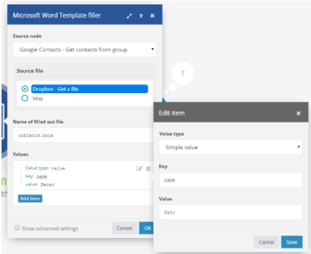

# [!DNL Microsoft Word Template] módulos

En un escenario de [!DNL Adobe Workfront Fusion], puede automatizar los flujos de trabajo que utilizan [!DNL Microsoft Word Templates], así como conectarlo a varias aplicaciones y servicios de terceros.

Si necesita instrucciones para crear un escenario, consulte [Crear un escenario en [!DNL Adobe Workfront Fusion]](../../workfront-fusion/scenarios/create-a-scenario.md).

Para obtener información acerca de los módulos, vea [Módulos en [!DNL Adobe Workfront Fusion]](../../workfront-fusion/modules/modules.md).

## Requisitos de acceso

Debe tener el siguiente acceso para utilizar la funcionalidad de este artículo:

<table style="table-layout:auto"> 
 <col> 
 <col> 
 <tbody> 
  <tr> 
   <td role="rowheader">[!DNL Adobe Workfront] plan*</td>
  <td> <p>[!UICONTROL Pro] o superior</p> </td>
  </tr> 
  <tr data-mc-conditions=""> 
   <td role="rowheader">[!DNL Adobe Workfront] licencia*</td>
   <td> <p>[!UICONTROL Plan], [!UICONTROL Trabajo]</p> </td> 
  </tr> 
  <tr> 
   <td role="rowheader">[!DNL Adobe Workfront Fusion] licencia**</td> 
   <td> <p>[!UICONTROL [!DNL Workfront Fusion] para automatización e integración de trabajo] </p> </td> 
  </tr> 
  <tr> 
   <td role="rowheader">Product</td> 
   <td>Su organización debe comprar [!DNL Adobe Workfront Fusion] así como [!DNL Adobe Workfront] para usar la funcionalidad descrita en este artículo.</td> 
  </tr> <!--
   <tr data-mc-conditions="QuicksilverOrClassic.Draft mode"> 
    <td role="rowheader">Access level configurations*</td> 
    <td> 
      <p data-mc-conditions="QuicksilverOrClassic.Draft mode">You must be a Workfront Fusion administrator for your organization.</p>
     --> <!--
      <p data-mc-conditions="QuicksilverOrClassic.Draft mode">You must be a Workfront Fusion administrator for your team.</p>
     --> </td> 
   </tr>
 </tbody> 
</table>

Para saber qué plan, tipo de licencia o acceso tiene, póngase en contacto con el administrador de [!DNL Workfront].

Para obtener información sobre [!DNL Adobe Workfront Fusion] licencias, consulte [[!DNL Adobe Workfront Fusion] licencias](../../workfront-fusion/get-started/license-automation-vs-integration.md).

## Requisitos previos

Para usar [!DNL Miscrosoft Word Templates] con [!DNL Adobe Workfront Fusion], es necesario tener una cuenta de [!DNL Office 365]. Puede crear uno en www.office.com.


## Conectando el servicio [!DNL Office] a [!DNL Workfront Fusion]

Para obtener instrucciones sobre cómo conectar tu cuenta de [!DNL Office] a [!UICONTROL Workfront Fusion], consulta [Crear una conexión a [!UICONTROL Adobe Workfront Fusion] - Instrucciones básicas](../../workfront-fusion/connections/connect-to-fusion-general.md)

>[!NOTE]
>
>Algunas aplicaciones de Microsoft utilizan la misma conexión, que está vinculada a permisos de usuario individuales. Por lo tanto, al crear una conexión, la pantalla de consentimiento de permisos muestra todos los permisos que se hayan concedido anteriormente a la conexión de este usuario, además de los nuevos permisos necesarios para la aplicación actual.
>
>Por ejemplo, si un usuario tiene permisos de &quot;Leer tabla&quot; concedidos a través del conector de Excel y, a continuación, crea una conexión en el conector de Outlook para leer correos electrónicos, la pantalla de consentimiento de permisos mostrará tanto el permiso de &quot;Leer tabla&quot; ya concedido como el permiso de &quot;Escribir correo electrónico&quot; recién requerido.

## Usando módulos de [!DNL Microsoft Word Templates]

Puede usar un módulo [!DNL Microsoft Word Template] para combinar datos de varios servicios web en un documento [!DNL Microsoft Word].

Por ejemplo, podría usar esta plantilla [!DNL Microsoft Word]:


Para crear este documento:


## Acerca de las etiquetas de valor

Una plantilla [!DNL Microsoft Word] es un documento [!DNL Microsoft Word] normal (archivo .docx) con etiquetas especiales en el texto que determinan dónde y cómo combinar o rellenar datos. Existen tres tipos de etiquetas:

* [Etiqueta de valor simple](#simple-value-tag)
* [Etiqueta de condición](#condition-tag)
* [Etiqueta de bucle](#loop-tag)

### Etiqueta de valor simple {#simple-value-tag}

Una etiqueta de valor simple se sustituye simplemente por un valor correspondiente. El nombre de la etiqueta corresponde al valor del campo [!UICONTROL Key], que se coloca entre llaves dobles; por ejemplo,


<pre>{{name}}</pre>


.

**Ejemplo:** Para crear un documento que diga &quot;Hola, Petr!&quot;, podría usar un módulo [!DNL Microsoft Word Template] para crear la siguiente plantilla:

<pre>&gt; ¡Hola {{name}}!</pre>

Para ello, debe configurar el módulo de la siguiente manera:



### Etiqueta de condición {#condition-tag}

Puede utilizar una etiqueta de condición para ajustar el texto que se debe representar solo cuando se cumplen determinadas condiciones. Para ajustar el texto, colóquelo entre las etiquetas de condición de apertura y cierre, como &quot;hasPhone&quot; si la condición es si los datos incluyen o no un número de teléfono. El nombre de una etiqueta de apertura va precedido del signo hash # y el nombre de una etiqueta de cierre va precedido de una barra diagonal /, como se muestra en el ejemplo siguiente.

**Ejemplo:** Para generar un documento que incluya el número de teléfono de un cliente si los datos de entrada incluyen un número de teléfono pero ninguna dirección de correo electrónico, puede usar un módulo [!DNL Microsoft Word Template] y crear la siguiente plantilla:
<pre>&gt; {{#hasPhone}}Teléfono: {{phone}} {{/hasPhone}}</pre><pre>&gt; {{#hasEmail}}Correo electrónico: {{email}} {{/hasEmail}}</pre>Para ello, debe configurar el módulo de la siguiente manera:


En el documento, el número de teléfono aparecería de la siguiente manera:
<pre>&gt; Teléfono: 4445551234</pre>

### Etiqueta de bucle {#loop-tag}

Puede utilizar una etiqueta de bucle, también conocida como etiqueta de sección, para repetir una sección de texto. Ajuste el texto colocándolo entre las etiquetas de bucle de apertura y cierre. El nombre de una etiqueta de apertura va precedido del signo de almohadilla #; el nombre de una etiqueta de cierre va precedido de una barra diagonal /.

* [Etiqueta de bucle con relleno de un módulo de documento](#loop-tag-with-fill-out-a-document-module)
  <!-- [Loop tag with Fill a document with a batch of data module](#loop-tag-with-fill-a-document-with-a-batch-of-data-module)-->

#### Etiqueta de bucle con Rellenar un módulo de documento {#loop-tag-with-fill-out-a-document-module}

**Ejemplo:** Para producir un documento que muestre el nombre y el número de teléfono de cada contacto en una lista de clientes, puede usar un módulo [!DNL Microsoft Word Template] y crear la siguiente plantilla:

<pre>&gt; {#contact}</pre><pre>&gt;     {{name}}, {{phone}}</pre><pre>&gt; {{/contact}}</pre>

Para ello, debe configurar el módulo de la siguiente manera:


El módulo crearía el siguiente documento:

```
> Jan Toman, 4445551234
> Eduard Salo, 4445552345
```

<!--

#### Loop tag with Fill a document with a batch of data module {#loop-tag-with-fill-a-document-with-a-batch-of-data-module}

**Example:** You can export Google contacts into a table that you create using loop tags.

The first module loads the template. The next module retrieves all contacts from the group you specify in [!DNL Google Contacts]. The aggregator module aggregates all values retrieved from Google Contacts and merges them into the template. And the last module saves the filled template to the desired location.


You could use this scenario with the following template:


To do this, you would set up the module as follows:


The module would create the following document:


-->

## [!DNL Microsoft Word Template] módulos

Estos módulos no requieren conexión.

* [Rellenar un documento](#fill-out-a-document)
* [Rellenar un documento con un lote de datos](#fill-a-document-with-a-batch-of-data)

### [!UICONTROL Rellenar un documento] {#fill-out-a-document}

Este módulo transformador permite rellenar un documento con los datos especificados. Se puede utilizar con etiquetas de valores simples, etiquetas condicionales o etiquetas de bucle.

<table style="table-layout:auto"> 
 <col> 
 <col> 
 <tbody> 
  <tr> 
   <td role="rowheader">[!UICONTROL Delimitador de inicio del texto que se va a reemplazar]</td> 
   <td> <p>Introduzca los caracteres que desea marcar al principio del texto que se va a reemplazar. </p> <p class="example" data-mc-autonum="<b>Example: </b>"><span class="autonumber"><span><b>Ejemplo: </b></span></span>Escriba <code>[[</code> si desea reemplazar un texto similar a este: <code>[[replace_me]]</code></p> </td> 
  </tr> 
  <tr> 
   <td role="rowheader"> <p>[!UICONTROL Delimitador final del texto que se va a reemplazar]</p> </td> 
   <td> <p>Introduzca los caracteres que desea que marquen el final del texto que se va a reemplazar. </p> <p class="example" data-mc-autonum="<b>Example: </b>"><span class="autonumber"><span><b>Ejemplo: </b></span></span>Escriba <code>]]</code> si desea reemplazar un texto similar a este: <code>[[replace_me]]</code></p> </td> 
  </tr> 
  <tr> 
   <td role="rowheader">[!UICONTROL archivo Source]</td> 
   <td> <p> Asigne el archivo que desee cargar desde el módulo anterior (por ejemplo, el módulo HTTP &gt; Obtener un archivo o Dropbox &gt; Obtener un archivo ). O introduzca el archivo de datos manualmente.</p> </td> 
  </tr> 
  <tr> 
   <td role="rowheader">[!UICONTROL Nombre del archivo rellenado]</td> 
   <td>Introduzca un nombre de archivo (incluida la extensión) para el archivo de salida de destino.</td> 
  </tr> 
  <tr> 
   <td role="rowheader">[!UICONTROL Origen de datos]</td> 
   <td> <p>Seleccione una opción para indicar si los datos que está utilizando proceden de un formulario o de una recopilación de datos sin procesar (datos de equipo no procesados).</p> </td> 
  </tr> 
  <tr> 
   <td role="rowheader">[!UICONTROL Valores]</td> 
   <td> <p>Debe ser una matriz de colecciones, donde:</p> 
    <ul> 
     <li>Cada colección corresponde a una entrada de datos y contiene un elemento <code>entry</code></li> 
     <li>El elemento <code>entry </code> contiene una colección de <code>key </code> y <code>value</code></li> 
     <li>El elemento <code>key </code> contiene el nombre de la etiqueta</li> 
     <li>el elemento <code>value </code> contiene el valor de la etiqueta</li> 
    </ul> 
    <p>Para agregar una entrada:</p>
    <ol> 
     <li> Haga clic en <b>[!UICONTROL Agregar elemento]</b>. </li> 
     <li>Seleccione el tipo de valor de la entrada.</li> 
     <li>Añada el nombre y el valor. Para obtener más información, consulte el ejemplo del tipo de valor elegido en este artículo. 
      <ul> 
       <li><a href="#simple-value-tag" class="MCXref xref">Etiqueta de valor simple</a></li> 
       <li><a href="#condition-tag" class="MCXref xref">Etiqueta de condición</a></li> 
       <li><a href="#loop-tag" class="MCXref xref">Etiqueta de bucle</a></li> 
      </ul></li> 
    </ol> </td> 
  </tr> 
 </tbody> 
</table>

### [!UICONTROL Rellenar un documento con un lote de datos] {#fill-a-document-with-a-batch-of-data}

Este módulo de agregador es útil si las entradas de datos se incluyen como paquetes independientes. Con este módulo, puede configurar fácilmente la estructura necesaria para el campo Valor y asignar elementos a cada elemento de valor. A diferencia del módulo Rellenar un documento, el campo Valores del módulo Rellenar un documento con un lote de datos solo permite una única entrada que contenga variables.

También puede usar este módulo si las entradas de datos vienen como una matriz, usando el módulo *Iterator* para transformar el contenido de la matriz en una serie de paquetes.

Los valores reales se crean y rellenan para cada paquete entrante. La plantilla se genera después de procesar todos los paquetes de entrada.

Este módulo de agregador es especialmente útil para crear listas o informes.

<table style="table-layout:auto"> 
 <col> 
 <col> 
 <tbody> 
  <tr> 
   <td role="rowheader">[!UICONTROL Módulo Source]</td> 
   <td>Seleccione el módulo que es el origen del texto.</td> 
  </tr> 
  <tr> 
   <td role="rowheader">[!UICONTROL Delimitador de inicio del texto que se va a reemplazar]</td> 
   <td> <p>Introduzca los caracteres que desea marcar al principio del texto que se va a reemplazar. </p> <p class="example" data-mc-autonum="<b>Example: </b>"><span class="autonumber"><span><b>Ejemplo: </b></span></span>Escriba <code>[[</code> si desea reemplazar un texto similar a este: <code>[[replace_me]]</code></p> </td> 
  </tr> 
  <tr> 
   <td role="rowheader"> <p>[!UICONTROL Delimitador final del texto que se va a reemplazar]</p> </td> 
   <td> <p>Introduzca los caracteres que desea que marquen el final del texto que se va a reemplazar. </p> <p class="example" data-mc-autonum="<b>Example: </b>"><span class="autonumber"><span><b>Ejemplo: </b></span></span>Escriba <code>]]</code> si desea reemplazar un texto similar a este: <code>[[replace_me]]</code></p> </td> 
  </tr> 
  <tr> 
   <td role="rowheader">[!UICONTROL Agrupar por]</td> 
   <td> Defina una expresión que contenga uno o varios elementos asignados. Los datos agregados se separan en Grupos con el mismo valor de expresión. Cada grupo genera como un paquete independiente que contiene una clave con la expresión evaluada y el texto agregado. Al hacerlo, puede utilizar la clave como filtro en módulos posteriores.</td> 
  </tr> 
  <tr> 
   <td role="rowheader">[!UICONTROL Detener procesamiento después de una agregación vacía]</td> 
   <td>Active esta opción para detener el procesamiento cuando una agregación no contenga paquetes.</td> 
  </tr> 
  <tr> 
   <td role="rowheader">[!UICONTROL archivo Source]</td> 
   <td> <p> Asigne el archivo que desee cargar desde el módulo anterior (por ejemplo, el módulo HTTP &gt; Obtener un archivo o Dropbox &gt; Obtener un archivo ). O introduzca el archivo de datos manualmente.</p> </td> 
  </tr> 
  <tr> 
   <td role="rowheader">[!UICONTROL Nombre del archivo rellenado]</td> 
   <td>Introduzca un nombre de archivo (incluida la extensión) para el archivo de salida de destino.</td> 
  </tr> 
  <tr> 
   <td role="rowheader">[!UICONTROL Origen de datos]</td> 
   <td> <p>Seleccione una opción para indicar si los datos que está utilizando proceden de un formulario o de una recopilación de datos sin procesar (datos de equipo no procesados).</p> </td> 
  </tr> 
  <tr> 
   <td role="rowheader">[!UICONTROL Valores]</td> 
   <td> <p>Debe ser una matriz de colecciones, donde:</p> 
    <ul> 
     <li>Cada colección corresponde a una entrada de datos y contiene un elemento <code>entry</code></li> 
     <li>El elemento <code>entry </code> contiene una colección de <code>key </code> y <code>value</code></li> 
     <li>El elemento <code>key </code> contiene el nombre de la etiqueta</li> 
     <li>el elemento <code>value </code> contiene el valor de la etiqueta</li> 
    </ul> 
    <p>Para agregar una entrada:</p>
    <ol> 
     <li> Haga clic en <b>[!UICONTROL Agregar elemento]</b>. </li> 
     <li>Seleccione el tipo de valor de la entrada.</li> 
     <li>Añada el nombre y el valor. Para obtener más información, consulte el ejemplo del tipo de valor elegido en este artículo. 
      <ul> 
       <li><a href="#simple-value-tag" class="MCXref xref">Etiqueta de valor simple</a></li> 
       <li><a href="#condition-tag" class="MCXref xref">Etiqueta de condición</a></li> 
       <li><a href="#loop-tag" class="MCXref xref">Etiqueta de bucle</a></li> 
      </ul></li> 
    </ol> </td> 
  </tr> 
 </tbody> 
</table>
