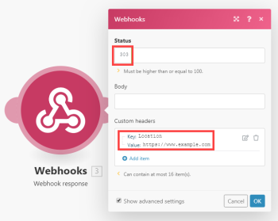

# Webhooks

Un webhook es una llamada HTTP que se activa por un evento. Puede utilizar webhooks para activar los módulos de déclencheur instantáneos. Cualquier aplicación que esté conectada a Internet y permita peticiones HTTP puede enviar webhooks a Adobe Workfront Fusion.

## Requisitos de acceso

Debe tener el siguiente acceso para utilizar la funcionalidad de este artículo:

<table style="table-layout:auto"> 
 <col> 
 <col> 
 <tbody> 
  <tr> 
   <td role="rowheader">[!DNL Adobe Workfront] plan*</td> 
   <td> <p>[!UICONTROL Pro] o superior</p> </td> 
  </tr> 
  <tr data-mc-conditions=""> 
   <td role="rowheader">[!DNL Adobe Workfront] licencia*</td> 
   <td> <p>[!UICONTROL Plan], [!UICONTROL Trabajo]</p> </td> 
  </tr> 
  <tr> 
   <td role="rowheader">[!DNL Adobe Workfront Fusion] licencia**</td> 
   <td>
   <p>Requisito de licencia actual: No [!DNL Workfront Fusion] requisito de licencia.</p>
   <p>O</p>
   <p>Requisito de licencia heredada: [!UICONTROL [!DNL Workfront Fusion] para automatización e integración de trabajo] </p>
   </td> 
  </tr> 
  <tr> 
   <td role="rowheader">Product</td> 
   <td>
   <p>Requisito actual del producto: si tiene [!UICONTROL Select] o [!UICONTROL Prime] [!DNL Adobe Workfront] Plan, su organización debe comprar [!DNL Adobe Workfront Fusion] así como [!DNL Adobe Workfront] para utilizar la funcionalidad descrita en este artículo. [!DNL Workfront Fusion] está incluido en [!UICONTROL Ultimate] [!DNL Workfront] plan.</p>
   <p>O</p>
   <p>Requisito de productos heredados: su organización debe comprar [!DNL Adobe Workfront Fusion] así como [!DNL Adobe Workfront] para utilizar la funcionalidad descrita en este artículo.</p>
   </td> 
  </tr>
 </tbody> 
</table>

&#42;Para saber qué plan, tipo de licencia o acceso tiene, póngase en contacto con su administrador de Workfront.

&#42;&#42;Para obtener información sobre [!DNL Adobe Workfront Fusion] licencias, consulte [[!DNL Adobe Workfront Fusion] licencias](../../workfront-fusion/get-started/license-automation-vs-integration.md)

## Uso de un webhook en [!DNL Workfront Fusion]

>[!NOTE]
>
>Para llamar a un webhook de terceros (un webhook saliente), utilice uno de los módulos HTTP. Para obtener más información, consulte [Módulos HTTP](../../workfront-fusion/apps-and-their-modules/http-modules/http-modules-1.md).

Para utilizar un webhook para conectar una aplicación a [!DNL Workfront Fusion]:

1. Añada el **[!UICONTROL Webhooks]** >**[!UICONTROL Webhook personalizado]** módulo de déclencheur instantáneo a su escenario.

1. Clic **[!UICONTROL Añadir]** situado junto al campo Webhook e introduzca un nombre para el nuevo webhook.
1. (Opcional) Haga clic en **[!UICONTROL Configuración avanzada]**.
1. En el **[!UICONTROL Restricciones de IP]** , introduzca una lista separada por comas de las direcciones IP desde las que el módulo puede aceptar datos.
1. Haga clic en **[!UICONTROL Guardar]**

Después de crear un gancho web, aparece una dirección URL única. Dirección a la que el webhook envía los datos. Workfront Fusion valida los datos enviados a esta dirección y los pasa para su procesamiento en el escenario.

>[!NOTE]
>
>Una vez creado un webhook, puede utilizarlo en más de un escenario a la vez.

### Configuración de la estructura de datos del gancho web {#configure-the-webhook-s-data-structure}

Para reconocer la estructura de datos de la carga útil entrante, [!DNL Workfront Fusion] analiza los datos de ejemplo que se envían a la dirección mostrada. Puede proporcionar los datos de ejemplo realizando un cambio en el servicio o la aplicación que hará que ese servicio o aplicación llame al webhook. Por ejemplo, puede quitar un archivo.

O puede seguir los pasos a continuación para enviar los datos de ejemplo a través de la variable [!UICONTROL HTTP] > [!UICONTROL Realizar una solicitud] módulo.

1. Cree un nuevo escenario con **[!UICONTROL HTTP]** > **[!UICONTROL Realizar una solicitud]** módulo

1. Configure el módulo con los siguientes valores:

   <table style="table-layout:auto"> 
    <col> 
    <col> 
    <tbody> 
     <tr> 
      <td role="rowheader"><p>[!UICONTROL URL] </p></td> 
      <td>Introduzca la URL del webhook. Puede encontrar esta URL en el módulo de [!UICONTROL Webhooks] que ha utilizado para configurar el webhook.</td> 
     </tr> 
     <tr> 
      <td role="rowheader">[!UICONTROL Método] </td> 
      <td><p>[!UICONTROL POST]</p></td> 
     </tr> 
     <tr> 
      <td role="rowheader">[!UICONTROL Tipo de cuerpo]</td> 
      <td><p> [!UICONTROL Raw]</p></td> 
     </tr> 
     <tr> 
      <td role="rowheader">[!UICONTROL Tipo de contenido]</td> 
      <td><p> JSON (application/json)</p></td> 
     </tr> 
     <tr> 
      <td role="rowheader">[!UICONTROL Solicitar contenido]</td> 
      <td><p>Se esperaba un JSON sin procesar en el webhook</p></td> 
     </tr> 
    </tbody> 
   </table>

   

1. Abra el escenario con [!UICONTROL Webhooks] en una pestaña o ventana independiente del explorador.
1. En el módulo webhooks, haga clic en **[!UICONTROL Redeterminar la estructura de datos]**.

   No es necesario desenlazar otros módulos del módulo de webhooks.

1. Cambie al escenario con la variable [!UICONTROL HTTP] y ejecútelo.
1. Vuelva al escenario con el módulo Webhooks.

   A &quot;[!UICONTROL Determinado correctamente]&quot; significa que el módulo ha determinado correctamente la estructura de datos.

   

1. Clic **[!UICONTROL OK]** para guardar la estructura de datos.

   Los elementos del gancho web ahora están disponibles en el panel de asignación para su uso con módulos posteriores en el escenario.

## Cola

Si un gancho web recibe datos y no hay un escenario activo que espere esos datos, los datos se almacenan en la cola. Una vez activado el escenario, se procesan secuencialmente todos los paquetes que esperan en la cola.

>[!IMPORTANT]
>
>Las colas de webhook se comparten entre escenarios que emplean el mismo webhook. Si una de las situaciones está desactivada, todos los datos entrantes se mantienen en cola.

## Formatos de datos entrantes admitidos

[!DNL Workfront Fusion] admite 3 formatos de datos entrantes: [!UICONTROL Cadena de consulta], [!UICONTROL Datos de formulario] y [!UICONTROL JSON].

[!DNL Workfront Fusion] valida todos los datos entrantes con la estructura de datos seleccionada. A continuación, según la configuración del escenario, los datos se almacenan en la cola para su procesamiento o se procesan inmediatamente.

Si alguna parte de los datos no supera la validación, [!DNL Workfront Fusion] devuelve un código de estado HTTP 400 y especifica, en el cuerpo de la respuesta HTTP, el motivo por el que los datos entrantes no superaron las comprobaciones de validación. Si la validación de los datos entrantes se realiza correctamente, Workfront Fusion devuelve el valor &quot;[!UICONTROL 200 aceptados]&quot; estado.

* [[!UICONTROL Cadena de consulta]](#query-string)
* [[!UICONTROL Datos de formulario]](#form-data)
* [[!UICONTROL JSON]](#json)

### [!UICONTROL Cadena de consulta]

```
GET https://app.workfrontfusion.com/wh/<yourunique32characterslongstring>?name=<yourname>&job=automate
```

### [!UICONTROL Datos de formulario]

```
POST https://app.workfrontfusion.com/wh/<yourunique32characterslongstring>

Content-Type: application/x-www-form-urlencoded

name=<yourname>&job=automate
```

#### Datos de formulario multiparte

```
POST https://app.workfrontfusion.com/wh/<yourunique32characterslongstring>


Content-Type: multipart/form-data; boundary=---generatedboundary

---generatedboundary

Content-Disposition: form-data; name="file"; filename="file.txt"


Content-Type: text/plain


Content of file.txt


---generatedboundary

Content-Disposition: form-data; name="name"

Workfront Fusion

---generatedboundary
```

Para recibir archivos codificados con `multipart/form-data`, debe configurar una estructura de datos con un `collection` escriba el campo que contiene los campos anidados `name`, `mime`, y `data`. El campo `name` es un `text` escriba y contendrá el nombre del archivo cargado. El `mime` es un `text` y contiene un archivo en formato MIME. El campo `data` es un `buffer` type y contiene datos binarios para el archivo que se transfiere.

Para obtener más información sobre el formato MIME, consulte [Módulos MIME](../../workfront-fusion/apps-and-their-modules/mime.md).

### [!UICONTROL JSON]

```
POST https://app.workfrontfusion.com/wh/<yourunique32characterslongstring>

Content-Type: application/json

{"name": "Workfront Fusion", "job": "automate"}
```

>[!TIP]
>
>Si desea acceder al JSON original, habilite el paso a través de JSON al configurar el webhook.
>
>1. Clic **[!UICONTROL Añadir]** para agregar un nuevo webhook.
>1. Clic **[!UICONTROL Mostrar configuración avanzada]**.
>1. Clic **[!UICONTROL Paso a través de JSON]**.
>

## Encabezados de webhook

Para acceder a los encabezados del webhook, habilite Obtener encabezados de solicitud al configurar el webhook.

1. Clic **[!UICONTROL Añadir]** para agregar un nuevo webhook.
1. Clic **[!UICONTROL Mostrar configuración avanzada]**.
1. Clic **[!UICONTROL Obtener encabezados de solicitud]**.

Puede extraer un valor de encabezado determinado con la combinación de `map()` y `get()` funciones.

>[!INFO]
>
>**Ejemplo:**
>
>El ejemplo siguiente muestra una fórmula que extrae el valor del `authorization` encabezado desde el `Headers[]` matriz. La fórmula se utiliza en un filtro que compara el valor extraído con el texto dado para pasar solo webhooks si hay una coincidencia.
>
>
>
>Para obtener más información sobre la obtención de un elemento de una matriz con una clave determinada, consulte [Asignar un elemento de una matriz con una clave determinada](../../workfront-fusion/mapping/map-information-between-modules.md#mapping) en el artículo [Asignación de información de un módulo a otro en Adobe Workfront Fusion](../../workfront-fusion/mapping/map-information-between-modules.md).

## Respuesta a los webhooks

La respuesta predeterminada a una llamada de webhook es el texto &quot;Aceptado&quot;. La respuesta se devuelve a la aplicación que llamó al webhook durante la ejecución del módulo Webhook personalizado.

* [Prueba de la respuesta a un webhook](#test-the-response-to-a-webhook)
* [Ejemplo de respuesta del HTML](#html-response-example)
* [Ejemplo de redirección](#redirect-example)

### Prueba de la respuesta a un webhook

1. Incluya el **[!UICONTROL Webhook personalizado]** en su escenario.
1. Agregue un nuevo webhook al módulo.
1. Copie la URL del webhook en el portapapeles.
1. Ejecute el escenario.

   El icono del rayo en la [!UICONTROL Webhook personalizado] cambios del módulo en los puntos de giro. Esto muestra que el módulo está esperando la llamada del webhook.

1. Abra una nueva ventana del explorador, pegue la dirección URL copiada en la barra de direcciones y pulse **[!UICONTROL Entrar]**.

   El [!UICONTROL Webhook personalizado] se activa y el explorador muestra una nueva página.

Si desea personalizar la respuesta del webhook, emplee el módulo Respuesta de webhook.

La configuración del módulo contiene dos campos: [!UICONTROL Estado] y [!UICONTROL Cuerpo].

* El [!UICONTROL Estado] contiene códigos de estado de respuesta HTTP como 2xx para Success (por ejemplo, `200` para OK), 3xx para Redirection (por ejemplo, `307` para redireccionamiento temporal), 4xx para errores de cliente (por ejemplo, `400` para solicitudes incorrectas), etc.

* El [!UICONTROL Cuerpo] contiene cualquier cosa que sea aceptada por la llamada del webhook. Puede ser texto simple, HTML, XML, JSON, etc.

  >[!TIP]
  >
  >Se recomienda configurar la variable `Content-Type` encabezado al tipo MIME correspondiente: `text/plain` para texto sin formato, `text/html` para el HTML, `application/json` para JSON, `application/xml` para XML, etc. Para obtener más información sobre los tipos MIME, consulte [Módulos MIME](../../workfront-fusion/apps-and-their-modules/mime.md).

El tiempo de espera para enviar una respuesta es de 40 segundos. Si la respuesta no está disponible dentro de ese periodo, Workfront Fusion devuelve el estado &quot;200 Aceptado&quot;.

### Ejemplo de respuesta del HTML

>[!INFO]
>
>**Ejemplo:**
>
>Configure las variables [!UICONTROL Respuesta de webhook] como sigue:
>
><table style="table-layout:auto"> 
&gt; <col> 
&gt; <col> 
&gt; <tbody> 
&gt;  <tr> 
&gt;   <td role="rowheader">[!UICONTROL Estado] </td> 
&gt;   <td> <p>Código de estado HTTP de éxito 2xx, p. ej. 200</p> </td> 
&gt;  </tr> 
&gt;  <tr> 
&gt;   <td role="rowheader">[!UICONTROL Cuerpo] </td> 
&gt;   <td> <p>código de HTML</p> </td> 
&gt;  </tr> 
&gt;  <tr> 
&gt;   <td role="rowheader"> <p>[!UICONTROL Encabezados personalizados]</p> </td> 
&gt;   <td> 
&gt;    <ul> 
&gt;     <li><strong>Clave</strong>: Content-type</li> 
&gt;     <li><strong>Valor</strong>: text/html</li> 
&gt;    </ul> </td> 
&gt;  </tr> 
&gt; </tbody> 
&gt;</table>
>
>
>
>Esto producirá una respuesta del HTML que se mostrará en un explorador web:
>
>

### Ejemplo de redirección

>[!INFO]
>
>**Ejemplo:** Configure las variables [!UICONTROL Respuesta de webhook] como sigue:
>
><table style="table-layout:auto"> 
&gt; <col> 
&gt; <col> 
&gt; <tbody> 
&gt;  <tr> 
&gt;   <td role="rowheader">[!UICONTROL Estado] </td> 
&gt;   <td> <p>Código de estado HTTP de redirección 3xx, p. ej. 303</p> </td> 
&gt;  </tr> 
&gt;  <tr> 
&gt;   <td role="rowheader"> <p>[!UICONTROL Encabezados personalizados]</p> </td> 
&gt;   <td> 
&gt;    <ul> 
&gt;     <li><strong>[!UICONTROL Key]</strong>: Ubicación</li> 
&gt;     <li><strong>[!UICONTROL Valor]</strong>: Dirección URL a la que desea redirigir el mensaje.</li> 
&gt;    </ul> </td> 
&gt;  </tr> 
&gt; </tbody> 
&gt;</table>
>
>

## Desactivación de webhook

Los webhooks se desactivan automáticamente si se aplica cualquiera de las siguientes opciones:

* El webhook no ha estado conectado a ningún escenario durante más de 5 días
* El webhook solo se utiliza en escenarios inactivos, que han estado inactivos durante más de 30 días.

Los webhooks desactivados se borran y no se registran automáticamente si no están conectados a ningún escenario y han estado en estado desactivado durante más de 30 días.


## Resolución de problemas

### Faltan elementos en el panel de asignación

Si faltan algunos elementos en el panel de asignación en la configuración de los módulos siguientes a la [!UICONTROL Webhooks] > [!UICONTROL Webhook personalizado] , haga clic en el **[!UICONTROL Webhooks] > [!UICONTROL Webhook personalizado]** para abrir su configuración y haga clic en **[!UICONTROL Volver a determinar la estructura de datos]**:


A continuación, siga los pasos descritos en la sección [Configuración de la estructura de datos del gancho web](#configure-the-webhook-s-data-structure) en este artículo.
