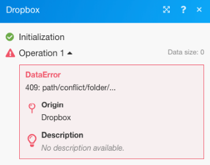

# Gestión de errores avanzada en [!DNL Adobe Workfront Fusion]

Las técnicas avanzadas de gestión de errores incluyen filtrado y anidamiento.

## Requisitos de acceso

Debe tener el siguiente acceso para utilizar la funcionalidad de este artículo:

<table style="table-layout:auto">
 <col> 
 <col> 
 <tbody> 
  <tr> 
   <td role="rowheader">[!DNL Adobe Workfront] plan*</td> 
   <td> 
[!UICONTROL Pro] o superior
 </td> 
  </tr> 
  <tr data-mc-conditions=""> 
   <td role="rowheader">[!DNL Adobe Workfront] licencia*</td> 
   <td> 
[!UICONTROL Plan], [!UICONTROL Trabajo]
 </td> 
  </tr> 
  <tr> 
   <td role="rowheader">Licencia de [!UICONTROL Adobe Workfront Fusion]**</td> 
   <td>
   
Requisito de licencia actual: No [!DNL Workfront Fusion] requisito de licencia.

   
O

   
Requisito de licencia heredada: [!UICONTROL [!DNL Workfront Fusion] para automatización e integración de trabajo] 

   </td> 
  </tr> 
  <tr> 
   <td role="rowheader">Product</td> 
   <td>
   
Requisito actual del producto: si tiene [!UICONTROL Select] o [!UICONTROL Prime] [!DNL Adobe Workfront] Plan, su organización debe comprar [!DNL Adobe Workfront Fusion] así como [!DNL Adobe Workfront] para utilizar la funcionalidad descrita en este artículo. [!DNL Workfront Fusion] está incluido en [!UICONTROL Ultimate] [!DNL Workfront] plan.

   
O

   
Requisito de productos heredados: su organización debe comprar [!DNL Adobe Workfront Fusion] así como [!DNL Adobe Workfront] para utilizar la funcionalidad descrita en este artículo.

   </td> 
  </tr> 
 </tbody> 
</table>

Para saber qué plan, tipo de licencia o acceso tiene, póngase en contacto con su [!DNL Workfront] administrador.

Para obtener información sobre [!DNL Adobe Workfront Fusion] licencias, consulte [[!DNL Adobe Workfront Fusion] licencias](../../workfront-fusion/get-started/license-automation-vs-integration.md).

## Filtrando

Existen dos tipos de filtrado que pueden realizarse en una ruta de tratamiento de errores.

* [Adición de un filtro a la ruta del controlador de error](#adding-a-filter-to-the-error-handler-route)
* [Agregar un enrutador seguido de filtros a la ruta del controlador de errores](#adding-a-router-followed-by-filters-to-the-error-handler)

### Adición de un filtro a la ruta del controlador de error

Puede utilizar un filtro para controlar qué errores gestiona la ruta del controlador de errores. Esto le permite procesar únicamente tipos de errores específicos. Si un error no pasa a través del filtro, se tratará como si no hubiera una ruta de controlador de error definida para el módulo determinado.

>[!INFO]
>
>**Ejemplo:**
>
>

### Adición de un [!UICONTROL Enrutador] seguido de filtros al controlador de errores

>[!INFO]
>
>
>
>En este ejemplo, el error tiene lugar en el [!UICONTROL Crear una carpeta] módulo (A), que tiene una ruta regular y una ruta de gestión de errores. A este último le sigue un enrutador con una ruta que tiene un filtro que define un tipo específico de error (Error de datos) y la otra que es la ruta predeterminada para todos los demás errores. La primera ruta termina con el [!UICONTROL Reanudar] que contiene valores sustitutos para que el escenario se reanude desde el módulo A ([!UICONTROL Crear una carpeta]), mientras que la segunda ruta termina con la [!UICONTROL Reversión] que detiene la ejecución del escenario inmediatamente.

Consulte [Error de procesamiento en [!DNL Adobe Workfront Fusion]](../../workfront-fusion/errors/error-processing.md) para obtener más información sobre los distintos tipos de error y sobre cómo [!DNL Workfront Fusion] los procesa y evalúa.

### El escenario de ejemplo

Puede configurar esta situación de ejemplo para comprender cómo funcionan estos filtros para la gestión de errores.

Usar un existente [!DNL Dropbox] para cargar un archivo en lugar de crear uno nuevo

Si usa el [!UICONTROL Crear una carpeta] módulo en [!DNL Dropbox] y ya existe una carpeta con el mismo nombre, el módulo generará un error de datos como se muestra a continuación:

El escenario completo:

1. El [!UICONTROL Herramientas] > [!UICONTROL Establecer variable] module contiene el nombre de la carpeta
1. El [!UICONTROL HTTP] >[!UICONTROL Obtener un archivo] El módulo recupera el archivo que debe cargarse en la carpeta
1. El [!UICONTROL Dropbox] >[!UICONTROL Crear una carpeta] El módulo genera un error si ya existe una carpeta con el mismo nombre que la asignada en el módulo
1. La ruta del controlador de errores (burbujas transparentes) contiene un enrutador para filtrar los errores
1. La primera ruta es para un tipo de error especificado llamado Error de datos, tal como lo conocemos ya:

   1. Si se produce un error de datos y los detalles del error pasan a través del filtro, la variable [!UICONTROL Dropbox] >[!UICONTROL Mostrar todos los archivos y subcarpetas de un módulo de carpetas] enumera todas las carpetas de [!DNL Dropbox]
   1. El filtro siguiente coincide con los nombres de carpeta
   1. El [!UICONTROL Reanudar] especifica el ID de carpeta y la ruta de carpeta de la carpeta existente y el escenario de ejecución se reanuda desde el [!UICONTROL Dropbox] >[!UICONTROL Crear una carpeta] , pero en lugar de intentar crear una nueva carpeta, esta vez utiliza los valores del [!UICONTROL Reanudar] para pasar al siguiente módulo y cargar el archivo en la carpeta existente

1. La segunda ruta es para todos los demás errores y termina con [!UICONTROL Reversión] que provoca la detención inmediata del escenario

A continuación se ofrece una explicación detallada de la quinta declaración:

Para utilizar la carpeta existente en los módulos posteriores ([!UICONTROL Cargar un archivo] a continuación), debe agregar una ruta de controlador de error al módulo y recuperar la ruta de la carpeta que se va a asignar al [!UICONTROL Reanudar] módulo de directivas que sigue:

El filtro de la primera ruta está configurado para controlar únicamente el error concreto (Error de datos) que aparece cuando ya existe una carpeta con el mismo nombre:

El [!UICONTROL Dropbox] >[!UICONTROL Mostrar todos los archivos de una carpeta] El módulo está configurado para devolver todas las carpetas de la carpeta de destino. El siguiente filtro solo pasa el que estábamos intentando crear originalmente (el nombre de la carpeta se almacena en el 33. Nombre de carpeta (elemento):

Finalmente, la variable [!UICONTROL Reanudar] proporciona la ruta de la carpeta como salida para el módulo fallido. Tenga en cuenta que el ID de carpeta se ha dejado en blanco, ya que no es necesario para[!UICONTROL Cargar un archivo]&#39; módulo:

## Anidado

Independientemente de dónde se encuentre un módulo, se pueden crear e implementar rutas de controladores de errores en todos los módulos, excepto en los enrutadores. Por lo tanto, es posible crear una ruta de controlador de error para un módulo que ya forme parte de una ruta de controlador de error existente creada para otro módulo.

Este es un ejemplo de una ruta anidada del controlador de error:

En este escenario, la segunda ruta del controlador de errores está anidada en la primera ruta del controlador de errores. Así pues, si la variable [!UICONTROL Dropbox] >[!UICONTROL Crear un módulo de carpeta] encuentra un error, la ejecución se mueve a la Ruta 1, si la variable [!UICONTROL Se Produce Un Error De Datos] Cuando se pasa el filtro, se ejecuta el siguiente módulo seguido del [!UICONTROL Reanudar] módulo de directivas si no se produce un error con el [!UICONTROL Dropbox] >[!UICONTROL Mostrar todos los archivos/subcarpetas] en un módulo de carpeta.

Sin embargo, si se produce un error con esto [!DNL Dropbox] y, a continuación, la ejecución se mueve a la Ruta 2 del controlador de error y termina con el [!UICONTROL Ignorar] Directiva. El [!UICONTROL Reanudar directiva] El módulo no se ejecuta en este caso.

Se trata de una combinación de controladores de error de filtrado y anidación.

