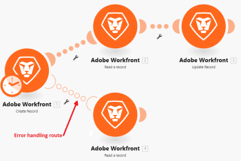

# Tratamiento de errores en [!DNL Adobe Workfront Fusion]

Cuando se producen errores durante la ejecución de un escenario, normalmente se debe a que un servicio no está disponible debido a un error, a que un servicio responde con datos inesperados o a que falla la validación de los datos de entrada.

Si un módulo genera un error durante la ejecución del escenario y no hay ninguna ruta de control de errores asociada al módulo, se ejecutará la lógica de control de errores predeterminada, tal como se describe en [Procesamiento de errores en [!DNL Adobe Workfront Fusion]](../../workfront-fusion/errors/error-processing.md).

Al agregar una ruta de controlador de error a un módulo, puede reemplazar la lógica de control de errores predeterminada por la suya propia. [!DNL Adobe Workfront Fusion] ofrece cinco directivas diferentes que se pueden insertar al final de las rutas del controlador de errores.

Para obtener más información, vea [Directivas para la administración de errores en [!DNL Adobe Workfront Fusion]](../../workfront-fusion/errors/directives-for-error-handling.md).

## Requisitos de acceso

Debe tener el siguiente acceso para utilizar la funcionalidad de este artículo:

<table style="table-layout:auto">
 <col> 
 <col> 
 <tbody> 
  <tr> 
   <td role="rowheader">[!DNL Adobe Workfront] plan*</td> 
   <td> 
[!DNL Pro] o superior
 </td> 
  </tr> 
  <tr data-mc-conditions=""> 
   <td role="rowheader">[!DNL Adobe Workfront] licencia*</td> 
   <td> 
[!UICONTROL Plan], [!UICONTROL Trabajo]
 </td> 
  </tr> 
  <tr> 
   <td role="rowheader">Licencia de [!UICONTROL Adobe Workfront Fusion]**</td> 
   <td>
   
Requisito de licencia actual: no se requiere licencia de [!DNL Workfront Fusion].

   
O

   
Requisito de licencia heredado: [!UICONTROL [!DNL Workfront Fusion] para automatización e integración de trabajo] 

   </td> 
  </tr> 
  <tr> 
   <td role="rowheader">Product</td> 
   <td>
   
Requisito de producto actual: si tiene el plan [!UICONTROL Select] o [!UICONTROL Prime] [!DNL Adobe Workfront], su organización debe adquirir [!DNL Adobe Workfront Fusion] así como [!DNL Adobe Workfront] para utilizar la funcionalidad descrita en este artículo. [!DNL Workfront Fusion] está incluido en el plan [!DNL Workfront] de [!UICONTROL Ultimate].

   
O

   
Requisito de productos heredados: su organización debe comprar [!DNL Adobe Workfront Fusion] y [!DNL Adobe Workfront] para utilizar la funcionalidad descrita en este artículo.

   </td> 
  </tr> 
 </tbody> 
</table>

Para saber qué plan, tipo de licencia o acceso tiene, póngase en contacto con el administrador de [!DNL Workfront].

Para obtener información sobre [!DNL Adobe Workfront Fusion] licencias, consulte [[!DNL Adobe Workfront Fusion] licencias](../../workfront-fusion/get-started/license-automation-vs-integration.md).

## Ruta del controlador de error

Para agregar una ruta de controlador de error a un módulo:

1. Haga clic con el botón derecho en el módulo y seleccione **[!UICONTROL Agregar controlador de error]**:

   

   El módulo muestra una lista de directivas, así como las aplicaciones que se utilizan en su escenario.

1. Si el módulo al que agregó un controlador de errores es el último módulo de la ruta, seleccione una de las directivas.

   O

   Añada uno o más módulos a la ruta del controlador de error.

   Si agrega más módulos a la ruta, se aplica la directiva [!UICONTROL Ignore] de forma predeterminada y, en caso de error, se procesan los módulos posteriores de esa ruta.

>[!INFO]
>
>En este ejemplo, si se produce un error al ejecutar el módulo [!UICONTROL Crear una carpeta], la directiva [!UICONTROL Ignorar] se aplicará automáticamente y el escenario pasará al siguiente módulo en la ruta del controlador de errores.
>
>Sin embargo, si no hay ningún error, el escenario se moverá a [!UICONTROL Enumerar todos los archivos en un módulo de carpetas] en la ruta normal.
>
>

Tenga en cuenta que una ruta de controlador de error está compuesta por círculos transparentes, mientras que una ruta regular está compuesta por círculos sólidos.

## Directivas de gestión de errores

Las directivas se explican brevemente a continuación. Para obtener más información, vea [Directivas para la administración de errores en [!DNL Adobe Workfront Fusion]](../../workfront-fusion/errors/directives-for-error-handling.md).

Hay un total de cinco directivas que se pueden agrupar en las siguientes categorías en función de si la ejecución de un escenario debe continuar o no.

Las siguientes directivas garantizan que continúe la ejecución de un escenario:

* **[!UICONTROL Reanudar]**: permite especificar una salida de sustitución para el módulo con el error. El estado de ejecución del escenario se marca como correcto
* **[!UICONTROL Ignorar]**: ignora el error. El estado de ejecución del escenario se marca como correcto
* **[!UICONTROL Salto]**: Almacena la entrada en la cola de ejecuciones incompletas. El estado de ejecución del escenario se marca como advertencia. Para obtener más información, vea [Ver y resolver ejecuciones incompletas en [!DNL Adobe Workfront Fusion]](../../workfront-fusion/scenarios/view-and-resolve-incomplete-executions.md).

Si la ejecución de un escenario debe detenerse cuando se produce un error, utilice una de las siguientes directivas:

* **[!UICONTROL Reversión]**: detiene la ejecución del escenario inmediatamente y marca su estado como error
* **[!UICONTROL Compromiso]**: detiene la ejecución del escenario inmediatamente y marca su estado como correcto

Para obtener más información sobre la gestión de errores, consulte:

* [Directivas para la administración de errores en  [!DNL Adobe Workfront Fusion]](../../workfront-fusion/errors/directives-for-error-handling.md)
* [Tratamiento de errores avanzado en [!DNL Adobe Workfront Fusion]](../../workfront-fusion/errors/advanced-error-handling.md)