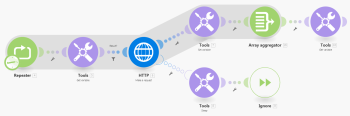

# Reintentar la gestión de errores en [!DNL Adobe Workfront Fusion]

En algunos casos, es útil volver a ejecutar un módulo que falla si existe la posibilidad de que el motivo del error pueda pasar con el tiempo.

## Requisitos de acceso

Debe tener el siguiente acceso para utilizar la funcionalidad de este artículo:

<table style="table-layout:auto">
 <col> 
 <col> 
 <tbody> 
  <tr> 
   <td role="rowheader">[!DNL Adobe Workfront] plan*</td> 
   <td> 
[!DNL Pro] o superior
 </td> 
  </tr> 
  <tr data-mc-conditions=""> 
   <td role="rowheader">[!DNL Adobe Workfront] licencia*</td> 
   <td> 
[!UICONTROL Plan], [!UICONTROL Trabajo]
 </td> 
  </tr> 
  <tr> 
   <td role="rowheader">Licencia de [!UICONTROL Adobe Workfront Fusion]**</td> 
   <td>
   
Requisito de licencia actual: No [!DNL Workfront Fusion] requisito de licencia.

   
O

   
Requisito de licencia heredada: [!UICONTROL [!DNL Workfront Fusion] para automatización e integración de trabajo] 

   </td> 
  </tr> 
  <tr> 
   <td role="rowheader">Product</td> 
   <td>
   
Requisito actual del producto: si tiene [!UICONTROL Select] o [!UICONTROL Prime] [!DNL Adobe Workfront] Plan, su organización debe comprar [!DNL Adobe Workfront Fusion] así como [!DNL Adobe Workfront] para utilizar la funcionalidad descrita en este artículo. [!DNL Workfront Fusion] está incluido en [!UICONTROL Ultimate] [!DNL Workfront] plan.

   
O

   
Requisito de productos heredados: su organización debe comprar [!DNL Adobe Workfront Fusion] así como [!DNL Adobe Workfront] para utilizar la funcionalidad descrita en este artículo.

   </td> 
  </tr> 
 </tbody> 
</table>

Para saber qué plan, tipo de licencia o acceso tiene, póngase en contacto con su [!DNL Workfront] administrador.

Para obtener información sobre [!DNL Adobe Workfront Fusion] licencias, consulte [[!DNL Adobe Workfront Fusion] licencias](../../workfront-fusion/get-started/license-automation-vs-integration.md).

## Soluciones alternativas para [!UICONTROL Reintentar] directiva de gestión de errores

[!UICONTROL Adobe Workfront Fusion] actualmente no ofrece el [!UICONTROL Reintentar] directiva de gestión de errores, aunque se pueden emplear dos soluciones para imitar su funcionalidad. Para obtener más información, consulte [Directivas para la gestión de errores en Adobe Workfront Fusion](../../workfront-fusion/errors/directives-for-error-handling.md).

### Utilice el [!UICONTROL Descanso] directiva

1. En el panel de configuración de escenario, habilite la opción **[!UICONTROL Permitir el almacenamiento de ejecuciones incompletas]** opción.

   Para obtener más información, consulte [El panel de configuración de escenario en [!DNL Adobe Workfront Fusion]](../../workfront-fusion/scenarios/scenario-settings-panel.md).

1. Adjunte una ruta de controlador de error al módulo, tal como se describe en [Tratamiento de errores en [!UICONTROL Adobe Workfront Fusion]](../../workfront-fusion/errors/error-handling.md).
1. Vincule el [!UICONTROL Descanso] a la ruta del controlador de errores y configúrela.

   Para obtener más información, consulte [Directivas para la gestión de errores en [!UICONTROL Adobe Workfront Fusion]](../../workfront-fusion/errors/directives-for-error-handling.md).

   

#### Inconvenientes

* El intervalo mínimo de reintento es de un minuto.
* Si el módulo procesa varios paquetes y falla el procesamiento de un paquete, la ejecución parcial (solo el paquete que provocó el error) se mueve a la carpeta de ejecuciones incompletas y se programa para reintentos según el [!UICONTROL Descanso] configuración de directivas. Sin embargo, la ejecución actual continúa y el módulo continúa procesando los paquetes posteriores. Puede activar la opción &quot;[!UICONTROL Procesamiento secuencial]&quot; en la [!UICONTROL Configuración de escenarios] para evitar que el escenario se vuelva a ejecutar hasta que la ejecución almacenada en la carpeta Ejecuciones incompletas se haya resuelto correctamente.

  Para obtener más información sobre las ejecuciones incompletas, consulte [Ver y resolver ejecuciones incompletas en [!DNL Adobe Workfront Fusion]](../../workfront-fusion/scenarios/view-and-resolve-incomplete-executions.md).

### Utilice el [!UICONTROL Repetidor] módulo

1. Utilice el **[!UICONTROL Repetidor]** y establezca su **[!UICONTROL Repeticiones]** al número máximo de intentos.
1. Vincule el módulo que podría fallar al **[!UICONTROL Repetidor]** módulo.
1. Adjuntar una ruta del controlador de errores a este módulo (consulte [Tratamiento de errores en [!DNL Adobe Workfront Fusio]n](../../workfront-fusion/errors/error-handling.md)).
1. Vincule el **[!UICONTROL Herramientas] > [!UICONTROL Suspensión]** módulo a la ruta del controlador de errores y establezca su **[!UICONTROL Demora]** al número de segundos entre los intentos.

1. Vincule el **[!UICONTROL Ignorar]** después de la **[!UICONTROL Herramientas] > [!UICONTROL Suspensión]** módulo (consulte [Directivas para la gestión de errores en Adobe Workfront Fusion](../../workfront-fusion/errors/directives-for-error-handling.md)).

1. Vincule el **[!UICONTROL Herramientas] > [!UICONTROL Establecer variable]** después del módulo potencialmente fallido y configúrelo para almacenar el resultado del módulo en una variable denominada, por ejemplo, `Result`.

1. Vincule el **[!UICONTROL Agregador de matrices]** después del módulo **[!UICONTROL Herramientas] > [!UICONTROL Establecer variable]** y elija la **[!DNL Repeater]** en el campo Módulo de origen.

1. Vincule el **[!UICONTROL Herramientas] > [!UICONTROL Obtener variable]** al módulo de **[!UICONTROL Agregador de matrices]** y configúrelo para obtener el valor del módulo `Result` variable.

1. Inserte el **[!UICONTROL Herramientas] > [!UICONTROL Obtener variable]** entre el **[!UICONTROL Repetidor]** y el módulo que podría dar error y configurarlo para obtener el valor del `Result` variable.

1. Insertar un filtro entre esto **[!UICONTROL Herramientas] > [!UICONTROL Obtener variable]** módulo y el módulo que podría fallar para continuar solo si el `Result` no existe.

>[!INFO]
>
>**Ejemplo:** Este es un ejemplo de escenario en el que la variable [!UICONTROL HTTP] >[!UICONTROL Realizar una solicitud] module representa el módulo que podría dar error:
>
>
>
>Si el resultado del módulo que puede dar error es demasiado complejo para almacenarlo en una variable simple, puede utilizar un almacén de datos para almacenar o recuperar el resultado. El almacén de datos contendría un solo registro. La clave del registro puede ser, por ejemplo, `Result`.
>
>Para obtener más información sobre los almacenes de datos, consulte [Almacenes de datos en [!DNL Adobe Workfront Fusion]](../../workfront-fusion/modules/data-stores.md)

#### Inconveniente

Esta solución puede parecer un poco compleja y también más exigente en términos de operaciones.
