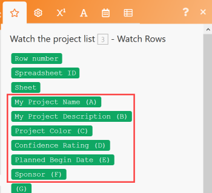

# Creación de un escenario de integración de prácticas en Adobe Workfront Fusion

En este artículo se describe cómo crear un escenario de integración con Adobe Workfront Fusion. Los escenarios de integración conectan aplicaciones independientes entre sí, lo que permite que los datos fluyan por distintas aplicaciones.

Para crear un escenario de integración, su organización debe tener un [!DNL Workfront Fusion for Work Automation and Integration] licencia.

Para obtener instrucciones sobre la creación de un escenario de automatización solo de Workfront, consulte [Creación de un escenario de automatización de la práctica en Adobe Workfront Fusion](../../workfront-fusion/get-started/create-a-practice-automation-scenario.md)

Para obtener más información sobre las licencias de Workfront Fusion, consulte [Licencias de Adobe Workfront Fusion](../../workfront-fusion/get-started/license-automation-vs-integration.md).

>[!NOTE]
>
>Es posible que su organización no permita el acceso a las hojas de Google. En ese caso, no podrá configurar esta integración, pero la información presentada aquí puede utilizarse como ejemplo general del funcionamiento de los escenarios de integración.

## Requisitos de acceso

Debe tener el siguiente acceso para utilizar la funcionalidad de este artículo:

<table style="table-layout:auto"> 
 <col> 
 <col> 
 <tbody> 
  <tr> 
    <td role="rowheader">[!DNL Adobe Workfront] plan*</td> 
   <td> 
[!DNL Pro] o superior
 </td> 
  </tr> 
  <tr data-mc-conditions=""> 
   <td role="rowheader">[!DNL Adobe Workfront] licencia*</td> 
   <td> 
[!UICONTROL Plan], [!UICONTROL Trabajo]
 </td> 
  </tr> 
  <tr> 
   <td role="rowheader">Licencia de [!UICONTROL Adobe Workfront Fusion]**</td> 
   <td>
   
Requisito de licencia actual: No [!DNL Workfront Fusion] requisito de licencia.

   
O

   
Requisito de licencia heredada: [!UICONTROL [!DNL Workfront Fusion] para automatización e integración de trabajo] 

   </td> 
  </tr> 
  <tr> 
   <td role="rowheader">Product</td> 
   <td>
   
Requisito actual del producto: si tiene [!UICONTROL Select] o [!UICONTROL Prime] [!DNL Adobe Workfront] Plan, su organización debe comprar [!DNL Adobe Workfront Fusion] así como [!DNL Adobe Workfront] para utilizar la funcionalidad descrita en este artículo. [!DNL Workfront Fusion] está incluido en [!UICONTROL Ultimate] [!DNL Workfront] plan.

   
O

   
Requisito de productos heredados: su organización debe comprar [!DNL Adobe Workfront Fusion] así como [!DNL Adobe Workfront] para utilizar la funcionalidad descrita en este artículo.

   </td> 
  </tr> 
 </tbody> 
</table>

Para saber qué plan, tipo de licencia o acceso tiene, póngase en contacto con su [!DNL Workfront] administrador.

Para obtener información sobre [!DNL Adobe Workfront Fusion] licencias, consulte [[!DNL Adobe Workfront Fusion] licencias](../../workfront-fusion/get-started/license-automation-vs-integration.md).

## Crear un escenario de práctica

La función de [!DNL Adobe Workfront Fusion] es automatizar sus procesos para que pueda concentrarse en nuevas tareas en lugar de repetir las mismas tareas una y otra vez. Funciona vinculando acciones dentro de las aplicaciones y servicios y entre ellos para crear un escenario que transfiera y transforme los datos automáticamente. El escenario que cree inspecciona los datos de una aplicación o servicio y procesa esos datos para proporcionar el resultado deseado.

Un escenario se compone de una serie de módulos que indican cómo se deben transformar los datos dentro de una aplicación o transferirlos entre aplicaciones y servicios web.

Para explicar cómo crear un escenario y reforzar las prácticas recomendadas a medida que aprende a utilizar [!DNL Workfront Fusion]Sin embargo, este artículo lo lleva a través del proceso paso a paso. Crearemos un escenario que cree un nuevo registro en [!DNL Workfront] para cada fila de una [!DNL Google Sheets] hoja de cálculo.

>[!TIP]
>
>Un escenario como este sería útil si tuviera una hoja de cálculo que enumerara proyectos en los que se debe trabajar con proyectos en [!DNL Workfront]. El escenario podría &quot;inspeccionar&quot; la hoja de cálculo para buscar nuevas filas y agregar un nuevo proyecto en [!DNL Workfront] para cada uno.

La creación de un escenario consta de varias tareas principales:

## Elija las aplicaciones y asigne un nombre al escenario

1. Descargar esto [hoja de cálculo](https://cdn.experience.workfront.com/Documentation/Workfront+Fusion/Fusion+Practice+Scenario+Sample+Sheet.xlsx)y luego cárguelo en su [!DNL Google Drive] para usar durante este ejercicio.

   O

   Cree o encuentre su propio [!DNL Google Sheets] hoja de cálculo similar a esta:

   

1. Inicie sesión en su [!DNL Workfront Fusion] cuenta.
1. Clic **[!UICONTROL Escenarios]**  en el panel izquierdo.

   >[!NOTE]
   >
   >Si no ve el panel de navegación izquierdo o sus iconos, haga clic en el menú  icono.

   En el gris [!UICONTROL Carpetas] , puede organizar los escenarios en carpetas.

   En la parte superior del área principal a la derecha, puede ver **[!UICONTROL Todo]** escenarios que ha creado, sus **[!UICONTROL Escenarios activos]** y **[!UICONTROL Escenarios inactivos]**, y **[!UICONTROL Conceptos]**, que son escenarios que necesitan más trabajo antes [!DNL Workfront Fusion] Puede clasificarlos como activos o inactivos.

<!--
   
-->

1. En el [!UICONTROL Carpetas] , haga clic en **[!UICONTROL Añadir carpeta]** icono A continuación, escriba un nombre como &quot;Escenarios de práctica&quot; para la primera carpeta.

1. Abra la carpeta y haga clic en **[!UICONTROL Crear un nuevo escenario]** en la esquina superior derecha de la página.

   La página de aterrizaje que se muestra le permite cargar previamente cualquier aplicación que desee utilizar en el escenario que va a crear.

1. Para este ejercicio, busque y seleccione **[!UICONTROL Hojas de Google]** aplicación.
1. Clic **[!UICONTROL Continuar]** en la esquina superior derecha.

   El editor de escenarios muestra, con un módulo vacío en el centro, el [!DNL Google Sheets] La aplicación que ha cargado previamente y algunas opciones en la barra de herramientas de la parte inferior.

<!--
   
-->

Cuando empiece a crear un nuevo escenario, es aconsejable empezar creando un nombre para él.

1. Seleccione el **[!UICONTROL Nuevo escenario]** Nombre del marcador de posición en la esquina superior izquierda y, a continuación, escriba un nombre como &quot;Escenario de práctica 1&quot;.
1. Continuar con [Adición y configuración del primer módulo](#add-and-configure-the-first-module) más abajo.

## Adición y configuración del primer módulo

El módulo vacío con un signo de interrogación representa el módulo de déclencheur que debe agregar. Este módulo iniciará el escenario cada vez que se ejecute. El icono de reloj del módulo vacío indica que es un módulo programado.

Este módulo contendrá los datos que desea que el escenario observe.

1. Haga clic en el módulo vacío para elegir la aplicación desde la que seleccionará un módulo.

   La aplicación que ha cargado previamente anteriormente se muestra junto al módulo vacío. Puede agregar cualquier otra aplicación que tenga módulos usando [!UICONTROL Buscar] cuadro.

   

1. Haga clic **[!DNL Google Sheets]**.

   La lista cambia para mostrar todo [!DNL Google Sheets] módulos que puede utilizar como módulo de déclencheur.

1. Haga clic en el módulo déclencheur **[!UICONTROL Buscar registros]**.

   Ahora debe establecer una conexión autenticada con su cuenta de Google. Cada módulo que agregue a un escenario debe tener una conexión con su aplicación.

1. En el **[!DNL Google Sheets]** cuadro, debajo de **[!UICONTROL Conexión]**, haga clic en **[!UICONTROL Añadir]** A continuación, escriba un nombre para la conexión, como &quot;Cuenta de Google de Olivia&quot;, y haga clic en **[!UICONTROL Continuar]**.
1. Autentique la conexión en la ventana que aparece.

   El proceso de autenticación de una conexión puede variar un poco entre aplicaciones. Es posible que tenga que iniciar sesión en la aplicación. Normalmente tendrá que hacer clic en una **[!UICONTROL Permitir]** botón. Si necesita ayuda, consulte [Acerca de conectar [!DNL Adobe Workfront Fusion] a una aplicación o servicio](../../workfront-fusion/connections/about-connecting-wf-fusion-to-app-or-service.md).

## Configuración del primer módulo

Después de conectar [!DNL Workfront Fusion] a su [!DNL Google Sheets] cuenta, puede especificar una [!DNL Google Sheets] hoja de cálculo a la que tiene acceso y los datos allí que desea que procese el primer módulo.

1. Haga clic en **[!UICONTROL Hoja de cálculo]** y, a continuación, seleccione **[!UICONTROL Escenario de prácticas de Workfront Fusion] #1** hoja de cálculo en la lista que aparece.

   Esta hoja de cálculo contiene 2 hojas (fichas), por lo que es necesario especificar qué hoja contiene los datos deseados:

1. En el **[!UICONTROL Hoja]** , seleccione la opción **[!UICONTROL Proyectos]**.

   Nuestra hoja de cálculo contiene encabezados y queremos que el módulo los utilice para identificar los datos que queremos procesar:

   

1. Salir **[!UICONTROL Sí]** seleccionado para **[!UICONTROL La tabla contiene encabezados]**.

1. En el **[!UICONTROL Fila con encabezados]** , puede especificar el rango de filas que desea incluir, pero dejemos el valor predeterminado A1:Z1 para este ejercicio.
1. En el **[!UICONTROL Límite]** cuadro, escriba 1.

   De este modo, cada vez que ejecute el escenario, el módulo procesará solo 1 fila en la hoja de cálculo. Esto resulta útil para simplificar las ejecuciones de prueba mientras crea el escenario.

1. Clic **[!UICONTROL OK]**.

   El **[!UICONTROL Elija por dónde empezar]** Este cuadro le pide que especifique en qué parte de la hoja de cálculo desea que comience a procesarse el módulo.

1. Clic **[!UICONTROL Elegir manualmente]**, seleccione la opción superior en la lista que aparece y haga clic en **[!UICONTROL OK]**.
1. Haga clic con el botón derecho en el módulo y seleccione **[!UICONTROL Cambiar nombre]**, escriba un nombre y describa lo que desea que haga el módulo (por ejemplo, &quot;Ver la lista de proyectos&quot;) y haga clic en **[!UICONTROL OK]**.

   El nombre aparece justo debajo del módulo. Debajo de eso, [!DNL Workfront Fusion] incluye una breve descripción del tipo de acción realizada por el módulo.

   

1. Continuar con [Adición y configuración del segundo módulo](#add-and-configure-the-second-module).

## Adición y configuración del segundo módulo

1. Haga clic en el círculo parcial a la derecha del del del módulo para **[!UICONTROL Añadir otro módulo]**.

   Este segundo módulo debe ser un [!DNL Workfront] módulo, pero no hemos cargado previamente el [!DNL Workfront] aplicación.

1. Para encontrar la [!DNL Workfront] aplicación, empiece a escribir &quot;[!DNL Workfront]&quot; y haga clic en la aplicación cuando aparezca.
1. En la lista de [!DNL Workfront] módulos que aparece, haga clic en **[!UICONTROL Crear registro]**.

1. Como ya hizo anteriormente con la aplicación Google Sheets, haga clic en **[!UICONTROL Añadir]** en el [!DNL Workfront] para añadir una conexión entre Workfront Fusion y Workfront.

   Ahora empezaremos a especificar qué queremos hacer con los datos de la hoja de cálculo.

1. Clic **[!UICONTROL Tipo de registro]**, luego seleccione **[!UICONTROL Proyecto]** porque queremos crear un proyecto en [!DNL Workfront] utilizando una fila de la hoja de cálculo.

   >[!TIP]
   >
   >Puede encontrar **[!UICONTROL Proyecto]** en la lista si empieza a escribir la palabra &quot;[!UICONTROL proyecto].&quot;

   El cuadro se expande para mostrar todos los disponibles [!DNL Workfront] campos de proyecto donde puede colocar la información que encuentra el primer módulo.

   Vamos a usar el... **[!UICONTROL Nombre]** campo: queremos que este módulo asigne un nombre a cada proyecto de [!DNL Workfront] usando el texto en el [!UICONTROL Hojas de Google] fila.

1. Busque y haga clic en **[!UICONTROL Nombre]** field.

   >[!TIP]
   >
   >Puede utilizar **Cmd+F** ([!DNL Mac] OS) o **Ctrl-F**([!DNL Windows] OS) para buscar un campo rápidamente.

   Se abre la lista de variables que puede utilizar en la variable **[!UICONTROL Nombre]** para definir el nombre de cada proyecto creado en Workfront.

   

   Observe que las variables cerca de la parte superior de la lista corresponden a los encabezados de columna de la hoja de cálculo.

   

   

1. Haga clic en la variable **[!UICONTROL Nombre de mi proyecto (A)]** para agregarlo al **[!UICONTROL Nombre]** field.

   Acaba de asignar el primer fragmento de datos para este escenario.

   Asignemos un fragmento más de datos de la hoja de cálculo a [!DNL Workfront]: la fecha de inicio de cada proyecto.

1. Busque y haga clic en **[!UICONTROL Fecha planificada de inicio]** y haga clic en el campo **[!UICONTROL Fecha planificada de inicio (E)]** , para extraer datos de esa columna en la hoja de cálculo.

1. Clic **[!UICONTROL OK]**.

   Ahora tiene un escenario de trabajo.

1. Asigne un nombre al segundo módulo, como &quot;Crear proyecto de Workfront&quot; y, a continuación, continúe con [Prueba del escenario](#test-the-scenario).

## Prueba del escenario

Antes de activar el escenario, es importante probarlo ejecutándolo al menos una vez y viendo los resultados. Esto le ayuda a comprender cómo fluyen los datos a través del escenario y a encontrar cualquier error.

Elegimos procesar 1 fila de la hoja de cálculo para crear un proyecto en Workfront. Si ejecuta el escenario, eso es lo que debería suceder.

1. Clic **[!UICONTROL Ejecutar una vez]** en la esquina inferior izquierda del editor de escenarios.
1. Una vez que el escenario termine de ejecutarse, haga clic en la burbuja situada encima de [!DNL Google Sheets] módulo.

   

   En el cuadro que aparece, puede ver información sobre el conjunto de datos que procesó el módulo, incluidos los datos reales extraídos de la hoja de cálculo para la fila con la que comenzó.

   

1. Haga clic en la burbuja del inspector de ejecución encima de [!DNL Workfront] para ver la entrada de información y el resultado, que es el ID del proyecto ahora creado en [!DNL Workfront]

   

   Puede obtener más información sobre cómo leer la información de ejecución de escenarios en los siguientes artículos:

   * Para obtener información general, consulte [Flujo de ejecución de escenario en [!DNL Adobe Workfront Fusion]](../../workfront-fusion/scenarios/scenario-execution-flow.md).
   * Para obtener información sobre los paquetes procesados, consulte [Ejecución de escenarios, ciclos y fases en [!DNL Adobe Workfront Fusion]](../../workfront-fusion/scenarios/scenario-execution-cycles-phases.md).

1. Ir a [!DNL Workfront] y busque &quot;soho center loft&quot; para ver el proyecto que creó el escenario. Ésta era la última fila de la hoja de cálculo.
1. Entrada [!DNL Workfront Fusion], haga clic en **[!UICONTROL Guardar]**  cerca de la esquina inferior izquierda para guardar el progreso del escenario.

   >[!IMPORTANT]
   >
   >Guarde con frecuencia mientras perfecciona y prueba un escenario.

## Finalice el escenario y vuelva a probarlo

Aún tenemos que configurar el escenario para crear proyectos para todas las demás filas de la hoja de cálculo.

1. Haga clic en **[!UICONTROL Observar filas]** módulo que ha creado para las hojas de Google.
1. Cambie el **[!UICONTROL Límite]** a 100.

   La especificación de un número mayor que el número de filas que sabe que están en la hoja de cálculo garantiza que el escenario las capturará todas.

1. Haga clic con el botón derecho en **[!UICONTROL Observar filas]** , haga clic en **[!UICONTROL Elija por dónde empezar]**, haga clic en **[!UICONTROL Todo]**, luego haga clic en **[!UICONTROL OK]**.

1. Clic **[!UICONTROL Ejecutar una vez]** y observen lo que sucede en las burbujas del inspector de ejecución.

   El [!DNL Google] Hojas **[!UICONTROL Observar filas]** El módulo se ejecuta una vez para leer todas las filas. A continuación, Workfront **[!UICONTROL Crear registro]** Este módulo se ejecuta 20 veces para crear un proyecto para cada una de las 20 filas restantes de la hoja de cálculo.

1. Haga clic en la burbuja del inspector de ejecución para [!DNL Workfront] para ver las 20 operaciones y, a continuación, haga clic en una de las operaciones para ver la información sobre el proyecto creado.
1. Clic **[!UICONTROL Guardar]**  cerca de la esquina inferior izquierda.
1. Ir a [!DNL Workfront] para ver los proyectos que creó el escenario.

>[!TIP]
>
>Recomendamos la práctica opcional pero útil de agregar notas sobre cada módulo.
>
>1. Haga clic con el botón derecho en [!DNL Workfront] módulo y haga clic en **[!UICONTROL Añadir una nota]**.
>1. En la nota que se muestra, escriba una descripción general del módulo.
>
>    Esto resulta útil porque no tiene que abrir continuamente el módulo para ver qué hace. Puede escribir algo como &quot;Crea un proyecto con el nombre, la fecha planificada de inicio y la prioridad asignada desde la hoja de cálculo&quot;.
>
>    Para el [!UICONTROL Hojas de Google] , podría escribir algo como &quot;Lista de proyectos de inspección para nuevas filas/proyectos añadidos&quot;.
>
>    Puede agregar varias notas para un módulo.
>
>1. Cierre el **[!UICONTROL Notas]** área.
>
>    Después de agregar una nota a un escenario, aparece un punto naranja en la etiqueta **[!UICONTROL Notas]** icono  en la parte inferior del editor de escenarios.
>
>1. Haga clic en **[!UICONTROL Notas]** icono  para ver las notas.
>

## Activación del escenario

Si se tratara de un escenario que utilizaría para datos reales, lo último que haría es activarlo. Después de activar un escenario, de forma predeterminada, se ejecuta cada 15 minutos. Puede cambiar esto definiendo cuándo y con qué frecuencia desea que se ejecute.

Para obtener más información sobre la activación de escenarios, consulte [Activación o desactivación de un escenario en Adobe Workfront Fusion](../../workfront-fusion/scenarios/activate-or-inactivate-scenario.md).

Para obtener información sobre las programaciones, consulte [Programar un escenario en Adobe Workfront Fusion](../../workfront-fusion/scenarios/schedule-a-scenario.md).
