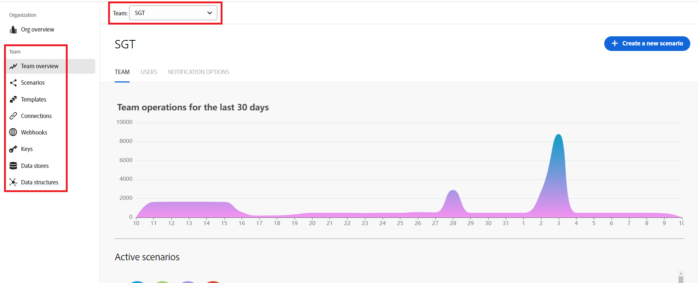

# Navegación por los paneles en Workfront Fusion

>[!IMPORTANT]
>
>La documentación de Adobe Workfront Fusion se ha trasladado a una nueva ubicación.
>
>La información de este artículo ahora se encuentra en el artículo:
>
>* [Navegar por Adobe Workfront Fusion](https://experienceleague.adobe.com/docs/workfront-fusion/using/get-started-with-fusion/navigate-workfront-fusion/navigate-workfront-fusion.html)
>
>Actualice sus marcadores.
>
>Este artículo ya no se actualiza y se eliminará en un futuro próximo.

Al iniciar sesión en Workfront Fusion, le lleva al panel de su organización. Desde aquí, puede navegar a diferentes áreas de Fusion haciendo clic en las áreas en la navegación izquierda.

Si no ve el panel de navegación izquierdo, haga clic en el icono del menú principal  en la esquina superior izquierda de la pantalla.

| Icono | Área | Descripción |
|---|---|---|
|  | Resumen de organización | Aquí puede ver información sobre su organización de Fusion. Puede ver el número de operaciones realizadas por los escenarios de esta organización, así como una lista de los escenarios activos. También puede ver listas del equipo, los usuarios y los entornos de esta organización. |
|  | Resumen del equipo | Aquí puede ver información sobre los equipos de Fusion, como el número de operaciones realizadas por los escenarios de este equipo y una lista de escenarios activos. También puede ver y administrar los usuarios de este equipo y establecer opciones de notificación para este. Cuando vea un equipo, puede seleccionar un equipo diferente en un menú desplegable de la parte superior de esta página. |
|  | Escenarios | Un escenario en Fusion representa un flujo de trabajo automatizado. Por ejemplo, un escenario puede supervisar las solicitudes entrantes de Workfront y convertirlas en proyectos, mientras que otro escenario puede generar imágenes, cargarlas en un proveedor de documentos y agregar tareas de aprobación a Workfront. La mayor parte de su trabajo en Fusion consiste en configurar y gestionar escenarios. En el área Escenarios, puede ver y organizar una lista de los escenarios de su equipo y seleccionar escenarios individuales para verlos o modificarlos. |
|  | Plantillas | Las plantillas son escenarios creados previamente que puede configurar para sus propios casos de uso. Aquí puede ver los escenarios públicos que proporciona Workfront Fusion, así como las plantillas creadas por su equipo. |
|  | Conexiones | Las conexiones contienen credenciales de inicio de sesión y permisos que permiten a Fusion interactuar con otras aplicaciones. Puede crear una conexión con un conjunto específico de credenciales y permisos para una aplicación específica y, a continuación, utilizar esa conexión en su escenario. El escenario puede acceder a los registros u otros datos disponibles para un usuario con esas credenciales y permisos y modificarlos. Puede crear varias conexiones para una aplicación y utilizar una conexión en varios escenarios. En el área Conexiones, puede ver y administrar una lista de conexiones configuradas por su equipo. |
|  | Webhooks | Los webhooks inspeccionan las aplicaciones en busca de cambios y luego inician un escenario basado en ese cambio. Por ejemplo, puede configurar un webhook para que inicie un escenario cuando se envíe un problema a un proyecto concreto de Workfront. En el área de Webhooks, puede ver una lista de webhooks configurados por su equipo y los escenarios en los que se utilizan. |
|  | Claves | Las claves públicas y privadas se utilizan para cifrar y descifrar datos. La clave pública se puede distribuir y cualquier persona que la tenga puede cifrar datos, pero solo la clave privada puede descifrarlos. Del mismo modo, un usuario con una clave privada podrá cifrar datos que cualquier persona que tenga la clave pública podrá descifrar. En el área Claves, puede ver y administrar las claves que posee su equipo. |
|  | Almacenes de datos | Los almacenes de datos son bases de datos pequeñas que existen fuera de los escenarios. Los almacenes de datos permiten transferir datos entre escenarios o entre ejecuciones independientes de un escenario. En el área Almacenes de datos, puede ver y administrar los almacenes de datos que son propiedad de su equipo. |
|  | Estructuras de datos | Las estructuras de datos describen el formato de los datos que se transfieren a Fusion y se utilizan normalmente para serializar o analizar formatos como JSON, XML y CSV. En las Estructuras de datos, puede ver y administrar las estructuras de datos que son propiedad de su equipo. |

>[!NOTE]
>
>En todas las áreas de la sección Equipo, puede ver los elementos de un equipo diferente haciendo clic en el nombre del equipo cerca de la parte superior de la página y seleccionando el nuevo equipo en el menú desplegable.
>
>

<!--
If you are an administrator, the following sections are available (Find out if these are visible, and if so, what they mean.)
Native apps | 
Apps | 
Organizations | 
All scenarios | 
All users |
-->

