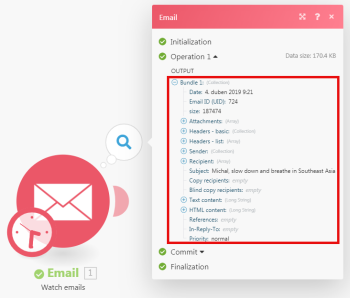

# Asignar información de un módulo a otro en [!DNL Adobe Workfront Fusion]

La asignación es el proceso de asignación de los resultados de un módulo, estructurados en elementos, a los campos de entrada de otro módulo.

El panel de asignación se muestra al hacer clic en un campo en el que desea insertar un valor generado desde un módulo anterior en un escenario. Dentro de un módulo, en cualquier campo disponible para asignación, puede crear una fórmula utilizando cualquier combinación de funciones y elementos asignados del panel de asignación con texto estático que escriba. Estos elementos se pueden anidar entre sí.

## Requisitos de acceso

Debe tener el siguiente acceso para utilizar la funcionalidad de este artículo:

<table style="table-layout:auto">
 <col> 
 <col> 
 <tbody> 
  <tr> 
    <td role="rowheader">[!DNL Adobe Workfront] plan*</td> 
   <td> 
[!DNL Pro] o superior
 </td> 
  </tr> 
  <tr data-mc-conditions=""> 
   <td role="rowheader">[!DNL Adobe Workfront] licencia*</td> 
   <td> 
[!UICONTROL Plan], [!UICONTROL Work]
 </td> 
  </tr> 
  <tr> 
   <td role="rowheader">Licencia de [!UICONTROL Adobe Workfront Fusion**</td> 
   <td> 
[!UICONTROL [!DNL Workfront Fusion] para integración y automatización de trabajo] 
  </td> 
  </tr> 
  <tr> 
   <td role="rowheader">Product</td> 
   <td>Su organización debe comprar [!DNL Adobe Workfront Fusion] así como [!DNL Adobe Workfront] para utilizar las funciones descritas en este artículo.</td> 
  </tr> 
 </tbody> 
</table>

Para saber qué plan, tipo de licencia o acceso tiene, póngase en contacto con su [!DNL Workfront] administrador.

Para obtener información sobre [!DNL Adobe Workfront Fusion] licencias, consulte [[!DNL Adobe Workfront Fusion] licencias](../../workfront-fusion/get-started/license-automation-vs-integration.md).

## Paquetes y elementos

El funcionamiento de un módulo produce cero, uno o más paquetes como salida. Un paquete consta de uno o más elementos.

Para explorar la salida de un módulo:

1. Haga clic en **[!UICONTROL Ejecutar una vez]** para ejecutar el módulo.
1. Haga clic en la burbuja situada encima del módulo.

   Aparece un registro que contiene todas las fases del módulo. Puede encontrar el paquete o paquetes que genera la fase de operación de un módulo en el **[!UICONTROL Salida]** encabezado. Cada paquete contiene sus elementos y los valores de cada elemento.

>[!INFO]
>
>**Ejemplo:** Este ejemplo muestra el módulo [!UICONTROL Correo electrónico] > [!UICONTROL Ver correos electrónicos]. Se puede ver que realizó una operación produciendo un solo paquete que contiene varios elementos como `Date`, `Email ID (UID)`, `size`, etc.
>
>

>[!NOTE]
>
>Los resultados de los módulos envueltos entre un [!UICONTROL Iterador] y [!UICONTROL Acumulador] no son accesibles más allá de [!UICONTROL Acumulador] módulo.

## Asignar un elemento

Después de crear una secuencia de módulos vinculando dos o más de ellos, cada módulo puede procesar los valores de los elementos generados por los módulos que la preceden.

Para asignar los elementos a los campos de entrada de un módulo:

1. Haga clic en el módulo que debe procesar la salida del módulo o módulos anteriores.
1. En el panel Configuración de módulo que aparece, haga clic en un campo en el que desee utilizar el valor de un elemento producido desde un módulo anterior.

   Se abre el panel de asignación.

1. Haga clic en un elemento del panel de asignación para insertarlo en el campo .
1. (Opcional) Para buscar un campo concreto en el panel de asignación, haga clic en la barra de búsqueda del panel de asignación y escriba el término que desee buscar. Haga clic en el campo cuando aparezca en la lista.

   Los resultados de la búsqueda contienen el término de búsqueda y no distinguen entre mayúsculas y minúsculas.

Para obtener más información, consulte [Configure las opciones de un módulo en [!DNL Adobe Workfront Fusion]](../../workfront-fusion/modules/configure-a-modules-settings.md).

## Fórmulas

Puede asignar varios elementos a un campo, combinarlos con literales (valores fijos) y utilizar Operadores y funciones para crear fórmulas complejas:

Puede encontrar las funciones y los operadores en el panel de asignación en una de sus pestañas.

La primera pestaña  (se muestra al abrir el panel) muestra los elementos que se pueden asignar desde otros módulos.

Las otras pestañas contienen los siguientes tipos de funciones:

* **Funciones generales**  - Consulte [Funciones generales en [!DNL Adobe Workfront Fusion]](../../workfront-fusion/functions/general-functions.md) para obtener más información.

* **Funciones matemáticas**  - Consulte [Funciones matemáticas en [!DNL Adobe Workfront Fusion]](../../workfront-fusion/functions/math-functions.md) para obtener más información.

* **Funciones de texto y binarias**  - Consulte [Funciones de cadena en [!DNL Adobe Workfront Fusion]](../../workfront-fusion/functions/string-functions.md) para obtener más información.

* **Fecha y hora**  - Consulte [Funciones de fecha y hora en [!DNL Adobe Workfront Fusion]](../../workfront-fusion/functions/date-and-time-functions.md) y los artículos siguientes para obtener más información.

   * [Tokens para el formato de fecha y hora en [!DNL Adobe Workfront Fusion]](../../workfront-fusion/functions/tokens-for-date-and-time-formatting.md)
   * [Tokens para el análisis de fecha y hora en Adobe Workfront Fusion](../../workfront-fusion/functions/tokens-for-date-and-time-parsing.md)

* **Funciones para trabajar con matrices**  - Consulte [Funciones de matriz en [!DNL Adobe Workfront Fusion]](../../workfront-fusion/functions/array-functions.md) para obtener más información.

>[!TIP]
>
>Cuando cree una fórmula compleja que desee reutilizarla en otro campo, puede hacer clic en el campo que contiene la combinación, utilizar Comando-A o Ctrl-A para seleccionarla y, a continuación, copiarla y pegarla en el otro campo.

Para obtener más información sobre la asignación de elementos mediante funciones, consulte [Asignación de elementos mediante funciones en [!DNL Adobe Workfront Fusion]](../../workfront-fusion/functions/map-using-functions.md).

## Colecciones

Algunos elementos pueden contener varios valores de varios tipos. Son elementos de tipo colección.

Puede identificar un [!UICONTROL colección] escriba elemento por el pequeño rectángulo negro mostrado a la derecha de la etiqueta del elemento y su lista expandida automáticamente de subelementos:

>[!NOTE]
>
>En la mayoría de los casos, se asignan los subelementos de la colección en lugar del elemento que representa toda la colección.

Para obtener más información sobre colecciones, consulte [Tipos de datos de elementos en [!UICONTROL Adobe Workfront Fusion]](../../workfront-fusion/mapping/item-data-types.md)

## Matrices

Algunos elementos pueden contener varios elementos del mismo tipo. Son elementos de tipo matriz.

Puede identificar un elemento de tipo de matriz mediante los corchetes al final de la etiqueta del elemento. Haga clic en el pequeño rectángulo negro a la derecha de la etiqueta del elemento para mostrar los elementos del elemento:

Para obtener más información sobre matrices, consulte [Tipos de datos de elementos en [!DNL Adobe Workfront Fusion]](../../workfront-fusion/mapping/item-data-types.md)

### Asignar el primer elemento de una matriz

Si asigna una matriz de `Recipient name` , se muestra en el campo de la siguiente manera:

El número entre corchetes es un índice que determina qué elemento de la matriz se utilizará. Se establece en 1 de forma predeterminada.

### Asignación del elemento n de una matriz

Si desea acceder a otro elemento, haga clic en los corchetes y edite el valor del índice:

### Asignación del elemento de una matriz con una clave determinada

Algunas matrices contienen varias colecciones con elementos clave y de valor. Normalmente son varios metadatos, atributos, etc.

El siguiente ejemplo muestra el resultado de la [!DNL Jira] Aplicación.

En este ejemplo, obtenemos un nombre de archivo de una matriz de archivos adjuntos para el archivo adjunto específico con un ID de 10108.

El resultado de [!DNL Jira] tiene este aspecto:

El requisito habitual es buscar un elemento por su valor de clave dado y obtener el valor correspondiente del elemento de valor. Esto se puede lograr con una fórmula que emplee una combinación de `map()` y `get()` funciones.

El siguiente es un desglose detallado de la fórmula:

1. El primer parámetro de la variable `map()` es el elemento de matriz completo.
1. El segundo parámetro es el nombre sin procesar del elemento de valor. Para obtener el nombre sin procesar, pase el ratón sobre el elemento de la sección [!UICONTROL asignación] panel:

   

   >[!NOTE]
   >
   >Todos los parámetros distinguen entre mayúsculas y minúsculas. Aunque en este ejemplo concreto la etiqueta del elemento difiere de su nombre sin procesar solo en mayúsculas, es necesario utilizar el nombre sin procesar, que es todo un valor en minúsculas en contraste con el valor de la etiqueta.

1. El tercer parámetro es el nombre sin procesar del elemento clave:

   

1. El cuarto parámetro es el valor de clave dado.

Porque la variable `map()` devuelve una matriz (ya que podría haber más elementos con el valor de clave dado), es necesario aplicar la variable `get()` para obtener su primer elemento:

* El primer parámetro de la variable `get()` es el resultado de la función `map()` función.

* El segundo parámetro es el índice del elemento: uno.

Para obtener más información sobre la variable `map()` función, consulte [Funciones de matriz en [!DNL Adobe Workfront Fusion]](../../workfront-fusion/functions/array-functions.md).

Para obtener más información sobre la variable `get()` función, consulte [Funciones generales en [!DNL Adobe Workfront Fusion]](../../workfront-fusion/functions/general-functions.md).

## Conversión de elementos en una serie de paquetes

Las matrices se pueden convertir en una serie de paquetes usando la variable [!UICONTROL Iterador] módulo. Para obtener más información, consulte [[!UICONTROL Iterador] módulo en [!UICONTROL Adobe Workfront Fusion]](../../workfront-fusion/modules/iterator-module.md).

## Resolución de problemas

### Elementos que faltan en el panel de asignación

Para cada módulo, el panel de asignación muestra todos los elementos de salida enumerados por el autor del módulo. En algunos casos, esta lista puede estar incompleta por varios motivos y es posible que falten algunos elementos. [!DNL Workfront Fusion] puede detectar automáticamente los elementos de salida que faltan cuando ejecuta el módulo en el editor de escenarios. El procedimiento exacto varía ligeramente según el tipo de módulo:

#### Déclencheur instantáneo

1. Haga clic con el botón derecho en el módulo y, a continuación, haga clic en **[!UICONTROL Ejecutar solo este módulo]** en el menú que se muestra.

   Si no hay enlaces web en cola, el módulo espera a que se procese un nuevo enlace web.

1. Genere un enlace web.

   Por ejemplo, el módulo de enlace web **[!DNL Slack]>[!UICONTROL Escuchar nuevos eventos]** (que busca nuevos mensajes de canal en un canal) envía un mensaje al canal.

1. Cuando el módulo termine de ejecutarse, haga clic en la burbuja situada encima del módulo para explorar su salida completa.

   El panel de asignación contiene todos los elementos que se descubrieron en la salida del módulo.

#### Déclencheur de sondeo

1. Haga clic con el botón derecho en el módulo y, a continuación, haga clic en **[!UICONTROL Ejecutar solo este módulo]** en el menú que se muestra.
1. Si no hay salida, haga clic en **[!UICONTROL Elija dónde empezar]** y ajustar la configuración.
1. Si no hay ningún evento que procesar, cree uno y vuelva al paso 2.

   Por ejemplo, el módulo de enlace web **[!UICONTROL Gmail] >[!UICONTROL Ver correos electrónicos]** envía un correo electrónico a la carpeta que está viendo el módulo.

1. Cuando el módulo termine de ejecutarse, haga clic en la burbuja situada encima del módulo para explorar su salida completa.

   El panel de asignación ahora contiene todos los elementos que se descubrieron en la salida del módulo.

#### Otros módulos

Puede elegir ejecutar:

* Todo el escenario (o solo la parte que contiene el módulo)

   Si el escenario comienza con un déclencheur, consulte la sección [Déclencheur instantáneo](#instant-trigger) o [Déclencheur de sondeo](#polling-trigger) sección anterior.

* Solo el módulo único

Si decide ejecutar solo el módulo único:

1. Haga clic con el botón derecho en el módulo y, a continuación, haga clic en **[!UICONTROL Ejecutar solo este módulo]** en el menú que aparece.
1. Proporcione valores de muestra para los elementos de entrada y haga clic en **[!UICONTROL OK]** .
1. Cuando el módulo termine de ejecutarse, haga clic en la burbuja situada encima del módulo para explorar su salida completa.

   El panel de asignación ahora contiene todos los elementos que se descubrieron en la salida del módulo.
