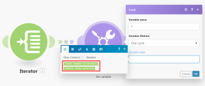

# Módulo [!UICONTROL Iterator] en [!DNL Adobe Workfront Fusion]

Un módulo [!UICONTROL Iterator] es un tipo especial de módulo que convierte una matriz en una serie de paquetes. Cada elemento de matriz se presenta como un paquete independiente.

Para obtener más información, consulte [Tipos de módulos](../../workfront-fusion/modules/module-types.md) y [Asignar una matriz en Adobe Workfront Fusion](../../workfront-fusion/mapping/map-an-array.md).

## Requisitos de acceso

Debe tener el siguiente acceso para utilizar la funcionalidad de este artículo:

<table style="table-layout:auto">
 <col> 
 <col> 
 <tbody> 
  <tr> 
    <td role="rowheader">[!DNL Adobe Workfront] plan*</td> 
   <td> 
[!DNL Pro] o superior
 </td> 
  </tr> 
  <tr data-mc-conditions=""> 
   <td role="rowheader">[!DNL Adobe Workfront] licencia*</td> 
   <td> 
[!UICONTROL Plan], [!UICONTROL Trabajo]
 </td> 
  </tr> 
  <tr> 
   <td role="rowheader">Licencia de [!UICONTROL Adobe Workfront Fusion]**</td> 
   <td>
   
Requisito de licencia actual: no se requiere licencia de [!DNL Workfront Fusion].

   
O

   
Requisito de licencia heredado: [!UICONTROL [!DNL Workfront Fusion] para automatización e integración de trabajo] 

   </td> 
  </tr> 
  <tr> 
   <td role="rowheader">Product</td> 
   <td>Su organización debe adquirir Adobe Workfront Fusion y Adobe Workfront para utilizar la funcionalidad que se describe en este artículo.</td> 
  </tr> 
 </tbody> 
</table>

Para saber qué plan, tipo de licencia o acceso tiene, póngase en contacto con su administrador de Workfront.

Para obtener información sobre [!DNL Adobe Workfront Fusion] licencias, consulte [[!DNL Adobe Workfront Fusion] licencias](../../workfront-fusion/get-started/license-automation-vs-integration.md).

## Configuración del módulo [!UICONTROL Iterator]

Configuró un módulo [!UICONTROL Iterator] igual que cualquier otro módulo. El campo [!UICONTROL Matriz] contiene la matriz que se va a convertir o dividir en paquetes separados.

Para obtener más información, consulte [Configuración de la configuración de un módulo en Adobe Workfront Fusion](../../workfront-fusion/modules/configure-a-modules-settings.md).

>[!INFO]
>
>**Ejemplos:**
>
>* El siguiente escenario muestra cómo recuperar correos electrónicos con archivos adjuntos y guardarlos como archivos únicos en una carpeta [!DNL Dropbox] seleccionada.
>
>   Los correos electrónicos pueden contener una matriz de archivos adjuntos. El módulo [!UICONTROL Iterator] insertado después del primer módulo le permitirá gestionar cada archivo adjunto por separado. El módulo [!UICONTROL Iterator] divide la matriz de archivos adjuntos en paquetes únicos. Cada paquete, con un archivo adjunto, se guarda de uno en uno en una carpeta [!DNL Dropbox] seleccionada. La configuración del módulo [!UICONTROL Iterator] se muestra arriba: el campo [!UICONTROL Array] debe contener la matriz `Attachments`.
>
>   
>
>* Para tu comodidad, muchas aplicaciones de [!DNL Workfront Fusion] ofrecen módulos [!UICONTROL Iterator] especializados con una configuración simplificada. Por ejemplo, la aplicación [!UICONTROL Email] contiene el módulo [!UICONTROL Email] > [!UICONTROL Iterator] especial que producirá los mismos resultados que el módulo [!UICONTROL Iterator] general.
>
>   

## Solución de problemas: el panel Asignación no muestra elementos asignables en el módulo [!UICONTROL Iterator]

Cuando un módulo [!UICONTROL Iterator] no tiene información sobre la estructura de los elementos de la matriz, el panel de asignación de los módulos que siguen al módulo [!UICONTROL Iterator] muestra solo 2 elementos bajo el módulo [!UICONTROL Iterator] :`Total number of bundles` y `Bundle order position`:

Esto se debe a que cada módulo es responsable de proporcionar información sobre los elementos que genera para que estos elementos se puedan mostrar correctamente en el panel de asignación en los módulos posteriores. Sin embargo, es posible que varios módulos no puedan proporcionar esta información en algunos casos; por ejemplo, [!UICONTROL JSON] > [!UICONTROL Analizar JSON] o [!UICONTROL Webhooks] > [!UICONTROL Webhook personalizado] módulos a los que les falta estructura de datos.

La solución es ejecutar manualmente el escenario para que el módulo obtenga información sobre los elementos que genera y pueda proporcionar la información a los siguientes módulos.

Por ejemplo, si tiene un módulo [!UICONTROL JSON] > [!UICONTROL Analizar JSON] sin una estructura de datos como se muestra a continuación:

Y entonces, si le conecta un módulo [!UICONTROL Iterator], no podrá asignar la salida del módulo al campo Array en el panel de configuración del módulo [!UICONTROL Iterator] :

Para resolver esto, inicie manualmente el escenario en el editor de escenarios. Puede desenlazar los módulos después del módulo [!UICONTROL JSON] > [!UICONTROL Analizar JSON] para evitar que el flujo continúe. O puede hacer clic con el botón derecho en el módulo [!UICONTROL JSON] > [!UICONTROL Analizar JSON] y elegir **[!UICONTROL Ejecutar este módulo solo]** del menú contextual para ejecutar solo el módulo [!UICONTROL JSON] > [!UICONTROL Analizar JSON].

Cuando se ejecuta [!UICONTROL JSON] > [!UICONTROL Analizar JSON], obtiene información sobre los elementos que genera y proporciona esta información a todos los módulos subsiguientes, incluido el módulo Iterator. A continuación, el panel de asignación de la configuración del iterador muestra los elementos:

Además, el panel de asignación de los módulos conectados después del módulo [!UICONTROL Iterator] muestra los elementos contenidos en los elementos de la matriz:

Si no puede ver algunos elementos en el panel de asignación de un módulo, ejecute el escenario una vez para que todos los módulos puedan obtener información sobre los elementos que generan y proporcionar esta información a los siguientes módulos.
