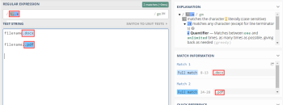

# Solución de problemas del analizador de texto en [!DNL Adobe Workfront Fusion]

Utilice esta información si no puede obtener un analizador de texto para producir ningún resultado.

## Requisitos de acceso

Debe tener el siguiente acceso para utilizar la funcionalidad de este artículo:

<table style="table-layout:auto">
 <col> 
 <col> 
 <tbody> 
  <tr> 
    <td role="rowheader">[!DNL Adobe Workfront] plan*</td> 
   <td> 
[!DNL Pro] o superior
 </td> 
  </tr> 
  <tr data-mc-conditions=""> 
   <td role="rowheader">[!DNL Adobe Workfront] licencia*</td> 
   <td> 
[!UICONTROL Plan], [!UICONTROL Work]
 </td> 
  </tr> 
  <tr> 
   <td role="rowheader">Licencia de [!UICONTROL Adobe Workfront Fusion**</td> 
   <td> 
[!UICONTROL [!DNL Workfront Fusion] para integración y automatización de trabajo] 
  </td> 
  </tr> 
  <tr> 
   <td role="rowheader">Product</td> 
   <td>Su organización debe comprar [!DNL Adobe Workfront Fusion] así como [!DNL Adobe Workfront] para utilizar las funciones descritas en este artículo.</td> 
  </tr> 
 </tbody> 
</table>

Para saber qué plan, tipo de licencia o acceso tiene, póngase en contacto con su [!DNL Workfront] administrador.

Para obtener información sobre [!DNL Adobe Workfront Fusion] licencias, consulte [[!DNL Adobe Workfront Fusion] licencias](../../workfront-fusion/get-started/license-automation-vs-integration.md).

## Resolución de problemas

Ejemplo de caso, le gustaría analizar el tipo de archivo de un documento de archivo &quot;filename.docx&quot; y la extensión del nombre de archivo siempre varía de DOCX a PDF a CSV.

La expresión que puede elegir utilizar en este caso es [!DNL \..+]

Si usara esto en la expresión regex en regex101.com obtendrá una coincidencia completa.

En la imagen anterior, la extensión del archivo era correctamente compatible. Si toma esto e intenta implementarlo en el analizador de texto:

no obtendrá una coincidencia:

El motivo es que la &quot;i&quot; muestra solo el número de coincidencias por coincidencia, por lo que en este caso, tenemos 2 coincidencias, por lo que después de la &quot;i&quot; hay un valor numérico 1 y 2. El caso de uso para esto es que si alguna vez necesita hacer coincidir o pasar datos a través de un filtro, solo el segundo valor coincidente puede especificar qué valor representa el valor numérico.

Para poder obtener los valores de coincidencia que necesita para agregar corchetes a la parte que desea analizar (por ejemplo, para extraer de &quot;filename.docx&quot; - &quot;docx&quot; solamente), entonces, según la expresión regex que estamos utilizando para este caso, los corchetes deben aplicarse en \.(.+)

Esto captura el DOCX, lo coloca en un grupo y deja el &quot;.&quot; de ahí.

En la salida mostrada en la imagen siguiente, el grupo de captura coincidirá con cualquier carácter (excepto con los caracteres de fin de línea).

Otra solución alternativa que también incorpora regex es el uso de la función de reemplazo

`{{replace("abcdefghijklmno pqr stuvw xyz.docx"; "/.\./"; ".")}}`

A continuación, sustituya `abcdefghijklmno pqr stuvw xyz.docx` con la variable de nombre de archivo real.
