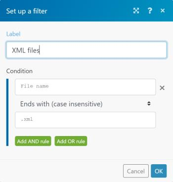

# Agregar un filtro a un escenario en [!DNL Adobe Workfront Fusion]

En algunos casos, solo debe trabajar con paquetes que cumplan criterios específicos. Los filtros le permiten seleccionar esos paquetes.

<!--

For example, you could create a scenario with the [!UICONTROL Watch records] trigger for [!DNL Salesforce] to capture only records containing a specific word written by a specific author.

-->

Puede añadir un filtro entre dos módulos y comprobar si los paquetes recibidos de los módulos anteriores cumplen condiciones de filtro específicas:

* Si es así, los paquetes pasan al siguiente módulo del escenario.
* Si no es así, el procesamiento de los paquetes finaliza.

## Requisitos de acceso

Debe tener el siguiente acceso para utilizar la funcionalidad de este artículo:

<table style="table-layout:auto">
 <col> 
 <col> 
 <tbody> 
  <tr> 
    <td role="rowheader">[!DNL Adobe Workfront] plan*</td> 
   <td> 
[!DNL Pro] o superior
 </td> 
  </tr> 
  <tr data-mc-conditions=""> 
   <td role="rowheader">[!DNL Adobe Workfront] licencia*</td> 
   <td> 
[!UICONTROL Plan], [!UICONTROL Trabajo]
 </td> 
  </tr> 
  <tr> 
   <td role="rowheader">Licencia de [!UICONTROL Adobe Workfront Fusion]**</td> 
  <td>
   
Requisito de licencia actual: no se requiere licencia de [!DNL Workfront Fusion].

   
O

   
Requisito de licencia heredado: [!UICONTROL [!DNL Workfront Fusion] para automatización e integración de trabajo], [!UICONTROL [!DNL Workfront Fusion] para automatización de trabajo]

   </td>    </tr> 
  </tr> 
  <tr> 
   <td role="rowheader">Product</td> 
   <td>
   
Requisito de producto actual: si tiene el plan [!UICONTROL Select] o [!UICONTROL Prime] [!DNL Adobe Workfront], su organización debe adquirir [!DNL Adobe Workfront Fusion] así como [!DNL Adobe Workfront] para utilizar la funcionalidad descrita en este artículo. [!DNL Workfront Fusion] está incluido en el plan [!DNL Workfront] de [!UICONTROL Ultimate].

   
O

   
Requisito de productos heredados: su organización debe comprar [!DNL Adobe Workfront Fusion] y [!DNL Adobe Workfront] para utilizar la funcionalidad descrita en este artículo.

   </td> 
  </tr> 
 </tbody> 
</table>

Para saber qué plan, tipo de licencia o acceso tiene, póngase en contacto con el administrador de [!DNL Workfront].

Para obtener información sobre [!DNL Adobe Workfront Fusion] licencias, consulte [[!DNL Adobe Workfront Fusion] licencias](../../workfront-fusion/get-started/license-automation-vs-integration.md).

## Requisitos previos

Debe agregar ambos módulos a un escenario para poder agregar un filtro entre ellos.

## Añada un filtro entre dos módulos:

1. Haga clic en **[!UICONTROL Escenarios]**  en el panel izquierdo y, a continuación, seleccione el escenario para abrirlo.
1. En la esquina superior derecha de la ventana, haga clic en **[!UICONTROL Editar]**.
1. Haga clic en la línea de conexión entre los módulos.
1. En el cuadro que se muestra, escriba una **[!UICONTROL Etiqueta]** para el filtro.
1. Defina un filtro **[!UICONTROL Condición]**.

   Puede introducir uno o dos operandos en los dos cuadros. Si se introducen operandos en ambos cuadros, se puede seleccionar un operador en el menú desplegable situado entre ellos para especificar la relación entre ellos.

   >[!TIP]
   >
   >En los campos de operando, puede escribir valores del mismo modo que los asignaría, tal como se describe en [Asignar información de un módulo a otro en [!DNL Adobe Workfront Fusion]](../../workfront-fusion/mapping/map-information-between-modules.md).

   Por ejemplo, si desea que el filtro busque archivos en [!DNL Adobe Workfront] que terminen con XML y los pase a [!DNL Dropbox], debe escribir **[!UICONTROL Nombre de archivo]** en el primer cuadro y .**[!UICONTROL xml]** en el segundo cuadro. En el menú desplegable que hay entre ellos, debe seleccionar **[!UICONTROL Finaliza con (sin distinción de mayúsculas y minúsculas)]**. Este filtro se aplicaría a los paquetes entrantes del primer módulo (Workfront). Solo los paquetes que contengan archivos XML pasarán al siguiente módulo ([!DNL Dropbox]).

   

1. Haga clic en **[!DNL OK]**.

## Copiar un filtro

Actualmente, el editor de escenarios no incluye una función para copiar un filtro.

>[!NOTE]
>
>Si copia los módulos a ambos lados del filtro, también se copia el filtro.
>
>Para obtener más información sobre cómo copiar módulos, consulte [Copiar módulos o escenarios en [!DNL Adobe Workfront Fusion]](../../workfront-fusion/scenarios/copy-modules-or-scenarios.md)

Para copiar un filtro sin copiar módulos, puede usar [!DNL Google] Chrome para la siguiente solución:

1. Instale la extensión [!UICONTROL [!DNL Adobe Workfront Fusion] DevTool Chrome].
1. En [!DNL Workfront Fusion], abra el escenario.
1. Haga clic en el menú de tres puntos de Chrome y, a continuación, haga clic en **[!UICONTROL Más herramientas*]* > **[!UICONTROL Herramientas para desarrolladores]**.

1. En el panel [!UICONTROL Herramientas para desarrolladores] que se muestra, en la barra de menús de la parte superior, haga clic en la ficha [!UICONTROL Workfront Fusion].

   

1. Haga clic en el icono **[!UICONTROL Herramientas]**  en la barra lateral izquierda.

1. Haga clic en **[!UICONTROL Copiar filtro]** y, a continuación, configure la herramienta **[!UICONTROL Copiar filtro]** en el panel derecho:

   1. Establezca el **[!UICONTROL módulo de Source]** como el módulo justo después del filtro que desea copiar.
   1. Establezca **[!UICONTROL Target Module]** como el módulo justo antes del filtro que desea copiar.

1. Haga clic en **[!UICONTROL Ejecutar]**.
