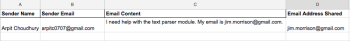

# [!DNL Adobe Workfront Fusion] ejemplo de escenario: Conectar correo electrónico, [!UICONTROL Analizador de texto], y [!DNL Google Sheets]

Este escenario le ayuda a crear un registro de todos los mensajes de correo electrónico y a etiquetarlos para realizar más acciones en una hoja de cálculo. Registra un cuerpo del correo electrónico en dos tablas independientes en una hoja de cálculo utilizando expresiones regulares (Regex) como patrones de búsqueda. El primer patrón busca una frase y el segundo busca la misma frase y una dirección de correo electrónico.

## Requisitos de acceso

Debe tener el siguiente acceso para utilizar la funcionalidad de este artículo:

<table style="table-layout:auto"> 
 <col> 
 <col> 
 <tbody> 
  <tr> 
    <td role="rowheader">[!DNL Adobe Workfront] plan*</td> 
   <td> 
[!DNL Pro] o superior
 </td> 
  </tr> 
  <tr data-mc-conditions=""> 
   <td role="rowheader">[!DNL Adobe Workfront] licencia*</td> 
   <td> 
[!UICONTROL Plan], [!UICONTROL Trabajo]
 </td> 
  </tr> 
  <tr> 
   <td role="rowheader">Licencia de [!UICONTROL Adobe Workfront Fusion]**</td> 
   <td>
   
Requisito de licencia actual: No [!DNL Workfront Fusion] requisito de licencia.

   
O

   
Requisito de licencia heredada: [!UICONTROL [!DNL Workfront Fusion] para automatización e integración de trabajo] 

   </td> 
  </tr> 
  <tr> 
   <td role="rowheader">Product</td> 
   <td>
   
Requisito actual del producto: si tiene [!UICONTROL Select] o [!UICONTROL Prime] [!DNL Adobe Workfront] Plan, su organización debe comprar [!DNL Adobe Workfront Fusion] así como [!DNL Adobe Workfront] para utilizar la funcionalidad descrita en este artículo. [!DNL Workfront Fusion] está incluido en [!UICONTROL Ultimate] [!DNL Workfront] plan.

   
O

   
Requisito de productos heredados: su organización debe comprar [!DNL Adobe Workfront Fusion] así como [!DNL Adobe Workfront] para utilizar la funcionalidad descrita en este artículo.

   </td> 
  </tr> 
 </tbody> 
</table>

Para saber qué plan, tipo de licencia o acceso tiene, póngase en contacto con su [!DNL Workfront] administrador.

Para obtener información sobre [!DNL Adobe Workfront Fusion] licencias, consulte [[!DNL Adobe Workfront Fusion] licencias](../../workfront-fusion/get-started/license-automation-vs-integration.md).

## Requisitos previos

Este tutorial requiere conocimientos básicos de expresiones regulares. Para obtener más información sobre Regex, visite [https://regexone.com](https://regexone.com/).

Añadir el primer módulo y configurarlo

1. Busque Correo electrónico y elija **[!UICONTROL Ver correos electrónicos]** como el Déclencheur.

   >[!NOTE]
   >
   >Mientras que puede conectar un [!DNL Google] cuenta que utiliza elmódulo de correo, también puede utilizar un [!DNL Gmail] módulo.

1. Conecte un [!DNL Google] o cualquier otro cliente de correo electrónico basado en IMAP (como [!DNL Outlook]).
1. Una vez conectado, seleccione una carpeta cuyos correos electrónicos entrantes desee ver, como [!UICONTROL Bandeja de entrada].
1. En [!UICONTROL Criterios], elija **[!UICONTROL Todos los correos electrónicos]** (o reduzca para leer o no leer correos electrónicos).

   También puede elegir marcar los correos electrónicos recuperados como leídos o no leídos.

1. Configure las variables [!UICONTROL Número máximo de resultados] a 1.

   

   Puede cambiar esto en función del volumen de mensajes que reciba. Sin embargo, se recomienda establecer un valor bajo y ejecutar el escenario con más frecuencia.

1. Clic **[!UICONTROL Mostrar configuración avanzada]** en la parte inferior.

   

1. Filtrar correos electrónicos por [!UICONTROL Dirección del remitente], [!UICONTROL Asunto] y [!UICONTROL Frase].

   Esto le permite ver solo los correos electrónicos relevantes. En este ejemplo, solo hemos agregado un filtro Asunto y dejado los otros 2 en blanco.

   >[!NOTE]
   >
   >Agregaremos un enrutador para buscar frases en un correo electrónico utilizando [!UICONTROL Patrón de coincidencia] iterador y una expresión regular (Regex) como patrón de búsqueda. Esto también nos permite crear un escenario de varias utilidades.

1. Una vez que la configuración haya finalizado y se le pida que especifique dónde comenzar a ver los correos electrónicos, haga clic en **[!DNL From now on]**.

   

1. Continuar a [Buscar por [!UICONTROL Control de flujo] y añada un [!UICONTROL Enrutador]](#search-for-flow-control-and-add-a-router)

## Buscar por [!UICONTROL Control de flujo] y añada un [!UICONTROL Enrutador]

1. Agregue un enrutador después de cualquier módulo para dividir o duplicar los datos antes de enviarlos al siguiente módulo.

   Aquí, se ha utilizado un [!UICONTROL Enrutador] para enviar el texto del cuerpo del correo electrónico a 2 tablas independientes en una [!DNL Google Sheet].

   

## Utilice el [!UICONTROL Analizador de texto] Módulo

1. Añadir un [!UICONTROL Patrón de coincidencia] para buscar una frase en un correo electrónico.

   Buscaremos la frase &quot;[!UICONTROL módulo de analizador de texto]&quot; en todos los correos electrónicos entrantes para capturar el texto del cuerpo y el nombre del remitente de los que coinciden con esa frase.

   1. Escriba el motivo como expresión regular:

      text\sparser\smodule

   1. (Opcional) Utilice cualquiera de las demás opciones de Patrón.

      

      Multiline es útil si el texto contiene varias líneas y necesita buscar el patrón en cada línea. Para este tutorial necesitamos buscar el patrón en todo el texto del cuerpo del correo electrónico, por lo tanto lo dejaremos sin marcar.

   1. En el [!UICONTROL Texto] , haga clic en el atributo **Contenido de texto** en la lista.

      

      Este es el atributo que almacena el texto del cuerpo del correo electrónico en el que buscaremos el patrón.

1. Añadir otro [!UICONTROL Patrón de coincidencia] que busca la misma frase y una dirección de correo electrónico.

   Esto resulta especialmente útil si tiene cuentas de cliente con varios usuarios. Para ahorrar tiempo, puede clonar el [!UICONTROL Analizador de texto] módulo que acaba de crear y lo vincula al enrutador.

   

1. Edite el patrón de la siguiente manera:

   text\sparser\smodule.+\s()[\w.-]+@[\w.-]+)

   

   Este patrón busca la frase &quot;[!UICONTROL módulo de analizador de texto]&quot; y una dirección de correo electrónico como john.doe@gmail.com y solo devuelve la dirección de correo electrónico.

   >[!NOTE]
   >
   >Es importante escribir su regex de acuerdo con la especificación de las direcciones de correo electrónico que acepta, pero la anterior se encarga de la mayoría de las direcciones de correo electrónico estándar.

   * Si desea buscar solo direcciones de correo electrónico, puede utilizar la regex a continuación:

     ([\w.-]+@[\w.-]+)

   * También puede buscar solo números de teléfono usando la regex a continuación:

     ^[+]?\(?(\d{1,3})\)?[\s-]?\(?(\d{3})\)?[\s-]?\d{3}[\s-]?\d{3,4}
El patrón anterior cubre los formatos más comunes en los que se escribe un número de teléfono.

   Para probar los patrones, recomendamos utilizar [[!DNL https://regex101.com]](https://regex101.com/) con [!DNL javascript] como el Sabor.

   El resto de la configuración sigue siendo la misma que la anterior.

## Añada el [!DNL Google Sheets] módulos

Para [!DNL Sheets], primero debemos crear una hoja de cálculo con los encabezados requeridos.

1. Cree una hoja de cálculo con las columnas en las que desee capturar los datos del usuario. (No dude en utilizar un archivo existente también).

   Por ejemplo, cree uno llamado &quot;Datos de correo electrónico: vale de asistencia&quot; con el nombre del remitente, el correo electrónico del remitente y el contenido de correo electrónico como columnas. Asigne un nombre a la hoja de cálculo &quot;contiene: módulo analizador de texto&quot;.

1. Añada el [!UICONTROL Hojas de Google] módulo con **[!UICONTROL Añadir una fila]** como la acción.

   

1. Conecte su [!DNL Google] cuenta de (si aún no lo ha hecho). Elija el archivo que creó anteriormente, seguido de la hoja de cálculo en la que está capturando los datos.

   La configuración debería ser similar a la siguiente:

   

1. Asigne los atributos en los campos relevantes (columnas) para finalizar la configuración del módulo.

   

1. Clone el módulo que acaba de crear y vincúlelo al segundo [!UICONTROL Analizador de texto] módulo.

   1. Vaya a la hoja de cálculo, duplique la hoja de cálculo que creó anteriormente y asígnele un nombre.

      Por ejemplo, asígnele el nombre &quot;contiene: módulo de analizador de texto y correo electrónico&quot;.

   1. Añada otra columna para almacenar la dirección de correo electrónico que contiene el cuerpo del correo electrónico.

      Por ejemplo, asígnele el nombre &quot;Dirección de correo electrónico compartida&quot;.

   1. Haga clic en el clonado [!DNL Google Sheets] para configurar la configuración.
   1. Cambie la hoja de cálculo por la nueva que acaba de crear.
   1. Asigne el resultado desde el [!UICONTROL Patrón de coincidencia] ($1) a la columna donde desea almacenar la dirección de correo electrónico (Dirección de correo electrónico compartida).

      

      

   1. Clic **[!UICONTROL OK]**, guarde el escenario y tómelo para una ejecución de prueba.

      Deberá enviar dos correos electrónicos independientes a la dirección de correo electrónico conectada de la siguiente manera:

      * Que contenga la frase &quot;[!UICONTROL módulo de analizador de texto]&quot; (y sin dirección de correo electrónico)

        

      * Que contenga la frase anterior y una dirección de correo electrónico

        

        Si no hay errores en la configuración, verá que la primera hoja de cálculo captura todos los correos electrónicos que contienen la frase &quot;[!UICONTROL módulo de analizador de texto]&quot; mientras que la segunda hoja de cálculo captura únicamente las que contienen la frase &quot;[!UICONTROL módulo de analizador de texto]&quot; y una dirección de correo electrónico. Puede consultar las capturas de pantalla a continuación.

        Hoja 1:

        

        Hoja 2:

        

## Recursos

* [Ejercicios gratuitos](https://regexone.com/) para obtener más información sobre las expresiones regulares
* [Más información sobre la Coincidencia de números de teléfono](https://regexone.com/problem/matching_phone_numbers) uso de Regex
* [Obtenga información sobre la coincidencia de correo electrónico](https://regexone.com/problem/matching_emails) uso de Regex
* [Prueba de las expresiones regulares](https://regex101.com/)
