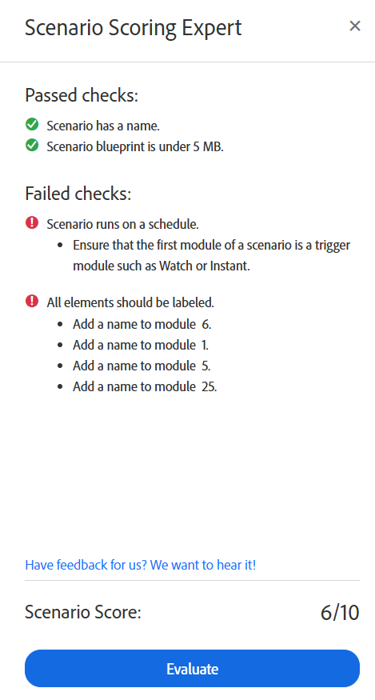

# Ejecutar el experto en puntuación de escenarios en Adobe Workfront Fusion

El experto en puntuación de escenarios puede ayudarle a garantizar que su escenario se configura de una manera que siga las prácticas recomendadas. Comprueba el escenario y ofrece recomendaciones para su estructura y organización.

## Requisitos de acceso

Para utilizar la funcionalidad de este artículo debe tener el siguiente acceso:

<table style="table-layout:auto">  
 <col> 
 <col> 
 <tbody> 
  <tr> 
    <td role="rowheader">[!DNL Adobe Workfront] plan*</td> 
   <td> 
[!DNL Pro] o superior
 </td> 
  </tr> 
  <tr data-mc-conditions=""> 
   <td role="rowheader">[!DNL Adobe Workfront] licencia*</td> 
   <td> 
[!UICONTROL Plan], [!UICONTROL Work]
 </td> 
  </tr> 
  <tr> 
   <td role="rowheader">Licencia** de [!UICONTROL Adobe Workfront Fusion]</td> 
  <td> 
[!UICONTROL [!DNL Workfront Fusion] for Work Automation and Integration] 

[!UICONTROL [!DNL Workfront Fusion] for Work Automation] 
  </td>    </tr> 
  </tr> 
  <tr> 
   <td role="rowheader">Producto</td> 
   <td>Su organización debe adquirir [!DNL Adobe Workfront Fusion], así como [!DNL Adobe Workfront], para usar la funcionalidad descrita en este artículo.</td> 
  </tr> 
 </tbody> 
</table>

Para saber qué plan, tipo de licencia o acceso tiene, póngase en contacto con el administrador de [!DNL Workfront].

Para obtener información sobre [!DNL Adobe Workfront Fusion] licencias, consulte [[!DNL Adobe Workfront Fusion] licencias](../../workfront-fusion/get-started/license-automation-vs-integration.md).

Ejecutar el experto en puntuación de escenarios

1. Haga clic en la ficha **[!UICONTROL Escenario]** en el panel izquierdo.
1. Seleccione el escenario en el que quiere ejecutar el Experto en puntuación de escenarios.
1. Haga clic en cualquier lugar del escenario para introducir el Editor de escenarios.
1. Haga clic en el icono de Scenario Scoring Expert  cerca de la parte inferior de la pantalla.

   Se abrirá el panel Experto en puntuación de escenarios.
1. Haga clic en **Evaluar**.

El experto en puntuación de escenarios devuelve una puntuación de 10 y muestra qué comprobaciones han pasado o fallado. Si una comprobación ha fallado, el experto en puntuación de escenarios ofrece recomendaciones para asegurarse de que el escenario cumpla estas comprobaciones.

## Comprobaciones de puntuación de escenario

El experto en puntuación de escenarios utiliza las siguientes comprobaciones:

* El escenario debe llamarse.
* Todos los módulos deben estar etiquetados.
* El escenario debe ejecutarse en una programación establecida.

  Para obtener instrucciones, consulte [Programar un escenario](/help/quicksilver/workfront-fusion/scenarios/schedule-a-scenario.md).
* El tamaño del modelo de escenario debe ser inferior a 5 MB.

  Para obtener más información, consulte [Protecciones de rendimiento de Fusion](/help/quicksilver/workfront-fusion/get-started/fusion-performance-guardrails.md#scenarios).
* Si se utiliza un módulo de déclencheur instantáneo de Workfront, debe filtrarse.

  Para obtener instrucciones, consulte [Filtros de suscripción de eventos en el módulo [!DNL Workfront] > [!UICONTROL Ver eventos]](/help/quicksilver/workfront-fusion/apps-and-their-modules/workfront-modules.md#event-subscription-filters-in-the-workfront--watch-events-module).

