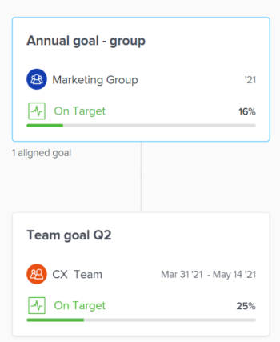

# Alinear objetivos conectándolos en los objetivos de Adobe Workfront

Si es un colaborador individual que tiene un objetivo personal, puede que desee alinearlo con los objetivos de su equipo para mostrar de forma eficaz el progreso de su propio objetivo en el contexto más amplio de la estrategia de su organización.

Cuando todos los miembros de su organización tienen sus objetivos alineados con los objetivos de su organización, pueden ver claramente cómo sus contribuciones individuales y los esfuerzos del equipo ayudan a hacer avanzar la aguja en prioridades más grandes a nivel de la empresa. Para obtener más información sobre las prácticas recomendadas para alinear objetivos, consulte [Información general sobre la alineación de objetivos en los objetivos de Adobe Workfront](../../workfront-goals/goal-alignment/goal-alignment-overview.md).

Existen dos enfoques para conectar objetivos en los objetivos de Adobe Workfront:

* Puede crear alineación entre objetivos conectando objetivos entre sí.

* Puede alinear manualmente dos objetivos o puede convertir los resultados y las actividades de un objetivo existente en otro objetivo. El resultado o la actividad convertidos se convierte en el objetivo secundario del objetivo original.

>[!IMPORTANT]
>
>Un objetivo puede tener un total de 1000 indicadores de progreso.

Este artículo describe cómo se pueden alinear los objetivos conectándolos entre sí. Para obtener información sobre la alineación de objetivos mediante la conversión de resultados y actividades en objetivos, consulte [Alinear objetivos convirtiendo resultados y actividades en objetivos](../../workfront-goals/goal-alignment/align-goals-by-converting-results-activities.md).

## Requisitos de acceso

<!--drfated for the P&P release: 

You must have the following:

<table style="table-layout:auto">
 <col>
 </col>
 <col>
 </col>
 <tbody>
  <tr>
   <td role="rowheader">Adobe Workfront plan*</td>
   <td>
   
Current plan: Select or higher

   Or
   
Legacy plan: Pro or higher

   
   </td>
  </tr>
  <tr>
   <td role="rowheader">Adobe Workfront license*</td>
   <td>
   
Current license: Contributor or higher

   Or
   
Legacy license: Request or higher
 
For more information, see <a href="../../administration-and-setup/add-users/access-levels-and-object-permissions/wf-licenses.md" class="MCXref xref">Adobe Workfront licenses overview</a>.
 </td>
  </tr>
  <tr>
   <td role="rowheader">Product</td>
   <td>
   
 Current product requirement: If you have the Select or Prime Adobe Workfront plan, you must also buy an additional Adobe Workfront Goals license.  Workfront Goals are included in the Ultimate Workfront Plan.

   Or
   
Legacy product requirement: You must purchase an additional license for the Adobe Workfront Goals to access functionality described in this article. 
 
For information, see <a href="../../workfront-goals/goal-management/access-needed-for-wf-goals.md" class="MCXref xref">Requirements to use Workfront Goals</a>. 
 </td>
  </tr>
  <tr>
   <td role="rowheader">Access level*</td>
   <td> 
Edit access to Goals
 
<b>NOTE</b>
If you still don't have access, ask your Workfront administrator if they set additional restrictions in your access level. For information on how a Workfront administrator can change your access level, see:

     <ul>
      <li> 
<a href="../../administration-and-setup/add-users/configure-and-grant-access/create-modify-access-levels.md" class="MCXref xref">Create or modify custom access levels</a> 
 </li>
      <li> 
<a href="../../administration-and-setup/add-users/configure-and-grant-access/grant-access-goals.md" class="MCXref xref">Grant access to Adobe Workfront Goals</a> 
 </li>
     </ul> 
 </td>
  </tr>
  <tr data-mc-conditions="">
   <td role="rowheader">Object permissions</td>
   <td>
    

     
View or higher permissions to the goal to view it

     
Manage permissions to the goal to edit it

     
For information about sharing goals, see <a href="../../workfront-goals/workfront-goals-settings/share-a-goal.md" class="MCXref xref">Share a goal in Workfront Goals</a>. 

    
 </td>
  </tr>
 </tbody>
</table>

-->

Debe tener lo siguiente:

<table style="table-layout:auto"> 
 <col> 
 <col> 
 <tbody> 
  <tr> 
   <td role="rowheader">plan de Adobe Workfront*</td> 
   <td> 
Pro o superior
 </td> 
  </tr> 
  <tr> 
   <td role="rowheader">Licencia de Adobe Workfront*</td> 
   <td> 
Solicitud o superior
 
Para obtener más información, consulte <a href="../../administration-and-setup/add-users/access-levels-and-object-permissions/wf-licenses.md" class="MCXref xref">Información general sobre las licencias de Adobe Workfront</a>.
 </td> 
  </tr> 
  <tr> 
   <td role="rowheader">Product</td> 
   <td> 
Debe adquirir una licencia adicional para los objetivos de Adobe Workfront para acceder a la funcionalidad que se describe en este artículo. 
 
Para obtener más información, consulte <a href="../../workfront-goals/goal-management/access-needed-for-wf-goals.md" class="MCXref xref">Requisitos para utilizar los objetivos de Workfront</a>. 
 </td> 
  </tr> 
  <tr> 
   <td role="rowheader">Configuraciones de nivel de acceso*</td> 
   <td> 
Editar acceso a Objetivos
 
<b>NOTA</b>

Si todavía no tiene acceso, pregunte a su administrador de Workfront si establece restricciones adicionales en su nivel de acceso. Para obtener información sobre cómo un administrador de Workfront puede cambiar su nivel de acceso, consulte:
 
     <ul> 
      <li> 
<a href="../../administration-and-setup/add-users/configure-and-grant-access/create-modify-access-levels.md" class="MCXref xref">Crear o modificar niveles de acceso personalizados</a> 
 </li> 
      <li> 
<a href="../../administration-and-setup/add-users/configure-and-grant-access/grant-access-goals.md" class="MCXref xref">Conceder acceso a los objetivos de Adobe Workfront</a> 
 </li> 
     </ul> 
 </td> 
  </tr> 
  <tr data-mc-conditions=""> 
   <td role="rowheader">Permisos de objeto</td> 
   <td> 
    
 
     
Administrar permisos para el objetivo
 
     
Para obtener información sobre cómo compartir objetivos, consulte <a href="../../workfront-goals/workfront-goals-settings/share-a-goal.md" class="MCXref xref">Compartir un objetivo en los objetivos de Workfront</a>. 
 
    
 </td> 
  </tr> 
 </tbody> 
</table>

*Para saber qué plan, tipo de licencia o acceso tiene, póngase en contacto con el administrador de Workfront.

## Requisitos previos

Debe tener lo siguiente para poder iniciar:

* Plantilla de diseño que incluye el área Objetivos del menú principal.

## Alinear objetivos conectándolos entre sí

<!--
Aligning goals by connecting them differs depending on what environment you use. 

### Align goals by connecting them in the Production environment

1. Create two goals that you want to align. For information about creating goals, see [Create goals in Adobe Workfront Goals](../../workfront-goals/goal-management/create-goals.md).
1. (Optional) Activate the goals that you want to align. You can align goals that have a Draft, Active, or Inactive status. For information about activating goals, see [Activate goals in Adobe Workfront Goals](../../workfront-goals/goal-management/activate-goals.md).
1. Go to the goal that you want to align (child goal) to another goal (parent goal) and click its name to open the **Goal Details** panel.

   For example, if you want Goal 2 to influence the progress of Goal 1, you must go to Goal 2. 

1. Click **Align to another goal** in the upper-right corner of the right panel.

   

1. Start typing the name of an existing goal or the name of an owner in the **Align to another goal** field, then select it when it appears in the list. Only goals that are from the same or future periods display in the list. 
1. Click **Save**.

   The goal you started with (Goal 2) is now the child goal of the goal you aligned it with (Goal 1).   
   The aligned goals display connected in the Goal Alignment section with Goal 2 as secondary to Goal 1.

   

1. (Optional) To view the goals in the Goal Alignment section, do one of the following:

   * Click the Goal Alignment section in the left panel and find the goals by applying the correct filter. For information about filtering information in Workfront Goals, see [Filter information in Adobe Workfront Goals](../../workfront-goals/goal-management/filter-information-wf-goals.md).
   * Click the Goal List, Check-in, or Pulse sections in the left panel and find one of the goals, then click the **Alignment icon**  next to the goal name to go directly to the goal in the Goal Alignment section.

   For information about the Goal Alignment section, see [Navigate the Goal Alignment section in Adobe Workfront Goals](../../workfront-goals/goal-alignment/navigate-goal-alignment-chart.md). 

1. (Optional) Add activities and results to either goal to indicate their progress. For information about adding activities and results, see the following articles:

   * [Add activities to goals in Adobe Workfront Goals](../../workfront-goals/results-and-activities/add-activities-to-goals.md) 
   * [Add results to goals in Adobe Workfront Goals](../../workfront-goals/results-and-activities/add-results-to-goals.md)

1. (Optional) Remove the alignment between two goals, when you consider that no longer is relevant to your organization's overall strategy For information about removing alignment between goals, see [Remove goal alignment in Adobe Workfront Goals](../../workfront-goals/goal-alignment/remove-goal-alignment.md).

-->
1. Cree dos objetivos que desee alinear. Para obtener información sobre la creación de objetivos, consulte [Crear objetivos en objetivos de Adobe Workfront](../../workfront-goals/goal-management/create-goals.md).
1. (Opcional) Active los objetivos que desea alinear. Puede alinear los objetivos que tengan un estado Borrador, Activo o Inactivo. Para obtener información sobre la activación de objetivos, consulte [Activar objetivos en objetivos de Adobe Workfront](../../workfront-goals/goal-management/activate-goals.md).
1. Vaya al objetivo que desea alinear (objetivo secundario) con otro objetivo (objetivo principal) y haga clic en su nombre para abrir la página de objetivo.

   >[!INFO]
   >
   >Por ejemplo, si desea que el Objetivo 2 influya en el progreso del Objetivo 1, debe ir al Objetivo 2.

1. Haga clic en **Detalles del objetivo** en el panel izquierdo.

1. En el **Información del objetivo principal** área, haga clic en **Agregar** en el **Objetivo principal** campo si no hay ningún objetivo principal,

   O

   Haga clic en el nombre del objetivo principal para elegir otro.

1. Empiece a escribir el nombre de un objetivo existente en la sección **Objetivo principal** y, a continuación, selecciónelo cuando aparezca en la lista. En la lista solo se muestran los objetivos que pertenecen al mismo período o a períodos futuros.

1. Haga clic en **Guardar cambios**.

   El objetivo con el que empezaste (Objetivo 2) es ahora el objetivo secundario del objetivo principal con el que lo alineaste (Objetivo 1).\
   Los objetivos alineados se muestran conectados en la sección Alineación de objetivos con el Objetivo 2 como secundario al Objetivo 1.
El objetivo secundario se muestra en la sección Indicadores de progreso del objetivo principal a medida que su progreso actualiza el progreso del objetivo principal.

   

1. (Opcional) Para ver los objetivos en la sección Alineación de objetivos , vaya al área Objetivos de Workfront y haga clic en el **Alineación de objetivos** en el panel izquierdo. Para obtener información sobre la sección Alineación de objetivo , consulte [Vaya a la sección Alineación de objetivos en Objetivos de Adobe Workfront](../../workfront-goals/goal-alignment/navigate-goal-alignment-chart.md).

1. (Opcional) Añada actividades y resultados a cualquiera de los objetivos para indicar su progreso. Para obtener información sobre la adición de actividades y resultados, consulte los siguientes artículos:

   * [Agregar actividades a objetivos en Objetivos de Adobe Workfront](../../workfront-goals/results-and-activities/add-activities-to-goals.md)
   * [Agregar resultados a objetivos en Objetivos de Adobe Workfront](../../workfront-goals/results-and-activities/add-results-to-goals.md)

1. (Opcional) Elimine la alineación entre dos objetivos, cuando considere que ya no es relevante para la estrategia general de su organización. Para obtener información sobre cómo quitar la alineación entre objetivos, consulte [Eliminar la alineación de objetivos en los objetivos de Adobe Workfront](../../workfront-goals/goal-alignment/remove-goal-alignment.md).

