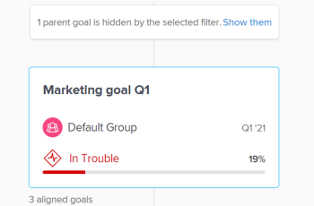

# Vaya a la sección Alineación de objetivos en Objetivos de Adobe Workfront

Utilice la sección Alineación de objetivos para mostrar una vista holística de la alineación de objetivos en toda la organización en un diagrama de flujo. Los objetivos alineados se muestran en tarjetas que se interconectan en un árbol jerárquico.

Para obtener información sobre la alineación de objetivos y cómo conseguirla, consulte también los siguientes artículos:

* [Información general sobre la alineación de objetivos en los objetivos de Adobe Workfront](../../workfront-goals/goal-alignment/goal-alignment-overview.md)
* [Alinear objetivos conectándolos en los objetivos de Adobe Workfront](../../workfront-goals/goal-alignment/align-goals-by-connecting-them.md)

## Requisitos de acceso

<!-- drafted for P&P release: 

You must have the following to perform the activities described in this article:

<table style="table-layout:auto">
 <col>
 </col>
 <col>
 </col>
 <tbody>
  <tr>
   <td role="rowheader">Adobe Workfront plan*</td>
   <td>
   
Current plan: Select or higher

   Or
   
Legacy plan: Pro or higher

   
   </td>
  </tr>
  <tr>
   <td role="rowheader">Adobe Workfront license*</td>
   <td>
   
Current license: Contributor or higher

   Or
   
Legacy license: Request or higher
 
For more information, see <a href="../../administration-and-setup/add-users/access-levels-and-object-permissions/wf-licenses.md" class="MCXref xref">Adobe Workfront licenses overview</a>.
 </td>
  </tr>
  <tr>
   <td role="rowheader">Product</td>
   <td>
   
 Current product requirement: If you have the Select or Prime Adobe Workfront plan, you must also buy an additional Adobe Workfront Goals license.  Workfront Goals are included in the Ultimate Workfront Plan.

   Or
   
Legacy product requirement: You must purchase an additional license for the Adobe Workfront Goals to access functionality described in this article. 
 
For information, see <a href="../../workfront-goals/goal-management/access-needed-for-wf-goals.md" class="MCXref xref">Requirements to use Workfront Goals</a>. 
 </td>
  </tr>
  <tr>
   <td role="rowheader">Access level*</td>
   <td> 
Edit access to Goals
 
<b>NOTE</b>
If you still don't have access, ask your Workfront administrator if they set additional restrictions in your access level. For information on how a Workfront administrator can change your access level, see:

     <ul>
      <li> 
<a href="../../administration-and-setup/add-users/configure-and-grant-access/create-modify-access-levels.md" class="MCXref xref">Create or modify custom access levels</a> 
 </li>
      <li> 
<a href="../../administration-and-setup/add-users/configure-and-grant-access/grant-access-goals.md" class="MCXref xref">Grant access to Adobe Workfront Goals</a> 
 </li>
     </ul> 
 </td>
  </tr>
  <tr data-mc-conditions="">
   <td role="rowheader">Object permissions</td>
   <td>
    

     
View or higher permissions to the goal to view it

     
Manage permissions to the goal to edit it

     
For information about sharing goals, see <a href="../../workfront-goals/workfront-goals-settings/share-a-goal.md" class="MCXref xref">Share a goal in Workfront Goals</a>. 

    
 </td>
  </tr>
 </tbody>
</table>

-->

Debe tener lo siguiente para realizar las actividades descritas en este artículo:

<table style="table-layout:auto"> 
 <col> 
 <col> 
 <tbody> 
  <tr> 
   <td role="rowheader">plan de Adobe Workfront*</td> 
   <td> 
Pro o superior
 </td> 
  </tr> 
  <tr> 
   <td role="rowheader">Adobe Workfrontlicense*</td> 
   <td> 
Solicitud o superior
 
Para obtener más información, consulte <a href="../../administration-and-setup/add-users/access-levels-and-object-permissions/wf-licenses.md" class="MCXref xref">Información general sobre las licencias de Adobe Workfront</a>.
 </td> 
  </tr> 
  <tr> 
   <td role="rowheader">Product</td> 
   <td> 
Debe adquirir una licencia adicional para los objetivos de Adobe Workfront para acceder a la funcionalidad que se describe en este artículo. 
 
Para obtener más información, consulte <a href="../../workfront-goals/goal-management/access-needed-for-wf-goals.md" class="MCXref xref">Requisitos para utilizar los objetivos de Workfront</a>. 
 </td> 
  </tr> 
  <tr> 
   <td role="rowheader">Nivel de acceso*</td> 
   <td> 
Editar acceso a Objetivos
 
<b>NOTA</b>
Si todavía no tiene acceso, pregunte a su administrador de Workfront si establece restricciones adicionales en su nivel de acceso. Para obtener información sobre cómo un administrador de Workfront puede cambiar su nivel de acceso, consulte:
 
     <ul> 
      <li> 
<a href="../../administration-and-setup/add-users/configure-and-grant-access/create-modify-access-levels.md" class="MCXref xref">Crear o modificar niveles de acceso personalizados</a> 
 </li> 
      <li> 
<a href="../../administration-and-setup/add-users/configure-and-grant-access/grant-access-goals.md" class="MCXref xref">Conceder acceso a los objetivos de Adobe Workfront</a> 
 </li> 
     </ul> 
 </td> 
  </tr> 
  <tr data-mc-conditions=""> 
   <td role="rowheader">Permisos de objeto</td> 
   <td> 
    
 
     
Ver o permisos superiores para objetivos
 
     
Para obtener información sobre cómo compartir objetivos, consulte <a href="../../workfront-goals/workfront-goals-settings/share-a-goal.md" class="MCXref xref">Compartir un objetivo en los objetivos de Workfront</a>. 
 
    
 </td> 
  </tr> 
 </tbody> 
</table>

*Para saber qué plan, tipo de licencia o acceso tiene, póngase en contacto con el administrador de Workfront.

## Requisitos previos

Debe tener lo siguiente para poder iniciar:

* Plantilla de diseño que incluye el área Objetivos del menú principal.

## Navegar por la sección Alineación de objetivos

1. Haga clic en el **Menú principal** icono  en la esquina superior derecha de la pantalla y, a continuación, haga clic en **Objetivos**.

   <!-- Add this when Shell is available to all: or (if available), click the **Main Menu** icon  in the upper-left corner)
   -->
1. Haga clic en **Alineación de objetivos** en el panel izquierdo.
1. Utilice los filtros de la esquina superior derecha del gráfico de alineación para seleccionar solo los objetivos que sean importantes para usted. Para obtener información sobre el uso de filtros en los objetivos de Workfront, consulte [Filtrar información en objetivos de Adobe Workfront](../../workfront-goals/goal-management/filter-information-wf-goals.md).

   Los objetivos que coinciden con los filtros se muestran en el gráfico de alineación de las tarjetas.

   La siguiente información se muestra en una tarjeta de objetivo:

   <table style="table-layout:auto"> 
    <col> 
    <col> 
    <tbody> 
     <tr> 
      <td role="rowheader">Fechas de período de tiempo </td> 
      <td> 
Este es el periodo durante el cual se abre el objetivo. El objetivo debe alcanzarse antes de la fecha de finalización del período. Los objetivos de Workfront calculan el progreso en el objetivo en función de la duración del periodo del objetivo y la fecha actual.
 </td> 
     </tr> 
     <tr> 
      <td role="rowheader">Indicadores de progreso</td> 
      <td>Número de indicadores de progreso para el objetivo. Los indicadores de progreso pueden alinearse entre objetivos, resultados o actividades. </td> 
     </tr> 
     <tr> 
      <td role="rowheader">Nombre del propietario</td> 
      <td>Nombre del usuario, equipo, grupo o la organización designada como propietario del objetivo. </td> 
     </tr> 
     <tr> 
      <td role="rowheader">Nombre de la meta</td> 
      <td>Nombre del objetivo. </td> 
     </tr> 
     <tr> 
      <td role="rowheader">Barra de progreso del objetivo y progreso</td> 
      <td> 
El progreso del objetivo indica en qué medida se ha alcanzado actualmente el objetivo. Se trata de un cálculo automático del progreso promedio del progreso de todos los objetivos, resultados y actividades alineados para el objetivo en función del tiempo transcurrido desde el inicio del período de tiempo del objetivo. Para obtener información sobre el cálculo del progreso en los objetivos, consulte <a href="../../workfront-goals/goal-management/calculate-goal-progress.md" class="MCXref xref">Resumen del progreso y la condición del objetivo en los objetivos de Adobe Workfront</a>. 
 
       
 
        
El progreso real del objetivo para la fecha actual. Los siguientes valores de progreso y colores indican la probabilidad de que el objetivo se alcance a tiempo: 
 
        <ul> 
         <li>En Target (indicador verde): el objetivo es a tiempo y se alcanzará a tiempo.</li> 
         <li> En riesgo (indicador amarillo): el objetivo se queda atrás y es posible que no se logre a tiempo.</li> 
         <li> En problemas (indicador rojo): el objetivo corre el peligro de no alcanzarse a tiempo. </li> 
        </ul> 
       
 </td> 
     </tr> <!--
      <tr data-mc-conditions="QuicksilverOrClassic.Draft mode"> 
       <td role="rowheader">Updated on date </td> 
       <td> 
The date when the goal was last updated
 
(NOTE: drafted because I think this was removed with the alignment chart redesign - 21.1) 
 </td> 
      </tr>
     --> 
     <tr> 
      <td role="rowheader">Estado</td> 
      <td>Los objetivos de todos los estados se muestran en la sección Alineación de objetivos . </td> 
     </tr> 
    </tbody> 
   </table>

   Los objetivos que se alinean con otros objetivos muestran el número de objetivos alineados en la tarjeta de objetivo.

   

1. Haga clic en el **flecha hacia abajo** para ampliar y ver los objetivos secundarios.

   

   >[!TIP]
   >
   >Los objetivos que tienen objetivos secundarios alineados con ellos muestran el número de objetivos alineados bajo sus respectivas tarjetas.

1. (Condicional) Si el filtro actual excluye algunos de los objetivos que participan en una alineación, aparece un mensaje de advertencia para indicar que no se muestran todos los objetivos.

   

1. Haga clic en **Mostrar** para mostrar los objetivos que el filtro elimina actualmente.

   Observe los siguientes cambios en el gráfico de alineación:

   * Los objetivos conectados anteriormente eliminados por el filtro ahora se muestran en el gráfico de alineación.
   * El filtro de la esquina superior derecha está delineado en amarillo para indicar que actualmente no se aplica.

      

      Aparece un vínculo Reapply filter a la izquierda del nombre del filtro.

1. (Opcional) Haga clic en **Volver a aplicar filtro** para volver a los resultados originales y mostrar la jerarquía de objetivos.
1. (Opcional) Pase el ratón sobre el indicador de progreso para comprender dónde debe estar el progreso del objetivo para el día actual.

   

   Se muestra la siguiente información:

   <table style="table-layout:auto"> 
    <col> 
    <col> 
    <tbody> 
     <tr> 
      <td role="rowheader">Hoy</td> 
      <td>El estado del progreso siempre está actualizado. </td> 
     </tr> 
     <tr> 
      <td role="rowheader">Real </td> 
      <td>El progreso real (un porcentaje) del objetivo en la fecha actual, calculado teniendo en cuenta todos los indicadores de progreso del objetivo. Los indicadores de progreso de los objetivos están alineados con los objetivos, las actividades y los resultados. </td> 
     </tr> 
     <tr> 
      <td role="rowheader">Previsto</td> 
      <td> 
El progreso esperado (un porcentaje) del objetivo para la fecha actual suponiendo que logre el objetivo a tiempo.
 </td> 
     </tr> 
    </tbody> 
   </table>

1. Haga clic en una tarjeta de objetivo para abrir la página de objetivo. Para obtener información sobre cómo editar objetivos existentes, consulte [Editar objetivos en objetivos de Adobe Workfront](../../workfront-goals/goal-management/edit-goals.md). Para obtener información sobre cómo actualizar el progreso de los objetivos, consulte [Actualización del progreso del objetivo en los objetivos de Adobe Workfront](../../workfront-goals/goal-review-and-workfront-goals-sections/check-in-goals.md).

1. Haga clic en la flecha hacia arriba del objetivo de nivel actual para volver al nivel anterior en la jerarquía del gráfico.

   O

   (Opcional) Haga clic en **Jerarquía de objetivo de salida** para mostrar las tarjetas de todos los objetivos que coinciden con el filtro actual, sin mostrar su conexión entre sí.

