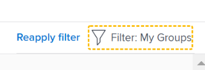

# Desplazarse por la sección Alineación de metas en Adobe Workfront Goals

Utilice la Sección Alineación de metas para mostrar una vista integral de la alineación de objetivos en toda la organización en un diagrama de flujo. Los objetivos alineados se muestran en tarjetas que se interconectan en un árbol jerárquico.

Para obtener información sobre la alineación de objetivos y cómo conseguirla, consulte también los siguientes artículos:

* [Resumen de alineación de metas en Adobe Workfront Goals](../../workfront-goals/goal-alignment/goal-alignment-overview.md)
* [Alinear metas conectándolas en Adobe Workfront Goals](../../workfront-goals/goal-alignment/align-goals-by-connecting-them.md)

## Requisitos de acceso

Debe tener lo siguiente para realizar las actividades descritas en este artículo:

<table style="table-layout:auto">
<col>
</col>
<col>
</col>
<tbody>
<tr>
<td role="rowheader">Plan de Adobe Workfront</td>
<td>

Cualquiera

</td>
</tr>
<tr>
<td role="rowheader">Licencia de Adobe Workfront*</td>
<td>

Nueva licencia: Contributor o superior

O

Licencia actual: Request o superior
  </td>
</tr>
<tr>
<td role="rowheader">Producto*</td>
<td>

 Nuevo requisito de producto, uno de los siguientes: 

<ul>
<li>Un plan Select or Prime Adobe Workfront y una licencia adicional de Adobe Workfront Goals.</li>
<li>Un plan Ultimate Workfront que incluye Workfront Goals de forma predeterminada. </li></ul>

O

Requisito de producto actual: un plan de Workfront y una licencia adicional para Adobe Workfront Goals. 
 
Para obtener más información, consulte <a href="../../workfront-goals/goal-management/access-needed-for-wf-goals.md" class="MCXref xref">Requisitos para usar Workfront Goals</a>. 
 </td>
</tr>
<tr>
<td role="rowheader">Nivel de acceso</td>
<td> 
Editar acceso a Goals
 </td>
</tr>
<tr data-mc-conditions="">
<td role="rowheader">Permisos de objeto</td>
<td>

Permisos Ver o superiores para la meta que desea ver

Permisos de administración para la meta y poder editarla

Para obtener información acerca de cómo compartir metas, consulte <a href="../../workfront-goals/workfront-goals-settings/share-a-goal.md" class="MCXref xref">Compartir una meta en Workfront Goals</a>. 

 </td>
</tr>
<tr>
<td role="rowheader">
Plantilla de diseño
</td>
<td> 
A todos los usuarios, incluidos los administradores de Workfront, se les debe asignar una plantilla de diseño que incluya el área Metas en el menú principal. 
  
</td>
</tr>
</tbody>
</table>

*Para obtener más información, consulte [Requisitos de acceso en la documentación de Workfront](/help/quicksilver/administration-and-setup/add-users/access-levels-and-object-permissions/access-level-requirements-in-documentation.md).

## Navega por la sección de Alineación de Metas

1. Haz clic en el icono **Menú principal**  en la esquina superior derecha de tu pantalla, luego haz clic en **Objetivos**.
   <!-- Add this when Shell is available to all: or (if available), click the **Main Menu** icon  in the upper-left corner)
   -->
1. Haga clic en **Alineación de metas** en el panel izquierdo
1. Utilice los filtros de la esquina superior derecha del gráfico de alineación para seleccionar solo las metas que sean importantes para usted. Para obtener información sobre cómo usar filtros en Workfront Goals, consulte [información de filtros en Adobe Workfront Goals](../../workfront-goals/goal-management/filter-information-wf-goals.md).

   Las metas que coinciden con sus filtros se muestran en el gráfico de alineación en tarjetas.

   La siguiente información se muestra en una tarjeta de meta:

   <table style="table-layout:auto"> 
    <col> 
    <col> 
    <tbody> 
     <tr> 
      <td role="rowheader">Fechas del período de tiempo </td> 
      <td> 
Este es el período durante el cual se abre la meta. El objetivo debe alcanzarse antes de la fecha de finalización del período. Workfront Goals calcula el progreso del objetivo en función de la duración del período del objetivo y la fecha actual.
 </td> 
     </tr> 
     <tr> 
      <td role="rowheader">Indicadores de progreso</td> 
      <td>Número de indicadores de progreso de la meta. Los indicadores de progreso pueden alinear metas, resultados o actividades. </td> 
     </tr> 
     <tr> 
      <td role="rowheader">Nombre del propietario</td> 
      <td>El nombre del usuario, equipo, grupo o la organización designada como propietario de la meta. </td> 
     </tr> 
     <tr> 
      <td role="rowheader">Nombre de la meta</td> 
      <td>El nombre de la meta. </td> 
     </tr> 
     <tr> 
      <td role="rowheader">Barra de progreso de la meta y progreso</td> 
      <td> 
El progreso de la meta indica qué porcentaje de la meta se ha alcanzado actualmente. Se trata de un cálculo automático de la media del progreso de todas las metas alineadas, resultados y actividades de la meta en función del tiempo transcurrido desde el inicio del período de tiempo de la meta. Para obtener información sobre el cálculo del progreso de las metas, consulte <a href="../../workfront-goals/goal-management/calculate-goal-progress.md" class="MCXref xref">Información general sobre el progreso y la condición de las metas en Adobe Workfront Goals</a>. 
 
       
 
        
El progreso real de la meta por la fecha actual.Los siguientes valores y colores de progreso indican la probabilidad de que la meta se alcance a tiempo: 
 
        <ul> 
         <li>En destino (indicador verde): la meta está a tiempo y se alcanzará a tiempo.</li> 
         <li> En riesgo (indicador amarillo): la meta se retrasa y es posible que no se logre a tiempo.</li> 
         <li> Con problemas (indicador rojo): la meta corre el riesgo de no lograrse a tiempo. </li> 
        </ul> 
       
 </td> 
     </tr> <!--
      <tr data-mc-conditions="QuicksilverOrClassic.Draft mode"> 
       <td role="rowheader">Updated on date </td> 
       <td> 
The date when the goal was last updated
 
(NOTE: drafted because I think this was removed with the alignment chart redesign - 21.1) 
 </td> 
      </tr>
     --> 
     <tr> 
      <td role="rowheader">Estado</td> 
      <td>Las metas de todos los estados se muestran en la sección Alineación de metas. </td> 
     </tr> 
    </tbody> 
   </table>

   Las metas que se alinean con otras metas muestran el número de metas alineadas debajo de la tarjeta de metas.

   

1. Haga clic en el icono de **flecha que apunta hacia abajo** debajo de una meta para expandir y ver aún más las metas secundarias.

   

   >[!TIP]
   >
   >Las metas que tienen metas secundarias alineadas con ellas muestran el número de metas alineadas bajo sus respectivas tarjetas.

1. (Condicional) Si el filtro actual excluye algunas de las metas que participan en una alineación, aparece un mensaje de advertencia para indicar que no se muestran todas las metas.

   

1. Haga clic en **Mostrarlas** para mostrar las metas que el filtro ha eliminado actualmente.

   Observe los siguientes cambios en el gráfico de alineación:

   * Las metas conectadas que el filtro había eliminado anteriormente ahora se muestran en el gráfico de alineación.
   * El filtro de la esquina superior derecha aparece delineado en amarillo para indicar que actualmente no se está aplicando.

     

     A la izquierda del nombre del filtro se muestra el vínculo Reaplicar filtro.

1. (Opcional) Haga clic en **Volver a aplicar el filtro** para volver a los resultados originales y mostrar la jerarquía de metas.
1. (Opcional) Pase el puntero por encima del indicador de progreso para saber dónde debe estar el progreso de la meta en el día actual.

   

   Se muestra la siguiente información:

   <table style="table-layout:auto"> 
    <col> 
    <col> 
    <tbody> 
     <tr> 
      <td role="rowheader">Hoy</td> 
      <td>El estado de progreso siempre es actual. </td> 
     </tr> 
     <tr> 
      <td role="rowheader">Real </td> 
      <td>El progreso real (un porcentaje) de la meta en la fecha actual se calcula teniendo en cuenta todos los indicadores de progreso de la meta. Los indicadores de progreso son las metas alineadas, las actividades, los resultados y los proyectos. </td> 
     </tr> 
     <tr> 
      <td role="rowheader">Previsto</td> 
      <td> 
El progreso previsto (un porcentaje) de la meta en la fecha actual, suponiendo que logre la meta a tiempo.
 </td> 
     </tr> 
    </tbody> 
   </table>

1. Haga clic en una tarjeta de metas para abrir la página de metas. Para obtener información sobre cómo editar las metas existentes, consulte [Editar metas en Adobe Workfront Goals](../../workfront-goals/goal-management/edit-goals.md). Para obtener información sobre la actualización del progreso de las metas, consulte [Actualizar el progreso de las metas en Adobe Workfront Goals](../../workfront-goals/goal-review-and-workfront-goals-sections/check-in-goals.md).

1. Haga clic en la flecha hacia arriba de la meta del nivel actual para volver al nivel anterior en la jerarquía del gráfico.

   O

   (Opcional) Haga clic en **Salir de la jerarquía de metas** para mostrar las tarjetas de todas las metas que coinciden con el filtro actual, sin mostrar su conexión entre sí.

