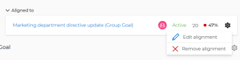

# Quitar la alineación de objetivos en Adobe Workfront Goals

Puede quitar la alineación entre dos objetivos si ya no tiene sentido que estén conectados.

Para obtener información sobre cómo alinear objetivos, consulte los siguientes artículos:

* [Alinee metas conectándolas en Adobe Workfront Goals](../../workfront-goals/goal-alignment/align-goals-by-connecting-them.md)
* [Alinear metas convirtiendo resultados y actividades en metas](../../workfront-goals/goal-alignment/align-goals-by-converting-results-activities.md)

## Requisitos de acceso

Debe tener lo siguiente:

<table style="table-layout:auto">
 <col>
 </col>
 <col>
 </col>
 <tbody>
  <tr>
   <td role="rowheader">plan Adobe Workfront*</td>
   <td>
   
Nuevo plan: Select o superior

   O
   
Plan actual: Pro o superior

   
   </td>
  </tr>
  <tr>
   <td role="rowheader">Licencia de Adobe Workfront*</td>
   <td>
   
Nueva licencia: Colaborador o superior

   O
   
Licencia actual: Solicitud o superior
 </td>
  </tr>
  <tr>
   <td role="rowheader">Producto*</td>
   <td>
   
 Nuevo requisito de producto, uno de los siguientes: 

<ul>
<li>Un plan Select or Prime Adobe Workfront y una licencia adicional de Adobe Workfront Goals.</li>
<li>Un plan Ultimate Workfront que incluye Workfront Goals de forma predeterminada. </li></ul>
   
O

   
Requisito de producto actual: un plan de Workfront y una licencia adicional para los objetivos de Adobe Workfront. 
 
Para obtener más información, consulte <a href="../../workfront-goals/goal-management/access-needed-for-wf-goals.md" class="MCXref xref">Requisitos para utilizar Workfront Goals</a>. 
 </td>
  </tr>
  <tr>
   <td role="rowheader">Nivel de acceso</td>
   <td> 
Editar acceso a Objetivos
 </td>
  </tr>
  <tr data-mc-conditions="">
   <td role="rowheader">Permisos de objeto</td>
   <td>
    
Ver o permisos superiores a la meta para verla

     
Administrar permisos para el objetivo y editarlo

     
Para obtener información sobre cómo compartir objetivos, consulte <a href="../../workfront-goals/workfront-goals-settings/share-a-goal.md" class="MCXref xref">Compartir una meta en Workfront Goals</a>. 

    </td>
  </tr>
   <td role="rowheader">
Plantilla de diseño
</td>
   <td> 
A todos los usuarios, incluidos los administradores de Workfront, se les debe asignar una plantilla de diseño que incluya el área Objetivos en el menú principal. 
  
</td>
  </tr>
 </tbody>
</table>

*Para obtener más información, consulte [Requisitos de acceso en la documentación de Workfront](/help/quicksilver/administration-and-setup/add-users/access-levels-and-object-permissions/access-level-requirements-in-documentation.md).

## Requisitos previos

Debe tener lo siguiente para poder iniciar:

* Una meta principal que tiene al menos una meta secundaria asociada. Las metas para la infancia son los indicadores de progreso de la meta.

## Consideraciones sobre la eliminación de la alineación del objetivo

Tenga en cuenta lo siguiente al eliminar la alineación entre dos objetivos:

* La meta principal debe tener otra meta, actividad o resultado asociado para poder permanecer Activa.
* No se puede quitar una meta secundaria alineada de una meta principal si es el único indicador de progreso de la meta principal.
* La meta secundaria se convierte en una meta independiente cuando se elimina su alineación con la meta principal.

## Eliminar alineación de metas

<!--
Removing goal alignment differs depending on which environment you use.

### Remove goal alignment in the Production environment

1. Go to a child goal aligned to a parent goal. 
1. Click the goal name to open the **Goal Details** panel. 
1. Click the **gear icon**  next to the parent goal, then click **Remove alignment**.

   

   The goal becomes a standalone goal and its progress no longer influences the progress of the original parent goal. 

1. (Optional) Click **Undo** in the lower-left corner of the screen if you want to revert this change and keep the goals aligned. 
1. (Optional) Add activities and results to either goals to indicate their progress. For information about adding activities and results, see the following articles:

   * [Add activities to goals in Adobe Workfront Goals](../../workfront-goals/results-and-activities/add-activities-to-goals.md) 
   * [Add results to goals in Adobe Workfront Goals](../../workfront-goals/results-and-activities/add-results-to-goals.md)
-->

1. Acceda a la **Metas** en Workfront y haga clic en el nombre de una meta para abrir su página.
1. En la página de la meta de una meta principal, haga clic en **Indicadores de progreso** en el panel izquierdo.

   

1. En el **Tipo: meta** Para agrupar, seleccione un objetivo y haga clic en **Desconectar** icono  al principio de la lista.

   Aparece la casilla Desconectar.

1. Clic **Desconectar** para desconectar la meta seleccionada de su elemento principal.

   El objetivo se convierte en un objetivo independiente y ya no aparece como indicador de progreso del objetivo original. El progreso de la meta desconectada ya no influye en el progreso de la meta original.

   Aparece un mensaje de éxito en la esquina superior derecha de la página para confirmar que el objetivo se ha desconectado.