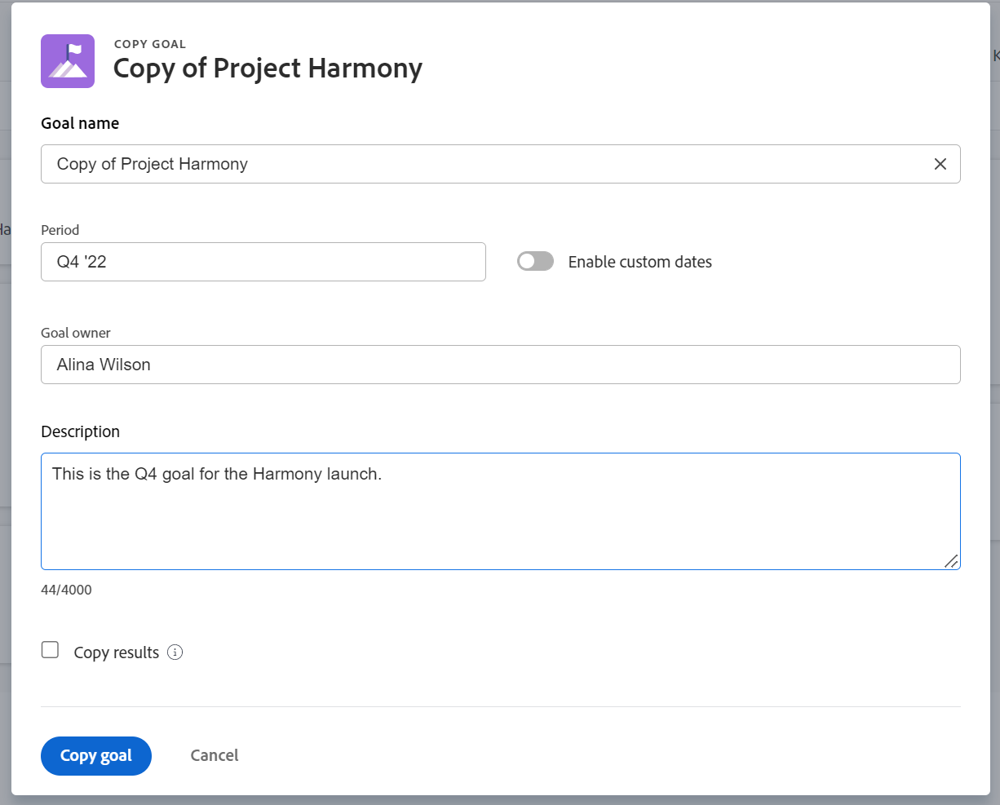

# Copiar metas en Adobe Workfront Goals

Puede copiar metas en Objetivos de Adobe Workfront para crear una meta. Parte de la información de la meta original se transfiere a la nueva meta.

## Requisitos de acceso

Debe tener lo siguiente:

<table style="table-layout:auto">
<col>
</col>
<col>
</col>
<tbody>
 <tr>
 <td role="rowheader">plan de Adobe Workfront</td>
 <td>
 
Cualquiera

</td>
 </tr>
 <tr>
 <td role="rowheader">Licencia de Adobe Workfront*</td>
 <td>
 
Nueva licencia: Colaborador o superior

 O
 
Licencia actual: Solicitud o superior
 
Para obtener más información, consulte <a href="../../administration-and-setup/add-users/access-levels-and-object-permissions/wf-licenses.md" class="MCXref xref">Resumen de licencias de Adobe Workfront</a>.
 </td>
 </tr>
 <tr>
 <td role="rowheader">Producto*</td>
 <td>
 
 Nuevo requisito de producto, uno de los siguientes: 

<ul>
<li>Un plan Select or Prime Adobe Workfront y una licencia adicional de Adobe Workfront Goals.</li>
<li>Un plan Ultimate Workfront que incluye Workfront Goals de forma predeterminada. </li></ul>
 
O

 
Requisito de producto actual: un plan de Workfront y una licencia adicional para los objetivos de Adobe Workfront. 
 
Para obtener más información, consulte <a href="../../workfront-goals/goal-management/access-needed-for-wf-goals.md" class="MCXref xref">Requisitos para utilizar Workfront Goals</a>. 
 </td>
 </tr>
 <tr>
 <td role="rowheader">Nivel de acceso</td>
 <td> 
Editar acceso a Objetivos
 </td>
 </tr>
 <tr data-mc-conditions="">
 <td role="rowheader">Permisos de objeto</td>
 <td>
  

  
Ver o permisos superiores a la meta para verla

  
Administrar permisos para el objetivo y editarlo

  
Para obtener información sobre cómo compartir objetivos, consulte <a href="../../workfront-goals/workfront-goals-settings/share-a-goal.md" class="MCXref xref">Compartir una meta en Workfront Goals</a>. 

  
 </td>
 </tr>
<tr>
   <td role="rowheader">
Plantilla de diseño
</td>
   <td> 
A todos los usuarios, incluidos los administradores de Workfront, se les debe asignar una plantilla de diseño que incluya el área Objetivos en el menú principal. 
  
</td>
  </tr>
</tbody>
</table>

*Para obtener más información, consulte [Requisitos de acceso en la documentación de Workfront](/help/quicksilver/administration-and-setup/add-users/access-levels-and-object-permissions/access-level-requirements-in-documentation.md).

## Consideraciones para copiar metas

Debe tener acceso a Editar metas en su nivel de acceso para poder copiar metas. Para obtener información sobre la concesión de acceso a los objetivos, consulte [Concesión de acceso a Adobe Workfront Goals](../../administration-and-setup/add-users/configure-and-grant-access/grant-access-goals.md).

Algunas de las razones por las que es posible que desee copiar un objetivo existente son las siguientes:

* Al final de un período de tiempo (trimestre o año), cuando desee volver a crear el mismo objetivo para el siguiente período.
* Al final de un período de tiempo, cuando el objetivo no se puede completar y desea trabajar en él durante otro período de tiempo.
* Cuando varios integrantes del equipo tienen objetivos similares y es posible que tenga que crear uno para cada uno de ellos.

>[!TIP]
>
>Puede copiar una meta en cualquier estado. Para obtener información sobre los estados de objetivos, consulte [Información general sobre el estado de las metas en Adobe Workfront Goals](../../workfront-goals/goal-management/goal-status-overview.md).

Tenga en cuenta lo siguiente al copiar los objetivos:

* Toda la información sobre la meta también se copia en la nueva meta.
* Puede seleccionar para copiar los resultados de un objetivo existente. El nombre de los resultados se transfiere a la nueva meta, pero el progreso actual de los resultados en la meta existente no se copia a la nueva meta. Los resultados copiados se asignan al mismo propietario de forma predeterminada.

  >[!NOTE]
  >
  >Si el propietario original se eliminó o desactivó de Workfront, el nuevo resultado se asigna al usuario que ha iniciado sesión.

* No puede copiar las actividades de una meta cuando copia la meta.

## Copiar metas

<!--
Copying goals differs depending on what environment you use. 

To copy goals in the Production environment:

1. Go to a goal and click it to open the Goal Details panel.

   For information about accessing an individual goal, see the "Access individual goals" section in [Access and open goals in Adobe Workfront Goals](../../workfront-goals/goal-management/access-goals-in-wf-goals.md).

   This opens the Goal Details panel.

1. Click the **More icon** , then click **Copy**. 

1. Update any of the following information for the copied goal:

   | Field |Description  |
   |---|---|
   | New Goal |The name of the new goal. The default is the name of the original goal.  |
   | Period |The time period during which you want to achieve the goal. Select a time period from the drop-down menu or click **Define custom dates** to indicate a custom time period. By default, the Period is always the current quarter. |
   | Owner |The owner of the goal. It can be a user, team, group, or a company. The default is the owner of the original goal.  |
   | Description |Additional information about the goal.  |

1. (Conditional) Select **Copy results** if the original goal had results added to it and you want to copy them to the new goal. This duplicates the original results to the new goal. The results of the copied goal have the same owner, names and measured values as the results of the original goal.

   >[!TIP]
   >
   >* The progress of the original result does not transfer to the copied goal. 
   >* If the original owner was deleted or deactivated from Workfront, the new result is assigned to the logged in user.

1. Click **Save**.

   The copied goal is saved with a status of Draft and displays in the Goal Details panel.

   >[!IMPORTANT]
   >
   >If you have not copied the results from the original goal, you must first associate the new goal with a progress indicator before you can activate it and start working towards achieving it. 
   >
   >Do at least one of the following to be able to activate a goal: 
   >   
   >* Add a Result
   >   
   >  For information about adding results, see [Add results to goals in Adobe Workfront Goals](../../workfront-goals/results-and-activities/add-results-to-goals.md).
   >   
   >* Add an Activity
   >   
   >  For information about adding activities, see [Add activities to goals in Adobe Workfront Goals](../../workfront-goals/results-and-activities/add-activities-to-goals.md). 
   >   
   >* Align another goal to it
   >   
   >  For information about aligning goals, see [Align goals by connecting them in Adobe Workfront Goals](../../workfront-goals/goal-alignment/align-goals-by-connecting-them.md).
   >
   > For information about activating a goal, see [Activate goals in Adobe Workfront Goals](../goal-management/activate-goals.md). 

1. Click the **X** icon in the upper-right of the Goal Details panel to close it.

   The copied goal displays in the following sections:

   * Goal List 
   * Check-in (after it is activated)
   * Goal Alignment section (after it is activated) 
   * Pulse
(!--drafted - this was important when we could not update the goal timeframe in the past but we can do that now - not needed
1. (Optional and conditional) If you have copied a goal that was not achieved in a previous time period to continue working on it in the following time period, do the following:

   1. Go to the original goal in the Goal List, Check-in page, or Pulse section and comment on the goal, to indicate that this goal was copied to another, more current goal. For information about commenting on a goal, see [Manage goal comments in Adobe Workfront Goals](../../workfront-goals/goal-management/manage-goal-comments.md).
   1. Close the original goal, to preserve the progress in its original time period. For information about closing goals, see [Close and reopen goals in Adobe Workfront Goals](../../workfront-goals/goal-management/close-and-reopen-goals.md). 
   1. Update the the **Initial** value of the new Result to match the **End At** value of the previous result, so that your new goal progress will start calculating from the point you achieved in the previous period.
   
-->

1. Vaya a una meta y haga clic en **Más** menú , luego haga clic en **Copiar meta**.

   

1. Actualice la siguiente información para el objetivo copiado:
   * **Nombre de meta**: Nombre de la nueva meta. El nombre predeterminado para la meta copiada es &quot;Copia de &lt;original goal=&quot;&quot;>&quot;.
   * **Periodo**: Período de tiempo durante el cual desea lograr el objetivo. Seleccione un periodo de tiempo en el menú desplegable

     O

     Seleccionar **Habilitar fechas personalizadas** para especificar fechas personalizadas para el **Inicio** y **Fechas de finalización**. La configuración Habilitar fechas personalizadas está deshabilitada de forma predeterminada.

     >[!TIP]
     >
     >   Al anular la selección de Habilitar fechas personalizadas, se revierte al periodo de tiempo de la meta original.

      * **Propietario de meta**: el propietario del objetivo. Puede ser un usuario, un equipo, un grupo o una compañía. El valor predeterminado es el propietario de la meta original.
      * **Descripción**: Información adicional sobre el objetivo.
      * **Copiar resultados**: seleccione esta opción si desea transferir los resultados de la meta actual a la meta copiada. Esto duplica los resultados originales y los adjunta a la meta copiada. Los resultados de la meta copiada tienen el mismo propietario, nombres y valores medidos que los resultados de la meta original.

        >[!NOTE]
        >
        >* El progreso del resultado original no se transfiere a la meta copiada.
        >* Si el propietario original se eliminó o desactivó de Workfront, el nuevo resultado se asigna al usuario que ha iniciado sesión.

1. Clic **Copiar meta**.

   Se crea una meta similar a la original y está en estado de Borrador.

   >[!NOTE]
   >
   >Si no ha copiado los resultados de la meta original, primero debe asociar la nueva meta con un indicador de progreso antes de poder activarla y comenzar a trabajar para alcanzarla.
   >Para obtener información sobre cómo asociar metas con indicadores de progreso, consulte los siguientes artículos:
   >* [Añadir resultados a metas en Objetivos de Adobe Workfront](../results-and-activities/add-results-to-goals.md)
   >* [Añadir actividades a objetivos en Adobe Workfront Goals](../results-and-activities/add-activities-to-goals.md)
   >* [Alinee metas conectándolas en Adobe Workfront Goals](../goal-alignment/align-goals-by-connecting-them.md)
   >
   >Para obtener información sobre cómo activar metas, consulte [Activar metas](../goal-management/activate-goals.md).

