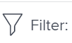

# Filtrar información en Adobe Workfront Goals

Puede ver las metas que usted o cualquier otra persona haya agregado en las metas de Adobe Workfront. Para obtener información sobre la creación de objetivos, consulte [Crear metas en Adobe Workfront Goals](../../workfront-goals/goal-management/create-goals.md). Cuando visualice las metas, puede filtrar la información en las metas de Workfront para ver solo las metas que sean importantes para usted.

## Requisitos de acceso

Debe tener el siguiente acceso para realizar las acciones descritas en este artículo:

<table style="table-layout:auto">
<col>
</col>
<col>
</col>
<tbody>
 <tr>
 <td role="rowheader">plan de Adobe Workfront</td>
 <td>
 
Cualquiera

</td>
 </tr>
 <tr>
 <td role="rowheader">Licencia de Adobe Workfront*</td>
 <td>
 
Nueva licencia: Colaborador o superior

 O
 
Licencia actual: Solicitud o superior
 
Para obtener más información, consulte <a href="../../administration-and-setup/add-users/access-levels-and-object-permissions/wf-licenses.md" class="MCXref xref">Resumen de licencias de Adobe Workfront</a>.
 </td>
 </tr>
 <tr>
 <td role="rowheader">Producto*</td>
 <td>
 
 Nuevo requisito de producto, uno de los siguientes: 

<ul>
<li>Un plan Select or Prime Adobe Workfront y una licencia adicional de Adobe Workfront Goals.</li>
<li>Un plan Ultimate Workfront que incluye Workfront Goals de forma predeterminada. </li></ul>
 
O

 
Requisito de producto actual: un plan de Workfront y una licencia adicional para los objetivos de Adobe Workfront. 
 
Para obtener más información, consulte <a href="../../workfront-goals/goal-management/access-needed-for-wf-goals.md" class="MCXref xref">Requisitos para utilizar Workfront Goals</a>. 
 </td>
 </tr>
 <tr>
 <td role="rowheader">Nivel de acceso</td>
 <td> 
Editar acceso a Objetivos
 </td>
 </tr>
 <tr data-mc-conditions="">
 <td role="rowheader">Permisos de objeto</td>
 <td>
  

  
Ver o permisos superiores a la meta para verla

  
Administrar permisos para el objetivo y editarlo

  
Para obtener información sobre cómo compartir objetivos, consulte <a href="../../workfront-goals/workfront-goals-settings/share-a-goal.md" class="MCXref xref">Compartir una meta en Workfront Goals</a>. 

  
 </td>
 </tr>
 <tr>
   <td role="rowheader">
Plantilla de diseño
</td>
   <td> 
A todos los usuarios, incluidos los administradores de Workfront, se les debe asignar una plantilla de diseño que incluya el área Objetivos en el menú principal. 
  
</td>
  </tr>
</tbody>
</table>

*Para obtener más información, consulte [Requisitos de acceso en la documentación de Workfront](/help/quicksilver/administration-and-setup/add-users/access-levels-and-object-permissions/access-level-requirements-in-documentation.md).

## Información general sobre los filtros en Workfront Goals

>[!NOTE]
>
>Para encontrar y centrarse de forma eficaz en los objetivos correctos, le recomendamos que utilice filtros en los objetivos de Workfront. Esto le permite mostrar la información correcta antes de empezar a administrar los objetivos que son importantes para usted. De forma predeterminada, Workfront Goals muestra todas las metas del sistema.

Puede localizar y filtrar objetivos en las siguientes secciones del área Objetivos en Workfront:

* Lista de metas
* Gráficos
* Alineación de metas

Para obtener información sobre las secciones del área Objetivos, consulte [Información general sobre las secciones Objetivos de Adobe Workfront](../../workfront-goals/goal-review-and-workfront-goals-sections/overview-of-wf-goals-sections.md).

>[!IMPORTANT]
>
>Puede configurar filtros para una sección y que se mantengan al pasar a otra sección de Workfront Goals.

Tenga en cuenta lo siguiente al trabajar con filtros en Workfront Goals:

* Puede crear y aplicar un filtro sin guardarlo, o bien puede guardar un filtro para reutilizarlo más adelante.

  Existen los siguientes escenarios:

   * Al guardar un filtro, este se convierte en el filtro predeterminado cada vez que inicia sesión en Workfront Goals.
   * Cuando aplique un filtro sin guardarlo, puede volver a las listas originales al actualizar la página.

* Solo puede ver y aplicar los filtros que ha creado. Los filtros creados por otros usuarios solo se muestran para esos usuarios.
* No puede compartir filtros que haya creado con otros usuarios.

## Aplicación de un filtro rápido en Workfront Goals

Puede utilizar un filtro rápido en una lista de objetivos para que le ayude a localizar únicamente los elementos que son importantes para usted. Los filtros rápidos no se pueden guardar y no son persistentes. Workfront borra los resultados de un filtro rápido al actualizar la página.

Para obtener más información, consulte [Aplicar el filtro rápido a una lista](../../workfront-basics/navigate-workfront/use-lists/apply-quick-filter-list.md).

## Creación y aplicación de un filtro en Workfront Goals

El proceso de creación de filtros es el mismo para cualquier sección de los objetivos de Workfront.

Puede crear un filtro desde cero o editar uno de los filtros integrados.

1. Vaya a los Objetivos de Workfront.

   Para obtener información sobre el acceso a Workfront Goals, consulte [Acceder y abrir metas en Adobe Workfront Goals](../../workfront-goals/goal-management/access-goals-in-wf-goals.md)

   De forma predeterminada, se muestra la sección Lista de objetivos.

1. Clic **Filtrar** en la esquina superior derecha de la lista.

   

   De forma predeterminada, Workfront aplica la variable **Todo** filtro que muestra todas las metas del sistema.

   >[!TIP]
   >
   >No puede editar ni eliminar el filtro Todos.

1. Realice una de las siguientes acciones:

   * Haga clic en cualquiera de los siguientes filtros predefinidos para mostrar los objetivos solo para los siguientes propietarios:

     <table style="table-layout:auto"> 
      <col> 
      <col> 
      <tbody> 
       <tr> 
        <td>Todas</td> 
        <td> 
Todos los objetivos del sistema, independientemente de quién los creó, cuál es el período de tiempo para ellos o quién es el propietario. Este es el filtro predeterminado y no se puede editar. 
 <!--
          
(NOTE: what the ALL filter displays might change; right now, it displays all, regardless of status, period, owner, etc)

         --> </td> 
       </tr> 
       <tr> 
        <td>Personal</td> 
        <td>Los objetivos de los que es propietario.</td> 
       </tr> 
       <tr> 
        <td>Mis equipos</td> 
        <td> 
Los objetivos para los que cualquiera de sus equipos está seleccionado como propietario. 
 
<b>SUGERENCIA</b>

     No se muestran metas cuando no se le ha asignado ningún equipo. 
 </td>
     </tr> 
       <tr> 
        <td>Mis grupos</td> 
        <td>Los objetivos para los que cualquiera de sus grupos está seleccionado como propietario. </td> 
       </tr> 
       <tr> 
        <td>Compañía</td> 
        <td> 
Los objetivos asociados con su organización. 
 
<b>SUGERENCIA</b>
        
En Adobe Workfront Goals, el filtro Compañía muestra las metas para las que su organización está seleccionada como propietaria. 
 
No puede buscar compañías utilizando este campo. De forma predeterminada, solo está seleccionada la organización que es el propietario de la instancia de Workfront. 
 
 </td> 
       </tr> 
      </tbody> 
     </table>

   * Pase el ratón sobre el nombre de un filtro y haga clic en **Editar** icono  junto a su nombre para personalizarlo y agregar nombres específicos de usuarios, equipos, grupos o el nombre de su organización, y luego selecciónelo cuando aparezca en la lista.

   * Clic **Nuevo filtro** para crear un nuevo filtro, seleccione una de las siguientes opciones para personalizar el nuevo filtro:

     <table style="table-layout:auto"> 
      <col> 
      <col> 
      <tbody> 
       <tr> 
        <td role="rowheader">Periodo</td> 
        <td>Seleccione un periodo de tiempo en el menú desplegable. Puede seleccionar varios periodos de tiempo. </td> 
       </tr> 
       <tr> 
        <td role="rowheader">Estado</td> 
        <td> 
Seleccione un estado en el menú desplegable de las siguientes opciones:
 
         <ul> 
          <li> 
Activo
 </li> 
          <li> 
Borrador
 </li> 
          <li> 
Inactivo
 </li> 
          <li> 
Cerrado
 </li> 
         </ul> </td> 
       </tr> 
       <tr> 
        <td role="rowheader">Progreso</td> 
        <td> 
Seleccione un progreso en el menú desplegable de las siguientes opciones: 
 
         <ul> 
          <li> 
Con problemas
 </li> 
          <li> 
En riesgo
 </li> 
          <li> 
Bien encaminado
 </li> 
         </ul> </td> 
       </tr> 
       <tr> 
        <td role="rowheader">Propietario</td> 
        <td> 
Empiece a escribir el nombre de un propietario y, a continuación, selecciónelo cuando aparezca en la lista. 
 
Puede escribir los nombres de los usuarios, equipos, grupos o el nombre de su organización, o bien puede seleccionar entre las opciones predefinidas. 
 
Las siguientes opciones de filtro predefinidas siempre hacen referencia al usuario que ha iniciado sesión actualmente: 
 
         <ul> 
          <li> 
<strong>Yo</strong>: Muestra las metas donde usted es el propietario.
 </li> 
          <li> 
<strong>Mi equipo de inicio</strong> y <strong>Todos mis equipos</strong>: Muestra los objetivos en los que su equipo de inicio o cualquiera de sus equipos están designados como propietarios. 
 
Sugerencia: No se muestran metas cuando no se le ha asignado ningún equipo. 
 </li> 
          <li> 
<strong>Mi grupo de inicio</strong> y <strong>Todos mis grupos</strong>: Muestra los objetivos en los que el grupo de inicio o cualquiera de los grupos están designados como propietarios.
 </li> 
         </ul> </td> 
       </tr> 
      </tbody> 
     </table>

1. (Opcional) Haga clic en **Restablecer** en la esquina inferior derecha del cuadro de filtro para borrar todos los campos seleccionados y comenzar a crear el filtro desde cero.
1. (Opcional) Haga clic en **Aplicar** para aplicar el filtro sin guardar.

   El filtro se muestra en la **Sin guardar** del generador de filtros como **Nuevo filtro**.

   No puede cambiar el nombre de un filtro sin guardar.

   Los filtros que no se hayan guardado se eliminarán del área de Objetivos la próxima vez que cierre la sesión de Workfront y vuelva a iniciarla.

   >[!TIP]
   >
   >Solo se puede tener un nuevo filtro sin guardar a la vez.

1. Clic **Guardar** para guardar el filtro y utilizarlo más adelante, agregue un nombre para el filtro en la **Agregar nombre de filtro** y haga clic en **Listo**.

   Esto guarda el filtro en la **Guardado** del generador de filtros. Puede utilizar este filtro en el futuro.

   El último filtro guardado y aplicado se muestra de forma predeterminada la próxima vez que vuelva a iniciar sesión en Workfront

1. (Opcional) Haga clic en **flecha hacia la izquierda** junto a **Nuevo filtro** para salir del generador de filtros y volver a la lista de filtros.
1. (Opcional) Pase el ratón sobre el nombre de un filtro personalizado y haga clic en **Más** y haga clic en **Eliminar**, entonces **Eliminar**. Esto elimina el filtro y no puede recuperarlo.

   >[!TIP]
   >
   >No puede eliminar ninguno de los filtros predefinidos.

1. Haga clic en **Icono X** en la esquina superior derecha del generador de filtros para cerrarlo.

   El nombre del filtro aplicado actualmente se muestra a la derecha del icono Filtro, en la esquina superior derecha de la lista de metas.

   La lista de objetivos se filtra según los criterios de filtro.

1. (Opcional y condicional) Cuando visualice los objetivos en la sección Alineación de objetivos, haga clic en **Muéstrelos.** si desea ver las metas filtradas.

   

   El nombre del filtro aparece resaltado en amarillo para indicar que se está ignorando.

   

1. (Opcional y condicional) Haga clic en **Volver a aplicar filtro** para aplicar el filtro y omitir los elementos mostrados en el paso anterior.

