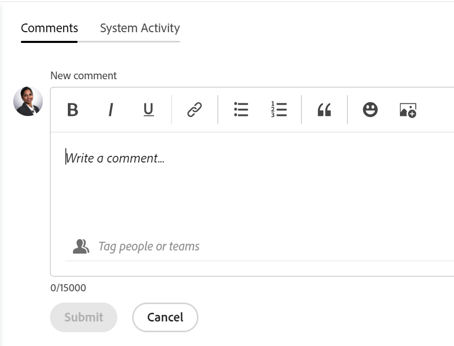

# Administrar comentarios sobre metas en Adobe Workfront Goals

<!--Audited: 01/2024-->

<!--consider retiring this article when goals and all objects are in parity and we remove the legacy commenting from the system. From then on, there is just ONE way to comment and that will be documented in the Update Work article-->

<!--take "legacy" and "new commenting" references out when we remove the legacy - April 2024???-->

<!--The highlighted information on this page refers to functionality not yet generally available. It is available only in the Preview environment for all customers. 

For information about the current release schedule, see [First Quarter 2024 release overview](../../product-announcements/product-releases/24-q1-release-activity/24-q1-release-overview.md).-->

<!--
After the monthly releases to Production, the same features are also available in the Production environment for customers who enabled fast releases.   
For information about fast releases, see [Enable or disable fast releases for your organization](../../administration-and-setup/set-up-workfront/configure-system-defaults/enable-fast-release-process.md)  
-->

Puede agregar comentarios a todas las metas que puede ver en Adobe Workfront Goals.

## Requisitos de acceso

Debe tener el siguiente acceso para realizar las acciones descritas en este artículo:

<table style="table-layout:auto">
<col>
</col>
<col>
</col>
<tbody>
 <tr> 
   <td role="rowheader">plan Adobe Workfront*</td> 
   <td> 
   
Para el nuevo plan y la estructura de licencias:
  <ul><li>Un plan definitivo </li>
  O
  <li>Licencia adicional para objetivos de Adobe Workfront para los planes Prime o Select Adobe Workfront. </li></ul> 

Para el plan y la estructura de licencias actuales: 
<ul><li> A Pro o superior </li>
  <li>Una licencia de Adobe Workfront Goals además de una licencia de Workfront.</li></ul>

   </td> 
  </tr>
 <tr>
 <td role="rowheader">Licencia de Adobe Workfront</td>
 <td>
 
Cualquiera</td>
 </tr>
 <tr>
 <td role="rowheader">Producto*</td>
 <td>
 
 Nuevo requisito del producto: si tiene el plan Select o Prime Adobe Workfront, también debe comprar una licencia adicional de Adobe Workfront Goals. Los objetivos de Workfront se incluyen en el plan Ultimate Workfront.

 O
 
Requisito de producto actual: debe adquirir una licencia adicional para las metas de Adobe Workfront a fin de acceder a la funcionalidad descrita en este artículo. 
 
Para obtener más información, consulte <a href="../../workfront-goals/goal-management/access-needed-for-wf-goals.md" class="MCXref xref">Requisitos para utilizar Workfront Goals</a>. 
 </td>
 </tr>
 <tr>
 <td role="rowheader">Configuración del nivel de acceso</td>
 <td> 
Ver los objetivos o acceder a ellos
 </td>
 </tr>
 <tr data-mc-conditions="">
 <td role="rowheader">Permisos de objeto</td>
 <td>
  

  
Ver o permisos superiores para la meta

  
De forma predeterminada, los usuarios no tienen acceso a las metas 

 
Para obtener información sobre cómo compartir objetivos, consulte <a href="../../workfront-goals/workfront-goals-settings/share-a-goal.md" class="MCXref xref">Compartir una meta en Workfront Goals</a>. 

  
 </td>
 </tr>
 <tr>
   <td role="rowheader">
Plantilla de diseño
</td>
   <td> 
A todos los usuarios, incluidos los administradores de Workfront, se les debe asignar una plantilla de diseño que incluya el área Objetivos en el menú principal. 
  
</td>
  </tr>
</tbody>
</table>

*Para obtener más información, consulte [Requisitos de acceso en la documentación de Workfront](/help/quicksilver/administration-and-setup/add-users/access-levels-and-object-permissions/access-level-requirements-in-documentation.md).

## Requisitos previos

Debe tener lo siguiente para poder iniciar:

* Plantilla de diseño que incluye el área de Objetivos en el menú principal.

## Administrar comentarios de metas

Puede agregar comentarios a los objetivos en la sección Actualizaciones de la página de un objetivo.

Puede responder a un comentario que usted u otras personas agregaron en esta área o marcarlo como me gusta.

1. Haga clic en **Menú principal** icono  en la esquina superior derecha, o la **Menú principal** icono  en la esquina superior izquierda, si está disponible, haga clic en **Metas**.
Se abrirá la lista de metas.
1. Busque la meta a la que desee agregar comentarios y, a continuación, haga clic en su nombre para abrir la página de la meta.
1. Clic  **Actualizaciones** en el panel izquierdo.
1. (Opcional) Para localizar un comentario existente, empiece a escribir una palabra clave <!--or a user's name--> en el **Buscar** en la esquina superior derecha de la ventana **Comentarios** pestaña.

   

   La palabra clave <!--or user--> Si ha buscado, se resaltará y los comentarios que lo contengan se mostrarán en la parte superior de la sección Actualizaciones.

   <!--change the NOTE below when functionality changes-->

   >[!NOTE]
   >
   >Debe buscar una palabra incluida en un comentario o una respuesta. No puede buscar un usuario o equipo etiquetado.

   Para obtener más información, consulte [Actualizar trabajo](../../workfront-basics/updating-work-items-and-viewing-updates/update-work.md).

1. Haga clic en **x** en el campo buscar para borrar los resultados de la búsqueda y volver a la actualización completa.
1. Haga clic en **Comentarios** en la esquina superior izquierda del área de Actualizaciones.
1. Comience a escribir un comentario en **Nuevo comentario** cuadro.

   

   >[!TIP]
   >
   >Si sale de la sección Actualizaciones antes de terminar de escribir y enviar un comentario, el comentario en la página se mantiene en modo de borrador incluso después de cerrar la sesión y volver a iniciarla. Los borradores se guardan durante 7 días después de los cuales se descartan y no se pueden recuperar. Los comentarios redactados solo son visibles para el usuario que los escribe.

1. (Opcional) Para deshacer o rehacer un cambio, utilice las siguientes teclas de método abreviado:
   * CTRL + Z (⌘ + z para Mac) para deshacer un cambio
   * CTRL + Y (⌘ + y para Mac) para rehacer un cambio
1. (Opcional) Para agregar formato de texto enriquecido a la actualización, un hipervínculo o un emoji, utilice las opciones de la barra de herramientas Texto enriquecido o los iconos adyacentes. Para obtener más información, consulte [Actualizar trabajo](../../workfront-basics/updating-work-items-and-viewing-updates/update-work.md).
1. (Opcional) En el **Etiquetar personas o equipos** , empiece a escribir el nombre o el correo electrónico de un usuario o equipo que desee incluir en este comentario y, a continuación, selecciónelo cuando se muestre en la lista.
1. Seleccione el **Privado para mi compañía** alterne para que el comentario solo sea visible para las personas de la compañía.

   >[!TIP]
   >
   >Debe tener una Compañía especificada en el perfil para que esta opción esté disponible en el área de Actualizaciones.

1. Clic **Enviar**.

   >[!TIP]
   >
   >Si otro usuario envía un comentario al mismo elemento que está actualizando, habrá una línea roja con un indicador &quot;Nuevo&quot; para informarle de los comentarios más recientes, así como una notificación azul en la parte inferior de la pantalla que indica el número de comentarios nuevos.
   >
   >El indicador solo se muestra después de que el comentario se haya enviado sobre el elemento, y no cuando el comentario aún está compuesto.
   >

1. (Opcional) Para editar un comentario, haga clic en **Más** menú  a la derecha del icono Like y, a continuación, haga clic en **Editar**.
1. Edite la información del comentario o elimine cualquiera de los usuarios etiquetados.
Puede editar su comentario en un plazo de 15 minutos a partir del envío. Se agrega un indicador &quot;editado&quot; a la izquierda de la marca de fecha que muestra cuándo se actualizó el comentario.

   

   >[!TIP]
   >
   > * Se genera un correo electrónico para notificar a los usuarios de su actualización solo cuando envía la actualización original. No se genera ningún correo electrónico después de editar la actualización.
   >
   > * La marca de fecha es la fecha del comentario original y no la fecha de la última actualización.

1. (Opcional) Haga clic en **Más** menú , a continuación, haga clic en cualquiera de las siguientes opciones para copiar información de un comentario en el portapapeles o en una nueva respuesta:

   * **Copiar vínculo** para copiar el vínculo de una actualización, sin las respuestas.
   * **Copiar el texto del cuerpo** para copiar el texto de una actualización.
   * **Cita respuesta** para abrir un nuevo cuadro de comentarios en el que el comentario original se cita en una nueva respuesta y se marca como una cita de bloque.

     Para obtener más información, consulte [Actualizar trabajo](../../workfront-basics/updating-work-items-and-viewing-updates/update-work.md).

1. (Opcional) Haga clic en **Más** menú  a la derecha de un comentario y haga clic en **Eliminar** para eliminar un comentario que ha agregado. Para obtener más información, consulte [Actualizar trabajo](../../workfront-basics/updating-work-items-and-viewing-updates/update-work.md).
1. (Opcional) Haga clic en **Responder** para responder a un comentario existente, siga los pasos del 5 al 9 anteriores. Para obtener más información sobre cómo responder a las actualizaciones, consulte [Responder a las actualizaciones](../../workfront-basics/updating-work-items-and-viewing-updates/reply-to-updates.md). <!--insure this stays accurate-->
1. (Condicional y opcional) Si otros usuarios han agregado comentarios que se muestran fuera del área visible en la sección Actualizaciones, haga clic en **Ver** dentro del azul **titular de nuevos comentarios** en la parte inferior de la pantalla para mostrar estos comentarios.

   

   Los comentarios adicionales se muestran en la parte inferior de la pantalla.
1. (Opcional) Haga clic en **Like** icono para que le guste un comentario que otra persona haya agregado. El icono se actualiza con el número de me gusta.

1. (Opcional) Haga clic en **Actividad del sistema** para ver las actualizaciones registradas por el sistema. Cuando se actualiza un objetivo, Workfront genera una nota sobre esa actualización que se muestra en la pestaña Actividad del sistema. Workfront también registra una actualización del sistema cuando se agrega un resultado, una actividad o un proyecto al objetivo o cuando se actualiza. <!--ensure the casing on the tab has not changed-->

