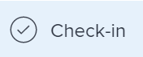

# Administrar comentarios de objetivo en objetivos de Adobe Workfront

<!--consider retiring this article when goals and all objects are in parity - after the new commenting experience goes to production GA-->

<!--The highlighted information on this page refers to functionality not yet generally available. It is available only in the Preview environment.-->

Puede agregar comentarios a todos los objetivos que puede ver en los objetivos de Adobe Workfront.

<!--drafted for P&P:

<table style="table-layout:auto">
 <col>
 </col>
 <col>
 </col>
 <tbody>
  <tr>
   <td role="rowheader">Adobe Workfront plan*</td>
   <td>
   
Current plan: Select or higher

   Or
   
Legacy plan: Pro or higher

   
   </td>
  </tr>
  <tr>
   <td role="rowheader">Adobe Workfront license*</td>
   <td>
   
Current license: Contributor or higher

   Or
   
Legacy license: Request or higher
 
For more information, see <a href="../../administration-and-setup/add-users/access-levels-and-object-permissions/wf-licenses.md" class="MCXref xref">Adobe Workfront licenses overview</a>.
 </td>
  </tr>
  <tr>
   <td role="rowheader">Product</td>
   <td>
   
 Current product requirement: If you have the Select or Prime Adobe Workfront plan, you must also buy an additional Adobe Workfront Goals license.  Workfront Goals are included in the Ultimate Workfront Plan.

   Or
   
Legacy product requirement: You must purchase an additional license for the Adobe Workfront Goals to access functionality described in this article. 
 
For information, see <a href="../../workfront-goals/goal-management/access-needed-for-wf-goals.md" class="MCXref xref">Requirements to use Workfront Goals</a>. 
 </td>
  </tr>
  <tr>
   <td role="rowheader">Access level*</td>
   <td> 
Edit access to Goals
 
<b>NOTE</b>
If you still don't have access, ask your Workfront administrator if they set additional restrictions in your access level. For information on how a Workfront administrator can change your access level, see:

     <ul>
      <li> 
<a href="../../administration-and-setup/add-users/configure-and-grant-access/create-modify-access-levels.md" class="MCXref xref">Create or modify custom access levels</a> 
 </li>
      <li> 
<a href="../../administration-and-setup/add-users/configure-and-grant-access/grant-access-goals.md" class="MCXref xref">Grant access to Adobe Workfront Goals</a> 
 </li>
     </ul> 
 </td>
  </tr>
  <tr data-mc-conditions="">
   <td role="rowheader">Object permissions</td>
   <td>
    

     
View or higher permissions to the goal to view it

     
Manage permissions to the goal to edit it

     
For information about sharing goals, see <a href="../../workfront-goals/workfront-goals-settings/share-a-goal.md" class="MCXref xref">Share a goal in Workfront Goals</a>. 

    
 </td>
  </tr>
 </tbody>
</table>
-->

## Requisitos de acceso

Debe tener el siguiente acceso para realizar las acciones descritas en este artículo:

<table style="table-layout:auto"> 
 <col> 
 <col> 
 <tbody> 
  <tr> 
   <td role="rowheader">plan de Adobe Workfront*</td> 
   <td> 
Pro o superior
 </td> 
  </tr> 
  <tr> 
   <td role="rowheader">Licencia de Adobe Workfront*</td> 
   <td> 
Solicitud o superior
 
Para obtener más información, consulte <a href="../../administration-and-setup/add-users/access-levels-and-object-permissions/wf-licenses.md" class="MCXref xref">Información general sobre las licencias de Adobe Workfront</a>.
 </td> 
  </tr> 
  <tr> 
   <td role="rowheader">Product</td> 
   <td> 
Debe adquirir una licencia adicional para los objetivos de Adobe Workfront para acceder a la funcionalidad que se describe en este artículo. 
 
Para obtener más información, consulte <a href="../../workfront-goals/goal-management/access-needed-for-wf-goals.md" class="MCXref xref">Requisitos para utilizar los objetivos de Workfront</a>. 
 </td> 
  </tr> 
  <tr> 
   <td role="rowheader">Nivel de acceso*</td> 
   <td> 
Ver o tener más acceso a los objetivos
 
<b>NOTA</b>
Si todavía no tiene acceso, pregunte a su administrador de Workfront si establece restricciones adicionales en su nivel de acceso. Para obtener información sobre cómo un administrador de Workfront puede cambiar su nivel de acceso, consulte:
 
     <ul> 
      <li> 
<a href="../../administration-and-setup/add-users/configure-and-grant-access/create-modify-access-levels.md" class="MCXref xref">Crear o modificar niveles de acceso personalizados</a> 
 </li> 
      <li> 
<a href="../../administration-and-setup/add-users/configure-and-grant-access/grant-access-goals.md" class="MCXref xref">Conceder acceso a los objetivos de Adobe Workfront</a> 
 </li> 
     </ul> 
 </td> 
  </tr> 
  <tr data-mc-conditions=""> 
   <td role="rowheader">Permisos de objeto</td> 
   <td> 
    
 
     
Ver o permisos superiores en objetivos
 
     
Para obtener información sobre cómo compartir objetivos, consulte <a href="../../workfront-goals/workfront-goals-settings/share-a-goal.md" class="MCXref xref">Compartir un objetivo en los objetivos de Workfront</a>. 
 
    
 </td> 
  </tr> 
 </tbody> 
</table>

*Para saber qué plan, tipo de licencia o acceso tiene, póngase en contacto con el administrador de Workfront.

## Requisitos previos

Debe tener lo siguiente para poder iniciar:

* Plantilla de diseño que incluye el área Objetivos del menú principal.

## Busque la sección Actualizaciones

Puede agregar comentarios a los objetivos en la sección Actualizaciones de la página de un objetivo.

Puede responder o indicar que le gusta un comentario que agregó usted u otros usuarios en esta área.

1. Haga clic en el **Menú principal** icono  > **Objetivos** en la esquina superior derecha.
Esto abre la lista de objetivos.
1. Busque el objetivo al que desee agregar comentarios y haga clic en su nombre para abrir la página de objetivo.
1. Haga clic en  **Actualizaciones** en el panel izquierdo.
1. Haga clic en el **Comentarios** en la esquina superior izquierda del área Actualizaciones.
1. Comience a introducir un comentario en el **Nuevo comentario** en la ventana

   

   >[!TIP]
   >
   >Si sale de la sección Actualizaciones antes de terminar de escribir y enviar un comentario, el comentario se mantiene en modo borrador incluso después de cerrar la sesión y volver a iniciarla. Las imágenes que se agreguen al comentario también se guardan en el borrador. Los borradores se guardan durante 7 días después de los cuales se descartan y no se pueden recuperar. Los comentarios borrados solo son visibles para el usuario que los introduce.

1. (Opcional) Para agregar formato de texto enriquecido a la actualización, un hipervínculo o una imagen, utilice las opciones de la barra de herramientas Texto enriquecido o los iconos adyacentes. Para obtener más información, consulte [Actualizar trabajo](../../workfront-basics/updating-work-items-and-viewing-updates/update-work.md).
1. (Opcional) En la **Etiquetar personas o equipos** , empiece a escribir el nombre o el correo electrónico de un usuario, o un equipo que desee incluir en este comentario y, a continuación, selecciónelo cuando aparezca en la lista.
1. Seleccione el **Privado para mi empresa** alterne para que el comentario sea visible solo para las personas de su empresa.

   >[!TIP]
   >
   >Debe tener una empresa especificada en el perfil para que esta opción esté disponible en el área Actualizaciones .

1. Haga clic en **Submit**.

   >[!TIP]
   >
   >Si otro usuario envía un comentario al mismo elemento que está actualizando, habrá una línea roja con un indicador &quot;Nuevo&quot; para informarle de los comentarios más recientes.
   >
   >El indicador solo se muestra después de enviar el comentario en el elemento, y no cuando el comentario sigue compuesto.
   >
   >El indicador &quot;Nuevo&quot; solo se muestra cuando tanto el usuario que ha introducido una nueva actualización como el usuario que está introduciendo una actualización están utilizando la nueva experiencia de comentarios.
   >

1. (Opcional) Para editar un comentario, haga clic en el **Más** menú  a la derecha del icono &quot;Me gusta&quot; y, a continuación, haga clic en **Editar**.
1. Edite la información del comentario, agregue o elimine imágenes o elimine cualquiera de los usuarios etiquetados.
Puede editar su comentario en un plazo de 15 desde su envío. Se agrega un indicador &quot;Editado&quot; a la izquierda de la marca de fecha que se muestra cuando se actualizó el comentario.

   

   >[!TIP]
   >
   > Se genera un correo electrónico para notificar a los usuarios de la actualización solo cuando envíe la actualización original. Después de editar la actualización no se genera ningún correo electrónico.

   1. (Opcional) Haga clic en el **Más** menú y, a continuación, haga clic en cualquiera de las siguientes opciones para copiar información de un comentario en el portapapeles:

      * **Copiar vínculo** para copiar el vínculo de una actualización, sin las respuestas.
      * **Copiar texto del cuerpo** para copiar el texto de una actualización.

         Para obtener más información, consulte [Actualizar trabajo](../../workfront-basics/updating-work-items-and-viewing-updates/update-work.md).

1. (Opcional) Haga clic en el **Más** menú  a la derecha de un comentario y, a continuación, haga clic en **Eliminar** para eliminar un comentario que haya agregado. Para obtener más información, consulte [Actualizar trabajo](../../workfront-basics/updating-work-items-and-viewing-updates/update-work.md).
1. (Opcional) Haga clic en **Responder** para responder a un comentario existente, siga los pasos 5-9 anteriores. <!--insure this stays accurate-->
1. (Condicional y opcional) Si otros usuarios han añadido comentarios que se muestran fuera del área visible de la sección Actualizaciones , haga clic en **Ver** dentro del azul **banner de comentarios nuevos** en la parte inferior de la pantalla para mostrar estos comentarios.

   

   Los comentarios adicionales aparecen en la parte inferior de la pantalla.
1. (Opcional) Haga clic en el **Like** icono para indicar que le gusta un comentario que otro haya añadido. El icono se actualiza con el número de &quot;Me gusta&quot;.

1. (Opcional) Haga clic en el **Actividad del sistema** para ver las actualizaciones registradas por el sistema. Cuando se actualiza un objetivo, Workfront genera una nota sobre esa actualización y la muestra en la pestaña Actividad del sistema . Workfront también registra una actualización del sistema cuando un resultado, actividad o proyecto se agrega al objetivo o cuando se actualiza. <!--ensure the casing on the tab has not changed-->

<!--BELOW IS OLD, ATIIM/ WORKFRONT GOALS INFORMATION ABOUT COMMENTS: 

## Add comments to goals in the Check-in section

The Check-in section has been removed from the Preview environment. You can update goals by accessing the goal page. For information, see 
[Update goals in the Goal details section in Adobe Workfront Goals](../goal-management/update-goals-in-goal-details-panel.md). 

>[!TIP]
>
>You must have access to Edit Goals in your access level to view the Check-in section.

You can add comments to goals in the Check-in section of Workfront Goals, as part of updating your list of goals. For information about updating goals, see [Update goal progress in Adobe Workfront Goals](../../workfront-goals/goal-review-and-workfront-goals-sections/check-in-goals.md).

You can also like goal comments that other users have added to mark your approval of them in the Check-in section.

1. Click the **Main Menu** icon  > **Goals** in the upper-right corner.

   ( Add this when Shell is available to all: or (if available), click the **Main Menu** icon  in the upper-left corner))

   This opens the Workfront Goals area. 

1. Click the **Check-in** section in the left panel.

   

   Goals assigned to you or that have results and activities that are assigned to you display in this area. 

1. (Optional) Click the right-pointing arrow to the left of the goal name to expand the goal, if the goal is not already expanded. 
1. Type your comment in the **Add a comment to this goal (optional)** field, then click **Post**.

   Two most recent comments display by default under each goal.

1. Click **Show all comments** to display all comments on a goal. A number of total comments for the goal also displays. Comments display in the order they were entered, with the most recent first. 
1. (Optional) Click the **Like icon**  to like a comment. The icon updates with the number of likes. 

1. (Optional) Click the number of likes next to a comment and a list with the names of the users who liked the comment displays in the right panel.

   

1. (Conditional) Click **Back to Updates** to return to the Updates tab of the Goal Details panel, or click the **X icon** in the upper-right corner to close the right panel.

## Add comments to goals in the Pulse section

The Pulse section has been removed from the Preview environment. You can update goals by accessing the goal page. For information, see 
[Update goals in the Goal details section in Adobe Workfront Goals](../goal-management/update-goals-in-goal-details-panel.md). 

You can add comments to goals in the Pulse section of Workfront Goals, as part of reviewing goals that might affect yours. For information about reviewing goals in the Pulse section, see [Review goals in the Adobe Workfront Goals Pulse section](../../workfront-goals/goal-review-and-workfront-goals-sections/review-goals-in-pulse.md).

You can also like goal comments that other users have added to mark your approval of them in the Pulse section.

1. Click the **Main Menu** icon  > **Goals** in the upper-right corner.

   (Add this when Shell is available to all: or (if available), click the **Main Menu** icon  in the upper-left corner))

   This opens the Workfront Goals area. 

1. Click the Pulse section in the left panel.

   

   All current goals display in this section, regardless of their status.

1. Click **Add a comment**, then type your comment in the **Add a comment to this goal (optional)** field.
1. Click **Post**.

   Three comments display by default under each goal.

1. Click **Show all updates** to display all comments on a goal. A number of total comments for the goal also displays. Comments display in the order they were entered, with the most recent first. 
1. (Optional) Click the **Like icon**  to like a comment. The icon updates with the number of likes. 

1. (Optional) Click the number of likes next to a comment and a list with the names of the users who liked the comment displays in the right panel.

   

1. (Conditional) Click **Back to Updates** to return to the Updates tab of the Goal Details panel, or click the **X icon** in the upper-right corner to close the right panel.

-->

<!--
Locating goal comments differs depending on what environment you use. 

### Locate goal comments in the Production environment

You can add comments to goals in the following areas of Workfront Goals:

* The Goal Details panel
* The Check-in section 
* The Pulse section

Although the process for adding comments to goals is similar in these areas, there are differences in being able to edit, delete, or react to a comment when using one area versus another. When you enter a comment in any of these areas, the comment is visible in all areas where goal comments display.

>[!NOTE]
>
>You cannot add comments to results and activities.

-->

<!--
## Add comments to goals in the Goal Details panel

Adding comments to goals differs depending on what environment you use.

### Add comments to goals in the Production environment

You can add comments to goals in the Goal Details panel, as part of updating an individual goal.

You can edit or delete a comment that you entered in this area, or you can like comments.

1. Click the **Main Menu** icon  > **Goals** in the upper-right corner.

   (Add this when Shell is available to all: or (if available), click the **Main Menu** icon  in the upper-left corner))
   

   This opens the Workfront Goals area. 

1. Locate the goal you want to add comments to, then click its name to open the Goal Details panel to the right. 
1. Click the **Updates** tab.
1. Type your comment in the **Comment here** field, then click **Post**. 
1. (Optional and conditional) Select the **Comments** option at the top of the list to view your comment at the top of the list. It is enabled by default and comments display here with the most recent comment first. 
1. (Optional) Click **Edit** to edit your comment, then click **Save** to save your changes, or **Cancel** to revert to the original update.

   >[!TIP]
   >
   >* You can only edit comments you entered. 
   >* There is no time limit for how long after you enter a comment you are allowed to edit it.

1. (Optional) Click **Delete** to delete your comment, then click **Yes, Delete** to confirm.

   >[!TIP]
   >
   >* You can only delete comments you entered. 
   >* There is no time limit for how long after you enter a comment you are allowed to delete it.

1. (Optional) Click the **Like icon**  to like a comment that someone else added. The icon updates with the number of likes. 

1. (Optional) Click the number of likes next to a comment and a list with the names of the users who liked the comment displays in the right panel.

   <!--
   
(NOTE: this functionality might change)

   

   

1. (Conditional) Click **Back to Updates** to return to the Updates tab of the Goal Details panel, or click the **X icon** in the upper-right corner to close the right panel.

-->