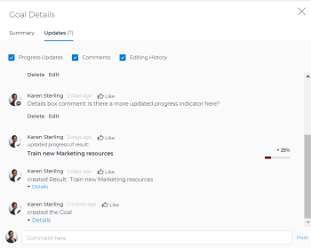

# Actualizar objetivos en la sección Detalles del objetivo de los objetivos de Adobe Workfront

<!--drafted for the goal redesign:
- change the title for Production to Update goals in the Goal details section in Adobe Workfront Goals. 
- update the description in the metadata above
-->

Puede actualizar la información para objetivos individuales accediendo al panel Detalles del objetivo .

>[!NOTE]
>
>No puede actualizar los objetivos que tengan el estado Cerrado.

## Requisitos de acceso

<!--drafted for P&P release: replace the existing requirements with this:

You must have the following: 

<table style="table-layout:auto">
 <col>
 </col>
 <col>
 </col>
 <tbody>
  <tr>
   <td role="rowheader">Adobe Workfront plan*</td>
   <td>
   
Current plan: Select or higher

   Or
   
Legacy plan: Pro or higher

   
   </td>
  </tr>
  <tr>
   <td role="rowheader">Adobe Workfront license*</td>
   <td>
   
Current license: Contributor or higher

   Or
   
Legacy license: Request or higher
 
For more information, see <a href="../../administration-and-setup/add-users/access-levels-and-object-permissions/wf-licenses.md" class="MCXref xref">Adobe Workfront licenses overview</a>.
 </td>
  </tr>
  <tr>
   <td role="rowheader">Product</td>
   <td>
   
 Current product requirement: If you have the Select or Prime Adobe Workfront plan, you must also buy an additional Adobe Workfront Goals license.  Workfront Goals are included in the Ultimate Workfront Plan.

   Or
   
Legacy product requirement: You must purchase an additional license for the Adobe Workfront Goals to access functionality described in this article. 
 
For information, see <a href="../../workfront-goals/goal-management/access-needed-for-wf-goals.md" class="MCXref xref">Requirements to use Workfront Goals</a>. 
 </td>
  </tr>
  <tr>
   <td role="rowheader">Access level*</td>
   <td> 
Edit access to Goals
 
<b>NOTE</b>
If you still don't have access, ask your Workfront administrator if they set additional restrictions in your access level. For information on how a Workfront administrator can change your access level, see:

     <ul>
      <li> 
<a href="../../administration-and-setup/add-users/configure-and-grant-access/create-modify-access-levels.md" class="MCXref xref">Create or modify custom access levels</a> 
 </li>
      <li> 
<a href="../../administration-and-setup/add-users/configure-and-grant-access/grant-access-goals.md" class="MCXref xref">Grant access to Adobe Workfront Goals</a> 
 </li>
     </ul> 
 </td>
  </tr>
  <tr data-mc-conditions="">
   <td role="rowheader">Object permissions</td>
   <td>
    

     
View or higher permissions to the goal to view it

     
Manage permissions to the goal to edit it

     
For information about sharing goals, see <a href="../../workfront-goals/workfront-goals-settings/share-a-goal.md" class="MCXref xref">Share a goal in Workfront Goals</a>. 

    
 </td>
  </tr>
 </tbody>
</table>

-->

Debe tener lo siguiente:

<table style="table-layout:auto"> 
 <col> 
 <col> 
 <tbody> 
  <tr> 
   <td role="rowheader">plan de Adobe Workfront*</td> 
   <td> 
Pro o superior
 </td> 
  </tr> 
  <tr> 
   <td role="rowheader">Licencia de Adobe Workfront*</td> 
   <td> 
Solicitud o superior
 
Para obtener más información, consulte <a href="../../administration-and-setup/add-users/access-levels-and-object-permissions/wf-licenses.md" class="MCXref xref">Información general sobre las licencias de Adobe Workfront</a>.
 </td> 
  </tr> 
  <tr> 
   <td role="rowheader">Product</td> 
   <td> 
Debe adquirir una licencia adicional para los objetivos de Adobe Workfront para acceder a la funcionalidad que se describe en este artículo. 
 
Para obtener más información, consulte <a href="../../workfront-goals/goal-management/access-needed-for-wf-goals.md" class="MCXref xref">Requisitos para utilizar los objetivos de Workfront</a>. 
 </td> 
  </tr> 
  <tr> 
   <td role="rowheader">Configuraciones de nivel de acceso*</td> 
   <td> 
Editar acceso a Objetivos o posterior
 
<b>NOTA</b>
Si todavía no tiene acceso, pregunte a su administrador de Workfront si establece restricciones adicionales en su nivel de acceso. Para obtener información sobre cómo un administrador de Workfront puede cambiar su nivel de acceso, consulte:
 
     <ul> 
      <li> 
<a href="../../administration-and-setup/add-users/configure-and-grant-access/create-modify-access-levels.md" class="MCXref xref">Crear o modificar niveles de acceso personalizados</a> 
 </li> 
      <li> 
<a href="../../administration-and-setup/add-users/configure-and-grant-access/grant-access-goals.md" class="MCXref xref">Conceder acceso a los objetivos de Adobe Workfront</a> 
 </li> 
     </ul> 
 </td> 
  </tr> 
  <tr data-mc-conditions=""> 
   <td role="rowheader">Permisos de objeto</td> 
   <td> 
    
 
     
Administrar permisos para el objetivo
 
     
Para obtener información sobre cómo compartir objetivos, consulte <a href="../../workfront-goals/workfront-goals-settings/share-a-goal.md" class="MCXref xref">Compartir un objetivo en los objetivos de Workfront</a>. 
 
    
 </td> 
  </tr> 
 </tbody> 
</table>

*Para saber qué plan, tipo de licencia o acceso tiene, póngase en contacto con el administrador de Workfront.

## Requisitos previos

Debe tener lo siguiente para poder iniciar:

* Plantilla de diseño que incluye el área Objetivos del menú principal.

## Actualizar objetivos en la sección Detalles del objetivo

Puede acceder a un objetivo individual desde una lista de objetivos.

<!--

Updating goals in the Goal Details panel differs depending on where you access the goal from. 

### Update goals in the Goal Details panel in the Production environment

1. Click the **Main Menu** icon  > **Goals** in the upper-right corner.

   (!-- Add this when Shell is available to all: or (if available), click the **Main Menu** icon  in the upper-left corner)
   --)

   This opens the Goals area in Workfront. 

1. Click the name of a goal in the Goal List, then click the name of a goal.

   This opens the Goal Details panel on the right.
   

   >[!TIP]
   >
   >You can also click the name of a goal in the Goal Alignment, Check-in, or Pulse sections. 
   >
   ><!-- drafted for goal redesign:
   >Add this to the TIP above with goal redesign: 
   >
   >The Check-in and Pulse sections have been removed from the Preview environment.
   >

1. On the Summary tab, click the **More icon** , then click any of the following options:

   1. **Edit**. For information about editing goals, see [Edit goals in Adobe Workfront Goals](../../workfront-goals/goal-management/edit-goals.md).
   1. **Copy**. For information about copying goals, see [Copy goals in Adobe Workfront Goals](../../workfront-goals/goal-management/copy-goals.md).
   1. **Activate**. This option is available only for drafted and inactive goals.

      For information about activating goals, see [Access and open goals in Adobe Workfront Goals](../../workfront-goals/goal-management/access-goals-in-wf-goals.md). 
   
   1. **Close**, then click**Close Goal**. This option is available only for active goals.

      For information about closing goals, see [Close and reopen goals in Adobe Workfront Goals](../../workfront-goals/goal-management/close-and-reopen-goals.md). 
   
   1. **Deactivate**. This option is available only for active goals. This deactivates the goal immediately.

      For information about deactivating goals, see [Delete and deactivate goals in Adobe Workfront Goals](../../workfront-goals/goal-management/delete-and-deactivate-goals.md).
   
   1. **Delete**, then click **Yes, Delete**.

      For information about deleting goals, see [Delete and deactivate goals in Adobe Workfront Goals](../../workfront-goals/goal-management/delete-and-deactivate-goals.md).

      >[!NOTE]
      >
      >Deleted goals cannot be recovered.

   1. **Reopen**, then click **Reopen**. This option is available only for closed goals that are from a current time period.

      For information about reopening goals, see [Close and reopen goals in Adobe Workfront Goals](../../workfront-goals/goal-management/close-and-reopen-goals.md). 
   
   1. (Conditional) If you clicked any of the options between steps a-i above except Delete or Reopen, click **Save**.    
   
      (!--ensure this is accurate)--)

1. Click **Align to another goal** in the upper-right of the Summary tab, then specify the name of a goal in the **Align to** **another goal** field that you want to align the current goal to. The current goal becomes the child of the goal you align it to. For information about child and parent goals, see [Align goals by connecting them in Adobe Workfront Goals](../../workfront-goals/goal-alignment/align-goals-by-connecting-them.md). 
1. Click **Add results**. Results drive the progress of your goal. For information about adding results, see [Add results to goals in Adobe Workfront Goals](../../workfront-goals/results-and-activities/add-results-to-goals.md).

1. Click **Add activities**. Activities drive the progress of your goal. For information about adding activities, see [Add activities to goals in Adobe Workfront Goals](../../workfront-goals/results-and-activities/add-activities-to-goals.md). 

1. Click the **Updates** tab. Here, you can view goal comments and review the entire editing history of the goal, activities, and results, to understand who changed what and when.

   

1. (Optional) Deselect any of the following options if you want to not display them in the Updates tab.&nbsp;They are selected by default: 

   | Option |Description  |
   |---|---|
   | Progress Updates |Displays information about the history of progress updates on results and activities.  |
   | Comments |Displays comments made by users on the goal.  |
   | Editing History |Displays information about creating and updating the goal, results, and activities.  |

1. (Optional) Click **Details** under a progress or an editing history update to display additional information about the update.

   

-->

1. Haga clic en el nombre de un objetivo en la lista de objetivos y, a continuación, haga clic en el nombre de un objetivo.

   Esto abre el **Detalles del objetivo** a la izquierda.

   

1. Haga clic en el **Icono Editar**  en la esquina superior derecha, haga clic en **Editar todo** o **Información general**

   O

   Empiece a escribir información en uno de los campos editables de la sección Detalles del objetivo . La sección se puede editar.

   >[!IMPORTANT]
   >
   >No se pueden editar todos los campos que se muestran en la sección Detalles del objetivo. Workfront calcula algunos de los campos y son de solo lectura.

1. Actualice o revise los campos siguientes:

   * **Descripción**: Agregue o actualice información sobre el objetivo.
   * **Progreso**: Indica qué porcentaje del objetivo se ha completado hasta ahora. No se puede actualizar manualmente el progreso de un objetivo. El progreso del objetivo es un cálculo de todos los indicadores de progreso.
   * **Condición**: Indica si el objetivo es nuevo y aún no se ha actualizado, si está en la meta para completarse a tiempo o si está retrasado. No se puede actualizar la condición de un objetivo. Worfront calcula automáticamente la condición del objetivo.\
      Para obtener más información sobre la condición y el progreso del objetivo, consulte
      [Resumen del progreso y la condición del objetivo en los objetivos de Adobe Workfront](../goal-management/calculate-goal-progress.md).
   * **Estado**: No se puede actualizar manualmente el estado de un objetivo. Para obtener más información, consulte [Información general sobre el estado de los objetivos en los objetivos de Adobe Workfront](../goal-management/goal-status-overview.md).
   * **Propietario del objetivo**: Haga clic en para actualizar el nombre del propietario del objetivo. Empiece a escribir el nombre de un usuario, equipo, grupo o el nombre de su organización y selecciónelo cuando aparezca en la lista. Solo se puede tener un propietario para un objetivo.
   * **Objetivo principal**: Empiece a escribir el nombre de un objetivo que desee establecer como el principal del objetivo seleccionado. El progreso del objetivo seleccionado actualizará automáticamente el progreso del objetivo principal.

      >[!TIP]
      >
      >No se puede actualizar la siguiente información sobre un objetivo principal:
      >    * Período de la meta principal
      >    * Progreso de la meta principal
      >    * Propietario de la meta principal.

      >      
      >Debe actualizar esta información sobre el objetivo principal en sí.

   * **Periodo**: Haga clic en para actualizar el período de tiempo para el objetivo\
      O\
      Select **Habilitar fechas personalizadas** para especificar fechas para el **Inicio** y **Fechas de finalización**.
   * **Notas de cierre**: Este campo solo está visible para los objetivos con el estado Cerrado. Los objetivos cerrados no se pueden editar. Al volver a abrir un objetivo cerrado, se eliminan permanentemente las notas de cierre.

