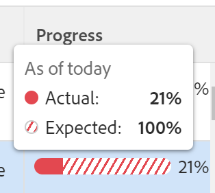

# Revisar los objetivos en problemas en Adobe Workfront Goals

<!--

(NOTE: the status of goals in "red" used to be called At Risk. Now, it is "in trouble") 

-->

Las metas con un progreso de problemas corren el riesgo de no alcanzarse y están representadas por una barra de progreso roja en las metas de Adobe Workfront. Debe revisar sus objetivos con frecuencia y comprender por qué el progreso está rezagado. Para obtener información sobre el progreso de la meta, consulte [Información general sobre el progreso y la condición de la meta en Adobe Workfront Goals](../../workfront-goals/goal-management/calculate-goal-progress.md).

## Requisitos de acceso

Debe tener lo siguiente:

<table style="table-layout:auto">
<col>
</col>
<col>
</col>
<tbody>
 <tr> 
   <td role="rowheader">plan Adobe Workfront*</td> 
   <td> 
   
Para el nuevo plan y la estructura de licencias:
  <ul><li>Un plan definitivo </li></ul>
   

Para el plan y la estructura de licencias actuales: 
<ul><li> A Pro o superior </li>
  <li>Una licencia de Adobe Workfront Goals además de una licencia de Workfront.</li></ul>

   </td> 
  </tr>
 <tr>
 <td role="rowheader">Licencia de Adobe Workfront*</td>
 <td>
 
Nueva licencia: Colaborador o superior

 O
 
Licencia actual: Solicitud o superior
 
Para obtener más información, consulte <a href="../../administration-and-setup/add-users/access-levels-and-object-permissions/wf-licenses.md" class="MCXref xref">Resumen de licencias de Adobe Workfront</a>.
 </td>
 </tr>
 <tr>
 <td role="rowheader">Producto*</td>
 <td>
 
 Nuevo requisito de producto, uno de los siguientes: 

<ul>
<li>Un plan Select or Prime Adobe Workfront y una licencia adicional de Adobe Workfront Goals.</li>
<li>Un plan Ultimate Workfront que incluye Workfront Goals de forma predeterminada. </li></ul>
 
O

 
Requisito de producto actual: un plan de Workfront y una licencia adicional para los objetivos de Adobe Workfront. 
 
Para obtener más información, consulte <a href="../../workfront-goals/goal-management/access-needed-for-wf-goals.md" class="MCXref xref">Requisitos para usar Workfront Goals</a>. 
 </td>
 </tr>
 <tr>
 <td role="rowheader">Nivel de acceso</td>
 <td> 
Editar acceso a Objetivos
</td>
 </tr>
 <tr data-mc-conditions="">
 <td role="rowheader">Permisos de objeto</td>
 <td>
  

  
Ver o permisos superiores a la meta para verla

  
Administrar permisos para el objetivo y editarlo

  
Para obtener información acerca de cómo compartir metas, vea <a href="../../workfront-goals/workfront-goals-settings/share-a-goal.md" class="MCXref xref">Compartir una meta en Workfront Goals</a>. 

  
 </td>
 </tr>
 <tr>
   <td role="rowheader">
Plantilla de diseño
</td>
   <td> 
A todos los usuarios, incluidos los administradores de Workfront, se les debe asignar una plantilla de diseño que incluya el área Objetivos en el menú principal. 
  
</td>
  </tr>
</tbody>
</table>

*Para obtener más información, consulte [Requisitos de acceso en la documentación de Workfront](/help/quicksilver/administration-and-setup/add-users/access-levels-and-object-permissions/access-level-requirements-in-documentation.md).

## Recommendations para evitar que los objetivos alcancen un progreso de En problemas

Antes de que las metas alcancen un progreso de En problemas, puede monitorizarlas a menudo y ajustar su progreso cuando alcanzan un progreso de En riesgo. Los objetivos que están en riesgo corren el riesgo de meterse en problemas. Para obtener más información acerca del progreso de la meta, consulte [Información general sobre el progreso y la condición de la meta en Adobe Workfront Goals](../../workfront-goals/goal-management/calculate-goal-progress.md)

Antes de que sus objetivos alcancen un progreso de En problemas, le recomendamos lo siguiente:

* Revise las metas que tienen una condición de En riesgo a menudo que se le asignan, así como las metas de la organización que se asignan a sus equipos, grupos o a su organización que pueden verse afectados por el progreso de sus metas. Las metas en riesgo corren el riesgo de convertirse en metas en problemas. Los objetivos en riesgo están marcados con una barra de progreso amarilla. Utilice la Lista de metas para ver las metas que le pertenecen a usted, a sus equipos, a grupos o a su organización.

## Revisar las metas en problemas en la lista de metas

Puede revisar las metas en cualquier sección de Workfront Goals. Para obtener información acerca de las secciones Objetivos de Workfront, consulte [Información general sobre las secciones Objetivos de Adobe Workfront](../../workfront-goals/goal-review-and-workfront-goals-sections/overview-of-wf-goals-sections.md).

Este artículo describe cómo revisar las metas en la Lista de metas.

1. Haga clic en el icono **Menú principal**  > **Metas** en la esquina superior derecha.

   <!-- Add this when Shell is available to all: or (if available), click the **Main Menu** icon  in the upper-left corner)
   -->

   Se abre el área de Objetivos de Workfront y la sección Lista de objetivos se muestra de forma predeterminada.

1. (Recomendado) Ajuste los siguientes filtros en el área Lista de objetivos para revisar los objetivos en riesgo:

   * Haz clic en **Empresa**, luego en **Mis equipos**, después en **Mis grupos** y después en **Personal** metas en este orden para ver las metas que pertenecen a tu organización, a tus equipos, grupos y luego a tus propias metas.

     >[!TIP]
     >
     >En Adobe Workfront Goals, el filtro Compañía muestra las metas para las que su organización está seleccionada como propietaria.
     >
     >
     >No puede buscar compañías utilizando este campo. De forma predeterminada, solo está seleccionada la organización que es el propietario de la instancia de Workfront.

   * Para cada una de las unidades organizativas que ha seleccionado anteriormente, haga clic en **Nuevo filtro** > **Progreso** > **Con problemas** >**Aplicar.**
   * (Opcional) Seleccione el período de tiempo para el que desea ver las metas.

     El indicador de la barra de progreso se muestra en rojo para cada objetivo de la lista de objetivos.

     Para obtener más información sobre cómo filtrar metas usando todos los demás criterios del panel derecho, consulte [Filtrar información en Adobe Workfront Goals](../../workfront-goals/goal-management/filter-information-wf-goals.md).

1. Pase el ratón sobre el indicador de la barra de progreso para ver cuál es el porcentaje de progreso real y cuál es el valor esperado para el día actual.

   

1. (Opcional) Utilice los filtros para buscar metas que pertenezcan a un propietario específico.

   Las metas en problemas de los usuarios seleccionados se muestran en la lista de metas.

1. Haga clic en un nombre de meta para abrir la página de metas y luego haga clic en **Indicadores de progreso** en el panel izquierdo. Vea qué indicador de progreso hace que la meta esté retrasada y actualice el progreso del indicador en línea, en la columna **Progreso real** de la lista Indicadores de progreso.

   Para obtener información sobre cómo actualizar resultados y actividades, consulte [Actualizar progreso de objetivos en Adobe Workfront Goals](../goal-review-and-workfront-goals-sections/check-in-goals.md)

   

   >[!NOTE]
   >
   >En la lista Progress indicators solo se pueden actualizar los resultados y las actividades. Debe actualizar los indicadores de progreso de las metas secundarias accediendo a las metas y debe actualizar las tareas en los proyectos conectados para actualizar el progreso de los proyectos.

