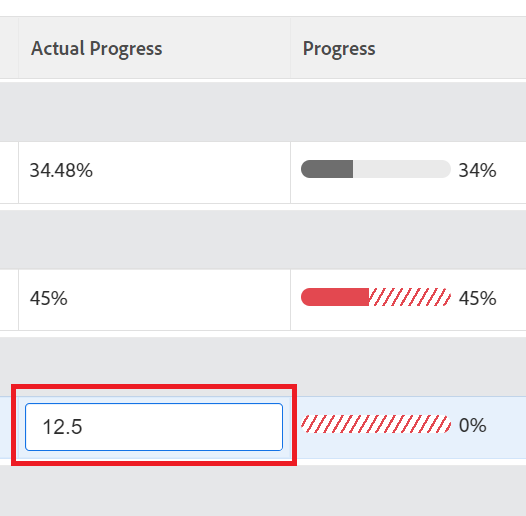

# Actualizar el progreso de las metas en Adobe Workfront Goals

<!-- Audited for P&P only: 10/2025-->

Debe revisar sus metas periódicamente y actualizar su progreso para asegurarse de que no se quedan atrás o corren el riesgo de no alcanzarse.

<!--And: take this last sentence ^^ out when you update this for goal redesign production.-->

## Requisitos de acceso

>[!NOTE]
>
>Su empresa puede optar por seguir utilizando los objetivos de Adobe Workfront si compró este paquete anteriormente. Debe hablar con el representante de su cuenta para obtener más detalles.
>
>Adobe Workfront Goals ya no se puede adquirir.

+++ Expanda para ver los requisitos de acceso para la funcionalidad en este artículo. 

<table style="table-layout:auto">
<col>
</col>
<col>
</col>
<tbody>
 <tr>
  <td> 
paquete de Adobe Workfront
 </td> 
   <td> 
   
Adobe Workfront Ultimate

   </td> 
  </tr>
 <tr>
 <td role="rowheader">Licencia de Adobe Workfront</td>
 <td>
 
Colaborador o superior

Solicitud o superior
</td>
 </tr>
  <tr>
 <td role="rowheader">Configuración de nivel de acceso</td>
 <td> 
Editar acceso a Goals
 </td>
 </tr>
 <tr data-mc-conditions="">
 <td role="rowheader">Permisos de objeto</td>
 <td>
  

  
Permisos Ver o superiores para la meta que desea ver

  
Permisos de administración para la meta y poder editarla

  
 </td>
 </tr>
<tr>
   <td role="rowheader">
Plantilla de diseño
</td>
   <td> 
A todos los usuarios, incluidos los administradores del sistema, se les debe asignar una plantilla de diseño que incluya el área Objetivos en el menú principal. 
  
</td>
  </tr>
</tbody>
</table>

Para obtener más información, consulte [Requisitos de acceso en la documentación de Workfront](/help/quicksilver/administration-and-setup/add-users/access-levels-and-object-permissions/access-level-requirements-in-documentation.md).

+++

<!--Old:

<table style="table-layout:auto">
<col>
</col>
<col>
</col>
<tbody>
 <tr> 
   <td role="rowheader">Adobe Workfront plan*</td> 
   <td> 
   
For the new plan and license structure:
  <ul><li>An Ultimate plan </li></ul>
   

For the current plan and license structure: 
<ul><li> A Pro or higher </li>
  <li>An Adobe Workfront Goals license in addition to a Workfront license.</li></ul>

   </td> 
  </tr>
 <tr>
 <td role="rowheader">Adobe Workfront license*</td>
 <td>
 
New license: Contributor or higher

 Or
 
Current license: Request or higher
 
For more information, see <a href="../../administration-and-setup/add-users/access-levels-and-object-permissions/wf-licenses.md" class="MCXref xref">Adobe Workfront licenses overview</a>.
 </td>
 </tr>
 <tr>
 <td role="rowheader">Product*</td>
 <td>
   
 New product requirement: Workfront

   Or
   
Current product requirement: In addition to a Workfront license, you must purchase a license for Adobe Workfront Goals. 
 
For information, see <a href="../../workfront-goals/goal-management/access-needed-for-wf-goals.md" class="MCXref xref">Requirements to use Workfront Goals</a>. 
 </td>
 </tr>
 <tr>
 <td role="rowheader">Access level</td>
 <td> 
Edit access to Goals
</td>
 </tr>
 <tr data-mc-conditions="">
 <td role="rowheader">Object permissions</td>
 <td>
  

  
View or higher permissions to the goal to view it

  
Manage permissions to the goal to edit it

  
For information about sharing goals, see <a href="../../workfront-goals/workfront-goals-settings/share-a-goal.md" class="MCXref xref">Share a goal in Workfront Goals</a>. 

  
 </td>
 </tr>
<tr>
   <td role="rowheader">
Layout template
</td>
   <td> 
All users, including Workfront administrators,  must be assigned a layout template that includes the Goals area in the Main Menu. 
  
</td>
  </tr>
</tbody>
</table>-->

## Requisitos previos

Debe tener un meta activa para poder empezar.

No puede actualizar el progreso de metas que sean borradores, estén inactivas o estén cerradas.

## Consideraciones para actualizar metas

Tenga en cuenta lo siguiente al actualizar el progreso de las metas:

* Workfront Goals calcula automáticamente el progreso de una meta cuando se actualiza el progreso de sus indicadores de progreso.

  >[!TIP]
  >
  >No puede actualizar el progreso directamente de una meta. Debe actualizar el progreso de los indicadores de progreso de la meta (actividades, resultados, proyectos conectados) que a su vez actualizan el progreso de la meta. Para actualizar el progreso de los proyectos, debe actualizar las tareas del proyecto.

  Consulte también los siguientes artículos:

   * Para obtener información sobre cómo añadir actividades a las metas, consulte [Añadir actividades a las metas en Adobe Workfront Goals](../../workfront-goals/results-and-activities/add-activities-to-goals.md).
   * Para obtener información sobre cómo añadir resultados a las metas, consulte [Añadir resultados a las metas en Adobe Workfront Goals](../../workfront-goals/results-and-activities/add-results-to-goals.md).
   * Para obtener información sobre cómo Workfront Goals calcula el progreso de una meta, consulte [Información general sobre el progreso y la condición de metas en Adobe Workfront Goals](../../workfront-goals/goal-management/calculate-goal-progress.md).

* Debe crear metas y activarlas para poder actualizar su progreso.

  Consulte también los siguientes artículos:

   * Para obtener información sobre la creación de metas, consulte [Crear metas en Adobe Workfront Goals](../../workfront-goals/goal-management/create-goals.md).
   * Para obtener información sobre la activación de metas, consulte [Activar metas en Adobe Workfront Goals](../../workfront-goals/goal-management/activate-goals.md).

  >[!IMPORTANT]
  >
  >No puede actualizar el progreso de las metas que son borradores, están cerradas o estén inactivas.

* La primera vez que usted u otra persona actualizan el progreso de un resultado o actividad en una meta, el progreso de la meta cambia de Nuevo y Workfront Goals comienza a registrar el progreso y las actualizaciones de estado de progreso de la meta.

<!--

## Update goal progress by using Check-in in the Production environment

>[!IMPORTANT]
>
>  The Check-in functionality has been removed from the Preview environment and will be removed from Workfront Goals with the 23.1 release. See the [Update goal progress in the Preview environment](#update-goal-progress-in-the-preview-environment) section in this article to update goal progress in Preview. 

You can check in on goals at the individual goal level, or you can check in on multiple goals from the Check-in section of Workfront Goals.

* [Update individual goals](#update-individual-goals) 
* [Update goals in the Check-in section](#update-goals-in-the-check-in-section)

### Update individual goals {#update-individual-goals}

When you check in on a goal at the goal level, you can update the progress of the results and activities that are assigned to you or other users.

For information about how to update additional information about results and activities, see [Edit results and activities in Adobe Workfront Goals](../../workfront-goals/results-and-activities/edit-results-and-activities.md).

1. Click the **Main Menu** icon  > **Goals** in the upper-right corner.

   (!-- Add this when Shell is available to all: or (if available), click the **Main Menu** icon  in the upper-left corner)
   --)

   This opens the Workfront Goals area.

   All goals display by default. 

1. (Optional) Click any of the following sections in the left panel to access a list of goals:

   * Goal Alignment 
   * Pulse 
   * Check-in

   Or

   From the Goal List, click the name of a goal to open the **Goal Details** panel on the right.

   >[!TIP]
   >
   >You must have Edit access to Goals in your Access Level to view the Check-in section or the Check in button.

1. Click **Check in**.

   

   The progress of results and activities becomes editable.

1. Update the current progress on each of the results. Depending on what type of result you selected, you can do one of the following:

   * Update the quantity 
   * Update the currency amount
   * Update the percent complete

1. Update the percent complete on the Manual progress bar activity.

   >[!TIP]
   >
   >When you add projects as activities to your goals, you cannot manually update projects at the goal level. Workfront automatically updates project progress based on the project of their tasks. When the project percent complete updates in Workfront, the goal progress associated with the project also updates automatically.

1. Click **Back to Summary** to return to the Goal Details panel.

   Your goal progress updates as you update the results and activities of your goal. 

1. Click the **X icon** in the upper-right corner of the Goal Details panel to close it.

### Update goals in the Check-in section {#update-goals-in-the-check-in-section}

You can use the Check-in section to check in on goals when you want to quickly provide updates for several goals at the same time.

>[!TIP]
>
>You can access the Check-in section from any of the following sections:
>
>* Goal List 
>* Goal Alignment 
>* Pulse 
>

When you check in on a goal in the Check-in section, you can update the progress of the results and activities that are assigned only to you. You cannot update the progress of results and activities that are assigned to other users in this section.

1. Click the **Main Menu** icon  > **Goals** in the upper-right corner.

   (!-- Add this when Shell is available to all: or (if available), click the **Main Menu** icon  in the upper-left corner)
   --)

   This opens the Workfront Goals area and the Goal List section displays by default. 

1. Click Check-in in the left panel.

   Or

   (Conditional) If you are in the Goal List, Goal Alignment, or Pulse sections, click the **Check in** button in the upper-right of the screen. This opens the Check-in section.

   

   Goals display in a list and results and activities are listed under each goal.

   

1. (Optional) Click **Show all results**, **Show all activities**, or **Show all aligned goals** to the far right of the goal name to display all results, activities, and aligned goals of a goal whose progress you want to update.

   >[!CAUTION]
   >
   >You cannot directly update aligned goals, but you can update their results and activities.

1. Update the current progress on each of the results assigned to you. Depending on what type of result you selected, you can do one of the following:

   * Update the quantity 
   * Update the currency amount
   * Update the percent complete

   The result and the goal progress updated automatically and you receive a confirmation of your changes.

1. Update the percent complete on your Manual progress bar activity.

   >[!TIP]
   >
   >When you add projects as activities to your goals, you cannot manually update projects at the goal level. Workfront automatically updates project progress based on the project of their tasks. When the project percent complete updates in Workfront, the goal progress associated with the project also updates automatically.

   The activity and the goal progress updated automatically and you receive a confirmation of your changes.

1. (Optional) Add a comment for your goal, then click **Post** to save your comment.

-->

Para actualizar el progreso de las metas:

1. Haga clic en el icono **Menú principal**  > **Metas** en la esquina superior derecha.

   <!-- Add this when Shell is available to all: or (if available), click the **Main Menu** icon  in the upper-left corner)
   -->

   Se abrirá la lista de metas. Todas las metas a las que tiene acceso se muestran de forma predeterminada.

   También puede hacer clic en Alineación de metas en el panel izquierdo.

1. En la Lista de metas, haga clic en el nombre de una meta para abrir su página.
1. Haga clic en **Indicadores de progreso** en el panel de la izquierda.

   La lista Indicadores de progreso muestra todos los indicadores de progreso para el objetivo seleccionado.

   >[!NOTE]
   >
   >  * Solo puede actualizar los resultados y las actividades.
   >  * Debe actualizar los indicadores de progreso de las metas secundarias para mostrar el progreso de dichas metas secundarias.
   >  * Debe actualizar las tareas de los proyectos conectados para mostrar el progreso de los proyectos.
   >   
   >    A su vez, el progreso de las metas secundarias y el progreso de los proyectos impulsan el progreso de la meta seleccionada.

1. Para actualizar el progreso de un resultado o actividad, haga clic en el valor dentro de la columna **Progreso real** del resultado o actividad y escriba un número para actualizar su valor; a continuación, presione Entrar.

   

   La barra de progreso del indicador de progreso de la columna Progreso y el progreso de la meta en el encabezado de la meta se actualizan inmediatamente.

