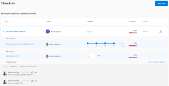

# Actualización del progreso del objetivo en los objetivos de Adobe Workfront

Debe revisar sus objetivos periódicamente y actualizar su progreso para asegurarse de que no se queden atrás o corren el riesgo de no alcanzarse.

<!--And: take this last sentence ^^ out when you update this for goal redesign production.-->

## Requisitos de acceso

<!--drafted for P&P release:

You must have the following: 

<table style="table-layout:auto">
 <col>
 </col>
 <col>
 </col>
 <tbody>
  <tr>
   <td role="rowheader">Adobe Workfront plan*</td>
   <td>
   
Current plan: Select or higher

   Or
   
Legacy plan: Pro or higher

   
   </td>
  </tr>
  <tr>
   <td role="rowheader">Adobe Workfront license*</td>
   <td>
   
Current license: Contributor or higher

   Or
   
Legacy license: Request or higher
 
For more information, see <a href="../../administration-and-setup/add-users/access-levels-and-object-permissions/wf-licenses.md" class="MCXref xref">Adobe Workfront licenses overview</a>.
 </td>
  </tr>
  <tr>
   <td role="rowheader">Product</td>
   <td>
   
 Current product requirement: If you have the Select or Prime Adobe Workfront plan, you must also buy an additional Adobe Workfront Goals license.  Workfront Goals are included in the Ultimate Workfront Plan.

   Or
   
Legacy product requirement: You must purchase an additional license for the Adobe Workfront Goals to access functionality described in this article. 
 
For information, see <a href="../../workfront-goals/goal-management/access-needed-for-wf-goals.md" class="MCXref xref">Requirements to use Workfront Goals</a>. 
 </td>
  </tr>
  <tr>
   <td role="rowheader">Access level*</td>
   <td> 
Edit access to Goals
 
<b>NOTE</b>
If you still don't have access, ask your Workfront administrator if they set additional restrictions in your access level. For information on how a Workfront administrator can change your access level, see:

     <ul>
      <li> 
<a href="../../administration-and-setup/add-users/configure-and-grant-access/create-modify-access-levels.md" class="MCXref xref">Create or modify custom access levels</a> 
 </li>
      <li> 
<a href="../../administration-and-setup/add-users/configure-and-grant-access/grant-access-goals.md" class="MCXref xref">Grant access to Adobe Workfront Goals</a> 
 </li>
     </ul> 
 </td>
  </tr>
  <tr data-mc-conditions="">
   <td role="rowheader">Object permissions</td>
   <td>
    

     
View or higher permissions to the goal to view it

     
Manage permissions to the goal to edit it

     
For information about sharing goals, see <a href="../../workfront-goals/workfront-goals-settings/share-a-goal.md" class="MCXref xref">Share a goal in Workfront Goals</a>. 

    
 </td>
  </tr>
 </tbody>
</table>

-->

Debe tener lo siguiente:

<table style="table-layout:auto"> 
 <col> 
 <col> 
 <tbody> 
  <tr> 
   <td role="rowheader">plan de Adobe Workfront*</td> 
   <td> 
Pro o superior
 </td> 
  </tr> 
  <tr> 
   <td role="rowheader">Licencia de Adobe Workfront*</td> 
   <td> 
Solicitud o superior
 
Para obtener más información, consulte <a href="../../administration-and-setup/add-users/access-levels-and-object-permissions/wf-licenses.md" class="MCXref xref">Información general sobre las licencias de Adobe Workfront</a>.
 </td> 
  </tr> 
  <tr> 
   <td role="rowheader">Product</td> 
   <td> 
Debe adquirir una licencia adicional para los objetivos de Adobe Workfront para acceder a la funcionalidad que se describe en este artículo. 
 
Para obtener más información, consulte <a href="../../workfront-goals/goal-management/access-needed-for-wf-goals.md" class="MCXref xref">Requisitos para utilizar los objetivos de Workfront</a>. 
 </td> 
  </tr> 
  <tr> 
   <td role="rowheader">Configuraciones de nivel de acceso*</td> 
   <td> 
Editar acceso a Objetivos o posterior
 
<b>NOTA</b>
Si todavía no tiene acceso, pregunte a su administrador de Workfront si establece restricciones adicionales en su nivel de acceso. Para obtener información sobre cómo un administrador de Workfront puede cambiar su nivel de acceso, consulte:
 
     <ul> 
      <li> 
<a href="../../administration-and-setup/add-users/configure-and-grant-access/create-modify-access-levels.md" class="MCXref xref">Crear o modificar niveles de acceso personalizados</a> 
 </li> 
      <li> 
<a href="../../administration-and-setup/add-users/configure-and-grant-access/grant-access-goals.md" class="MCXref xref">Conceder acceso a los objetivos de Adobe Workfront</a> 
 </li> 
     </ul> 
 </td> 
  </tr> 
  <tr data-mc-conditions=""> 
   <td role="rowheader">Permisos de objeto</td> 
   <td> 
    
 
     
Administrar permisos para el objetivo
 
     
Para obtener información sobre cómo compartir objetivos, consulte <a href="../../workfront-goals/workfront-goals-settings/share-a-goal.md" class="MCXref xref">Compartir un objetivo en los objetivos de Workfront</a>. 
 
    
 </td> 
  </tr> 
 </tbody> 
</table>

*Para saber qué plan, tipo de licencia o acceso tiene, póngase en contacto con el administrador de Workfront.

## Requisitos previos

Debe tener lo siguiente para poder iniciar:

* Plantilla de diseño que incluye el área Objetivos del menú principal.
* Un objetivo activo. No se puede actualizar el progreso en objetivos que sean borradores, inactivos o cerrados.

## Consideraciones para actualizar objetivos

Tenga en cuenta lo siguiente al actualizar el progreso en los objetivos:

* Los objetivos de Workfront calculan automáticamente el progreso de un objetivo al actualizar el progreso de sus indicadores de progreso.

   >[!TIP]
   >
   >No se puede actualizar el progreso directamente en un objetivo. Debe actualizar el progreso de los indicadores de progreso del objetivo (actividades, resultados, proyectos conectados) que, a su vez, actualiza el progreso del objetivo. Para actualizar el progreso de los proyectos, debe actualizar las tareas del proyecto.

   Consulte también los siguientes artículos:

   * Para obtener información sobre cómo agregar actividades a objetivos, consulte [Agregar actividades a objetivos en Objetivos de Adobe Workfront](../../workfront-goals/results-and-activities/add-activities-to-goals.md).
   * Para obtener información sobre cómo agregar resultados a objetivos, consulte [Agregar resultados a objetivos en Objetivos de Adobe Workfront](../../workfront-goals/results-and-activities/add-results-to-goals.md).
   * Para obtener información sobre cómo calculan los objetivos de Workfront el progreso en un objetivo, consulte [Resumen del progreso y la condición del objetivo en los objetivos de Adobe Workfront](../../workfront-goals/goal-management/calculate-goal-progress.md).

* Debe crear objetivos y activarlos antes de poder actualizar su progreso.

   Consulte también los siguientes artículos:

   * Para obtener información sobre la creación de objetivos, consulte [Crear objetivos en objetivos de Adobe Workfront](../../workfront-goals/goal-management/create-goals.md).
   * Para obtener información sobre la activación de objetivos, consulte la [Activar objetivos en objetivos de Adobe Workfront](../../workfront-goals/goal-management/activate-goals.md).

   >[!IMPORTANT]
   >
   >No se puede actualizar el progreso de los objetivos que están redactados, cerrados o inactivos.

* La primera vez que usted u otra persona actualiza el progreso de un resultado o actividad en un objetivo, el progreso del objetivo cambia de Nuevo y los Objetivos de Workfront empiezan a registrar el progreso y las actualizaciones de estado del progreso en el objetivo.

<!--

## Update goal progress by using Check-in in the Production environment

>[!IMPORTANT]
>
>  The Check-in functionality has been removed from the Preview environment and will be removed from Workfront Goals with the 23.1 release. See the [Update goal progress in the Preview environment](#update-goal-progress-in-the-preview-environment) section in this article to update goal progress in Preview. 

You can check in on goals at the individual goal level, or you can check in on multiple goals from the Check-in section of Workfront Goals.

* [Update individual goals](#update-individual-goals) 
* [Update goals in the Check-in section](#update-goals-in-the-check-in-section)

### Update individual goals {#update-individual-goals}

When you check in on a goal at the goal level, you can update the progress of the results and activities that are assigned to you or other users.

For information about how to update additional information about results and activities, see [Edit results and activities in Adobe Workfront Goals](../../workfront-goals/results-and-activities/edit-results-and-activities.md).

1. Click the **Main Menu** icon  > **Goals** in the upper-right corner.

   (!-- Add this when Shell is available to all: or (if available), click the **Main Menu** icon  in the upper-left corner)
   --)

   This opens the Workfront Goals area.

   All goals display by default. 

1. (Optional) Click any of the following sections in the left panel to access a list of goals:

   * Goal Alignment 
   * Pulse 
   * Check-in

   Or

   From the Goal List, click the name of a goal to open the **Goal Details** panel on the right.

   >[!TIP]
   >
   >You must have Edit access to Goals in your Access Level to view the Check-in section or the Check in button.

1. Click **Check in**.

   

   The progress of results and activities becomes editable.

1. Update the current progress on each of the results. Depending on what type of result you selected, you can do one of the following:

   * Update the quantity 
   * Update the currency amount
   * Update the percent complete

1. Update the percent complete on the Manual progress bar activity.

   >[!TIP]
   >
   >When you add projects as activities to your goals, you cannot manually update projects at the goal level. Workfront automatically updates project progress based on the project of their tasks. When the project percent complete updates in Workfront, the goal progress associated with the project also updates automatically.

1. Click **Back to Summary** to return to the Goal Details panel.

   Your goal progress updates as you update the results and activities of your goal. 

1. Click the **X icon** in the upper-right corner of the Goal Details panel to close it.

### Update goals in the Check-in section {#update-goals-in-the-check-in-section}

You can use the Check-in section to check in on goals when you want to quickly provide updates for several goals at the same time.

>[!TIP]
>
>You can access the Check-in section from any of the following sections:
>
>* Goal List 
>* Goal Alignment 
>* Pulse 
>

When you check in on a goal in the Check-in section, you can update the progress of the results and activities that are assigned only to you. You cannot update the progress of results and activities that are assigned to other users in this section.

1. Click the **Main Menu** icon  > **Goals** in the upper-right corner.

   (!-- Add this when Shell is available to all: or (if available), click the **Main Menu** icon  in the upper-left corner)
   --)

   This opens the Workfront Goals area and the Goal List section displays by default. 

1. Click Check-in in the left panel.

   Or

   (Conditional) If you are in the Goal List, Goal Alignment, or Pulse sections, click the **Check in** button in the upper-right of the screen. This opens the Check-in section.

   

   Goals display in a list and results and activities are listed under each goal.

   

1. (Optional) Click **Show all results**, **Show all activities**, or **Show all aligned goals** to the far right of the goal name to display all results, activities, and aligned goals of a goal whose progress you want to update.

   >[!CAUTION]
   >
   >You cannot directly update aligned goals, but you can update their results and activities.

1. Update the current progress on each of the results assigned to you. Depending on what type of result you selected, you can do one of the following:

   * Update the quantity 
   * Update the currency amount
   * Update the percent complete

   The result and the goal progress updated automatically and you receive a confirmation of your changes.

1. Update the percent complete on your Manual progress bar activity.

   >[!TIP]
   >
   >When you add projects as activities to your goals, you cannot manually update projects at the goal level. Workfront automatically updates project progress based on the project of their tasks. When the project percent complete updates in Workfront, the goal progress associated with the project also updates automatically.

   The activity and the goal progress updated automatically and you receive a confirmation of your changes.

1. (Optional) Add a comment for your goal, then click **Post** to save your comment.

-->

Para actualizar el progreso en los objetivos:

1. Haga clic en el **Menú principal** icono  > **Objetivos** en la esquina superior derecha.

   <!-- Add this when Shell is available to all: or (if available), click the **Main Menu** icon  in the upper-left corner)
   -->

   Esto abre la lista de objetivos. Todos los objetivos a los que tiene acceso para ver se muestran de forma predeterminada.

   También puede hacer clic en Alineación de objetivo en el panel izquierdo.

1. En la lista de objetivos, haga clic en el nombre de un objetivo para abrir la página de objetivo.
1. Haga clic en **Indicadores de progreso** en el panel izquierdo.

   La lista Indicadores de progreso muestra todos los indicadores de progreso para el objetivo seleccionado.

   >[!NOTE]
   >
   >  * Solo puede actualizar los resultados y las actividades.
   >  * Debe actualizar los indicadores de progreso de los objetivos de los niños para mostrar el progreso en los objetivos de los niños.
   >  * Debe actualizar las tareas en los proyectos conectados para mostrar el progreso de los proyectos.

      >   
      >    A su vez, el progreso de los objetivos para la infancia y los proyectos impulsan el progreso del objetivo seleccionado.

1. Para actualizar el progreso de un resultado o actividad, haga clic en el valor dentro del **Progreso real** del resultado o actividad y escriba un número para actualizar su valor y, a continuación, pulse Intro.

   

   La barra de progreso del indicador de progreso en la columna Progreso y el progreso del objetivo en el encabezado de objetivo se actualizan inmediatamente.

