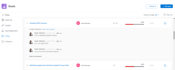

# Información general sobre las secciones de objetivos de Adobe Workfront

>[!NOTE]
>
>Su organización debe tener lo siguiente para utilizar la funcionalidad descrita en este artículo:
>
>* Un Pro o superior [plan de Adobe Workfront](https://www.workfront.com/plans).
>* Licencia de Adobe Workfront para objetivos además de una licencia de Workfront.
>
>  Póngase en contacto con el administrador de cuentas de Workfront para obtener más información sobre una licencia de Workfront para objetivos.
>
>Para obtener información adicional sobre el acceso a los objetivos de Workfront, consulte [Requisitos para utilizar los objetivos de Workfront](../../workfront-goals/goal-management/access-needed-for-wf-goals.md).

Una vez que el administrador de Workfront le haya concedido acceso a los objetivos de Workfront, podrá ver los objetivos que usted o cualquier otra persona de su organización hayan creado en el área de objetivos de Workfront .

Puede acceder a listas de objetivos o objetivos individuales y administrarlas desde varias secciones de Objetivos de Workfront. La sección que utilice dependerá del propósito que desee lograr al trabajar con los objetivos.

Puede aplicar filtros para mostrar solo los objetivos que son importantes para usted en cada sección.

>[!TIP]
>
>Los filtros actualizados en una sección se aplican automáticamente a las secciones Lista de objetivos, Gráficos y Alineación de objetivos . De esta forma, puede actualizarlas solo una vez. Para obtener más información, consulte [Filtrar información en objetivos de Adobe Workfront](../../workfront-goals/goal-management/filter-information-wf-goals.md).

A continuación se ofrece una breve descripción general de las secciones de Objetivos de Workfront y las opciones disponibles para administrar objetivos. Para obtener más información sobre las acciones adicionales que puede realizar dentro de cada sección de los objetivos de Workfront, también recomendamos los siguientes artículos:

* [Crear objetivos en objetivos de Adobe Workfront](../../workfront-goals/goal-management/create-goals.md)
* [Actualización del progreso del objetivo en los objetivos de Adobe Workfront](../../workfront-goals/goal-review-and-workfront-goals-sections/check-in-goals.md)
* [Filtrar información en objetivos de Adobe Workfront](../../workfront-goals/goal-management/filter-information-wf-goals.md)

## Lista de metas

Puede usar la lista de objetivos para revisar los objetivos que le pertenecen, a sus equipos, a grupos o a su organización. Puede ver los objetivos en cualquier estado y desde cualquier período de tiempo.

Para obtener información sobre cómo navegar por la lista de objetivos y administrar los objetivos, consulte [Administrar objetivos en la lista de objetivos de Adobe Workfront](../../workfront-goals/goal-review-and-workfront-goals-sections/manage-goals-in-goal-list.md).

Utilice la lista de objetivos para hacer lo siguiente:

* Vea los objetivos que le pertenecen, a sus equipos, grupos u organización.
* Revise los objetivos y su información (por ejemplo, nombre, propietario, progreso o condición).
* Añada nuevos objetivos.

   Para obtener más información, consulte [Crear objetivos en objetivos de Adobe Workfront](../../workfront-goals/goal-management/create-goals.md).

* Acceda a la página de un objetivo y edite y actualice el objetivo, sus resultados o actividades

   Para obtener más información, consulte [Editar objetivos en objetivos de Adobe Workfront](../../workfront-goals/goal-management/edit-goals.md).

* Editar objetivos.

## Gráficos

Puede utilizar la sección Gráficos para obtener una vista holística del estado de los objetivos que le pertenecen o que pertenecen a su organización. Puede ver información de progreso de los objetivos en cualquier estado desde cualquier período de tiempo en esta sección.

Para obtener información sobre el uso de la sección Gráficos , consulte [Revisar gráficos para comprender las tendencias de progreso de objetivos en los objetivos de Adobe Workfront](../../workfront-goals/goal-review-and-workfront-goals-sections/review-goal-graphs.md).

Utilice la sección Gráficos para hacer lo siguiente:

* Vea el rendimiento de los objetivos que le pertenecen, a sus equipos, grupos u organización.
* Ver el número de objetivos con un estado de progreso determinado.
* Comprender el desempeño semanal de sus objetivos.

## Alineación de metas

Si los objetivos están alineados entre sí, puede utilizar la sección Alineación de objetivos para mostrar y revisar todos los objetivos de su organización y su alineación entre sí. Los objetivos alineados se muestran aquí en tarjetas conectadas para ilustrar su alineación entre sí. Los objetivos principales se muestran primero y los objetivos secundarios se apilan detrás de ellos. Puede ver los objetivos en cualquier estado y desde cualquier período de tiempo en esta sección.

Para obtener información sobre cómo navegar por la sección Alineación de objetivos para administrar los objetivos, consulte [Vaya a la sección Alineación de objetivos en Objetivos de Adobe Workfront](../../workfront-goals/goal-alignment/navigate-goal-alignment-chart.md).

Para obtener información sobre la alineación de objetivos, consulte los siguientes artículos:

* [Alinear objetivos conectándolos en los objetivos de Adobe Workfront](../../workfront-goals/goal-alignment/align-goals-by-connecting-them.md)
* [Alinear objetivos convirtiendo resultados y actividades en objetivos](../../workfront-goals/goal-alignment/align-goals-by-converting-results-activities.md)

Utilice la sección Alineación de objetivos para hacer lo siguiente:

* Ver los objetivos que le pertenecen a usted o a su organización en formato de tarjeta.
* Mostrar jerarquía de objetivos y ver objetivos secundarios alineados.
* Acceda a la página de objetivo y actualice el objetivo, sus resultados o actividades.

<!--
## Pulse

 The Pulse section has been removed from the Preview environment and will be removed from Workfront Goals with the 23.1 release. Use the Goal List area to review goals that you or your teams are responsible for. 

You can use the Pulse section to review and request updates to goals that might influence the progress of your goals. These could be your own goals, or goals that belong to your teams, groups, or your organization. You can view goals in any status and from any time period in this section.

>[!TIP]
>
>Only goals that have been checked in on at least once display in the Pulse section.

For information about reviewing goals using the Pulse section, see [Review goals in the Adobe Workfront Goals Pulse section](../../workfront-goals/goal-review-and-workfront-goals-sections/review-goals-in-pulse.md).

Use the Pulse section to do the following:

* View goals that belong to your teams, groups, or organization. 
* Review goal progress and updates, including aligned goals, their results, and activities. 
* Make or ask for updates to a goal by adding a comment. 
* Access the Goal Details panel and edit and update the goal, its results, or activities.
* Add new goals. 
* Check in on goals.

  >[!TIP]
  >
  >Clicking Check in opens the Check-in section in the left panel.

## Check-in

 The Check-in section has been removed from the Preview environment and will be removed from Workfront Goals with the 23.1 release. Use the Goal List area to review goals that you or your teams are responsible for.

You must have access to Edit Goals in your access level before you can access the Check- in section. For information about granting access to Goals, see  [Grant access to Adobe Workfront Goals](../../administration-and-setup/add-users/configure-and-grant-access/grant-access-goals.md).

You can use the Check-in section to update active goals and any results and activities that you are the owner of. You can primarily view only goals in an Active status in this section. Children goals aligned to active parents also display in the Check-in section, regardless of their status.

>[!IMPORTANT]
>
>* A goal displays in the Check-in section only if it is assigned to you or if it has a result or activity that is assigned to you. 
>* If a goal assigned to you is the child goal of a parent that is not assigned to you and your goal (the child goal) is closed, inactive, or a draft, the parent goal does not display in your Check-in section. 
>

For information about managing goals in the Goal List, see [Manage goals in the Goal List of Adobe Workfront Goals](../../workfront-goals/goal-review-and-workfront-goals-sections/manage-goals-in-goal-list.md).

Use the Check-in section to do the following:

* Review goal progress and updates, including aligned goals, their results, and activities. 
* Update the progress on the results and activities that are assigned to you. For information about updating goals by checking in on them, see [Update goal progress in Adobe Workfront Goals](../../workfront-goals/goal-review-and-workfront-goals-sections/check-in-goals.md).

  >[!IMPORTANT]
  >
  >You can check in only on the results and activities assigned to you in the Check-in section, and not those that are assigned to other entities.

* Add a comment to a goal, then click Post to make or ask for updates to a goal. 
* Access the Goal Details panel and edit and update the goal, its results, or activities.
* Add new goals.
-->
