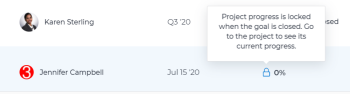

# Agregar proyectos a objetivos en Objetivos de Adobe Workfront

<!--
THIS MIGHT NEED TO BE RENAMED BECAUSE THERE WILL BE OTHER OBJECTS CONNECTED TO GOALS IN THE FUTURE
-->

Puede conectar proyectos a objetivos para indicar cómo progresa el objetivo, según el progreso real del proyecto. El proyecto se convierte en un indicador de progreso para el objetivo.

Al conectar proyectos a objetivos, puede enlazar la planificación estratégica (objetivos) de su organización con el trabajo real que su gente está realizando y completando cada día (proyectos).

>[!IMPORTANT]
>
>Los objetivos a nivel de proyecto creados en el área de Caso de negocio de un proyecto no están relacionados con los objetivos estratégicos creados en los objetivos de Workfront. Para obtener información sobre los objetivos del proyecto Caso empresarial, consulte [Crear objetivos de caso empresarial](../../manage-work/projects/define-a-business-case/create-business-case-goals.md).

## Requisitos de acceso

<!--drafted for P&P release: replace the table below with this: 

<table style="table-layout:auto">
 <col>
 </col>
 <col>
 </col>
 <tbody>
  <tr>
   <td role="rowheader">Adobe Workfront plan*</td>
   <td>
   
Current plan: Select or higher

   Or
   
Legacy plan: Pro or higher

   
   </td>
  </tr>
  <tr>
   <td role="rowheader">Adobe Workfront license*</td>
   <td>
   
Current license: Contributor or higher

   Or
   
Legacy license: Request or higher
 
For more information, see <a href="../../administration-and-setup/add-users/access-levels-and-object-permissions/wf-licenses.md" class="MCXref xref">Adobe Workfront licenses overview</a>.
 </td>
  </tr>
  <tr>
   <td role="rowheader">Product</td>
   <td>
   
 Current product requirement: If you have the Select or Prime Adobe Workfront plan, you must also buy an additional Adobe Workfront Goals license.  Workfront Goals are included in the Ultimate Workfront Plan.

   Or
   
Legacy product requirement: You must purchase an additional license for the Adobe Workfront Goals to access functionality described in this article. 
 
For information, see <a href="../../workfront-goals/goal-management/access-needed-for-wf-goals.md" class="MCXref xref">Requirements to use Workfront Goals</a>. 
 </td>
  </tr>
  <tr>
   <td role="rowheader">Access level*</td>
   <td> 
Edit access to Goals
 
<b>NOTE</b>
If you still don't have access, ask your Workfront administrator if they set additional restrictions in your access level. For information on how a Workfront administrator can change your access level, see:

     <ul>
      <li> 
<a href="../../administration-and-setup/add-users/configure-and-grant-access/create-modify-access-levels.md" class="MCXref xref">Create or modify custom access levels</a> 
 </li>
      <li> 
<a href="../../administration-and-setup/add-users/configure-and-grant-access/grant-access-goals.md" class="MCXref xref">Grant access to Adobe Workfront Goals</a> 
 </li>
     </ul> 
 </td>
  </tr>
  <tr data-mc-conditions="">
   <td role="rowheader">Object permissions</td>
   <td>
    

     
View or higher permissions to the goal to view it

     
Manage permissions to the goal to edit it

     
For information about sharing goals, see <a href="../../workfront-goals/workfront-goals-settings/share-a-goal.md" class="MCXref xref">Share a goal in Workfront Goals</a>. 

    
 </td>
  </tr>
 </tbody>
</table>

-->
Debe tener lo siguiente:

<table style="table-layout:auto"> 
 <col> 
 <col> 
 <tbody> 
  <tr> 
   <td role="rowheader">plan de Adobe Workfront*</td> 
   <td> 
Pro o superior
 </td> 
  </tr> 
  <tr> 
   <td role="rowheader">Licencia de Adobe Workfront*</td> 
   <td> 
Solicitud o superior
 
Para obtener más información, consulte <a href="../../administration-and-setup/add-users/access-levels-and-object-permissions/wf-licenses.md" class="MCXref xref">Información general sobre las licencias de Adobe Workfront</a>.
 </td> 
  </tr> 
  <tr> 
   <td role="rowheader">Product</td> 
   <td> 
Debe adquirir una licencia adicional para los objetivos de Adobe Workfront para acceder a la funcionalidad que se describe en este artículo. 
 
Para obtener más información, consulte <a href="../../workfront-goals/goal-management/access-needed-for-wf-goals.md" class="MCXref xref">Requisitos para utilizar los objetivos de Workfront</a>. 
 </td> 
  </tr> 
  <tr> 
   <td role="rowheader">Configuraciones de nivel de acceso*</td> 
   <td> 
Editar acceso a Objetivos
 
<b>NOTA</b>

Si todavía no tiene acceso, pregunte a su administrador de Workfront si establece restricciones adicionales en su nivel de acceso. Para obtener información sobre cómo un administrador de Workfront puede cambiar su nivel de acceso, consulte:
 
     <ul> 
      <li> 
<a href="../../administration-and-setup/add-users/configure-and-grant-access/create-modify-access-levels.md" class="MCXref xref">Crear o modificar niveles de acceso personalizados</a> 
 </li> 
      <li> 
<a href="../../administration-and-setup/add-users/configure-and-grant-access/grant-access-goals.md" class="MCXref xref">Conceder acceso a los objetivos de Adobe Workfront</a> 
 </li> 
     </ul> 
 </td> 
  </tr> 
  <tr data-mc-conditions=""> 
   <td role="rowheader">Permisos de objeto</td> 
   <td> 
    
 
     
Administrar permisos para el objetivo
 
     
Para obtener información sobre cómo compartir objetivos, consulte <a href="../../workfront-goals/workfront-goals-settings/share-a-goal.md" class="MCXref xref">Compartir un objetivo en los objetivos de Workfront</a>. 
 
    
 </td> 
  </tr> 
 </tbody> 
</table>

*Para saber qué plan, tipo de licencia o acceso tiene, póngase en contacto con el administrador de Workfront.

Para obtener información adicional sobre el acceso a los objetivos de Workfront, consulte [Requisitos para utilizar los objetivos de Workfront](../goal-management/access-needed-for-wf-goals.md).

## Consideraciones sobre la conexión de proyectos a objetivos

* Puede agregar un proyecto que cumpla los siguientes criterios a un objetivo:

   * Debe tener al menos permisos para verlo.

      >[!NOTE]
      >
      >Si pierde los permisos para ver el proyecto después de haber adjunto el proyecto al objetivo, podrá ver la información del proyecto sobre el objetivo, pero ya no podrá acceder al proyecto.

   * El proyecto no debe estar en estado de muerto.

* Puede asociar varios proyectos con un objetivo.
* Puede asociar el mismo proyecto con varios objetivos.
* No se puede actualizar manualmente el progreso de un proyecto desde el objetivo al que está adjunto el proyecto. En su lugar, Workfront calcula el porcentaje de finalización del proyecto y los objetivos de Workfront calculan el progreso del objetivo mediante este porcentaje de finalización. Esto actualiza el objetivo en tiempo real después de actualizar el porcentaje del proyecto.
* La duración del proyecto puede estar fuera del período de tiempo de un objetivo. Si un proyecto dura más de la fecha límite del objetivo, aún puede cerrar el objetivo y considerarlo completado, pero el porcentaje de objetivo completado no será del 100%. El porcentaje completado del proyecto ya no se actualiza en el objetivo.

<!--this is no longer visible in the new redesigned interface for goals: logged a bug for this: https://experience.adobe.com/#/@adobeinternalworkfront/so:hub-Hub/workfront/issue/63ceb049000080d30022aab9a359f6f1/updates - but confirmed that this will not be brought back at least for now - Jan 2023. 

There is an indication on the goal list that the project no longer updates progress for the goal.

  
-->

* Cuando elimina un proyecto adjunto a un objetivo, también se elimina del objetivo.

   >[!CAUTION]
   >
   >Si el objetivo estaba activo antes de que eliminara el proyecto y no hay otros indicadores de progreso en el objetivo, el objetivo se vuelve Inactivo.

## Agregar proyectos a objetivos

1. Haga clic en el **Menú principal**  (borrador para Shell: o haga clic en el botón **Menú principal**  en la esquina superior izquierda, si está disponible) y **Objetivos**.
1. En la lista de objetivos, haga clic en el nombre de un objetivo para abrir la página de objetivo.
1. Haga clic en **Indicadores de progreso** en el panel izquierdo.
1. En el **Nuevo indicador de progreso** menú desplegable, haga clic en **Agregar proyecto existente**.

   Se muestra el cuadro Agregar proyectos al objetivo .
1. (Opcional) Actualice el **Ver**, **Filtro** o **Agrupación** haciendo clic en los iconos respectivos en la esquina superior derecha de la lista para modificar la forma en que se muestra la lista de proyectos.
1. (Opcional) Haga clic en el **Buscar** icono  y empiece a escribir el nombre de un proyecto para encontrarlo rápidamente en la lista.
1. Seleccione los proyectos que desee agregar al objetivo y haga clic en **Agregar**.

   Los proyectos seleccionados se añaden al objetivo y se muestran en la sección Indicadores de progreso de la página de objetivo, en la sección **Proyecto** agrupación.

   Después de activar el objetivo, el progreso del objetivo se actualiza automáticamente cuando se actualiza el progreso de un proyecto. Para obtener información sobre cómo activar un objetivo, consulte [Activar objetivos en objetivos de Adobe Workfront](../goal-management/activate-goals.md).

## Localizar información del proyecto en objetivos

La siguiente información del proyecto es visible en el nivel de objetivo en la sección Indicadores de progreso de la página de un objetivo:

<table>
  <tr>
   <td>Nombre del proyecto
   </td>
   <td>Cualquier cambio en el nombre del proyecto también se refleja en el proyecto conectado.
   </td>
  </tr>
  <tr>
   <td>Propietario del proyecto
   </td>
   <td>Cualquier cambio en el propietario del proyecto también se refleja en el proyecto conectado.
   </td>
  </tr>
    <tr>
   <td>Progreso actual
   </td>
   <td> 
Porcentaje completado del proyecto. No puede actualizar manualmente el porcentaje completado del proyecto desde el objetivo. Workfront lo calcula automáticamente en función del porcentaje de finalización de las tareas. 

   </td>
  </tr>
  <tr>
   <td>Progreso
   </td>
   <td>Porcentaje completado del proyecto representado por una barra. Cualquier cambio en el porcentaje completado del proyecto actualiza automáticamente el progreso del objetivo a menos que se cierre el objetivo.
   </td>
  </tr>

</table>

## Localizar información de objetivo en proyectos

La siguiente información de objetivo está visible en una lista de proyectos o en un informe:

| Información sobre objetivos | Descripción |
|---|---|
| Metas | Lista de todos los objetivos que tienen un proyecto asociado a ellos. |
| Jerarquía de objetivos | La jerarquía a la que pertenece un objetivo. En este campo solo se muestran los elementos primarios del objetivo y del objetivo. Los objetivos secundarios no se muestran. |
| Número de objetivos vinculados | Número de objetivos vinculados a un proyecto. |
