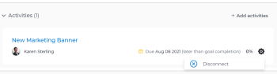

# Eliminar indicadores de progreso de objetivos en Objetivos de Adobe Workfront

<!-- for goal redesign PRODUCTION RELEASE: Should this article be called "Remove or disconnect progress indicators from goals" when this is available to ALL progress indicators (including "disconnect goals")-- if yes, updte the title everywhere else where this is linked?
-->

Puede eliminar resultados, actividades y proyectos de los objetivos si ya no son relevantes.

Para obtener información sobre la creación de objetivos y la adición de resultados y actividades a ellos, consulte los siguientes artículos:

* [Crear objetivos en objetivos de Adobe Workfront](../../workfront-goals/goal-management/create-goals.md)
* [Agregar actividades a objetivos en Objetivos de Adobe Workfront](../../workfront-goals/results-and-activities/add-activities-to-goals.md)
* [Agregar resultados a objetivos en Objetivos de Adobe Workfront](../../workfront-goals/results-and-activities/add-results-to-goals.md)
* [Editar resultados y actividades en objetivos de Adobe Workfront](../../workfront-goals/results-and-activities/edit-results-and-activities.md)

Los objetivos también se pueden alinear con los objetivos principales, convirtiéndose en objetivos para los niños. Los objetivos relativos a la infancia son también indicadores de progreso de los objetivos principales.

Puede quitar la alineación entre objetivos eliminando la conexión entre ellos. Para obtener más información, consulte [Eliminar la alineación de objetivos en los objetivos de Adobe Workfront](../goal-alignment/remove-goal-alignment.md).

## Requisitos de acceso

<!--drafted - replace the table below with this one when P&P releases: 

<table style="table-layout:auto">
 <col>
 </col>
 <col>
 </col>
 <tbody>
  <tr>
   <td role="rowheader">Adobe Workfront plan*</td>
   <td>
   
Current plan: Select or higher

   Or
   
Legacy plan: Pro or higher

   
   </td>
  </tr>
  <tr>
   <td role="rowheader">Adobe Workfront license*</td>
   <td>
   
Current license: Contributor or higher

   Or
   
Legacy license: Request or higher
 
For more information, see <a href="../../administration-and-setup/add-users/access-levels-and-object-permissions/wf-licenses.md" class="MCXref xref">Adobe Workfront licenses overview</a>.
 </td>
  </tr>
  <tr>
   <td role="rowheader">Product</td>
   <td>
   
 Current product requirement: If you have the Select or Prime Adobe Workfront plan, you must also buy an additional Adobe Workfront Goals license.  Workfront Goals are included in the Ultimate Workfront Plan.

   Or
   
Legacy product requirement: You must purchase an additional license for the Adobe Workfront Goals to access functionality described in this article. 
 
For information, see <a href="../../workfront-goals/goal-management/access-needed-for-wf-goals.md" class="MCXref xref">Requirements to use Workfront Goals</a>. 
 </td>
  </tr>
  <tr>
   <td role="rowheader">Access level*</td>
   <td> 
Edit access to Goals
 
<b>NOTE</b>
If you still don't have access, ask your Workfront administrator if they set additional restrictions in your access level. For information on how a Workfront administrator can change your access level, see:

     <ul>
      <li> 
<a href="../../administration-and-setup/add-users/configure-and-grant-access/create-modify-access-levels.md" class="MCXref xref">Create or modify custom access levels</a> 
 </li>
      <li> 
<a href="../../administration-and-setup/add-users/configure-and-grant-access/grant-access-goals.md" class="MCXref xref">Grant access to Adobe Workfront Goals</a> 
 </li>
     </ul> 
 </td>
  </tr>
  <tr data-mc-conditions="">
   <td role="rowheader">Object permissions</td>
   <td>
    

     
View or higher permissions to the goal to view it

     
Manage permissions to the goal to edit it

     
For information about sharing goals, see <a href="../../workfront-goals/workfront-goals-settings/share-a-goal.md" class="MCXref xref">Share a goal in Workfront Goals</a>. 

    
 </td>
  </tr>
 </tbody>
</table>
-->

Debe tener lo siguiente:

<table style="table-layout:auto"> 
 <col> 
 <col> 
 <tbody> 
  <tr> 
   <td role="rowheader">plan de Adobe Workfront*</td> 
   <td> 
Pro o superior
 </td> 
  </tr> 
  <tr> 
   <td role="rowheader">Licencia de Adobe Workfront*</td> 
   <td> 
Solicitud o superior
 
Para obtener más información, consulte <a href="../../administration-and-setup/add-users/access-levels-and-object-permissions/wf-licenses.md" class="MCXref xref">Información general sobre las licencias de Adobe Workfront</a>.
 </td> 
  </tr> 
  <tr> 
   <td role="rowheader">Product</td> 
   <td> 
Debe adquirir una licencia adicional para los objetivos de Adobe Workfront para acceder a la funcionalidad que se describe en este artículo. 
 
Para obtener más información, consulte <a href="../../workfront-goals/goal-management/access-needed-for-wf-goals.md" class="MCXref xref">Requisitos para utilizar los objetivos de Workfront</a>. 
 </td> 
  </tr> 
  <tr> 
   <td role="rowheader">Configuraciones de nivel de acceso*</td> 
   <td> 
Editar acceso a Objetivos o posterior
 
<b>NOTA</b>
Si todavía no tiene acceso, pregunte a su administrador de Workfront si establece restricciones adicionales en su nivel de acceso. Para obtener información sobre cómo un administrador de Workfront puede cambiar su nivel de acceso, consulte:
 
     <ul> 
      <li> 
<a href="../../administration-and-setup/add-users/configure-and-grant-access/create-modify-access-levels.md" class="MCXref xref">Crear o modificar niveles de acceso personalizados</a> 
 </li> 
      <li> 
<a href="../../administration-and-setup/add-users/configure-and-grant-access/grant-access-goals.md" class="MCXref xref">Conceder acceso a los objetivos de Adobe Workfront</a> 
 </li> 
     </ul> 
 </td> 
  </tr> 
  <tr data-mc-conditions=""> 
   <td role="rowheader">Permisos de objeto</td> 
   <td> 
    
 
     
Administrar permisos para el objetivo
 
     
Para obtener información sobre cómo compartir objetivos, consulte <a href="../../workfront-goals/workfront-goals-settings/share-a-goal.md" class="MCXref xref">Compartir un objetivo en los objetivos de Workfront</a>. 
 
    
 </td> 
  </tr> 
 </tbody> 
</table>

*Para saber qué plan, tipo de licencia o acceso tiene, póngase en contacto con el administrador de Workfront.

## Requisitos previos

Debe tener lo siguiente para poder iniciar:

* Plantilla de diseño que incluye el área Objetivos del menú principal.
* Un objetivo con resultados, actividades o proyectos.

## Consideraciones para eliminar resultados, actividades y desconectar proyectos de objetivos

* Solo puede eliminar resultados y actividades de objetivos activos.
* Puede eliminar resultados y actividades de un objetivo eliminándolos. Los resultados y actividades eliminados no se pueden recuperar.
* Cuando elimina el resultado o la actividad de un objetivo, el progreso del resultado eliminado o de la actividad afecta al progreso general del objetivo.
* No puede eliminar un proyecto de un objetivo, pero puede desconectarlo del objetivo. Al desconectar el proyecto del objetivo, el porcentaje completado del proyecto ya no afecta al progreso del objetivo.

   Para obtener información sobre cómo afectan los proyectos al progreso del objetivo, consulte [Agregar proyectos a objetivos en Objetivos de Adobe Workfront](../../workfront-goals/results-and-activities/connect-projects-to-goals-overview.md).

* No puede eliminar un resultado o una actividad de un objetivo y no puede desconectar un objetivo secundario o un proyecto si son el último indicador de progreso del objetivo.
* Si se elimina un proyecto del área Proyectos y es el último indicador de progreso de un objetivo, el objetivo se vuelve Inactivo.

## Eliminar resultados y actividades de objetivos

Para eliminar resultados y actividades de un objetivo, elimínelos. La eliminación de resultados y actividades de un objetivo es idéntica.

<!--
How you delete results and activities differs depending on the environment you use.

### Delete results and activities in the Production environment

1. Click the **Main Menu** icon  > **Goals** in the upper-right corner.

   (!-- Add this when Shell is available to all: or (if available), click the **Main Menu** icon  in the upper-left corner)
   --)

   This opens the Workfront Goals area and the Goal List displays by default. 

1. Click the name of a goal you want to remove results and activities from.

   This opens the Goal Details panel on the right.

1. Click **Results** to remove results or **Activities** to remove activities. 

1. Click the **gear icon**  to the right of the result or activity name, then click **Delete** > **Yes, delete**.

   

   The result or activity is deleted and cannot be recovered. The percent complete of the goal updates to exclude the deleted activity or result.

-->

1. Haga clic en el **Menú principal** icono  en la esquina superior derecha, haga clic en **Objetivos**.

   <!-- Add this when Shell is available to all: or (if available), click the **Main Menu** icon  in the upper-left corner)
   -->
   Se abre el área Objetivos de Workfront y se muestra la Lista de objetivos de forma predeterminada.

1. Haga clic en el nombre de un objetivo desde el que desea eliminar resultados y actividades.

   Esto abre la página de objetivo.

1. Haga clic en **Indicadores de progreso** en el panel izquierdo.

1. Seleccione un resultado o actividad y haga clic en el botón **Eliminar** icono  en la parte superior de la lista.

1. Haga clic en **Eliminar** para confirmar la eliminación. El resultado o la actividad se eliminan y no se pueden recuperar. El porcentaje completado de las actualizaciones de objetivo para excluir la actividad o el resultado eliminados.

## Eliminar proyectos de objetivos

<!--
Dsconnecting projects from goals differs depending on the environment you use.

### Disconnect projects from goals in the Production environment

1. Click the **Main Menu** icon  > **Goals** in the upper-right corner.

   (!-- Add this when Shell is available to all: or (if available), click the **Main Menu** icon  in the upper-left corner)
   --)

   This opens the Workfront Goals area and the Goal List displays by default. 

1. Click the name of a goal you want to remove results and activities from.

   This opens the Goal Details panel on the right.

1. Click the **right-pointing arrow** to the left of the Activities sections to expand it. 
1. Click the **gear icon**  to the right of the project name, then click **Disconnect**.

   

   The project is disconnected from the goal. The percent complete of the goal updates to exclude the percent complete of the disconnected project.
-->

1. Haga clic en el **Menú principal** en la esquina superior derecha y, a continuación, haga clic en **Objetivos**.

   <!-- Add this when Shell is available to all: or (if available), click the **Main Menu** icon  in the upper-left corner)
   -->

   Se abre el área Objetivos de Workfront y se muestra la Lista de objetivos de forma predeterminada.

1. Haga clic en el nombre de un objetivo desde el que desea eliminar resultados y actividades.

   Esto abre la página de objetivo.
1. Haga clic en **Indicadores de progreso** en el panel izquierdo.
1. Seleccione un proyecto y, a continuación, haga clic en el **Desconectar** icono  en la parte superior de la lista.
1. Haga clic en **Desconectar** para confirmar.

   El proyecto ya no está conectado al objetivo. El porcentaje completado del objetivo se actualiza para excluir el proyecto desconectado.

