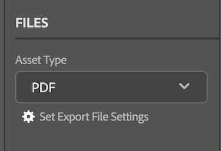

# Cargar documentos y pruebas de [!DNL Adobe Workfront plugin] en [!DNL Creative Cloud]

Puede cargar sus proyectos como documentos para una revisión y aprobación rápidas o simplemente para almacenarlos en [!DNL Adobe Workfront].

>[!NOTE]
>
>La carga de documentos y pruebas no se admite actualmente en Premiere Pro ni en After Effects.

## Limitaciones de documentos

Esta sección describe las limitaciones de documentos conocidas en [!DNL Workfront for Adobe Creative Cloud plugins].

### Las nuevas versiones del documento solo aceptan un archivo para cargar

Debido a que los documentos de [!DNL Workfront] no pueden contener varios archivos, se debe deshabilitar ciertas opciones de configuración para poder cargar nuevas versiones de documentos en Workfront.

>[!NOTE]
>
>Si debe generar varios archivos, puede crear una prueba en su lugar. La nueva revisión no se asociará con el documento original.

Para volver a cambiar el modificador a un solo archivo en [!DNL InDesign]:

1. Abra el cuadro de diálogo **Establecer configuración de archivo de exportación**.

   

1. Busque el tipo de recurso que desea exportar y ajuste la configuración como se describe a continuación:

   <table>
    <tr>
    <td><strong>PDF y PDF-PRINT</strong>
    </td>
    <td>Anule La Selección De <strong>Crear Archivos PDF Independientes</strong>.
    </td>
    </tr>
    <tr>
    <td><strong>EPS</strong>
    </td>
    <td>Seleccione <strong>Intervalos</strong> y escriba un solo número de página. 
    

    <strong>Nota</strong>: si desea cargar el documento completo, debe crear una revisión. 
    </td>
    </tr>
    <tr>
    <td><strong>EPUB y EPUB-FIXED</strong>
    </td>
    <td>No es necesario realizar ajustes.
    </td>
    </tr>
    <tr>
    <td><strong>IDML</strong>
    </td>
    <td>No es necesario realizar ajustes.
    </td>
    </tr>
    <tr>
    <td><strong>JPG</strong>
    </td>
    <td>Seleccione <strong>Intervalos</strong> y escriba un solo número de página. 
    

    <strong>Nota</strong>: si desea cargar el documento completo, debe crear una revisión. 
    </td>
    </tr>
    <tr>
    <td><strong>PNG</strong>
    </td>
    <td>Seleccione <strong>Intervalos</strong> y escriba un solo número de página. 
    

    <strong>Nota</strong>: si desea cargar el documento completo, debe crear una revisión. 
    </td>
    </tr>
    <tr>
    <td><strong>XML</strong>
    </td>
    <td>No es necesario realizar ajustes. 
    </td>
    </tr>
    </table>
