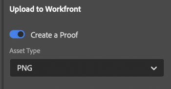

# Cargar pruebas desde [!DNL Illustrator]

Puede cargar los tableros de arte como pruebas directamente en [!DNL Adobe Workfront] para una revisión y aprobación exhaustivas.

## Requisitos de acceso

Debe tener el siguiente acceso para realizar los pasos de este artículo:

<table style="table-layout:auto"> 
 <col> 
 <col> 
 <tbody> 
 <tr> 
   <td role="rowheader">[!DNL Adobe Workfront] plan*</td> 
   <td> 
Plan actual: [!UICONTROL Pro] o superior
 
o
 
Plan heredado: [!UICONTROL Premium]
 
Para obtener más información sobre la prueba del acceso con los diferentes planes, consulte .
 </td> 
  </tr> 
  <tr> 
   <td role="rowheader">[!DNL Adobe Workfront] licencia*</td> 
   <td> 
Plan actual: [!UICONTROL Work] o [!UICONTROL Proof]
 
Plan heredado: Cualquiera (debe tener las pruebas habilitadas para el usuario)
 </td> 
  </tr> 
  <tr> 
   <td role="rowheader">Product</td> 
   <td>Debe tener un [!DNL Adobe Creative Cloud] además de una [!DNL Workfront] licencia.</td> 
  </tr> 
  <tr> 
   <td role="rowheader">Perfil de permiso de revisión </td> 
   <td>[!UICONTROL Manager] o superior</td> 
  </tr> 
  <tr> 
   <td role="rowheader">Permisos de objeto</td> 
   <td> 
Editar acceso a [!UICONTROL Documents]
 
Para obtener información sobre la solicitud de acceso adicional, consulte <a href="../../workfront-basics/grant-and-request-access-to-objects/request-access.md" class="MCXref xref">Solicitar acceso a objetos </a>.
 </td> 
  </tr> 
 </tbody> 
</table>

&#42;Para saber qué plan, función o perfil de permiso de prueba tiene, póngase en contacto con su [!DNL Workfront] o [!DNL Workfront Proof] administrador.

## Requisitos previos

* Debe instalar el [!DNL Adobe Workfront for design and video] antes de poder cargar pruebas desde [!DNL Illustrator].

   Para obtener instrucciones, consulte [Instalar [!DNL Adobe Workfront for design and video]](/help/quicksilver/workfront-integrations-and-apps/adobe-workfront-for-creative-cloud/wf-install-cc.md).

## Cargar una prueba básica

1. Haga clic en el **[!UICONTROL Menú]** en la esquina superior derecha y, a continuación, seleccione **[!UICONTROL Lista de trabajo]**. También puede utilizar el menú para desplazarse a los objetos principales.

   

1. Vaya al elemento de trabajo donde desee cargar una prueba.
1. Haga clic en el **[!UICONTROL Documento]** icono  en la barra de navegación.
1. Haga clic en **[!UICONTROL Nuevo archivo]** cerca de la parte inferior del complemento.
1. Active la variable **[!UICONTROL Creación de una prueba]** alternar.
1. Elija la **[!UICONTROL Tipo de recurso]** en el menú desplegable.

   

1. En el **[!UICONTROL Aprobaciones de prueba]** , seleccione **[!UICONTROL Básico]**.
1. (Opcional) Añada aprobadores.
1. (Opcional) Escriba un comentario en el **[!UICONTROL Actualizaciones]** .

   

1. (Opcional) Escriba un nombre para la prueba en la **[!UICONTROL Nombre de la prueba]** cuadro de texto.
1. (Opcional) Seleccione **[!UICONTROL Agregar archivo externo]** para agregar un archivo desde el equipo.
1. Haga clic en **[!UICONTROL Cargar]** y, a continuación, configure las opciones de exportación que desee en función del tipo de recurso elegido anteriormente.

   \
   El documento aparece en la [!UICONTROL Documentos] del complemento y de la aplicación de escritorio.

## Cargar una prueba automatizada

1. Haga clic en el **[!UICONTROL Menú]** en la esquina superior derecha y, a continuación, seleccione **[!UICONTROL Lista de trabajo]**. También puede utilizar el menú para desplazarse a los objetos principales.

   

1. Vaya al elemento de trabajo donde desee cargar una prueba.
1. Haga clic en el **[!UICONTROL Documento]** icono  en la barra de navegación.

1. Haga clic en **[!UICONTROL Nuevo archivo]** cerca de la parte inferior del complemento.
1. Active la variable **[!UICONTROL Creación de una prueba]** alterne y elija la opción **[!UICONTROL Tipo de recurso]** en el menú desplegable.

   

1. En el **[!UICONTROL Aprobaciones de prueba]** , seleccione **[!UICONTROL Automatizado]**.
1. (Opcional) En la **[!UICONTROL Plantilla de flujo de trabajo]** , escriba el nombre de una plantilla de flujo de trabajo de prueba.
<!--
{{adjust-proof-settings}}
-->
1. (Opcional) Escriba un comentario en el **[!UICONTROL Actualizaciones]** .

    <!-- new screenshot -->

1. (Opcional) Escriba un nombre para la prueba en la **[!UICONTROL Nombre de la prueba]** cuadro de texto.
1. (Opcional) Seleccione **[!UICONTROL Agregar archivo externo]** para agregar un archivo desde el equipo.
1. Haga clic en **[!UICONTROL Cargar]** y, a continuación, configure las opciones de exportación que desee en función del tipo de recurso elegido anteriormente.

   \
   El documento aparece en la [!UICONTROL Documentos] del complemento y de la aplicación de escritorio.

## Cargar una nueva versión de prueba

Puede cargar una nueva versión de una prueba. El complemento recuerda el flujo de trabajo de pruebas establecido en la versión anterior, pero puede cambiarlo si lo desea.

1. Haga clic en el **[!UICONTROL Menú]** en la esquina superior derecha y, a continuación, seleccione **[!UICONTROL Lista de trabajo]**. También puede utilizar el menú para desplazarse a los objetos principales.

   

1. Vaya al elemento de trabajo al que debe cargar un documento.
1. Haga clic en el **[!UICONTROL Documento]** icono en la barra de navegación.

1. Haga clic en **[!UICONTROL Nueva versión]** cerca de la parte inferior del complemento.
1. Elija la **[!UICONTROL Tipo de recurso]** en el menú desplegable.
1. Active la variable **[!UICONTROL Creación de una prueba]** alterne y elija la opción **[!UICONTROL Tipo de recurso]** en el menú desplegable.

   

1. En el *[!UICONTROL *Aprobaciones de prueba]** , elija **[!UICONTROL Básico]** o **[!UICONTROL Automatizado]**.

1. Agregar **[!UICONTROL Revisores]** o **[!UICONTROL Plantilla de flujo de trabajo]** en función del tipo de aprobación seleccionado en el paso 7.

1. (Opcional) Escriba un comentario en el **[!UICONTROL Actualizaciones]** .
1. Haga clic en **[!UICONTROL Cargar]**y, a continuación, configure las opciones de exportación que desee en función del tipo de recurso elegido anteriormente.
El documento aparece en la [!UICONTROL Documentos] del complemento y de la aplicación de escritorio.
