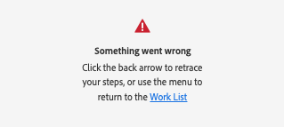

# Instalar y abrir [!DNL Adobe Workfront for XD]

Puede instalar el complemento [!DNL Adobe Workfront for XD] desde Adobe Marketplace. El complemento es compatible con los siguientes idiomas:

* Inglés
* Francés
* Alemán
* Italiano
* Español
* Portugués
* Japonés
* Chino simplificado
* Chino tradicional
* Coreano

## Requisitos de acceso

+++ Expanda para ver los requisitos de acceso para la funcionalidad en este artículo.

<table style="table-layout:auto"> 
 <col> 
 </col> 
 <col> 
 </col> 
 <tbody> 
 <!-- <tr> 
   <td role="rowheader">[!DNL Adobe Workfront] package/td> 
   <td> 
Any
 </td> 
  </tr> 
  <tr data-mc-conditions=""> 
   <td role="rowheader">[!DNL Adobe Workfront] license*</td> 
   <td>
   
Standard

    
Work or higher
 </td> 
  </tr> -->
  <tr> 
   <td role="rowheader">Productos adicionales</td> 
   <td>
Debe tener una licencia [!DNL Adobe Creative Cloud] además de una licencia [!DNL Workfront].
</td> 
  </tr> 
 </tbody> 
</table>

Para obtener más información, consulte [Requisitos de acceso en la documentación de Workfront](/help/quicksilver/administration-and-setup/add-users/access-levels-and-object-permissions/access-level-requirements-in-documentation.md).

+++

## Requisitos previos

* Debe instalar la aplicación [!DNL Adobe XD] antes de instalar el complemento de Workfront.

## Instalación del el complemento de [!DNL Adobe Workfront for XD] para su organización

Si es administrador de [!DNL Adobe Admin Console], puede incluir el complemento en paquetes de implementación de [!DNL Creative Cloud]. Para obtener más información, consulte [Inclusión de complementos en el paquete](https://helpx.adobe.com/in/enterprise/using/manage-extensions.html).

[Ver un tutorial de vídeo aquí](https://www.youtube.com/watch?v=zzvXNLIBzrc){target=_blank}.

Los administradores de [!DNL Adobe Admin Console] también pueden crear paquetes de solo complemento para distribuirlos a los usuarios. Para obtener más información, consulte [Creación de [!UICONTROL [!DNL Adobe Workfront]  para paquetes de  [!DNL Creative Cloud]]  para los usuarios en  [!DNL Adobe Admin Console]](/help/quicksilver/administration-and-setup/configure-integrations/create-plugin-only-packages.md)

## Instalación del complemento de [!DNL Adobe Workfront for XD] individualmente

Puede instalar el complemento de [!DNL Adobe Workfront for XD] usted mismo desde [!DNL Adobe Exchange].

1. Vaya a la [página de instalación de Adobe Workfront for XD](https://exchange.adobe.com/apps/cc/4c3566f9?pluginId=4c3566f9&workflow=share) en Adobe Exchange.
1. En el cuadro de diálogo que aparece, haga clic en **Abrir la aplicación de escritorio de [!DNL Adobe Creative Cloud]**.
1. Una vez que se abra el administrador de complementos de [!DNL Adobe XD], haga clic en **[!UICONTROL Instalar]**.
1. Lea la información del cuadro de diálogo y, a continuación, haga clic en **[!UICONTROL Aceptar]**.
1. Continúe en la siguiente sección para obtener información sobre cómo abrir el complemento.

## Abrir el complemento de [!DNL Adobe Workfront for XD]

1. Abra [!DNL Adobe XD].

1. Cree un nuevo archivo o abra uno existente.

1. En la esquina inferior izquierda, haga clic en el icono **Complementos**.

1. En el **[!UICONTROL Panel de complementos]**, busque **[!UICONTROL Adobe Workfront for XD]**.

1. Continúe en la siguiente sección para obtener información sobre cómo iniciar sesión en el complemento.

## Inicie sesión en [!DNL Adobe Workfront for XD].

1. Asegúrese de que el panel Complemento esté abierto y haga clic en **[!DNL Adobe Workfront for XD]**.
1. Introduzca su dominio y haga clic en **[!UICONTROL Iniciar sesión]**. Se abre una página del explorador.

   >[!TIP]
   >
   >* Para encontrar el dominio, abra un explorador, vaya a la instancia [!DNL Workfront] y copie la primera parte de la dirección URL:\
   >
   >
   >* Si la instancia de Workfront está integrada con Experience Cloud, pídale a su administrador que le proporcione el dominio de Workfront que se encuentra en Product > Workfront en el Admin Console.

1. En el explorador, escriba sus credenciales de [!DNL Workfront] y haga clic en **[!DNL Log in]**. Si su empresa utiliza un inicio de sesión único (SSO), se le redirigirá a la página de su proveedor de SSO para iniciar sesión.

   >[!NOTE]
   >
   >Es posible que no se le pida que introduzca sus credenciales de [!DNL Workfront] si ha iniciado sesión recientemente.

   Siga las indicaciones para iniciar sesión en [!DNL Workfront].

   >[!NOTE]
   >
   >* [!DNL Workfront] se conecta a [!DNL Adobe Creative Cloud] mediante OAuth 2.0, un estándar seguro utilizado por la mayoría de las integraciones basadas en la web para la autenticación y autorización de usuarios.
   >* Cuando se le pida que introduzca el [dominio o host] de su cuenta de [!DNL Workfront], escríbalo con este formato: *yourCompany&#39;sDomain.my.workfront.com*. El dominio de su empresa suele ser el nombre de su empresa.

1. Haz clic en **[!UICONTROL Permitir acceso]** para finalizar el inicio de sesión y vuelve a [!DNL Adobe XD] para ver tu trabajo.

### Solución de errores de inicio

**Aparece el error &quot;Se produjo un error&quot; al intentar iniciar sesión**

No puede usar una dirección URL que comience por `experience.adobe.com` para iniciar sesión en el complemento.

 

Para solucionar este problema,

1. Desinstale y vuelva a instalar el complemento de Adobe Workfront para XD para borrar el dominio y el error.

1. Introduzca su dominio de Workfront. El dominio debe ser `company-name.my.workfront.com` y no `experience.adobe.com`.

Para buscar el dominio de Workfront si se encuentra en la experiencia unificada de Adobe, vaya a
