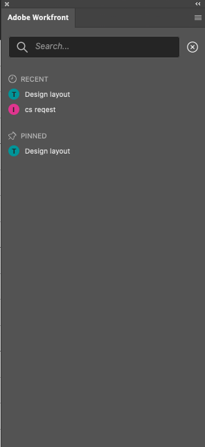

# Encuentre su trabajo usando el complemento [!DNL Adobe Workfront]

Busque el trabajo que se le asignó en [!DNL Adobe Workfront] sin salir de las siguientes [!DNL Adobe Creative Cloud] aplicaciones:

{{cc-app-list}}

## Requisitos de acceso

Debe tener el siguiente acceso para realizar los pasos de este artículo:

<table style="table-layout:auto"> 
 <col> 
 <col> 
 <tbody> 
 <!-- <tr> 
   <td role="rowheader">[!DNL Adobe Workfront] plan*</td> 
   <td> 
[!UICONTROL Pro] or higher
 </td> 
  </tr> 
  <tr data-mc-conditions=""> 
   <td role="rowheader">[!DNL Adobe Workfront] license*</td> 
   <td> 
[!UICONTROL Work] or [!UICONTROL Plan]
 </td> 
  </tr> -->
  <tr> 
   <td role="rowheader">Product</td> 
   <td>Debe tener una licencia [!DNL Adobe Creative Cloud] además de una licencia [!DNL Workfront].</td> 
  </tr> 
 </tbody> 
</table>

&#42;Para saber qué plan, tipo de licencia o acceso tiene, póngase en contacto con el administrador de [!DNL Workfront].

## Requisitos previos

{{cc-install-prereq}}

## Use [!UICONTROL Lista de trabajos] para obtener acceso a información importante

La [!UICONTROL Lista de trabajos] le permite ver todas las tareas y problemas que se le han asignado en un solo lugar. Puede usar la opción [!UICONTROL Ordenar por] para agrupar elementos y, a continuación, usar el [!UICONTROL Filtro] para centrarse en el trabajo que debe completarse.

### Agrupar elementos de trabajo similares con la opción [!DNL Sort By]

Utilice la opción [!UICONTROL Ordenar por] para agrupar elementos similares en la [!UICONTROL Lista de trabajos]. Puede ordenar por:

<table style="table-layout:auto"> 
 <col> 
 <col> 
 <tbody> 
  <tr> 
   <td> 
    <ul> 
     <li>[!UICONTROL Fecha de vencimiento]</li> 
     <li>[!UICONTROL Nombre]</li> 
     <li>[!UICONTROL Nombre de proyecto]</li> 
     <li>[!UICONTROL Mi prioridad]</li> 
    </ul> </td> 
   <td>  </td> 
  </tr> 
 </tbody> 
</table>

### Reduzca su enfoque con filtros

Usa el [!UICONTROL Filtro] para reducir el enfoque a elementos de trabajo específicos. Hay un par de formas de utilizar el filtro:

 

<table style="table-layout:auto"> 
 <col> 
 <col> 
 <tbody> 
  <tr> 
   <td> 
El primero es el filtrado basado únicamente en el tipo de elemento de trabajo o atributos:
 
    <ul> 
     <li><strong>Elemento de trabajo</strong>: tareas, subtareas, problemas o tareas personales</li> 
     <li><strong>Estado del elemento de trabajo</strong>: [!UICONTROL está trabajando en], [!UICONTROL está listo para iniciarse] o [!UICONTROL no está listo]</li> 
    </ul> 
El segundo es el filtrado mediante el estado del elemento de trabajo y del elemento de trabajo juntos. Por ejemplo, puede seleccionar Tareas y [!UICONTROL Listo para comenzar] para buscar todas las tareas de la lista de trabajos que están listas para trabajar.
 
También puede utilizar [!UICONTROL Coincidencia de campos] para buscar un elemento específico dentro del conjunto de filtros. 
 </td> 
   <td>  </td> 
  </tr> 
 </tbody> 
</table>

## Busque su trabajo

Utilice la barra [!UICONTROL Buscar] para localizar los proyectos, tareas, problemas y documentos que necesite.

<table style="table-layout:auto"> 
 <col> 
 <col> 
 <tbody> 
  <tr> 
   <td> 
    <ul> 
     <li>Ver elementos recientes: puede ver hasta 5 de los elementos de trabajo más recientes a los que se accede a través de las versiones de escritorio o de complemento de Workfront.</li> 
     <li>Localizar elementos anclados: puede acceder a proyectos, tareas, problemas y documentos que haya anclado en la nueva experiencia de Adobe Workfront.</li> 
     <li>Encuentre sus favoritos: puede ver cualquier proyecto, tarea, problema o documento que haya guardado como favorito.</li> 
    </ul> </td> 
   <td>  </td> 
  </tr> 
 </tbody> 
</table>

## Usar [!UICONTROL Menú] para navegar por proyectos

Puede usar el icono [!UICONTROL Menú] para navegar a los elementos principales de un proyecto.

