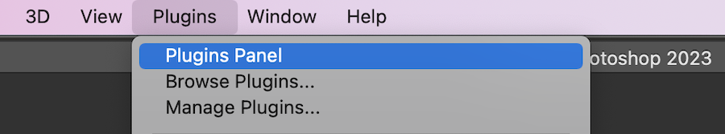

# Instalar y abrir [!DNL Adobe Workfront for Photoshop]

Puede instalar el [!DNL Adobe Workfront for Photoshop] complemento de [!DNL Adobe Marketplace]. El complemento admite los siguientes idiomas:

* Inglés
* Francés
* Alemán
* Italiano
* Español
* Portugués
* Japonés
* Chino simplificado
* Chino tradicional
* Coreano

## Requisitos de acceso

Debe tener el siguiente acceso para realizar los pasos de este artículo:

<table style="table-layout:auto"> 
 <col> 
 <col> 
 <tbody> 
  <!--<tr> 
   <td role="rowheader">[!DNL Adobe Workfront] plan*</td> 
   <td> 
[!UICONTROL Pro] or higher
 </td> 
  </tr> 
  <tr data-mc-conditions=""> 
   <td role="rowheader">[!DNL Adobe Workfront] license*</td> 
   <td> 
[!UICONTROL Work] or [!UICONTROL Plan]
 </td> 
  </tr> -->
  <tr> 
   <td role="rowheader">Product</td> 
   <td>Debe tener un [!DNL Adobe Creative Cloud] además de una [!DNL Workfront] licencia.</td> 
  </tr> 
 </tbody> 
</table>

&#42;Para saber qué plan, tipo de licencia o acceso tiene, póngase en contacto con su [!DNL Workfront] administrador.

## Requisitos previos

* Debe instalar el [!DNL Adobe Photoshop] antes de instalar la aplicación [!DNL Workfront] plugin.

## Instale el [!DNL Adobe Workfront for Photoshop] plugin

>[!TIP]
>
>Si es [!DNL Adobe Admin Console] administrador, puede incluir el complemento en [!DNL Creative Cloud] paquetes de implementación. Para obtener más información, consulte [Inclusión de complementos en el paquete](https://helpx.adobe.com/in/enterprise/using/manage-extensions.html).

1. Abra el [!DNL Adobe Creative Cloud] aplicación.
1. Haga clic en el **[!UICONTROL Marketplace]** cerca de la parte superior de la ventana.
1. En el **[!UICONTROL Buscar todos los complementos]** cuadro, tipo *Workfront* y, a continuación, pulse **[!UICONTROL Entrar]**.

   

1. Cuando aparezca el complemento Adobe Workfront for Photoshop en los resultados de la búsqueda, haga clic en **[!UICONTROL Get]**.
1. Lea la información del cuadro de diálogo y haga clic en **[!UICONTROL OK]**.

1. Continúe con la siguiente sección para obtener información sobre cómo abrir el complemento.

## Abra el [!DNL Adobe Workfront for Photoshop] plugin

1. Abrir [!DNL Photoshop].

1. Cree un nuevo archivo o abra uno existente.

1. En el menú superior, haga clic en **[!UICONTROL Complementos]** > **[!UICONTROL Panel de complementos]**.

   

1. En el **[!UICONTROL Panel de complementos]**, elija el **[!UICONTROL Complementos]** y busque **[!UICONTROL Workfront para Adobe Photoshop]**.

   >[!TIP]
   >
   >   Si no ve el complemento después de abrirlo desde el [!UICONTROL Panel de complementos], podría estar detrás de la aplicación de Photoshop. Intente minimizar el Photoshop para encontrar el complemento.

1. Continúe con la siguiente sección para obtener información sobre cómo iniciar sesión en el complemento.

## Iniciar sesión en [!DNL Adobe Workfront for Photoshop]

1. En el **[!UICONTROL Complementos]** en la parte superior de la pantalla, seleccione **[!UICONTROL Panel de complementos]**.
1. Seleccionar **[!DNL Adobe Workfront for Photoshop]**.
1. Introduzca su dominio y haga clic en **[!UICONTROL Iniciar sesión]**. Se abre una página del explorador.

   >[!TIP]
   >
   >* Para encontrar el dominio, abra un explorador y vaya a [!DNL Workfront] y copie la primera parte de la URL:\
      >
   >
   > * Si la instancia de Workfront está integrada con Experience Cloud, pídale al administrador que le proporcione el dominio de Workfront que se encuentra en Producto > Workfront en el Admin Console.

1. En el explorador, introduzca su [!DNL Workfront] credenciales y, a continuación, haga clic en **[!UICONTROL Iniciar sesión]**. Si su empresa utiliza un inicio de sesión único (SSO), se le dirigirá a la página de su proveedor de SSO para iniciar sesión.

   >[!NOTE]
   >
   >Es posible que no se le pida que introduzca su [!DNL Workfront] credenciales si ha iniciado sesión recientemente.

   Siga las indicaciones para iniciar sesión en [!DNL Workfront].

   >[!NOTE]
   >
   >* [!DNL Workfront] conecta con [!DNL Adobe Creative Cloud] con OAuth 2.0, un estándar seguro utilizado por la mayoría de las integraciones basadas en web para la autenticación y autorización de los usuarios.
   >* Cuando se le pida que introduzca la variable [dominio o host] de su [!DNL Workfront] cuenta, escríbala con este formato: *yourCompany&#39;sDomain.my.workfront.com*. El dominio de la empresa suele ser el nombre de la empresa.

1. Haga clic en **[!UICONTROL Permitir acceso]** para finalizar el inicio de sesión.
1. Vuelva a [!UICONTROL Adobe Photoshop] para ver su trabajo.
