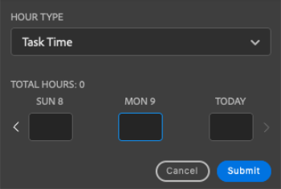

# Registrar tiempo usando el complemento [!DNL Adobe Workfront]

Puedes registrar tiempo para proyectos, tareas y problemas en los que estás trabajando directamente en cualquiera de las siguientes aplicaciones de [!DNL Adobe Creative Cloud]:

{{cc-app-list}}

## Requisitos de acceso

+++ Expanda para ver los requisitos de acceso para la funcionalidad en este artículo.

<table style="table-layout:auto"> 
 <col> 
 <col> 
 <tbody> 
  <tr> 
  <!--
   <td role="rowheader">[!DNL Adobe Workfront] package</td> 
   <td> Any</td> 
  </tr> 
  <tr data-mc-conditions=""> 
   <td role="rowheader">[!DNL Adobe Workfront] license</td> 
   <td>
   
Standard

    
Work or higher
 </td> 
  </tr>
  -->
  <tr> 
   <td role="rowheader">Productos adicionales</td> 
   <td>Debe tener una licencia [!DNL Adobe Creative Cloud] además de una licencia [!DNL Workfront].</td> 
  </tr> 
  <tr> 
   <td role="rowheader">Configuraciones de nivel de acceso</td> 
   <td> 
Acceso de [!UICONTROL Edit] a tareas o problemas
</td> 
  </tr> 
  <tr> 
   <td role="rowheader">Permisos de objeto</td> 
   <td> 
Permiso de [!UICONTROL Log Hours] para la tarea o el problema
 </td> 
  </tr> 
 </tbody> 
</table>

Para obtener más información, consulte [Requisitos de acceso en la documentación de Workfront](/help/quicksilver/administration-and-setup/add-users/access-levels-and-object-permissions/access-level-requirements-in-documentation.md).

+++

## Requisitos previos

{{cc-install-prereq}}

## Registrar tiempo mediante el complemento de Adobe Workfront

El administrador de [!DNL Workfront] determina qué tipos de horas específicas del proyecto están disponibles, tal como se describe en [Administrar tipos de horas](../../administration-and-setup/set-up-workfront/configure-timesheets-schedules/hour-types.md).

Para registrar el tiempo mediante el complemento de Workfront:

1. Haga clic en el icono **[!UICONTROL Menú]** en la esquina superior derecha y seleccione **[!UICONTROL Lista de trabajos]**. También puede utilizar el menú para desplazarse a los objetos principales.

   

1. En **[!UICONTROL Lista de trabajos]**, seleccione el elemento de trabajo en el que debe registrar el tiempo.
1. Haga clic en **[!UICONTROL Tiempo]** en la barra de navegación.

   

1. (Opcional) Elija **[!UICONTROL Tipo de hora]** en el menú desplegable.
1. Escriba la hora en horas del día que necesite.

   

1. Haga clic en **[!UICONTROL Enviar]**.
