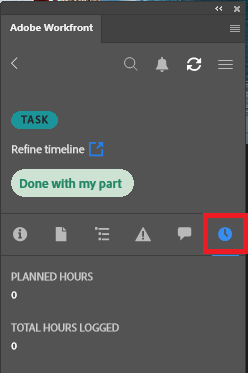

# El tiempo de registro se utiliza para [!DNL Adobe Workfront] plugin

Puede registrar el tiempo para proyectos, tareas y problemas en los que esté trabajando directamente en cualquiera de los siguientes [!DNL Adobe Creative Cloud] aplicaciones:

{{cc-app-list}}

## Requisitos de acceso

Debe tener el siguiente acceso para realizar los pasos de este artículo:

<table style="table-layout:auto"> 
 <col> 
 <col> 
 <tbody> 
  <tr> 
   <!--<td role="rowheader">[!DNL Adobe Workfront] plan*</td> 
   <td> 
[!UICONTROL Pro] or higher
 </td> 
  </tr> 
  <tr data-mc-conditions=""> 
   <td role="rowheader">[!DNL Adobe Workfront] license*</td> 
   <td> 
[!UICONTROL Work] or [!UICONTROL Plan]
 </td> 
  </tr> 
  <tr> 
   <td role="rowheader">Product</td> 
   <td>You must have an [!DNL Adobe Creative Cloud] license in addition to a [!DNL Workfront] license.</td> 
  </tr> -->
  <tr> 
   <td role="rowheader">Configuraciones de nivel de acceso*</td> 
   <td> 
Acceso de [!UICONTROL Edit] a tareas o problemas
 
Nota: Si todavía no tiene acceso, pregunte a su [!DNL Workfront] administrador si establecen restricciones adicionales en su nivel de acceso. Para obtener información sobre cómo se [!DNL Workfront] administrador puede modificar el nivel de acceso, consulte <a href="../../administration-and-setup/add-users/configure-and-grant-access/create-modify-access-levels.md" class="MCXref xref">Crear o modificar niveles de acceso personalizados</a>.
 </td> 
  </tr> 
  <tr> 
   <td role="rowheader">Permisos de objeto</td> 
   <td> 
Permiso de [!UICONTROL Log Hours] para la tarea o el problema
 
Para obtener información sobre la solicitud de acceso adicional, consulte <a href="../../workfront-basics/grant-and-request-access-to-objects/request-access.md" class="MCXref xref">Solicitar acceso a objetos </a>.
 </td> 
  </tr> 
 </tbody> 
</table>

&#42;Para saber qué plan, tipo de licencia o acceso tiene, póngase en contacto con su [!DNL Workfront] administrador.

## Requisitos previos

{{cc-install-prereq}}

## Hora de registro mediante el complemento de Adobe Workfront

La variable [!DNL Workfront] el administrador determina qué tipos de hora específicos del proyecto están disponibles, tal como se describe en [Administrar tipos de hora](../../administration-and-setup/set-up-workfront/configure-timesheets-schedules/hour-types.md).

Para registrar el tiempo mediante el complemento de Workfront:

1. Haga clic en el **[!UICONTROL Menú]** en la esquina superior derecha y, a continuación, seleccione **[!UICONTROL Lista de trabajo]**. También puede utilizar el menú para desplazarse a los objetos principales.

   

1. En el **[!UICONTROL Lista de trabajo]**, seleccione el elemento de trabajo al que debe registrar la hora.
1. Haga clic en **[!UICONTROL Tiempo]** en la barra de navegación.

   

1. (Opcional) Elija la **[!UICONTROL Tipo de hora]** en el menú desplegable.
1. Escriba la hora en horas del día que necesite.

   

1. Haga clic en **[!UICONTROL Submit]**.
