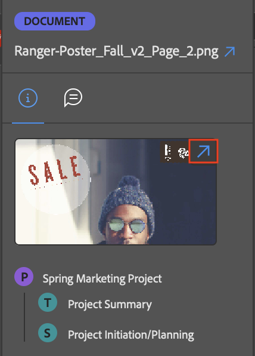

# Ver información del elemento de trabajo mediante el complemento [!DNL Adobe Workfront]

Puede ver información sobre proyectos, tareas, problemas y documentos de las [!DNL Adobe Creative Cloud] aplicaciones siguientes:

{{cc-app-list}}

## Requisitos de acceso

+++ Expanda para ver los requisitos de acceso para la funcionalidad en este artículo.

Debe tener el siguiente acceso para realizar los pasos de este artículo:

<table style="table-layout:auto"> 
 <col> 
 </col> 
 <col> 
 </col> 
 <tbody> 
  <!--<tr> 
   <td role="rowheader">[!DNL Adobe Workfront] plan*</td> 
   <td> 
[!UICONTROL Pro] or higher
 </td> 
  </tr> 
  <tr data-mc-conditions=""> 
   <td role="rowheader">[!DNL Adobe Workfront] license*</td> 
   <td> 
[!UICONTROL Work] or [!UICONTROL Plan]
 </td> 
  </tr> -->
  <tr> 
   <td role="rowheader">Product</td> 
   <td>Debe tener una licencia [!DNL Adobe Creative Cloud] además de una licencia [!DNL Workfront].</td> 
  </tr> 
  <tr> 
   <td role="rowheader">Configuraciones de nivel de acceso*</td> 
   <td> 
Acceso de [!UICONTROL View] a proyectos, tareas o problemas
 
Nota: si todavía no tiene acceso, pregunte al administrador de [!DNL Workfront] si ha establecido restricciones adicionales en su nivel de acceso. Para obtener información sobre cómo un administrador de [!DNL Workfront] puede modificar su nivel de acceso, vea <a href="../../administration-and-setup/add-users/configure-and-grant-access/create-modify-access-levels.md" class="MCXref xref">Crear o modificar niveles de acceso personalizados</a>.
 </td> 
  </tr> 
  <tr> 
   <td role="rowheader">Permisos de objeto</td> 
   <td> 
Permite ver el acceso al objeto que desea ver. 
 
Para obtener información sobre cómo solicitar acceso adicional, vea <a href="../../workfront-basics/grant-and-request-access-to-objects/request-access.md" class="MCXref xref">Solicitar acceso a los objetos </a>.
 </td> 
  </tr> 
 </tbody> 
</table>

&#42;Para saber qué plan, tipo de licencia o acceso tiene, póngase en contacto con el administrador de [!DNL Workfront].

+++

## Requisitos previos

{{cc-install-prereq}}

## Ver detalles y datos de formulario personalizados

1. Haga clic en el icono **[!UICONTROL Menú]** en la esquina superior derecha y seleccione **[!UICONTROL Lista de trabajos]**. También puede utilizar el menú para desplazarse a los objetos principales.

   

1. Seleccione el elemento de trabajo que desee ver.

   >[!TIP]
   >
   >Utilice el icono **[!UICONTROL Menú]** para ir a los objetos principales del elemento de trabajo.

1. Haga clic en el icono **[!UICONTROL Detalles]**  de la barra de navegación para ver:

   * [!UICONTROL Descripción]
   * [!UICONTROL Fecha planificada de finalización]
   * [!UICONTROL Estado]
   * [!UICONTROL Asignado a]
   * [!UICONTROL Propietario del proyecto] (solo proyectos)
   * Datos de formulario personalizados

## Ver detalles del documento

1. Haga clic en el icono **[!UICONTROL Menú]** en la esquina superior derecha y seleccione **[!UICONTROL Lista de trabajos]**. También puede utilizar el menú para desplazarse a los objetos principales.

   

1. Seleccione el elemento de trabajo que desee ver.

   >[!TIP]
   >
   >Utilice el icono **[!UICONTROL Menú]** para ir a los objetos principales del elemento de trabajo.

1. Haga clic en el icono **[!UICONTROL Documento]**  de la barra de navegación y, a continuación, haga doble clic en un documento para verlo:

   * [!UICONTROL Descripción]
   * [!UICONTROL Tipo de archivo]
   * [!UICONTROL Estado de prueba] (solo disponible para pruebas)
   * [!UICONTROL Versión]
   * [!UICONTROL Tamaño]
   * Datos de formulario personalizado

## Ver detalles de revisión

1. Haga clic en el icono **[!UICONTROL Menú]** en la esquina superior derecha y seleccione **[!UICONTROL Lista de trabajos]**. También puede utilizar el menú para desplazarse a los objetos principales.

   

1. Seleccione el elemento de trabajo que desee ver.

   >[!TIP]
   >
   >Utilice el icono **[!UICONTROL Menú]** para ir a los objetos principales del elemento de trabajo.

1. Haga clic en el icono **[!UICONTROL Documento]**  en la barra de navegación y luego haga doble clic en una revisión.

1. Haga clic en el icono de flecha en la esquina superior derecha de la miniatura para abrir los detalles de la revisión en [!DNL Workfront].

## Visualización del estado de una prueba

1. Haga clic en el icono **[!UICONTROL Menú]** en la esquina superior derecha y seleccione **[!UICONTROL Lista de trabajos]**. También puede utilizar el menú para desplazarse a los objetos principales.

   

1. Seleccione el elemento de trabajo que desee ver.

   >[!TIP]
   >
   >Utilice el icono **[!UICONTROL Menú]** para ir a los objetos principales del elemento de trabajo.

1. Haga clic en el icono **[!UICONTROL Documento]**  en la barra de navegación y luego haga doble clic en una revisión.

1. Desplácese hasta la parte inferior para ver el estado actual de la prueba. Para obtener más información sobre los detalles de Enviados, Aperturas, Comentarios y Decisiones (SOCD), consulte [Información general sobre los detalles del documento](/help/quicksilver/documents/managing-documents/document-details-overview.md).

## Ver subtareas y problemas

1. Haga clic en el icono **[!UICONTROL Menú]** en la esquina superior derecha y seleccione **[!UICONTROL Lista de trabajos]**. También puede utilizar el menú para desplazarse a los objetos principales.

   

1. Seleccione el elemento de trabajo que desee ver.

   >[!TIP]
   >
   >Utilice el icono **[!UICONTROL Menú]** para ir a los objetos principales del elemento de trabajo.

1. Haga clic en el icono **[!UICONTROL Problema]**  o en el icono **Subtarea** .

1. Seleccione la tarea o el problema y, a continuación, haga clic en el icono **[!UICONTROL Detalles]**  de la barra de navegación para verlo:

   * [!UICONTROL Fecha planificada de finalización]
   * [!UICONTROL Estado]
   * [!UICONTROL Asignado a]
   * Datos de formulario personalizado
