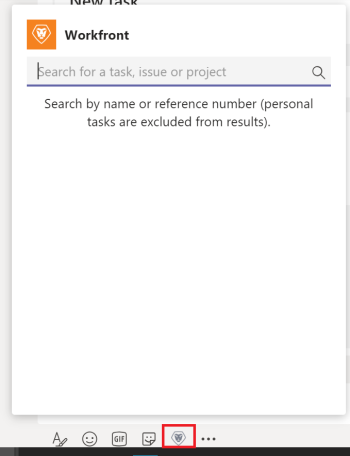

# Acceder a [!DNL Adobe Workfront] desde [!DNL Microsoft Teams]

<!--Audited: 01/2024-->

>[!IMPORTANT]
>
>A medida que Microsoft cambia al cliente Nuevos equipos, el cliente Teams clásico dejará de estar disponible a partir del 1 de julio de 2025. Como preparación, estamos desarrollando una nueva versión de la integración de Microsoft Teams que será totalmente compatible con el cliente de Nuevos equipos y estará disponible antes del 1 de julio para garantizar una transición sin problemas.
>
>Las instrucciones sobre cómo descargar e instalar la integración en el cliente de New Teams aparecerán aquí después de que la integración esté disponible.

Puede obtener acceso a [!DNL Adobe Workfront] desde [!DNL Microsoft Teams] y realizar varias acciones en [!DNL Workfront] escribiendo comandos en el canal de bots de [!DNL Workfront] o en cualquier otro canal del equipo.

Puede hacer lo siguiente en [!DNL Workfront] desde [!DNL Microsoft Teams]:

* Crear proyectos, tareas o problemas
* Crear tareas personales
* Responder a notificaciones
* Administrar aprobaciones de documentos

Los comandos que utiliza desde [!DNL Microsoft Teams] para realizar estas acciones son diferentes según el canal desde el que desee tener acceso a [!DNL Workfront].

>[!NOTE]
>
>[!DNL Microsoft Teams] ya no admite [!DNL Internet Explorer]. Para usar [!DNL Adobe Workfront for Microsoft Teams integration], debe usar un explorador web que no sea [!DNL Internet Explorer].

## Requisitos de acceso

+++ Expanda para ver los requisitos de acceso para la funcionalidad en este artículo.

Debe tener el siguiente acceso para realizar los pasos de este artículo:

<table style="table-layout:auto"> 
 <col> 
 <col> 
 <tbody> 
  <tr> 
   <td role="rowheader">[!DNL Adobe Workfront] plan*</td> 
   <td> 
Cualquiera
 </td> 
  </tr> 
  <tr> 
   <td role="rowheader">[!DNL Adobe Workfront] licencia*</td> 
   <td> 
Nuevo: [!UICONTROL Standard]

   
Actual: [!UICONTROL Work], [!UICONTROL Plan]
 </td> 
  </tr> 
 </tbody> 
</table>

*Para saber qué plan, tipo de licencia o acceso tiene, póngase en contacto con el administrador de [!DNL Workfront].

*Para obtener más información sobre los requisitos de acceso de Workfront, consulte [Información general sobre los requisitos de acceso en la documentación de Workfront](/help/quicksilver/administration-and-setup/add-users/access-levels-and-object-permissions/access-level-requirements-in-documentation.md).

+++

## Requisitos previos

Puede crear tareas personales en [!DNL Adobe Workfront] desde [!DNL Microsoft Teams] si se cumplen las siguientes condiciones:

* El propietario de un equipo ha instalado y configurado [!DNL Workfront for Microsoft Teams] para su equipo.
* Ha iniciado sesión en [!DNL Workfront] desde [!DNL Microsoft Teams].

## Acceder a [!DNL Workfront] desde el canal de chat de bots de [!DNL Workfront]

Debe haber iniciado sesión en Workfront.

1. Abra el canal de chat de bots de **[!DNL Workfront]**.
1. Haga clic en el icono **[!DNL Workfront]** debajo del campo de texto para mostrar el cuadro de búsqueda.

   

1. Empiece a escribir el nombre de un proyecto, tarea o problema.

   Para obtener información acerca de cómo buscar elementos, consulte la sección [Buscar y compartir [!DNL Adobe Workfront] elementos en [!DNL Microsoft Teams]](../../workfront-integrations-and-apps/using-workfront-with-microsoft-teams/search-for-and-share-wf-items-in-ms-teams.md) in the article [Search for and share [!DNL Adobe Workfront] elementos en [!DNL Microsoft Teams]](../../workfront-integrations-and-apps/using-workfront-with-microsoft-teams/search-for-and-share-wf-items-in-ms-teams.md).

1. Haga clic en el campo **[!UICONTROL Escriba sus preguntas aquí]**.

   

1. Realice una de las siguientes acciones:

   * Haga clic en **[!UICONTROL ¿Qué puedo hacer?]**, luego en **[!UICONTROL Iniciar sesión]** o **[!UICONTROL Cerrar sesión]** de [!DNL Workfront], cree una **[!UICONTROL Nueva tarea]** (tarea personal) en [!DNL Workfront] u obtenga **[!UICONTROL Ayuda]** mediante la lista de comandos disponibles.

   * Obtenga acceso a [!DNL Workfront] directamente escribiendo un comando en el campo **[!UICONTROL Escriba sus preguntas aquí]**.

     Los comandos no distinguen entre mayúsculas y minúsculas.

     El bot de [!DNL Workfront] responde con su solicitud en el canal de chat de bots de [!DNL Workfront].

## Acceda a [!DNL Workfront] desde un canal de equipo

Debe haber iniciado sesión en Workfront.

1. Abra un canal de equipo y escriba **@[!DNL Workfront]**, luego seleccione **[!DNL Workfront].**

1. Haga clic en **[!UICONTROL Buscar]** para buscar un proyecto, tarea o problema.

   Para obtener información acerca de cómo buscar elementos, consulte el artículo [Buscar y compartir [!DNL Adobe Workfront] elementos en [!DNL Microsoft Teams]](../../workfront-integrations-and-apps/using-workfront-with-microsoft-teams/search-for-and-share-wf-items-in-ms-teams.md) section in the [Search for and share [!DNL Adobe Workfront] elementos de [!DNL Microsoft Teams]](../../workfront-integrations-and-apps/using-workfront-with-microsoft-teams/search-for-and-share-wf-items-in-ms-teams.md).

1. Escriba cualquiera de los siguientes comandos para realizar estas acciones en Workfront.\
   Los comandos no distinguen entre mayúsculas y minúsculas:

   * **[!UICONTROL Inicie sesión]** para iniciar sesión en [!DNL Workfront]
   * **[!DNL Log out]** para cerrar la sesión de Workfront
   * **[!DNL New task]** para crear una nueva tarea personal

     Para obtener información acerca de cómo crear tareas desde [!DNL Microsoft Teams], consulte [Crear [!DNL Adobe Workfront] tareas desde [!DNL Microsoft Teams]](../../workfront-integrations-and-apps/using-workfront-with-microsoft-teams/create-workfront-tasks-from-ms-teams.md).

   * **[!UICONTROL Ayuda]** para ver una lista de todos los comandos disponibles.

     El bot de [!DNL Workfront] responde con su solicitud en el canal de chat de bots de [!DNL Workfront].

1. Vaya al canal de chat de bots de [!DNL Workfront] para acceder a [!DNL Workfront] y completar la solicitud.
