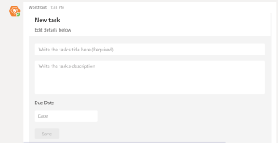

# Crear tareas de [!DNL Adobe Workfront] desde [!DNL Microsoft Teams]

>[!IMPORTANT]
>
>A medida que [Microsoft pasa al cliente del nuevo Teams](https://learn.microsoft.com/es-es/microsoftteams/teams-classic-client-end-of-availability), el cliente de Teams clásico dejará de estar disponible a partir del 1 de julio de 2025. Para seguir utilizando Microsoft Teams y aplicaciones integradas como Workfront, los usuarios deben realizar la transición al cliente del nuevo Teams antes de esta fecha.
>
>La integración actualizada de Workfront ya está disponible y es totalmente compatible con la experiencia del nuevo Teams. En la mayoría de los casos, Workfront aparecerá automáticamente una vez que los usuarios hayan realizado la transición. Si no es así, se puede instalar la integración manualmente desde la tienda de aplicaciones de Microsoft Teams. Para instalar o comprobar la integración de Workfront en el cliente del nuevo Teams, consulte [Instalar [!DNL Adobe Workfront] en Microsoft Teams](/help/quicksilver/workfront-integrations-and-apps/using-workfront-with-microsoft-teams/install-workfront-ms-teams.md).

## Requisitos de acceso

+++ Expanda para ver los requisitos de acceso para la funcionalidad en este artículo.

<table style="table-layout:auto"> 
 <col> 
 <col> 
 <tbody> 
  <tr> 
   <td role="rowheader">Paquete de Adobe Workfront</td> 
   <td> 
Cualquiera
 </td> 
  </tr> 
  <tr> 
   <td role="rowheader">Licencia de Adobe Workfront</td> 
   <td> 
Estándar

   
Trabajo o superior
 </td> 
  </tr> 
 </tbody> 
</table>

Para obtener más información, consulte [Requisitos de acceso en la documentación de Workfront](/help/quicksilver/administration-and-setup/add-users/access-levels-and-object-permissions/access-level-requirements-in-documentation.md).

+++

## Requisitos previos

Puede crear tareas personales en [!DNL Adobe Workfront] desde [!DNL Microsoft Teams] si se cumplen las siguientes condiciones:

* El propietario de un equipo ha instalado y configurado [!DNL Workfront for Microsoft Teams] para su equipo.
* Ha iniciado sesión en [!DNL Workfront] desde [!DNL Microsoft Teams].

>[!NOTE]
>
>[!DNL Microsoft Teams] ya no admite [!DNL Internet Explorer]. Para usar la integración de [!DNL Adobe Workfront for Microsoft Teams], debe usar un explorador web que no sea [!DNL Internet Explorer].

Para obtener información sobre cómo instalar [!DNL Workfront for Microsoft Teams] e iniciar sesión en [!UICONTROL Workfront] desde [!DNL Microsoft Teams], consulte [Instalar [!DNL Adobe Workfront for Microsoft Teams]](../../workfront-integrations-and-apps/using-workfront-with-microsoft-teams/install-workfront-ms-teams.md).

## Crear tareas personales a partir de [!DNL Microsoft Teams]

1. Inicie sesión en [!DNL Workfront] desde [!DNL Microsoft Teams].

   Para obtener información sobre cómo iniciar sesión en [!DNL Workfront], consulte [Instalar [!DNL Adobe Workfront for Microsoft Teams]](../../workfront-integrations-and-apps/using-workfront-with-microsoft-teams/install-workfront-ms-teams.md).

1. Para abrir una tarjeta de **[!UICONTROL Nueva tarea]**:

   * Si se encuentra en el canal de chat de bots de [!DNL Workfront], escriba **[!UICONTROL Nueva tarea]** en el campo [!UICONTROL conversación] para crear una nueva tarea.
   * Si se encuentra en un canal de chat que no sea el canal de chat para bots de [!DNL Workfront]:

      * Empiece a escribir **[!DNL @workfront]** en el campo [!UICONTROL conversación] y, a continuación, seleccione el canal de bots de [!DNL Workfront] que desee.
      * Siga escribiendo **[!UICONTROL Nueva tarea]** en el campo [!UICONTROL conversación] para crear una nueva tarea.

        La tarjeta [!UICONTROL Nueva tarea] se muestra en el canal de bots de [!DNL Workfront].

        

1. En el canal de bots [!UICONTROL Workfront], especifique la siguiente información en la tarjeta [!UICONTROL Nueva tarea]:

   * Nombre de la tarea en el campo **[!UICONTROL Escriba el título de la tarea]**.
   * Descripción de la tarea en el campo **[!UICONTROL Escriba la descripción de la tarea]**.
   * La fecha en la que debe completarse la tarea, en el campo **[!UICONTROL Fecha de vencimiento]**.

1. Haga clic en **[!UICONTROL Guardar].**

   La nueva tarea personal se creó en [!DNL Workfront]. Se le ha asignado un [!UICONTROL número de referencia] que está visible en la tarjeta de la [!UICONTROL nueva tarea].

   Para obtener información acerca de los números de referencia, consulte la sección [[!UICONTROL Números de referencia] de objetos](../../workfront-basics/navigate-workfront/workfront-navigation/understand-objects.md#understanding-reference-numbers-of-objects) en el artículo [Explicación de los objetos en [!DNL Adobe Workfront]](../../workfront-basics/navigate-workfront/workfront-navigation/understand-objects.md).

1. (Opcional) Haga clic en **[!UICONTROL Editar]** para editar más la información de la tarea.
1. (Opcional) Haga clic en **[!UICONTROL Ver en[!DNL Workfront]]** para abrir la tarea en una nueva ficha de [!DNL Workfront] y editarla más adelante, moverla a un proyecto o asignarla a otra persona.
