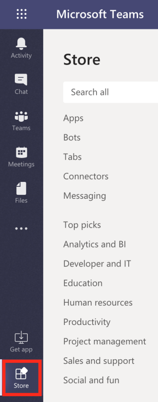

# Instalar [!DNL Adobe Workfront] para Microsofts Teams

La variable [!DNL Adobe Workfront for Microsoft Teams] aplicación le permite realizar acciones básicas en [!DNL Workfront] sin dejar su [!DNL Microsoft Teams] canales de chat.

>[!NOTE]
>
>[!DNL Microsoft Teams] ya no es compatible [!DNL Internet Explorer]. Para usar la variable [!DNL Adobe Workfront for Microsoft Teams integration], debe utilizar un explorador web que no sea [!DNL Internet Explorer].

## Requisitos de acceso

Debe tener el siguiente acceso para realizar los pasos de este artículo:

<table style="table-layout:auto"> 
 <col> 
 <col> 
 <tbody> 
  <tr> 
   <td role="rowheader">[!DNL Adobe Workfront] plan*</td> 
   <td> 
Cualquiera
 </td> 
  </tr> 
  <tr> 
   <td role="rowheader">[!DNL Adobe Workfront] licencia*</td> 
   <td> 
[!UICONTROL Work], [!UICONTROL Plan]
 </td> 
  </tr> 
 </tbody> 
</table>

&#42;Para saber qué plan, tipo de licencia o acceso tiene, póngase en contacto con su [!DNL Workfront] administrador.

## Requisitos previos

Debe ser propietario de un equipo en [!DNL Microsoft Teams] para instalar [!DNL Workfront] para [!DNL Microsoft Teams].

## Instalar [!DNL Workfront for Microsoft Teams]

Como propietario del equipo en [!DNL Microsoft Teams], puede instalar el [!DNL Workfront for Microsoft Teams] para cada uno de sus equipos, ya sea desde la [!DNL Microsoft] Almacenar o de un archivo proporcionado por [!DNL Workfront].

* [Instalar [!DNL Workfront for Microsoft Teams] desde la tienda Microsoft](#install-workfront-for-microsoft-teams-from-the-microsoft-store)
* [Instalar [!DNL Workfront for Microsoft Teams] desde un archivo privado](#install-workfront-for-microsoft-teams-from-a-private-file)

### Instalar [!DNL Workfront for Microsoft Teams] de la variable [!DNL Microsoft] Tienda

1. Iniciar sesión en [!DNL Microsoft Teams] como propietario del equipo.
1. Seleccione el equipo para el que desea instalar el [!DNL Workfront for Microsoft Teams] aplicación.
1. Haga clic en **[!UICONTROL Tienda]** en la barra de navegación lateral.

   

1. En el **[!UICONTROL Buscar todo]** cuadro, tipo *[!DNL Workfront]*.

1. Haga clic en el **[!DNL Workfront]** y siga las instrucciones del asistente.
1. (Recomendado) Seleccione un equipo del **[!UICONTROL Agregar a un equipo]** menú desplegable y habilite el **[!UICONTROL Sí]** para agregar la aplicación a un equipo.

   

1. Select **[!UICONTROL General]** para usar la aplicación en ese canal para el equipo seleccionado, haga clic en **[!UICONTROL Configuración]**.

   

1. Cuando se completa la instalación, aparece una notificación que indica que la instalación se realizó correctamente en la [!UICONTROL General] canal del equipo seleccionado. Todos los miembros del equipo pueden ver esta notificación.
1. (Opcional) Incruste su [!DNL Workfront] aplicación para un acceso más fácil:

   1. Haga clic en el **[!UICONTROL Más]** bajo el campo de mensaje en la [!UICONTROL General] canal.

   1. Pase el ratón sobre la [!DNL Workfront] de la lista y, a continuación, haga clic en la **[!UICONTROL Más]** a su derecha.

      

   1. Haga clic en **[!UICONTROL Fijar]**.

      Esto agrega un [!DNL Workfront] en el campo chat. Puede acceder rápidamente al [!UICONTROL Buscar] de aquí.

      Para obtener información acerca de la búsqueda de [!DNL Workfront] elementos, consulte [Buscar y compartir [!DNL Adobe Workfront] elementos en [!DNL Microsoft Teams]](../../workfront-integrations-and-apps/using-workfront-with-microsoft-teams/search-for-and-share-wf-items-in-ms-teams.md).

1. Haga clic en **[!UICONTROL Iniciar sesión en[!DNL Workfront]]** para acceder a [!DNL Workfront from Microsoft Teams].

   Para obtener información sobre cómo iniciar sesión en [!DNL Workfront], consulte la [Inicio de sesión en Workfront desde Microsoft Teams](#log-in-to-workfront-from-microsoft-teams) en este artículo.

### Instalar [!DNL Workfront for Microsoft Teams] desde un archivo privado

Si su organización restringe el acceso a la descarga de aplicaciones desde el [!DNL Microsoft] Tienda, debe ponerse en contacto con nuestro equipo de asistencia y solicitar un archivo privado de [!DNL Workfront for Microsoft Teams] para instalar la aplicación.

Para obtener información sobre cómo ponerse en contacto con nuestro equipo de asistencia, consulte [Contactar con el servicio de atención al cliente](../../workfront-basics/tips-tricks-and-troubleshooting/contact-customer-support.md).

Para instalar [!DNL Workfront for Microsoft Teams] desde un archivo privado:

1. Guarde el archivo privado que recibió de [!DNL Workfront] en el equipo.
1. Iniciar sesión en [!DNL Microsoft Teams] como [!DNL Microsoft] propietario del equipo.
1. Haga clic en el **[!UICONTROL Más]** para el equipo para el que desea instalar [!DNL Workfront for Microsoft Teams].

   

1. Haga clic en **[!UICONTROL Administrar equipo]**.
1. Seleccione el **[!UICONTROL Aplicaciones]** a continuación, haga clic en **[!UICONTROL Cargar una aplicación personalizada]** en la esquina inferior derecha de la pantalla.

1. Busque el archivo privado que guardó en el equipo y siga los pasos de instalación para instalar [!DNL Workfront for Microsoft Teams].
1. Cuando se completa la instalación, aparece una notificación que indica que la instalación se realizó correctamente en el canal General del equipo seleccionado. Todos los miembros del equipo pueden ver esta notificación.
1. (Opcional) Haga clic en el **[!UICONTROL Más]** debajo de **[!UICONTROL Escriba sus preguntas aquí]** campo .

1. (Opcional) Pase el ratón sobre el [!DNL Workfront] de la lista y, a continuación, haga clic en la **[!UICONTROL Más]** a su derecha.

   

1. (Opcional) Haga clic en **[!UICONTROL Fijar]**.

   Esto agrega un [!DNL Workfront] debajo de [!UICONTROL Escriba sus preguntas aquí] campo . Puede acceder rápidamente al [!UICONTROL Buscar] de aquí.\
   Para obtener información sobre la búsqueda de elementos de Workfront, consulte [Buscar y compartir [!DNL Adobe Workfront] elementos en [!DNL Microsoft Teams]](../../workfront-integrations-and-apps/using-workfront-with-microsoft-teams/search-for-and-share-wf-items-in-ms-teams.md).

## Iniciar sesión en [!DNL Workfront] from [!DNL Microsoft] Equipos

Como [!DNL Microsoft Teams] propietario del equipo, debe instalar el [!DNL Workfront for Microsoft Teams] aplicación para su equipo antes de que usted o cualquier persona del equipo puedan iniciar sesión en [!DNL Workfront from Microsoft Teams].

Cuando haya iniciado sesión en [!DNL Workfront] from [!DNL Microsoft Teams], puede recibir [!DNL Workfront] notificaciones en el [!DNL Workfront] canal de bots o puede realizar determinadas acciones en [!DNL Workfront] from [!DNL Microsoft Teams].

Para obtener información sobre cómo instalar la variable [!DNL Workfront] consulte la [Instalar [!DNL Workfront for Microsoft Teams]](#install-workfront-for-microsoft-teams) en este artículo.

Para obtener información sobre el acceso [!DNL Workfront] from [!DNL Microsoft Teams] para realizar determinadas acciones, consulte [Acceso [!DNL Adobe Workfront] from [!DNL Microsoft Teams]](../../workfront-integrations-and-apps/using-workfront-with-microsoft-teams/access-workfront-from-ms-teams.md).

Para iniciar sesión en [!DNL Workfront] from [!DNL Microsoft Teams]:

1. Vaya a la **[!UICONTROL General]** canal del equipo en el que [!DNL Workfront for Microsoft Teams] la aplicación se ha instalado y haga clic en **[!UICONTROL Iniciar sesión en Workfront]**.

   La variable [!DNL Workfront] el canal de chat de bots se agrega a su [!DNL Microsoft Teams] canales de chat.

   

1. Vaya a la [!DNL Workfront] canal de chat de bots en [!DNL Microsoft Teams] y tipo *[!UICONTROL iniciar sesión]* en el **[!UICONTROL Escriba sus preguntas aquí]** campo .

   O

   Haga clic en **[!UICONTROL Iniciar sesión]**.

   

   Se abre una nueva pestaña del explorador.

1. Siga las indicaciones para iniciar sesión en [!DNL Workfront] mediante la autenticación mejorada, OAuth 2.0 o la URL del lenguaje de marcado de aserción de seguridad (SAML).

   >[!NOTE]
   >
   >* Cuando se le pida que introduzca el dominio de su [!DNL Workfront] cuenta, escríbala con este formato: *yourCompany&#39;sDomain.my.workfront.com*. El dominio de la empresa suele ser el nombre de la empresa.
   >* La autenticación mejorada no está disponible hasta que se [!DNL Workfront] el administrador lo habilita para esta integración.

1. Cierre la pestaña del explorador que utilizó para iniciar sesión y volver a [!DNL Microsoft Teams].

   Se muestra una notificación en la variable [!DNL Workfront] canal de chat de bots para confirmar que ha iniciado sesión en [!DNL Workfront] correctamente.
