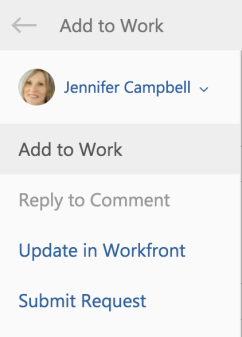
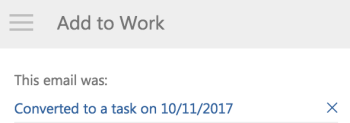

# Agregue un [!DNL Outlook] enviar correo electrónico como tarea a la lista de trabajo

Puede convertir [!DNL Outlook] correos electrónicos a [!DNL Adobe Workfront] tareas. Después de convertir un correo electrónico, la tarea está disponible en el [!UICONTROL Trabajo] Haga clic en [!UICONTROL Página principal] .

## Requisitos de acceso

Debe tener el siguiente acceso para realizar los pasos de este artículo:

<table style="table-layout:auto"> 
 <col> 
 <col> 
 <tbody> 
  <tr> 
   <td role="rowheader">[!DNL Adobe Workfront] plan*</td> 
   <td> 
Cualquiera
 </td> 
  </tr> 
  <tr> 
   <td role="rowheader">[!DNL Adobe Workfront] licencia*</td> 
   <td> 
[!UICONTROL Work], [!UICONTROL Plan]
 </td> 
  </tr> 
 </tbody> 
</table>

&#42;Para saber qué plan, tipo de licencia o acceso tiene, póngase en contacto con su [!DNL Workfront] administrador.

## Requisitos previos

Su [!DNL Workfront] el administrador debe habilitar [!DNL Outlook for Office] con [!DNL Workfront] antes de poder utilizar esta integración.

## Agregue un [!DNL Outlook] enviar correo electrónico como tarea a la lista de trabajo

1. Seleccione el correo electrónico en [!DNL Outlook] que desea convertir en una tarea.
1. Haga clic en el **[!DNL Workfront]** en la esquina superior derecha del mensaje de correo electrónico para mostrar la variable [!DNL Workfront] complemento.\
   Es posible que tenga que hacer clic en la flecha hacia abajo situada en la parte superior derecha del correo electrónico para acceder a la [!DNL Workfront] icono.

1. Haga clic en el **[!UICONTROL Menú]** para mostrar la lista de [!DNL Workfront] opciones.\
   

1. Haga clic en **[!UICONTROL Agregar a trabajo]**.\
   

1. Anule la selección de **[!UICONTROL Agregar a proyecto]** campo .
1. (Opcional) Puede actualizar la siguiente información del correo electrónico antes de guardarla como tarea:

   * **[!UICONTROL Nombre de la tarea]:** De forma predeterminada, el nombre de la tarea es el mismo que el asunto del correo electrónico. Puede modificar el nombre de la tarea como desee.
   * **[!UICONTROL Descripción]:** De forma predeterminada, la descripción es la misma que el cuerpo del correo electrónico. Puede modificar la descripción como desee.
   * **[!UICONTROL Archivos adjuntos]:** Los archivos adjuntos de correo electrónico se guardan en la variable [!UICONTROL Documentos] del área de la tarea. Puede eliminar los archivos adjuntos antes de guardar el correo electrónico como una tarea.

1. Haga clic en **[!UICONTROL Agregar]**.\
   La tarea se agrega al [!UICONTROL Lista de trabajo] en su área de inicio sin fecha de confirmación.

1. (Opcional) Haga clic en **[!UICONTROL Ver en Workfront]** para mostrar la tarea dentro de la variable [!DNL Workfront] en una pestaña nueva.

1. (Opcional) Vuelva a [!DNL Outlook]y seleccione el correo electrónico original.\
   En la parte superior del [!DNL Workfront] panel de complementos, observe la confirmación con un vínculo de que el correo electrónico se ha agregado a Workfront como tarea. El vínculo incluye la fecha de conversión.\
   
