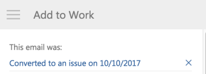

# Agregue un [!DNL Outlook] Enviar un correo electrónico a un proyecto como tarea o problema

Puede convertir correos electrónicos a [!DNL Adobe Workfront] tareas o problemas. Después de convertir un correo electrónico, la tarea o el problema aparece en el proyecto que está seleccionado mientras lo está convirtiendo.

## Requisitos de acceso

Debe tener el siguiente acceso para realizar los pasos de este artículo:

<table style="table-layout:auto"> 
 <col> 
 <col> 
 <tbody> 
  <tr> 
   <td role="rowheader">[!DNL Adobe Workfront] plan*</td> 
   <td> 
Cualquiera
 </td> 
  </tr> 
  <tr> 
   <td role="rowheader">[!DNL Adobe Workfront] licencia*</td> 
   <td> 
[!UICONTROL Work], [!UICONTROL Plan]
 </td> 
  </tr> 
 </tbody> 
</table>

&#42;Para saber qué plan, tipo de licencia o acceso tiene, póngase en contacto con su [!DNL Workfront] administrador.

## Requisitos previos

Su [!DNL Workfront] el administrador debe habilitar [!DNL Outlook for Office] con [!DNL Workfront] antes de poder utilizar esta integración.

## Agregue un [!DNL Outlook] Enviar un correo electrónico a un proyecto como tarea o problema

1. Seleccione el correo electrónico en [!DNL Outlook] que desea convertir en una tarea o un problema.
1. Haga clic en el **[!DNL Workfront]** en la esquina superior derecha del mensaje de correo electrónico para mostrar el complemento de Workfront.

   Es posible que tenga que hacer clic en la flecha hacia abajo situada en la parte superior derecha del correo electrónico para acceder a la [!DNL Workfront] icono.

1. Haga clic en el **[!UICONTROL Menú]** para mostrar la lista de [!DNL Workfront] opciones.

   

1. Haga clic en **[!UICONTROL Agregar a trabajo]**.

   

1. Seleccione el **[!UICONTROL Agregar a proyecto]** campo .
1. Empiece a escribir el nombre de un proyecto en la sección **[!UICONTROL Proyecto]** y, a continuación, selecciónelo cuando aparezca en la lista.
1. Seleccione el **[!UICONTROL Tarea]** botón de opción si desea añadir una tarea al proyecto seleccionado.

   O

   Seleccione el **[!UICONTROL Problema]** botón de opción si desea agregar un problema al proyecto seleccionado.

1. (Opcional) Especifique a quién se asigna esta tarea o problema en la **[!UICONTROL Asigne esto a]** campo .
1. (Opcional) Especifique la variable **[!UICONTROL Vence por fecha]**. Esto se convierte en la variable [!UICONTROL Fecha de finalización planeada] de la tarea o problema.
1. (Opcional) Actualice la siguiente información del correo electrónico antes de que se guarde como una tarea o problema (los campos obligatorios van precedidos de un asterisco).

   <table style="table-layout:auto">
      <tr>
        <td>[!UICONTROL Tarea o Nombre del problema]</td>
        <td>De forma predeterminada, el nombre de la tarea es el mismo que el asunto del correo electrónico. Puede modificar el nombre de la tarea como desee.</td>
        <td></td>
      </tr>
      <tr>
        <td>[!UICONTROL Descripción]</td>
        <td>De forma predeterminada, la descripción es la misma que el cuerpo del correo electrónico. Puede modificar la descripción como desee.</td>
      </tr>
      <tr>
        <td>[!UICONTROL Attachments]</td>
        <td>Los archivos adjuntos de correo electrónico se guardan en el área [!UICONTROL Documents] de la tarea o el problema. Puede eliminar los archivos adjuntos antes de guardar el correo electrónico como una tarea o un problema.</td>
      </tr>
   </table>

1. Haga clic en **[!UICONTROL Agregar]**.

   La tarea o el problema se añaden al proyecto especificado

1. (Opcional) Haga clic en **[!UICONTROL Ver en[!DNL Workfront]]** para mostrar la tarea dentro de la variable [!DNL Workfront] en una pestaña nueva.

1. (Opcional) Vuelva a [!DNL Outlook]y seleccione el correo electrónico convertido.

   En la parte superior del [!DNL Workfront] panel de complementos, observe la confirmación con un vínculo a la que se agregó el correo electrónico [!DNL Workfront] como tarea o problema. El vínculo incluye la fecha de conversión.

   
